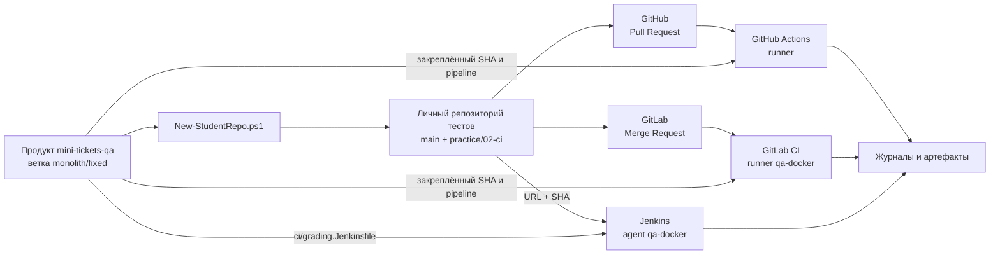

# Практическое задание № 2. CI/CD и личный репозиторий работ

## Цель

Создать один личный репозиторий тестов для всей программы курса и познакомиться
с полным маршрутом изменения: локальная рабочая ветка, Git-коммит, публикация на
сервере, Pull Request или Merge Request, запуск CI, чтение журнала и получение
артефактов.

В ходе практики вы познакомитесь с тремя системами автоматизации:

- GitHub Actions;
- GitLab CI;
- Jenkins.

После выполнения шагов вы сможете:

- проверить готовность компьютера, продукта и локальных CI-сервисов;
- различать продуктовый репозиторий и личный репозиторий тестов;
- объяснить назначение `main` и рабочей ветки `practice/02-ci`;
- связать `push`, Pull Request и Merge Request с событиями CI;
- найти workflow, pipeline, stage, job, step, runner и Jenkins agent;
- определить точный Git-коммит, который проверяет система;
- найти первую значимую ошибку в журнале;
- скачать и изучить артефакты завершённого запуска;
- сопоставить одинаковые элементы GitHub Actions, GitLab CI и Jenkins.

## Практическое задание

Используйте ветку продукта `monolith/fixed` как исходную точку и создайте из
готовой заготовки отдельный репозиторий тестов. Этот репозиторий будет постепенно
дополняться в следующих практиках, а продукт `mini-tickets-qa` останется объектом
изучения и тестирования.

Опубликуйте начальную ветку `main`, создайте рабочую ветку `practice/02-ci`,
добавьте небольшую заметку о CI/CD и откройте PR/MR в `main` своего репозитория.
Проследите запуск начальных конфигураций GitHub Actions и GitLab CI. Познакомьтесь
с параметризованным запуском Jenkins и сравните терминологию трёх систем.

В заготовке уже находятся два стартовых теста. Их достаточно для знакомства с
устройством pipeline. При желании репозиторий можно дополнить собственными
проверками, но основное содержание этой практики связано с Git и CI/CD.

### Рабочая схема



Две линии имеют разное назначение: репозиторий тестов содержит вашу рабочую
ветку и стартовые проверки, а продукт предоставляет приложение, версии шести
вариантов и механизм их запуска.

## Задание (шаги)

### Шаг 1. Разделите роли двух репозиториев

Перед созданием файлов сопоставьте назначение репозиториев.

| Репозиторий | Что в нём находится | Как используется в этой практике |
|---|---|---|
| `mini-tickets-qa` | Vue, FastAPI, PostgreSQL, Docker, шесть продуктовых веток, оценщик и Jenkins pipeline | Источник заготовки и закреплённой версии продукта |
| Личный репозиторий тестов | Pytest, Requests, Playwright, Page Object, фикстуры и пользовательские CI-файлы | Единое место для самостоятельных работ всего курса |

Целевой веткой PR/MR является `main` личного репозитория тестов. Названия
`monolith/fixed`, `client-server/fixed` и другие относятся к продуктовому
репозиторию и выбирают способ запуска приложения.

### Шаг 2. Проверьте рабочее окружение и подготовьте продукт

Для дальнейших практик используется одно и то же рабочее окружение. Проверьте
основные инструменты до создания личного репозитория:

| Компонент | Требуемая конфигурация | Команда проверки |
|---|---|---|
| Git | Клиент Git с доступом к GitHub и GitLab | `git --version` |
| PowerShell | PowerShell 7 | `pwsh --version` |
| Python | Python 3.13 | `python --version` |
| Node.js и npm | Node.js 22 LTS и входящий в него npm | `node --version`, `npm --version` |
| Docker | Docker Desktop, Linux-контейнеры, Compose v2 | `docker version`, `docker compose version` |
| Браузер | Google Chrome для интерфейса и DevTools | Запуск приложения Chrome |
| API-клиент | Postman или Insomnia | Запуск выбранного приложения |
| Java | JDK 21 или 25 для Windows agent Jenkins | `java --version` |

Выполните команды в PowerShell:

```powershell
git --version
pwsh --version
python --version
node --version
npm --version
docker version
docker compose version
docker info --format '{{.OSType}}'
java --version
```

Команда `docker info` должна вернуть `linux`, а `docker version` — показать
клиентскую и серверную части. Если команда отсутствует или её версия отличается
от таблицы, установите соответствующий компонент и повторите проверку. Системная
установка PostgreSQL для проекта не требуется: учебная база создаётся внутри
Docker.

Если продукт ещё не клонирован, создайте короткий рабочий путь без кириллицы и
получите все его ветки:

```powershell
$taskProjects = Join-Path $env:USERPROFILE 'repos'
$taskProduct = Join-Path $taskProjects 'testing'
New-Item -ItemType Directory -Path $taskProjects -Force | Out-Null
if (!(Test-Path -LiteralPath $taskProduct)) {
    git clone https://github.com/tsenturion/mini-tickets-qa.git $taskProduct
}
```

Откройте PowerShell в клоне `mini-tickets-qa` и выберите исправленный монолит:

```powershell
Set-Location -LiteralPath $taskProduct
git fetch origin
git switch monolith/fixed
git status
git branch --show-current
```

Команда `git branch --show-current` должна показать `monolith/fixed`. Команда
`git status` помогает увидеть текущую ветку и состояние рабочей копии до запуска
генератора.

Если Git ещё не содержит ваши данные автора, задайте их один раз:

```powershell
git config --global user.name 'Ваше имя'
git config --global user.email 'ваш-адрес@example.org'
git config --global --get user.name
git config --global --get user.email
```

Имя и адрес войдут в историю создаваемых вами коммитов.

Подготовьте изолированную Python-среду, npm-зависимости, образы приложения и
оценщика, затем запустите продукт:

```powershell
.\scripts\Prepare-Lab.ps1 -Grader
docker compose up -d --wait
docker compose ps
Invoke-RestMethod http://localhost:8000/health
```

Первый запуск `Prepare-Lab.ps1 -Grader` загружает пакеты и большой образ
оценщика с браузерами. Скрипт создаёт `.venv`, устанавливает закреплённые
зависимости, собирает frontend, приложение и оценщик. После запуска интерфейс
доступен по адресу `http://localhost:8000`, Swagger — по адресу
`http://localhost:8000/docs`, PostgreSQL — на `localhost:55432`.

Выполните полную самопроверку подготовленного проекта:

```powershell
.\.venv\Scripts\python.exe scripts/verify_grader.py --full
```

Успешная команда завершается с кодом `0` и создаёт отчёты в
`artifacts/grader-self-test`. Она проверяет исправленные варианты продукта,
одиночные включения учебных дефектов и реакцию оценщика на некорректные
заготовки. Такая проверка отделяет проблему рабочего окружения от результата
будущих тестов в личном репозитории.

### Шаг 3. Создайте личный репозиторий из заготовки

Выберите новый каталог рядом с продуктом и вызовите готовый PowerShell-скрипт:

```powershell
$taskTests = Join-Path $env:USERPROFILE 'repos/mini-tickets-tests'
Set-Location -LiteralPath $taskProduct
.\scripts\New-StudentRepo.ps1 -Destination $taskTests
Set-Location -LiteralPath $taskTests
```

Скрипт выполняет четыре операции:

1. создаёт указанный каталог;
2. копирует в него содержимое `student-template`, включая скрытые CI-файлы;
3. выполняет `git init -b main`;
4. создаёт начальный коммит с подготовленной структурой.

Посмотрите результат:

```powershell
git status
git branch --show-current
git log --oneline --decorate -n 3
git remote -v
git ls-files
```

После генерации активна ветка `main`, история уже содержит первый коммит, а
список remote пока пуст. Это самостоятельный Git-репозиторий, а не вложенная
ветка продукта.

### Шаг 4. Познакомьтесь со структурой заготовки

Откройте файлы в VS Code или другом редакторе и сопоставьте их назначение.

| Путь в личном репозитории | Назначение |
|---|---|
| `.github/workflows/qa.yml` | Workflow GitHub Actions |
| `.gitlab-ci.yml` | Pipeline GitLab CI |
| `ci_grade.py` | Адаптер получения продукта и запуска проверки в GitLab |
| `tests/api/test_example.py` | Стартовый API-пример |
| `tests/ui/test_example.py` | Стартовый UI-пример |
| `pages/login_page.py` | Начальный Page Object |
| `conftest.py` | Общие Pytest fixtures и параметры среды |
| `pytest.ini` | Маркеры и настройки Pytest |
| `requirements.txt` | Python-зависимости тестового проекта |
| `.gitignore` | Локальная среда, кеши и артефакты, исключённые из коммитов |
| `README.md` | Полная инструкция личного репозитория |

Просмотрите скрытые файлы через `git ls-files`. В личном репозитории пути
начинаются сразу с `.github`, `tests`, `pages` и других корневых каталогов:
префикс `student-template` после генерации отсутствует.

### Шаг 5. Прочитайте GitHub Actions как исполняемую документацию

Откройте `.github/workflows/qa.yml` и найдите следующие элементы:

1. `name` — отображаемое имя workflow;
2. `on` — события запуска;
3. `permissions` — разрешения служебного токена;
4. `jobs` — самостоятельные задачи workflow;
5. `runs-on` — тип runner;
6. `steps` — последовательность действий и команд;
7. `if: always()` — публикация артефактов независимо от результата предыдущего
   шага;
8. `retention-days` — срок хранения артефактов.

В текущей заготовке GitHub Actions запускается:

- при открытии Pull Request;
- при новом коммите в ветке открытого Pull Request;
- при повторном открытии или переводе PR в состояние ready for review;
- вручную через `workflow_dispatch`.

Обычная публикация ветки создаёт коммиты на сервере, а автоматический запуск
появляется после открытия PR. Это определяется текущим блоком `on`, а не общим
правилом GitHub.

Проследите будущий маршрут job `grade`:

1. checkout закреплённого продукта;
2. checkout точного SHA рабочей ветки PR;
3. подготовка Python 3.13;
4. сборка контейнера запуска;
5. формирование списка версий продукта;
6. выполнение стартовых тестов;
7. публикация каталога `product/artifacts` под именем `grading`.

### Шаг 6. Прочитайте GitLab CI и сравните термины

Откройте `.gitlab-ci.yml`. Найдите:

- `workflow.rules`;
- `stages`;
- job `grade`;
- `stage: test`;
- тег runner `qa-docker`;
- раздел `script`;
- раздел `artifacts`;
- `when: always`;
- `expire_in`.

Текущая конфигурация запускается для `merge_request_event` и из интерфейса через
ручное создание pipeline. Публикация ветки становится источником pipeline после
открытия MR или после ручного выбора ветки.

Job выполняет `python ci_grade.py`. Адаптер получает продукт, переключается на
точный `QA_PRODUCT_REF`, собирает контейнер и запускает те же проверки, которые
используются в GitHub Actions.

Сопоставьте терминологию:

| Понятие | GitHub Actions | GitLab CI | Jenkins |
|---|---|---|---|
| Полный сценарий | workflow | pipeline | pipeline |
| Крупная задача | job | job | stage |
| Группа задач по порядку | зависимости jobs | stage | последовательность stages |
| Отдельная команда | step | строка `script` | step внутри stage |
| Исполнитель | runner | GitLab Runner | Jenkins agent |
| Журнал | job log | job log | Console Output |
| Сохранённый результат | artifact | artifact | archived artifact |

### Шаг 7. Создайте удалённые репозитории

В GitHub создайте пустой репозиторий, например `mini-tickets-tests`. Добавьте его
как `origin`, заменив `YOUR_LOGIN` своим логином:

```powershell
$taskGitHubUrl = 'https://github.com/YOUR_LOGIN/mini-tickets-tests.git'
git remote add origin $taskGitHubUrl
git push -u origin main
```

В GitLab импортируйте уже опубликованный GitHub-репозиторий: выберите
`Create new → New project/repository → Import project → Repository by URL` и
укажите значение `$taskGitHubUrl`. Задайте тот же смысловой путь проекта,
например `mini-tickets-tests`, и дождитесь завершения импорта. Если пункта
`Repository by URL` нет, включите его в административных настройках импорта.

После импорта добавьте адрес GitLab как второй remote. Для локального GitLab
пример выглядит так:

```powershell
$taskGitLabUrl = 'http://localhost:8929/YOUR_LOGIN/mini-tickets-tests.git'
git remote add gitlab $taskGitLabUrl
git fetch gitlab --prune
```

Проверьте, что `main` после импорта указывает на тот же коммит:

```powershell
git rev-parse main
git rev-parse origin/main
git rev-parse gitlab/main
```

Посмотрите итоговую связь:

```powershell
git remote -v
git branch -vv
```

Имена `origin` и `gitlab` позволяют явно выбирать площадку одной командой. Один
локальный коммит можно отправить на обе площадки и затем сравнить CI для одного
и того же SHA. Подробный порядок первичного импорта, последующего обновления и
обратного переноса после merge приведён в
[инструкции синхронизации GitHub и GitLab](../СИНХРОНИЗАЦИЯ-GITHUB-GITLAB.md).

### Шаг 8. Закрепите версию продукта для CI

CI должен знать два значения: где находится продукт и какой точный коммит нужно
получить. Прочитайте полный SHA текущей исправленной ветки:

```powershell
$taskProductRef = git -C $taskProduct rev-parse monolith/fixed
$taskProductRef
```

Полный SHA состоит из 40 шестнадцатеричных символов. Он однозначно определяет
содержимое продукта, тогда как имя ветки со временем может указывать на новый
коммит.

В GitHub откройте в своём репозитории тестов:
`Settings → Secrets and variables → Actions → Variables`.

Создайте две Actions variables:

| Имя | Значение |
|---|---|
| `QA_PRODUCT_REPOSITORY` | `tsenturion/mini-tickets-qa` |
| `QA_PRODUCT_REF` | Полный SHA продукта |

В GitLab откройте:
`Settings → CI/CD → Variables`.

Создайте две CI/CD variables:

| Имя | Значение |
|---|---|
| `QA_PRODUCT_URL` | Clone URL проекта `mini-tickets-qa` на этом GitLab |
| `QA_PRODUCT_REF` | Полный SHA продукта, доступный на этом GitLab |

Для локальной конфигурации адрес продукта обычно имеет вид
`http://localhost:8929/root/mini-tickets-qa.git`. Значение SHA должно существовать
в указанном GitLab-проекте. Выберите для переменных область `All` и сделайте их
доступными рабочей ветке `practice/02-ci`. Переменные относятся к настройкам
площадки и поэтому создаются отдельно от Git-коммитов.

Адаптер `ci_grade.py` получает продукт с того же GitLab при помощи временного
`CI_JOB_TOKEN`. Если на сервере действует ограничение межпроектного доступа, в
**проекте продукта** откройте
`Settings → CI/CD → Job token permissions → CI/CD job token allowlist` и добавьте
туда личный проект тестов. При отсутствии доступа к настройкам проекта продукта
передайте его владельцу полный путь созданного проекта для добавления в allowlist.
После настройки job сможет клонировать продукт без персонального токена в URL.

### Шаг 9. Подготовьте CI-сервисы и проверьте исполнителей

GitHub Actions выполняется на инфраструктуре GitHub. Для GitLab CI и Jenkins в
проекте подготовлен локальный Docker Compose. При первичной настройке запустите
PowerShell-сценарий с установкой плагинов Jenkins:

```powershell
Set-Location -LiteralPath $taskProduct
.\scripts\Prepare-LocalCI.ps1 -JenkinsPlugins
```

Сценарий скачивает образы GitLab и Jenkins, поэтому первая подготовка требует
дополнительного места на диске и может занять продолжительное время. Для
одновременной работы контроллеров и временного приложения выделите Docker
ориентировочно 12 ГБ памяти. При последующих запусках уже подготовленной среды
достаточно выполнить:

```powershell
.\scripts\Prepare-LocalCI.ps1
```

Проверьте контейнеры и доступность интерфейсов:

```powershell
docker compose -f infra/ci/compose.yaml up -d --wait --wait-timeout 900
docker compose -f infra/ci/compose.yaml ps
(Invoke-WebRequest http://localhost:8929/users/sign_in).StatusCode
(Invoke-WebRequest http://localhost:8085/login).StatusCode
```

Контейнеры `gitlab` и `jenkins` должны иметь состояние `healthy`, а оба
HTTP-запроса — код `200`. Первичная настройка учётных записей, создание runner и
узла Jenkins описаны в
[`docs/ЛОКАЛЬНЫЕ-CI.md`](../ЛОКАЛЬНЫЕ-CI.md). Полученные локальные токены и
секрет узла сохраняются в настройках CI и каталоге `.runtime`, который исключён
из Git.

GitHub workflow использует runner `ubuntu-latest`, который создаётся площадкой
для конкретного job. Откройте вкладку Actions личного репозитория и убедитесь,
что workflow `Проверка работы` читается площадкой.

В GitLab откройте `Settings → CI/CD → Runners` и найдите доступный runner с тегом
`qa-docker`. Этот тег совпадает с `tags: [qa-docker]` в `.gitlab-ci.yml`.

В Jenkins откройте список узлов и найдите подключённый agent с меткой
`qa-docker`. Jenkins назначает pipeline только исполнителю, метка которого
соответствует выражению `agent { label 'qa-docker' }`.

Если GitLab Runner ещё не зарегистрирован, получите токен нового project runner
с тегом `qa-docker`, затем выполните регистрацию из корня продукта:

```powershell
$taskCIRoot = Join-Path $taskProduct '.runtime/gl'
.\.runtime\ci-tools\gitlab-runner.exe register --config .runtime/ci-tools/config.toml --template-config infra/ci/runner-template.toml --url http://localhost:8929 --executor shell --shell pwsh --builds-dir "$taskCIRoot/builds" --cache-dir "$taskCIRoot/cache"
.\.runtime\ci-tools\gitlab-runner.exe run --config .runtime/ci-tools/config.toml
```

Команда `run` остаётся активной и показывает журнал исполнителя. Для Jenkins
создайте узел `qa-windows` с меткой `qa-docker`, одним executor и рабочим
каталогом `$taskProduct\.runtime\jenkins`. Сохраните выданный Jenkins secret в
`.runtime/ci-tools/jenkins-agent.secret`, затем подключите agent в отдельном
PowerShell:

```powershell
New-Item -ItemType Directory -Path .runtime/ci-tools -Force | Out-Null
Invoke-WebRequest http://localhost:8085/jnlpJars/agent.jar -OutFile .runtime/ci-tools/agent.jar
[Console]::OutputEncoding = [Text.UTF8Encoding]::new()
java '-Dfile.encoding=UTF-8' '-Dstdout.encoding=UTF-8' '-Dstderr.encoding=UTF-8' -jar .runtime/ci-tools/agent.jar -url http://localhost:8085/ -secret '@.runtime/ci-tools/jenkins-agent.secret' -name qa-windows -webSocket -workDir .runtime/jenkins
```

Сообщение `Connected` подтверждает соединение с контроллером Jenkins. Окна
GitLab Runner и Jenkins agent обеспечивают выполнение pipeline и остаются
запущенными во время работы с локальными CI.

Для каждого исполнителя определите:

- операционную систему;
- способ получения исходников;
- наличие Git, Python и Docker;
- рабочий каталог;
- состояние подключения;
- место, где отображается его журнал.

### Шаг 10. Создайте рабочую ветку и заметку

Вернитесь в личный репозиторий тестов и создайте ветку:

```powershell
Set-Location -LiteralPath $taskTests
git switch main
git switch -c practice/02-ci
git branch --show-current
```

Добавьте каталог `notes` и файл `notes/02-ci.md`. Его можно начать следующим
шаблоном:

```markdown
# Наблюдения по CI/CD

## GitHub Actions

- Событие запуска:
- Workflow и job:
- Runner:
- Результат и артефакт:

## GitLab CI

- Источник pipeline:
- Stage и job:
- Runner:
- Результат и артефакт:

## Jenkins

- Способ запуска:
- Stages:
- Agent:
- Результат и артефакт:

## Сравнение

- Общие элементы:
- Основные различия:
```

Это изменение создаёт наглядный diff для PR/MR. Заметку можно расширять по мере
изучения запусков.

### Шаг 11. Создайте коммит и опубликуйте ветку

Перед коммитом посмотрите фактическое изменение:

```powershell
git status --short
git diff -- notes/02-ci.md
```

Затем создайте коммит и отправьте один SHA на обе площадки:

```powershell
git add notes/02-ci.md
git commit -m 'Добавлены наблюдения по CI/CD'
git push -u origin practice/02-ci
git push -u gitlab practice/02-ci
git rev-parse HEAD
```

Эти команды реализуют сценарий
[«Один коммит для PR и MR»](../СИНХРОНИЗАЦИЯ-GITHUB-GITLAB.md#один-коммит-для-pr-и-mr).

Сохраните выведенный SHA в заметке или рядом с открытыми страницами запусков. Он
позволяет убедиться, что GitHub, GitLab и Jenkins получили одну версию работы.

### Шаг 12. Откройте Pull Request в GitHub

В личном GitHub-репозитории выберите:

- base: `main`;
- compare: `practice/02-ci`.

В описании PR укажите назначение изменения и ожидаемый запуск workflow
`Проверка работы`. После создания PR откройте вкладку Checks или страницу Actions.

Найдите:

1. событие `pull_request`;
2. SHA исходной ветки;
3. job `grade`;
4. runner `ubuntu-latest`;
5. последовательность steps;
6. код завершения команды;
7. шаг публикации артефакта `grading`.

Добавьте ещё одну строку в `notes/02-ci.md`, создайте новый коммит и отправьте его
в ту же ветку. Событие `synchronize` создаст новый запуск для обновлённого SHA.

### Шаг 13. Откройте Merge Request в GitLab

В личном GitLab-проекте создайте MR:

- source branch: `practice/02-ci`;
- target branch: `main`.

Откройте связанный pipeline и job `grade`. Найдите:

1. источник `merge_request_event`;
2. stage `test`;
3. тег и имя runner;
4. команду `python ci_grade.py`;
5. клонирование закреплённого продукта;
6. точный checkout `QA_PRODUCT_REF`;
7. каталог опубликованных артефактов.

Сравните SHA исходной ветки MR с SHA GitHub PR. При одинаковом коммите различия
в результате чаще связаны с конфигурацией площадки, исполнителем или средой, а
не с содержимым `notes/02-ci.md`.

После объединения изменения перенесите итоговый `main` на вторую площадку по
разделу [GitLab → GitHub](../СИНХРОНИЗАЦИЯ-GITHUB-GITLAB.md#перенос-результата-из-gitlab-в-github)
или [GitHub → GitLab](../СИНХРОНИЗАЦИЯ-GITHUB-GITLAB.md#перенос-результата-из-github-в-gitlab),
в зависимости от того, где выполнялся merge.

### Шаг 14. Выполните ручной запуск

GitHub Actions поддерживает `workflow_dispatch`. Откройте
`Actions → Проверка работы → Run workflow` и выберите `practice/02-ci`.

GitLab поддерживает источник `web`. Откройте
`Build → Pipelines → New pipeline` и выберите ту же ветку.

Сопоставьте ручные запуски с PR/MR:

- какой SHA выбран;
- каким событием создан запуск;
- совпал ли набор команд;
- появился ли тот же артефакт;
- где интерфейс показывает инициатора запуска.

### Шаг 15. Познакомьтесь с Jenkins pipeline

Jenkins использует файл `ci/grading.Jenkinsfile` из продуктового репозитория.
Pipeline запускается вручную с параметрами и получает точный коммит личного
репозитория тестов.

Если задача Jenkins уже создана, откройте `Build with Parameters` и сопоставьте
поля:

| Параметр | Значение |
|---|---|
| `SUBMISSION_URL` | Clone URL личного репозитория тестов |
| `SUBMISSION_SHA` | SHA ветки `practice/02-ci`, полученный через `git rev-parse HEAD` |
| `SUBMISSION_CREDENTIALS_ID` | ID настроенных Jenkins credentials либо пустое значение, когда они не требуются |
| `FULL_MATRIX` | `false` для ознакомительного запуска |

В конфигурации задачи Jenkins источник Pipeline указывает на продукт, а
`Script Path` — на `ci/grading.Jenkinsfile`. Поэтому сценарий запуска и коммит
тестов передаются раздельно.

После старта откройте Stage View и Console Output. Найдите:

- выделение agent с меткой `qa-docker`;
- stage `Исходники`;
- checkout продукта;
- checkout `SUBMISSION_SHA`;
- stage `Оценивание`;
- команды Docker и Python;
- блок `post` и архивирование результатов.

В текущей конфигурации Jenkins запускается по параметрам. GitHub и GitLab, в
свою очередь, связывают запуск с PR/MR автоматически.

### Шаг 16. Изучите журналы

Для каждого запуска найдите четыре части журнала:

1. **Подготовка исполнителя.** Какая система и версия среды используются?
2. **Получение исходников.** Какой репозиторий и SHA получены?
3. **Команда проверки.** Какая команда запущена и в каком каталоге?
4. **Завершение.** Какой код возврата получен и опубликованы ли артефакты?

При красном результате двигайтесь сверху вниз до первой команды, которая
завершилась ошибкой. Последующие сообщения часто являются следствием первой
проблемы. Разделяйте три возможных источника:

- конфигурация CI или отсутствующая variable;
- недоступный runner, agent или Docker;
- результат выполнения стартовых тестов.

Стартовая заготовка содержит только два примера и пока не предназначена для
обнаружения всего набора учебных дефектов. Поэтому функциональный результат
оценщика и успешность знакомства с механизмом CI — разные наблюдения.

### Шаг 17. Изучите артефакты

В GitHub откройте завершённый workflow и скачайте артефакт `grading`.

В GitLab откройте job `grade` и раздел Job artifacts.

В Jenkins откройте страницу сборки и раздел Artifacts. Путь содержит номер
сборки: `product/artifacts/grading-НОМЕР_СБОРКИ/`.

Внутри результатов могут находиться:

- `grade.json` — машиночитаемое состояние запуска;
- `grade.md` — текстовое представление результата;
- JUnit XML;
- Allure-данные;
- журналы продукта и контейнеров;
- скриншоты и Playwright traces при соответствующих событиях.

Сопоставьте артефакт с журналом: имя pipeline, SHA, состояние и причина ошибки
должны описывать один и тот же запуск.

### Шаг 18. Завершите заметку сравнением

Дополните `notes/02-ci.md` наблюдениями по фактическим запускам. Сравните:

- способы запуска;
- модель stages/jobs/steps;
- тип исполнителя;
- отображение SHA;
- расположение журнала;
- публикацию артефактов;
- повторный запуск после нового коммита;
- ручной запуск;
- способ диагностики первой ошибки.

Сохраните изменения отдельным коммитом и отправьте его в уже открытую ветку:

```powershell
git add notes/02-ci.md
git commit -m 'Дополнено сравнение систем CI'
git push origin practice/02-ci
git push gitlab practice/02-ci
```

PR и MR обновятся тем же набором новых коммитов, а их CI получит новое событие.

### Шаг 19. Свяжите CI/CD с жизненным циклом и работой команды

Дополните `notes/02-ci.md` разделом `SDLC, процессы и роли`. Сначала
сопоставьте стадии жизненного цикла ПО с результатами и проверками:

| Стадия SDLC | Основной результат | Действие тестировщика | Автоматическая точка контроля |
|---|---|---|---|
| Анализ | требования и критерии приёмки | ревью полноты и тестируемости | статические проверки документации |
| Проектирование | архитектура и контракты | анализ рисков и границ интеграции | проверка схем и контрактов |
| Разработка | исходный код и unit-тесты | уточнение сценариев, ранняя обратная связь | lint, unit, component tests |
| Интеграция | собранные компоненты | API- и интеграционные проверки | pipeline PR/MR |
| Системная проверка | развёрнутое приложение | функциональная и нефункциональная оценка | smoke и regression |
| Выпуск | кандидат релиза | оценка критериев выхода и остаточных рисков | release pipeline и артефакты |
| Эксплуатация | работающая версия и телеметрия | анализ инцидентов и регрессий | health, логи и мониторинг |

Сравните модели организации работы:

| Модель | Как поступают изменения | Где появляется обратная связь тестирования | Риск позднего обнаружения |
|---|---|---|---|
| Waterfall | крупными последовательными фазами | после подготовки значительного объёма реализации | выше при передаче тестирования в конец |
| Scrum | небольшими инкрементами внутри sprint | refinement, критерии приёмки, проверки каждого инкремента | снижается при раннем участии тестировщика |
| Kanban | непрерывным потоком по состояниям | на каждом переходе карточки и через WIP-ограничения | виден по времени ожидания и накоплению очередей |

Опишите взаимодействие тестировщика с участниками команды:

- с аналитиком — неоднозначности, правила данных и критерии приёмки;
- с разработчиком — воспроизведение, диагностические данные, уровни тестов и
  влияние исправления;
- с менеджером продукта — пользовательский риск, приоритет и готовность
  инкремента;
- с инженером эксплуатации — параметры среды, журналы, наблюдаемость и
  восстановление pipeline.

Завершите раздел схемой DevOps-цикла:

```text
идея → требование → код → сборка → тесты → выпуск → эксплуатация → наблюдение
          ↑______________________________________________________________|
```

Отметьте, какие проверки выполняются до merge, какие относятся к кандидату
релиза и какие сигналы возвращаются из эксплуатации. DevOps-культура здесь
проявляется как совместная ответственность за быстрый, воспроизводимый и
наблюдаемый путь изменения, а не как название отдельной должности.

Сохраните дополнение новым коммитом и проверьте обновившиеся GitHub Actions и
GitLab CI в уже открытых PR/MR: один SHA, состояние job, первая значимая строка
журнала и опубликованные артефакты.

## Подсказки по ключевым частям

### Почему создаётся отдельный репозиторий тестов

Продукт и тестовая работа развиваются с разной целью. Продукт предоставляет
фиксированные варианты приложения, а личный репозиторий постепенно накапливает
тест-кейсы, автоматизированные проверки, Page Object, фикстуры и CI-настройки.
Такой подход позволяет обновлять тесты через собственные PR/MR и закреплять в CI
точную версию тестируемого продукта.

### Почему целевой веткой является `main`

`practice/02-ci` создаётся внутри личного репозитория тестов. Поэтому её
естественное продолжение — `main` того же репозитория. Ветка `monolith/fixed`
выбирается в продукте и определяет архитектуру приложения; она выполняет другую
роль и не является base для PR/MR тестовой работы.

### Что именно запускает текущий CI

В этой заготовке простой `push` публикует ветку. GitHub Actions автоматически
реагирует на PR, GitLab CI — на MR, а Jenkins — на ручной параметризованный
запуск. Источники событий всегда проверяйте в самих `.yml` и Jenkinsfile:
поведение определяется конфигурацией конкретного репозитория.

### Зачем использовать полный SHA

Имя ветки является перемещаемым указателем. Полный SHA закрепляет конкретный
набор файлов и позволяет проверить, что разные системы получили одинаковую
версию. В GitHub ищите `head SHA` PR, в GitLab — SHA исходной ветки MR, в Jenkins
— значение `SUBMISSION_SHA`.

### Чем variable отличается от значения в Git

`QA_PRODUCT_REPOSITORY`, `QA_PRODUCT_URL` и `QA_PRODUCT_REF` зависят от
площадки. Они настраиваются в интерфейсе CI и позволяют одному шаблону работать
в разных средах. Git-коммит содержит имя variable, а конкретное значение
подставляет площадка во время запуска.

Для чувствительных значений GitHub предоставляет Secrets, GitLab — masked
CI/CD variables, Jenkins — Credentials. В репозитории остаются ссылки на имена
таких параметров, а сами значения хранятся в настройках системы.

### Как связаны stage, job и step

Удобно читать pipeline сверху вниз:

```text
событие → pipeline/workflow → stage или job → step/команда → код возврата → артефакт
```

Stage отвечает на вопрос «какая крупная фаза выполняется», job — «какая
самостоятельная задача назначена исполнителю», step — «какое конкретное действие
сейчас выполняется». Названия различаются между системами, но путь данных остаётся
сходным.

### Runner и Jenkins agent

Runner или agent — машина либо контейнер, который фактически выполняет команды.
Контроллер CI хранит конфигурацию и состояние, а исполнитель получает рабочую
копию, запускает Git, Python и Docker и возвращает журнал. Статус online сам по
себе показывает связь с контроллером, а журнал job подтверждает выполнение
конкретной команды.

### Журнал и артефакт решают разные задачи

Журнал описывает процесс: команды, вывод и ошибки. Артефакт сохраняет результат:
отчёт, JSON, XML, скриншот, trace или архив журналов. При диагностике сначала
определите первую ошибочную команду, затем используйте артефакты для подробного
анализа состояния продукта и тестов.

### Почему красный запуск тоже содержит полезную информацию

Красный статус сообщает, что одна из команд завершилась ненулевым кодом. Он ещё
не объясняет причину. В этой практике одинаково полезно увидеть успешный запуск,
ошибку настройки, отказ среды или результат стартовых тестов — важно связать
статус с первой ошибкой, SHA и опубликованными артефактами.

### Как сравнивать площадки корректно

Сравнение становится содержательным, когда GitHub, GitLab и Jenkins используют:

- один коммит тестов;
- одну закреплённую версию продукта;
- одинаковый набор стартовых тестов;
- сопоставимые параметры запуска.

После этого различия в интерфейсе, исполнителях, синтаксисе и публикации
артефактов видны отдельно от различий исходного кода.

## Что проверить перед отправкой (чек-лист)

- [ ] Git, PowerShell 7, Python 3.13, Node.js 22 LTS, npm и Java выводят версии.
- [ ] `docker version` показывает клиент и сервер, Docker работает с
      Linux-контейнерами, Compose v2 доступен.
- [ ] Продукт находится в коротком пути без кириллицы и выбрана ветка
      `monolith/fixed`.
- [ ] `Prepare-Lab.ps1 -Grader` завершил подготовку зависимостей и образов.
- [ ] Контейнеры продукта запущены, `/health` отвечает, интерфейс и Swagger
      открываются.
- [ ] `verify_grader.py --full` завершился с кодом `0`, отчёты находятся в
      `artifacts/grader-self-test`.
- [ ] GitLab и Jenkins открываются по локальным адресам, их контейнеры имеют
      состояние `healthy`.
- [ ] Личный репозиторий создан из содержимого `student-template`.
- [ ] Начальная ветка личного репозитория называется `main`.
- [ ] Личный проект GitLab импортирован из соответствующего GitHub-репозитория.
- [ ] В `git remote -v` отображаются ожидаемые адреса `origin` и `gitlab`.
- [ ] `main`, `origin/main` и `gitlab/main` указывают на один коммит.
- [ ] В GitLab-проекте продукта доступны шесть архитектурных веток и тег выпуска.
- [ ] Actions variables `QA_PRODUCT_REPOSITORY` и `QA_PRODUCT_REF` заполнены.
- [ ] GitLab variables `QA_PRODUCT_URL` и `QA_PRODUCT_REF` заполнены.
- [ ] GitLab variables доступны рабочей ветке `practice/02-ci`.
- [ ] Проект тестов добавлен в `CI_JOB_TOKEN` allowlist продукта, когда такая
      политика доступа действует на GitLab.
- [ ] Значение `QA_PRODUCT_REF` является полным SHA доступного продукта.
- [ ] GitLab Runner с тегом `qa-docker` доступен проекту.
- [ ] Jenkins agent с меткой `qa-docker` отображается подключённым.
- [ ] Рабочая ветка называется `practice/02-ci`.
- [ ] Файл `notes/02-ci.md` содержит наблюдения по системам CI.
- [ ] Изменения сохранены понятными Git-коммитами.
- [ ] Один SHA ветки опубликован в GitHub и GitLab.
- [ ] GitHub PR направлен из `practice/02-ci` в `main` личного репозитория.
- [ ] GitLab MR направлен из `practice/02-ci` в `main` личного проекта.
- [ ] В GitHub найдено событие `pull_request` и job `grade`.
- [ ] В GitLab найдено событие `merge_request_event`, stage `test` и job `grade`.
- [ ] В Jenkins параметры URL и SHA соответствуют рабочей ветке.
- [ ] В каждом доступном запуске просмотрена первая значимая ошибка или успешное
      завершение команд.
- [ ] Найдены места публикации журналов и артефактов.
- [ ] Стадии SDLC связаны с результатами тестирования и автоматическими
      точками контроля.
- [ ] Сопоставлены Waterfall, Scrum и Kanban с точки зрения момента получения
      обратной связи.
- [ ] Описано взаимодействие тестировщика с аналитиком, разработчиком,
      менеджером продукта и инженером эксплуатации.
- [ ] Для DevOps-цикла отмечены проверки до merge, проверки кандидата релиза и
      сигналы эксплуатации.
- [ ] `git status` показывает понятное состояние перед следующим коммитом.

## Советы по улучшению работы

- Давайте веткам имена, связывающие изменение с практикой или проверяемой
  функцией: `practice/02-ci`, `api/registration`, `ui/ticket-lifecycle`.
- Разделяйте изменения на небольшие логически завершённые коммиты с понятными
  сообщениями.
- Указывайте в описании PR/MR назначение изменения, ожидаемый pipeline и способ
  локальной проверки.
- Сохраняйте полный SHA рядом со сравнением систем: он помогает быстро исключить
  различие исходников.
- Читайте журнал от начала к первой ошибке, а затем переходите к связанным
  артефактам.
- Используйте одинаковые команды локально и в CI, когда в следующих практиках
  появятся собственные API- и UI-тесты.
- Давайте jobs и stages предметные названия, чтобы назначение было видно без
  чтения каждой команды.
- Разделяйте быстрый smoke и полный regression по мере роста набора тестов.
- Используйте fixtures для подготовки данных и Page Object для UI, когда
  репозиторий перейдёт от стартовых примеров к рабочему набору.
- Сохраняйте JUnit, Allure, скриншоты и traces как артефакты: они позволяют
  анализировать завершённый запуск после освобождения runner или agent.
- Синхронизируйте `main` между площадками после объединения рабочей ветки, чтобы
  следующая практика начиналась от одной истории.
- Дополняйте `notes/02-ci.md` командами и наблюдениями, которые помогли быстрее
  понять причину конкретного статуса.
