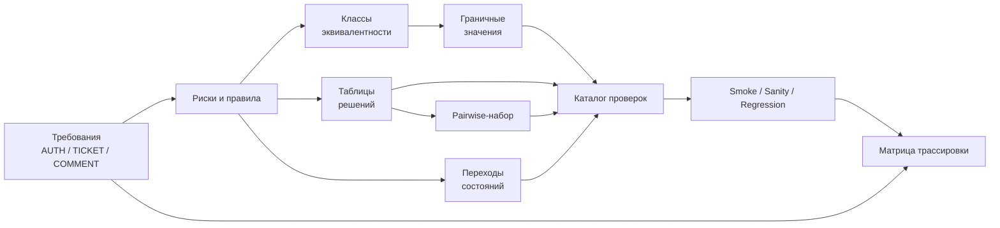
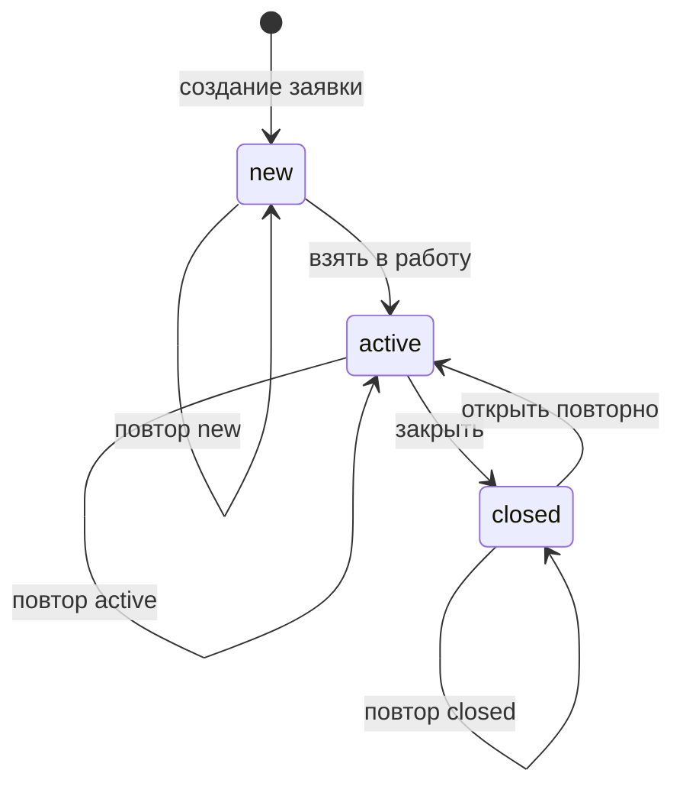

# Практическое задание № 3. Проектирование набора тестов

## Цель

Спроектировать целостную модель тестирования регистрации пользователя и
жизненного цикла заявки в приложении «Мини-заявки», применив основные понятия
методологии тестирования и техники тест-дизайна к одному связанному
бизнес-сценарию.

После выполнения работы вы сможете:

- переводить требования в проверяемые условия;
- различать уровни тестирования и выбирать подходящий уровень для риска;
- формировать smoke-, sanity- и regression-наборы;
- разделять позитивные и негативные проверки;
- выделять классы эквивалентности и значения на их границах;
- строить таблицы решений для сочетаний роли, владения заявкой и состояния;
- моделировать допустимые и недопустимые переходы состояний;
- сокращать комбинационный набор при помощи Pairwise;
- связывать требования, риски, техники и проверки в единой модели;
- оценивать полноту набора по покрытию правил, а не по количеству строк.

## Практическое задание

Используйте исправленную продуктовую ветку `monolith/fixed` и личный репозиторий
тестов, созданный в практической работе № 2. В личном репозитории создайте ветку
`practice/03-test-design` и единый документ:

```text
docs/test-design/03-registration-ticket-lifecycle.md
```

Документ должен описывать модель тестирования сквозного процесса:

```text
регистрация → вход → создание заявки → работа с новой заявкой
→ перевод оператором в active → перевод в closed → повторное открытие
```

Основными источниками ожидаемого поведения являются:

- `docs/ТРЕБОВАНИЯ.md`;
- `contract/openapi.json`;
- описание архитектуры `monolith/fixed` в корневом `README.md`;
- публичные маршруты `/api/auth/*` и `/api/tickets/*`;
- пользовательский интерфейс приложения и Swagger как способы наблюдения
  внешнего поведения.

Все части работы помещаются в один документ и используют общую систему
идентификаторов. Класс эквивалентности приводит к граничным данным, данные — к
проверке, проверка — к требованию и риску, а ожидаемый результат учитывает роль
и состояние заявки.

Основной результат этой работы — модель будущих проверок. Её можно дополнить
Postman-запросами, тест-кейсами или автоматизированными примерами, сохраняя
трассировку с общей моделью.

### Область проектирования

В модель входят следующие правила версии `1.0.0`:

| Область | Требования | Что проектируется |
|---|---|---|
| Регистрация | `AUTH-01` | Нормализация и уникальность email, длина пароля, роль нового пользователя, обработка неизвестных полей |
| Вход как предусловие | `AUTH-02` | Получение Bearer-токена для продолжения сценария и отсутствие чувствительных полей в ответах |
| Доступ к заявке | `AUTH-03` | Видимость собственной и чужой заявки для пользователя и оператора |
| Создание и изменение | `TICKET-01`–`TICKET-03` | Заголовок, приоритет, серверные поля, разрешение редактирования и удаления |
| Состояния | `TICKET-04` | Роль оператора, допустимые, повторные и отклоняемые переходы |
| Комментарии | `COMMENT-01` | Добавление комментария в разных состояниях и сохранение фактического автора |

### Связь частей модели



## Задание (шаги)

### Шаг 1. Подготовьте рабочие ветки

В продуктовом репозитории обновите ссылки на ветки и выберите исправленный
монолит:

```powershell
$taskProduct = Join-Path $env:USERPROFILE 'repos/testing'
Set-Location -LiteralPath $taskProduct
git fetch origin
git switch monolith/fixed
git pull --ff-only origin monolith/fixed
git branch --show-current
git status
```

В личном репозитории тестов начните работу от актуальной ветки `main`:

```powershell
$taskTests = Join-Path $env:USERPROFILE 'repos/mini-tickets-tests'
Set-Location -LiteralPath $taskTests
git switch main
git pull --ff-only origin main
git switch -c practice/03-test-design
New-Item -ItemType Directory -Path docs/test-design -Force | Out-Null
if (!(Test-Path -LiteralPath docs/test-design/03-registration-ticket-lifecycle.md)) {
    New-Item -ItemType File -Path docs/test-design/03-registration-ticket-lifecycle.md | Out-Null
}
```

Если личный каталог имеет другое имя, задайте в `$taskTests` его фактический
путь. Зафиксируйте в начале документа:

- ветку продукта `monolith/fixed`;
- полный Git SHA продукта;
- дату проектирования;
- ссылки на использованные требования и контракт;
- ветку личного репозитория `practice/03-test-design`.

Полный SHA продукта можно получить командой:

```powershell
git -C $taskProduct rev-parse HEAD
```

### Шаг 2. Создайте структуру единой модели

Добавьте в `03-registration-ticket-lifecycle.md` следующие разделы:

```markdown
# Модель тестирования регистрации и жизненного цикла заявки

## Версия и источники
## Область и границы модели
## Пользователи, данные и предусловия
## Сквозной бизнес-сценарий
## Требования, правила и риски
## Применение принципов тестирования
## Уровни тестирования
## Классификация наборов
## Классы эквивалентности
## Граничные значения
## Таблицы решений
## Модель состояний
## Pairwise-набор
## Каталог проверок
## Матрица трассировки
## Критерии покрытия и выводы
## Вопросы к требованиям
```

Разделы заполняются последовательно, но ссылаются друг на друга через
идентификаторы требований, рисков, классов и проверок.

Используйте единую схему идентификаторов, например:

| Префикс | Назначение | Пример |
|---|---|---|
| `RISK` | Риск продукта или проверки | `RISK-REG-01` |
| `EC` | Класс эквивалентности | `EC-EMAIL-VALID-NORMALIZED` |
| `BV` | Граничное значение | `BV-PASSWORD-07` |
| `CHK` | Проверка в общем каталоге | `CHK-REG-001` |
| `PW` | Строка Pairwise-набора | `PW-01` |

### Шаг 3. Опишите участников, тестовые данные и предусловия

Для сквозного сценария потребуются как минимум три логических участника:

| Участник | Роль | Назначение в модели |
|---|---|---|
| Новый пользователь | `user` | Регистрация, вход, создание собственной заявки |
| Другой пользователь | `user` | Проверка границы видимости и владения |
| Оператор | `operator` | Просмотр всех заявок и изменение статуса |

Опишите способ получения каждого участника. Новый пользователь создаётся через
регистрацию с уникальным email. Для другого пользователя и оператора можно
использовать подготовленные учётные записи или отдельные данные. В требованиях
зафиксируйте различие между ролью и владением: роль отвечает за полномочия, а
`author_id` — за принадлежность конкретной заявки.

Подготовьте словарь данных, который будет использоваться во всех разделах:

| Имя данных | Содержание | Где применяется |
|---|---|---|
| `email_valid` | Уникальный корректный email | Основной поток регистрации |
| `password_valid` | Пароль допустимой длины | Регистрация и вход |
| `title_valid` | Заголовок допустимой длины | Создание заявки |
| `operator_token` | Действующий токен оператора | Переходы статуса |
| `owner_token` | Действующий токен автора | Просмотр, изменение, комментарии |
| `other_user_token` | Токен другого пользователя | Проверка недоступной заявки |

Значения для классов и границ добавятся в этот словарь на следующих шагах.
Используйте уникальный фрагмент в email и заголовке, чтобы спроектированные
проверки могли выполняться независимо и однозначно находить созданные записи.

### Шаг 4. Разложите требования на атомарные правила

Одно требование может содержать несколько независимо проверяемых правил.
Разделите `AUTH-01`, `AUTH-02`, `AUTH-03`, `TICKET-01`–`TICKET-04` и
`COMMENT-01` на атомарные утверждения.

Для каждого правила заполните строку:

| ID требования | Атомарное правило | Наблюдаемый результат | Риск нарушения | Источник |
|---|---|---|---|---|
| `AUTH-01` | Email переводится в нижний регистр | В ответе и сохранённой записи находится нормализованный email | Один адрес создаёт несколько аккаунтов | `docs/ТРЕБОВАНИЯ.md` |
| `TICKET-03` | Автор и начальный статус назначаются сервером | В ответе `author_id` равен текущему пользователю, `status = new` | Клиент подменяет владельца или состояние | `docs/ТРЕБОВАНИЯ.md` |

Добавьте отдельные строки для следующих наблюдений:

- результат HTTP-запроса: код, заголовки и тело;
- фактическое изменение либо сохранение состояния заявки;
- видимость записи для автора, другого пользователя и оператора;
- серверные значения `id`, `author_id`, `role`, `status`, `created_at`;
- отсутствие пароля и его хеша в публичном ответе;
- отсутствие новой или изменённой записи после отклонённой операции.

Если формулировка допускает несколько толкований, внесите вопрос в раздел
«Вопросы к требованиям» и свяжите его с соответствующим правилом. Ожидаемый
результат при этом опирается на опубликованный контракт версии `1.0.0`.

### Шаг 5. Примените семь принципов тестирования

Создайте таблицу, показывающую практическое применение принципов к выбранному
сценарию:

| Принцип | Как влияет на модель |
|---|---|
| Тестирование показывает наличие дефектов | Результат проверки подтверждает конкретное наблюдение, а не абсолютную корректность системы |
| Исчерпывающее тестирование недостижимо | Комбинации сокращаются техниками риска, классов и Pairwise |
| Раннее тестирование | Противоречия и пропуски выявляются при чтении требований до выполнения запросов |
| Кластеризация дефектов | Наибольшая детализация направляется на авторизацию, границы данных и переходы статуса |
| Парадокс пестицида | Набор предусматривает обновление данных и комбинаций после изменений продукта |
| Тестирование зависит от контекста | Приоритеты учитывают учебное веб-приложение, роли, REST и PostgreSQL |
| Заблуждение об отсутствии ошибок | Технически успешный ответ оценивается вместе с бизнес-правилом и полезностью сценария |

Дополните каждую строку собственным примером из регистрации или работы с
заявкой. Свяжите наиболее важные примеры с рисками из шага 4.

### Шаг 6. Распределите проверки по уровням тестирования

Уровень определяется границей проверяемой системы, а не названием инструмента.
Для каждого существенного правила выберите наиболее ранний полезный уровень и
при необходимости более высокий уровень подтверждения.

| Уровень | Граница проверки | Примеры для этой модели |
|---|---|---|
| Unit | Одна функция или правило без внешних сервисов | Нормализация email, проверка длины заголовка, функция допустимости перехода |
| Интеграционный | Взаимодействие нескольких компонентов | API и PostgreSQL при уникальности email; каскад операций с заявкой; сессия и пользователь |
| Системный | Собранное приложение через публичные интерфейсы | Регистрация, вход и жизненный цикл заявки через REST или UI |
| Приёмочный (UAT) | Бизнес-ценность для пользователя | Пользователь создаёт обращение, оператор обрабатывает и закрывает его |

Составьте матрицу уровней:

| ID правила | Unit | Интеграционный | Системный | Приёмочный (UAT) | Обоснование выбора |
|---|---|---|---|---|---|

Одинаковое правило может проверяться на нескольких уровнях с разной целью.
Например, таблица переходов быстро проверяется на unit-уровне, а сохранение
нового состояния и полномочия оператора подтверждаются через системный API.

### Шаг 7. Сформируйте smoke-, sanity- и regression-наборы

Классификация по назначению описывает наборы, а признак
«позитивная/негативная» — направление конкретной проверки. Отметьте оба
измерения независимо.

**Smoke** подтверждает работоспособность критического бизнес-пути после сборки
или развёртывания. Спроектируйте короткий маршрут:

1. зарегистрировать нового пользователя;
2. выполнить вход;
3. создать заявку;
4. найти её в списке и карточке;
5. перевести заявку оператором `new → active → closed`;
6. подтвердить итоговое состояние.

**Sanity** формируется вокруг конкретного изменения. Опишите примеры состава
набора после изменений:

- правил нормализации email;
- валидации заголовка;
- матрицы переходов состояния;
- проверки роли оператора.

**Regression** покрывает основной поток, альтернативы, ошибки валидации,
авторизацию, владение, все состояния и связанные инварианты данных.

Создайте таблицу наборов:

| ID проверки | Smoke | Sanity-контекст | Regression | Позитивная/негативная | Причина включения |
|---|---:|---|---:|---|---|

Одна проверка может входить в smoke и regression. Sanity-контекст заполняйте
названием изменённой области, для которой эта проверка полезна.

### Шаг 8. Определите риски и приоритеты

Оцените риски по двум параметрам: влияние на пользователя и вероятность
нарушения. Используйте понятную шкалу, например `низкое / среднее / высокое`.

Рассмотрите следующие риски:

- создание нескольких пользователей для одного нормализованного email;
- сохранение или раскрытие пароля;
- регистрация с повышенной ролью;
- создание заявки от имени другого пользователя;
- просмотр или изменение чужой заявки;
- обход роли оператора при смене статуса;
- переход в недопустимое состояние;
- изменение данных при ответе `4xx`;
- добавление комментария после закрытия;
- расхождение состояния между ответом, списком и карточкой.

Добавьте таблицу:

| ID риска | Событие | Влияние | Вероятность | Приоритет проверки | Связанные требования |
|---|---|---|---|---|---|

Приоритет проверок должен объясняться риском и местом в бизнес-потоке. Эта
таблица поможет выбрать smoke и порядок будущей автоматизации.

### Шаг 9. Выделите классы эквивалентности для регистрации

Создайте классы отдельно для email, пароля и состава JSON. Класс описывает
множество данных, для которых ожидается одинаковая обработка.

Для email учтите:

- корректное значение в нижнем регистре;
- корректное значение с пробелами по краям и буквами разного регистра;
- отсутствие `@`;
- несколько символов `@`;
- отсутствие точки после `@`;
- пробел внутри адреса;
- входную строку в пределах 254 символов;
- строку длиннее 254 символов;
- новое нормализованное значение;
- уже зарегистрированное нормализованное значение.

Для пароля учтите:

- значения короче 8 символов;
- значения длиной 8–64 символа;
- значения длиннее 64 символов;
- пробелы как часть значения, поскольку пароль передаётся без обрезки;
- Unicode-символы с подсчётом в code points.

Для тела регистрации учтите:

- только `email` и `password`;
- отсутствие каждого требуемого поля;
- неизвестное поле;
- попытку передать `role`;
- неверный JSON-тип значения;
- корректные данные после предыдущей ошибки.

Оформите классы таблицей:

| ID класса | Параметр | Описание множества | Представитель | Ожидаемая обработка | Требование |
|---|---|---|---|---|---|

Для допустимого класса ожидайте не только код `201`, но и нормализованный email,
роль `user`, UUID и отсутствие полей пароля. Для отклоняемого класса ожидайте
код `422` или `409` в соответствии с причиной и сохранение исходного состояния
данных.

### Шаг 10. Выполните анализ граничных значений

Границы проверяются вокруг точки изменения поведения. Заполните таблицу
значениями `n-1`, `n`, `n+1` для каждого опубликованного ограничения.

| Поле | Нижняя граница | Значения около минимума | Верхняя граница | Значения около максимума |
|---|---:|---|---:|---|
| Пароль | 8 | 7, 8, 9 | 64 | 63, 64, 65 |
| Заголовок после обрезки | 3 | 2, 3, 4 | 80 | 79, 80, 81 |
| Комментарий после обрезки | 1 | 0, 1, 2 | 300 | 299, 300, 301 |
| Входная строка email | Определяется форматом | Валидный минимальный пример и соседние невалидные формы | 254 | 253, 254, 255 |

Для значений email длиной 253, 254 и 255 сохраняйте корректную структуру
`локальная-часть@домен.зона`, изменяя длину одной допустимой части. Тогда меняется
именно исследуемая длина, а не одновременно правило формата.

Для заголовка и комментария подготовьте два вида данных:

1. строку точной длины;
2. строку с пробелами по краям, длина содержимого которой попадает на границу.

Добавьте пример с Unicode и комбинируемыми символами. В требованиях длина
определена в Unicode code points, поэтому видимое количество символов и длина
строки могут различаться.

Для каждого значения зафиксируйте:

| ID | Поле | Значение или способ генерации | Длина входа | Длина после нормализации | Код | Инвариант данных |
|---|---|---|---:|---:|---:|---|

Инвариант для отклонённой регистрации — пользователь отсутствует. Инвариант для
отклонённого создания или изменения заявки — запись отсутствует либо сохраняет
прежние поля.

### Шаг 11. Спроектируйте классы для заявки

Для создания заявки выделите независимые параметры:

- класс заголовка;
- значение приоритета `low`, `normal`, `high`;
- отсутствие приоритета с ожидаемым значением `normal`;
- неизвестный приоритет;
- передача `author_id` или `status` как неизвестных полей;
- действующий, отсутствующий и недействительный Bearer-токен.

Для изменения заявки добавьте:

- только заголовок;
- только приоритет;
- оба редактируемых поля;
- пустой объект;
- явный `null`;
- неизвестное поле;
- собственную и чужую заявку;
- состояния `new`, `active`, `closed`.

Сопоставьте каждый класс с атомарным правилом и риском. Представитель класса
становится тестовыми данными только после того, как для него сформулирован
наблюдаемый ожидаемый результат.

### Шаг 12. Постройте таблицу решений для роли, владения и состояния

Сначала постройте таблицу для действий автора и оператора над заявкой. Входными
условиями являются:

- заявка существует;
- заявка видима участнику;
- участник является автором;
- роль участника `user` или `operator`;
- текущее состояние `new`, `active` или `closed`;
- действие: изменить поля, удалить, добавить комментарий, изменить статус.

Используйте формат:

| Правило | Роль | Владение | Состояние | Действие | Результат | Состояние данных |
|---|---|---|---|---|---|---|
| `DT-01` | `user` | Автор | `new` | Изменить заголовок | `200` | Заголовок изменён, статус прежний |
| `DT-02` | `operator` | Чужая заявка | `new` | Изменить заголовок | `403` | Поля прежние |
| `DT-03` | `user` | Чужая заявка | Любое | Просмотреть или изменить | `404` | Поля прежние |

Дополните таблицу всеми существенно различающимися результатами. Учитывайте
порядок проверок: чужая невидимая пользователю заявка возвращает `404`, а
видимая оператору чужая заявка возвращает `403` при редактировании или удалении.
Комментарии разрешены для доступной заявки в `new` и `active`, а в `closed`
возвращается `409`.

После заполнения сверните одинаковые правила при помощи значения «любое», если
результат действительно не зависит от этого условия. Каждое такое обобщение
сопроводите объяснением.

### Шаг 13. Постройте модель переходов состояния

Заявка создаётся в состоянии `new`. Из требования `TICKET-04` следуют переходы:



Повторная установка текущего состояния является допустимой идемпотентной
операцией. Остальные переходы между значениями закрытого набора отклоняются с
`409`. Изменение состояния выполняет оператор; для обычного пользователя
доступная собственная заявка даёт `403`.

Постройте полную матрицу переходов:

| Текущее состояние / Целевое | `new` | `active` | `closed` |
|---|---|---|---|
| `new` | Заполнить | Заполнить | Заполнить |
| `active` | Заполнить | Заполнить | Заполнить |
| `closed` | Заполнить | Заполнить | Заполнить |

В каждой ячейке укажите:

- допустимость перехода;
- ожидаемый HTTP-код для оператора;
- конечное состояние;
- ожидаемый результат для пользователя;
- сохранность прежнего состояния при отказе;
- связь с идентификатором будущей проверки.

Добавьте проверки начального состояния после создания, последовательности
`new → active → closed`, повторного открытия `closed → active`, повторов каждого
состояния и каждого отклоняемого направления.

### Шаг 14. Сформируйте Pairwise-модель

Pairwise используется для сочетаний независимых факторов поверх уже выбранных
граничных и критических проверок. Для модели жизненного цикла задайте факторы:

| Фактор | Значения |
|---|---|
| Участник | `owner_user`, `other_user`, `operator` |
| Текущее состояние | `new`, `active`, `closed` |
| Операция с данными | `edit_title_min`, `edit_title_max`, `comment_min`, `comment_max`, `set_new`, `set_active`, `set_closed` |

Во всех строках используется заявка, созданная `owner_user`. Поэтому
`other_user` означает другого обычного пользователя без доступа к заявке, а
`operator` — оператора, который видит чужую заявку, но не становится её автором.

Смысл составных операций:

- `edit_title_min` — изменить заголовок на допустимое значение длиной 3;
- `edit_title_max` — изменить заголовок на допустимое значение длиной 80;
- `comment_min` — добавить комментарий длиной 1;
- `comment_max` — добавить комментарий длиной 300;
- `set_*` — запросить соответствующее целевое состояние.

Постройте небольшой набор строк, в котором каждая пара значений любых двух
факторов встречается хотя бы один раз. Можно использовать Pairwise-инструмент,
таблицу или собственный алгоритм. Затем вручную добавьте ожидаемый результат по
таблице решений и матрице состояний:

| ID | Участник | Текущее состояние | Операция | Ожидаемый код | Ожидаемое изменение | Покрытые пары |
|---|---|---|---|---:|---|---|
| `PW-01` | Заполнить | Заполнить | Заполнить | Заполнить | Заполнить | Заполнить |

Проверьте покрытие пар `участник × состояние`, `участник × операция` и
`состояние × операция`. Отдельно сохраните критический smoke-путь, все значения
матрицы переходов и обязательные границы: Pairwise дополняет эти техники, а
критерии их полноты остаются самостоятельными.

### Шаг 15. Создайте общий каталог проверок

Соберите результаты всех техник в одну таблицу. Одна строка описывает одну цель
и один однозначный ожидаемый результат.

| ID | Название | Требование | Риск | Уровень | Набор | Направление | Техника | Предусловия | Данные | Действие | Ожидаемый результат |
|---|---|---|---|---|---|---|---|---|---|---|---|

Используйте последовательные группы идентификаторов:

- `CHK-REG-*` — регистрация;
- `CHK-AUTH-*` — вход и текущий пользователь;
- `CHK-CREATE-*` — создание заявки;
- `CHK-ACCESS-*` — видимость и владение;
- `CHK-EDIT-*` — изменение и удаление;
- `CHK-STATE-*` — переходы состояния;
- `CHK-COMMENT-*` — комментарии;
- `CHK-E2E-*` — сквозные бизнес-потоки.

В ожидаемом результате указывайте значимые наблюдения:

- HTTP-код;
- обязательные поля ответа;
- нормализованные и серверные значения;
- состояние заявки после действия;
- видимость результата для разных ролей;
- сохранение прежних данных после отказа;
- отсутствие чувствительных полей;
- связь ответа с созданным объектом по UUID.

Объединяйте несколько техник в одной проверке, когда это улучшает трассировку.
Например, проверка заголовка длиной 80 одновременно представляет допустимый
класс и верхнюю границу.

### Шаг 16. Постройте матрицу трассировки

Свяжите опубликованные требования с моделью:

| Требование | Риски | Классы и границы | Таблица решений | Переходы | Pairwise | Проверки | Наборы |
|---|---|---|---|---|---|---|---|
| `AUTH-01` | Заполнить | Заполнить | — | — | При наличии | Заполнить | Smoke / Regression |
| `AUTH-02` | Заполнить | Заполнить | При наличии | — | При наличии | Заполнить | Smoke / Regression |
| `AUTH-03` | Заполнить | Заполнить | Заполнить | — | Заполнить | Заполнить | Regression |
| `TICKET-01` | Заполнить | Заполнить | При наличии | — | Заполнить | Заполнить | Smoke / Regression |
| `TICKET-02` | Заполнить | Заполнить | При наличии | — | При наличии | Заполнить | Regression |
| `TICKET-03` | Заполнить | Заполнить | Заполнить | `new` как условие | Заполнить | Заполнить | Smoke / Regression |
| `TICKET-04` | Заполнить | Закрытый набор | Заполнить | Заполнить | Заполнить | Заполнить | Smoke / Regression |
| `COMMENT-01` | Заполнить | Заполнить | Заполнить | `closed` как условие | Заполнить | Заполнить | Regression |

Пустая ячейка должна означать осознанную неприменимость техники и обозначаться
символом `—`. Для каждой ссылки используйте реальные идентификаторы из своего
документа.

### Шаг 17. Проведите ревью модели

Прочитайте документ в четырёх направлениях.

**От требования к проверкам:** каждое атомарное правило связано хотя бы с одной
проверкой и наблюдаемым результатом.

**От проверки к требованию:** каждая строка каталога имеет источник ожидаемого
поведения или явно отмеченный вопрос.

**От данных к результату:** каждый представитель класса и каждая граница имеют
ожидаемую обработку и инвариант данных.

**От бизнес-потока к наборам:** smoke подтверждает основной маршрут, sanity
связан с областью изменения, regression покрывает альтернативы и риски.

Найдите и исправьте:

- проверки с несколькими несвязанными целями;
- одинаковые проверки с разными идентификаторами;
- ожидаемые результаты без конкретного наблюдения;
- требования без проверок;
- проверки без требования или риска;
- пропуски разрешённых и отклоняемых переходов;
- Pairwise-строки без определённого результата;
- смешение роли, владения и видимости;
- граничные данные, длина которых меняется после обрезки иначе, чем задумано.

Завершите документ кратким выводом: какие риски закрывает модель, какие проверки
войдут в smoke, какие области требуют широкого regression и какие вопросы могут
изменить ожидаемый результат.

### Шаг 18. Зафиксируйте модель в личном репозитории

Просмотрите итоговое изменение:

```powershell
Set-Location -LiteralPath $taskTests
git status --short
git diff -- docs/test-design/03-registration-ticket-lifecycle.md
```

Создайте коммит и опубликуйте ветку:

```powershell
git add docs/test-design/03-registration-ticket-lifecycle.md
git commit -m 'Спроектирована модель тестирования регистрации и заявок'
git push -u origin practice/03-test-design
```

Если личный репозиторий используется одновременно в GitHub и GitLab, отправьте
тот же коммит на вторую площадку:

```powershell
git push -u gitlab practice/03-test-design
```

PR и MR направляются из `practice/03-test-design` в `main` личного репозитория.
В описании изменения кратко перечислите выбранные требования, применённые
техники и основные критерии покрытия.

Для этого SHA выполните [общий цикл проверки CI](README.md#общий-цикл-результата):
сопоставьте GitHub Actions и GitLab CI, их журналы и опубликованные артефакты.

## Подсказки по ключевым частям

### Тестовый уровень и способ выполнения — разные измерения

API-запрос может участвовать в интеграционной или системной проверке в
зависимости от поднятых компонентов. UI-проверка обычно наблюдает собранную
систему, а чистая функция переходов подходит для unit-уровня. Сначала определите
границу проверяемой системы, затем выбирайте инструмент.

### Позитивная проверка может содержать сложный путь

Позитивная проверка использует допустимые условия и подтверждает ожидаемое
поведение. Негативная проверка подаёт недопустимое условие или выполняет действие
без требуемых полномочий. Красный или зелёный статус будущего теста описывает
фактический результат выполнения, а не тип спроектированной проверки.

### Sanity определяется изменением

У sanity-набора есть контекст: конкретно изменённая функция, исправленный дефект
или область риска. Проверка границы email может входить в sanity после изменения
регистрации, но не обязана входить в sanity после изменения таблицы переходов.

### Класс эквивалентности шире одного примера

Строка `wrong-email` является тестовым значением, а класс — множеством адресов,
не содержащих требуемого элемента формата. Название класса описывает правило обработки,
после чего из класса выбирается представитель.

### Граница относится к нормализованному значению

Заголовок и комментарий обрезаются по краям до проверки длины. Строка из 80
значимых символов с пробелами по краям остаётся допустимой, если после обрезки
содержит ровно 80 code points. Email имеет отдельное правило: ограничение 254
относится к входной строке, затем выполняются обрезка краёв и приведение к
нижнему регистру. Пароль передаётся без обрезки.

### Код ответа является частью, но не всем ожидаемым результатом

После `201` проверьте нормализованные и серверные поля. После `422`, `403` или
`409` важно подтвердить сохранность данных. После `404` для чужой заявки важно
учесть, что одинаковый ответ скрывает и отсутствующий, и недоступный объект.

### Различайте 401, 403, 404, 409 и 422

| Код | Смысл в выбранном сценарии |
|---:|---|
| `401` | Действующая сессия отсутствует |
| `403` | Участник распознан, но его роль или авторство не разрешают видимое действие |
| `404` | Заявка отсутствует либо скрыта от пользователя правилами доступа |
| `409` | Данные формально допустимы, но конфликтуют с уникальностью или состоянием |
| `422` | Структура или значение входных данных не прошло валидацию |

### Роль и владение дают разные решения

Оператор видит чужую заявку и может изменить её статус, но не становится её
автором и не получает право изменить заголовок или удалить запись. Другой
обычный пользователь не видит заявку, поэтому получает `404` раньше проверки
разрешения на конкретное действие.

### Повтор состояния является отдельным переходом

`new → new`, `active → active` и `closed → closed` допустимы. Это важная часть
контракта и хороший пример идемпотентного результата `PUT`. Переход
`closed → active` повторно открывает заявку, поэтому модель содержит больше
сценариев, чем только основной путь `new → active → closed`.

### Pairwise сокращает комбинации, а не правила

Pairwise помогает сократить декартово произведение роли, состояния и операции.
Все бизнес-критичные переходы, граничные значения и основной поток сохраняются
как отдельные критерии покрытия. Ожидаемый результат каждой Pairwise-строки
выводится из таблицы решений и модели состояний.

### Трассировка работает в обе стороны

Матрица показывает покрытие требования проверками и одновременно объясняет
назначение каждой проверки. Ссылки на классы, риски и переходы делают изменение
модели управляемым при новой версии требований.

### Открытый вопрос отличается от предположения

Открытый вопрос фиксирует отсутствующую или неоднозначную информацию. Временное
предположение дополнительно задаёт выбранное ожидаемое поведение и риск ошибки.
Размещайте оба элемента рядом с затронутыми проверками, чтобы после уточнения
быстро обновить модель.

## Что проверить перед отправкой (чек-лист)

- [ ] В продукте выбрана ветка `monolith/fixed`, в документе указан её полный
      Git SHA.
- [ ] В личном репозитории используется ветка `practice/03-test-design`.
- [ ] Модель находится в файле
      `docs/test-design/03-registration-ticket-lifecycle.md`.
- [ ] Указаны источники требований и границы рассматриваемого сценария.
- [ ] Описаны новый пользователь, другой пользователь, оператор и владение
      заявкой.
- [ ] `AUTH-01`, `AUTH-02`, `AUTH-03`, `TICKET-01`–`TICKET-04` и `COMMENT-01`
      разложены на атомарные правила.
- [ ] Для правил определены наблюдаемые результаты и риски.
- [ ] Для семи принципов тестирования приведены примеры из выбранного сценария.
- [ ] Проверки распределены по unit-, интеграционному, системному и приёмочному
      (UAT)
      уровням с обоснованием.
- [ ] Smoke содержит критический сквозной путь.
- [ ] Sanity связан с конкретными областями изменения.
- [ ] Regression покрывает основной поток, альтернативы, ошибки, роли и
      состояния.
- [ ] Для каждой проверки указано позитивное или негативное направление.
- [ ] Для email, пароля, состава JSON, заголовка и приоритета выделены классы
      эквивалентности.
- [ ] Для пароля проверены значения 7/8/9 и 63/64/65.
- [ ] Для заголовка проверены значения 2/3/4 и 79/80/81 после обрезки.
- [ ] Для комментария проверены значения 0/1/2 и 299/300/301 после обрезки.
- [ ] Для email рассмотрены формат, нормализация, уникальность и длина
      253/254/255.
- [ ] Таблица решений различает роль, владение, видимость, состояние и действие.
- [ ] Матрица состояний содержит девять комбинаций текущего и целевого статуса.
- [ ] Учтены основной путь, повтор каждого состояния и `closed → active`.
- [ ] Pairwise-набор покрывает пары участника, состояния и операции.
- [ ] Каждая строка Pairwise имеет ожидаемый код и состояние данных.
- [ ] Общий каталог использует единые идентификаторы и однозначные ожидаемые
      результаты.
- [ ] Матрица трассировки связывает требования, риски, техники, проверки и
      наборы.
- [ ] Неприменимые техники обозначены осознанно, вопросы к требованиям собраны
      отдельно.
- [ ] Итоговый вывод описывает покрытые риски и состав будущих наборов.
- [ ] `git diff` содержит целостную модель, а `git status` соответствует
      подготовленным изменениям.

## Советы по улучшению работы

- Формулируйте название проверки как наблюдаемое поведение: «повторный
  нормализованный email отклоняется с 409», а не как общее «проверить email».
- Используйте один словарь тестовых данных во всех таблицах, чтобы одинаковые
  имена обозначали одинаковые значения.
- Указывайте способ генерации длинных строк вместо ручного копирования сотен
  символов.
- Совмещайте класс и границу в одной проверке, когда ожидаемое поведение и риск
  совпадают.
- Выносите различающиеся ожидаемые результаты в отдельные строки, особенно для
  `403`, `404`, `409` и `422`.
- Добавляйте к негативным проверкам инвариант: какая запись и какие поля должны
  остаться прежними.
- Сохраняйте в smoke только критический связный поток, чтобы его назначение было
  понятно без чтения всего regression.
- Подписывайте sanity-набор областью изменения или идентификатором дефекта.
- Ранжируйте будущую автоматизацию по риску, повторяемости и стоимости
  подготовки данных.
- Используйте Mermaid для переходов и таблицы для решений: эти представления
  дополняют друг друга.
- Проверяйте пары Pairwise отдельной матрицей покрытия, а не только количеством
  полученных строк.
- Ссылайтесь на точный идентификатор требования рядом с ожидаемым результатом.
- Оставляйте в выводе остаточные риски: полное покрытие выбранной таблицы не
  означает исчерпывающего тестирования приложения.
- При дальнейшем создании Postman-коллекции и автотестов сохраняйте идентификаторы
  `CHK-*`, чтобы модель оставалась источником набора проверок.
