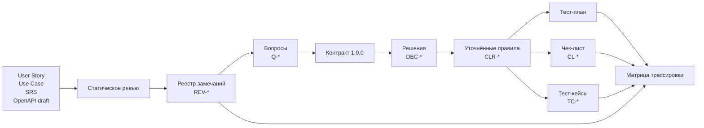

# Практическое задание № 4. Ревью требований и подготовка тестовой документации

## Цель

Научиться проводить статическое тестирование требований, превращать
разрозненные и противоречивые источники в согласованное ожидаемое поведение и на
этой основе создавать связанную тестовую документацию.

После выполнения работы вы сможете:

- объяснить назначение User Story, Use Case, SRS и OpenAPI;
- находить неоднозначности, пропуски, противоречия и непроверяемые формулировки;
- отделять наблюдение при ревью от вопроса, предположения и принятого решения;
- оценивать влияние дефекта требования на продукт и будущие проверки;
- формулировать атомарное, однозначное и наблюдаемое ожидаемое поведение;
- определять область, риски, данные и критерии тестирования в тест-плане;
- преобразовывать уточнённые правила в чек-лист и воспроизводимые тест-кейсы;
- строить двунаправленную трассировку от источника до проверки;
- согласовывать между собой тест-план, чек-лист, тест-кейсы и модель из
  практической работы № 3.

## Практическое задание

Проведите ревью учебного некорректного пакета требований к регистрации и
обработке заявки. Пакет создан только для этой работы, содержит намеренные
дефекты документации и не является действующим контрактом приложения. Он
состоит из четырёх источников:

- [учебная некорректная User Story](materials/04-requirements-review/user-story.md);
- [учебный некорректный Use Case](materials/04-requirements-review/use-case.md);
- [учебный некорректный фрагмент SRS](materials/04-requirements-review/srs-fragment.md);
- [учебный некорректный фрагмент OpenAPI](materials/04-requirements-review/openapi-fragment.yaml).

Работа выполняется в два связанных этапа.

1. Провести независимое статическое ревью чернового пакета: найти проблемы
   внутри каждого документа и между источниками, описать риски и сформулировать
   вопросы.
2. Сверить находки с опубликованным контрактом версии `1.0.0`, зафиксировать
   уточнённое ожидаемое поведение и подготовить на его основе тест-план,
   чек-лист, тест-кейсы и матрицу трассировки.

Используйте продуктовую ветку `monolith/fixed` и личный репозиторий тестов. В
личном репозитории создайте ветку `practice/04-requirements-docs` и единый файл:

```text
docs/test-documentation/04-requirements-review.md
```

В этом файле последовательно размещаются реестр замечаний, вопросы и решения,
уточнённые правила и вся связанная тестовая документация. Единые идентификаторы
покажут, как одна найденная проблема влияет на требования, риски и проверки.

### Источники уточнённого поведения

После завершения первого этапа используйте:

- `docs/ТРЕБОВАНИЯ.md` — текстовый контракт версии `1.0.0`;
- `contract/openapi.json` — полный машиночитаемый HTTP-контракт;
- `docs/ШАБЛОНЫ.md` — минимальный состав тестовой документации;
- модель `docs/test-design/03-registration-ticket-lifecycle.md` из личного
  репозитория — ранее выделенные классы, границы, решения и переходы.

Черновые материалы остаются объектом ревью. Уточнённый контракт используется
как источник решений, из которых создаётся согласованный комплект документов.

### Маршрут работы с документацией



## Задание (шаги)

### Шаг 1. Подготовьте продукт и рабочую ветку

Обновите исправленную ветку продукта и запишите её точный коммит:

```powershell
$taskProduct = Join-Path $env:USERPROFILE 'repos/testing'
Set-Location -LiteralPath $taskProduct
git fetch origin
git switch monolith/fixed
git pull --ff-only origin monolith/fixed
$taskProductRef = git rev-parse HEAD
$taskProductRef
```

В личном репозитории начните работу от актуальной `main`:

```powershell
$taskTests = Join-Path $env:USERPROFILE 'repos/mini-tickets-tests'
Set-Location -LiteralPath $taskTests
git switch main
git pull --ff-only origin main
git switch -c practice/04-requirements-docs
New-Item -ItemType Directory -Path docs/test-documentation -Force | Out-Null
$taskReview = 'docs/test-documentation/04-requirements-review.md'
if (!(Test-Path -LiteralPath $taskReview)) {
    New-Item -ItemType File -Path $taskReview | Out-Null
}
```

В начале документа укажите:

- название и цель ревью;
- ветку и SHA продукта;
- версию каждого изучаемого источника, если она указана;
- дату анализа;
- область: регистрация, создание, доступ, изменение, состояния и комментарии;
- ссылку на модель тест-дизайна из практической работы № 3.

### Шаг 2. Создайте структуру итогового документа

Используйте следующий каркас:

```markdown
# Ревью требований и тестовая документация

## Версия, область и источники
## Участники и словарь терминов
## Критерии качества требований
## Реестр замечаний
### User Story
### Use Case
### SRS
### OpenAPI
### Междокументные расхождения
## Вопросы к требованиям
## Решения и уточнённое ожидаемое поведение
## Краткий тест-план
## Чек-лист
## Тест-кейсы
## Матрица трассировки
## Итоги и остаточные риски
```

Задайте единую систему идентификаторов:

| Префикс | Сущность | Пример |
|---|---|---|
| `SRC` | Исходное утверждение | `SRC-SRS-03` |
| `REV` | Замечание ревью | `REV-API-04` |
| `Q` | Вопрос для уточнения | `Q-STATUS-02` |
| `DEC` | Зафиксированное решение | `DEC-STATUS-02` |
| `CLR` | Уточнённое атомарное правило | `CLR-TKT-05` |
| `RISK` | Риск | `RISK-ACCESS-01` |
| `CL` | Проверка чек-листа | `CL-REG-03` |
| `TC` | Полный тест-кейс | `TC-STATE-02` |

Идентификаторы позволяют ссылаться на одну сущность из нескольких разделов без
копирования длинной формулировки.

### Шаг 3. Определите критерии качества требований

До чтения отдельных документов сформулируйте критерии ревью.

| Критерий | Контрольный вопрос |
|---|---|
| Полнота | Указаны ли участник, предусловия, вход, обработка, результат, ошибки и изменение данных? |
| Однозначность | Можно ли понять формулировку только одним способом? |
| Непротиворечивость | Совместимо ли правило с другими строками и источниками? |
| Проверяемость | Существует ли наблюдаемый критерий успешного результата? |
| Атомарность | Описывает ли утверждение одно правило или несколько независимых правил? |
| Реализуемость | Можно ли получить результат в заявленной системе и архитектуре? |
| Трассируемость | Есть ли устойчивый ID и источник правила? |
| Согласованность терминов | Одинаково ли используются роль, статус, заявка, автор и доступ? |

Добавьте рабочий словарь терминов. Начните с понятий:

- пользователь;
- клиент;
- автор или владелец заявки;
- оператор;
- заявка или обращение;
- приоритет;
- состояние или статус;
- доступ, видимость и разрешение на действие;
- успешная регистрация;
- понятная ошибка;
- закрытая заявка.

Если источники используют разные слова для одной сущности, зафиксируйте это как
решение словаря или как вопрос.

### Шаг 4. Проведите ревью User Story

Прочитайте `user-story.md` как описание пользовательской ценности. Выделите:

1. роль;
2. потребность;
3. ожидаемую ценность;
4. критерии приёмки;
5. слова, которые требуют измеримого определения;
6. утверждения о полномочиях и состояниях;
7. отсутствующие альтернативы и ошибки.

Для каждого критерия приёмки задайте вопросы:

- какое конкретное состояние системы наблюдается;
- какие данные считаются допустимыми;
- кто именно выполняет действие;
- где заканчивается основной поток;
- что происходит при конфликте или ошибке;
- как проверить заявленную скорость, понятность или содержательность;
- совместим ли критерий с остальными источниками.

Добавьте находки в общий реестр. User Story может оставаться компактной, но её
критерии приёмки должны ссылаться на детальные правила или явно обозначать
необходимость уточнения.

### Шаг 5. Проведите ревью Use Case

Проверьте `use-case.md` как описание взаимодействия участников с системой.
Проследите основной поток от предусловия до постусловия.

Для каждого шага определите:

- действующего участника;
- входные данные;
- действие системы;
- наблюдаемый результат;
- состояние пользователя и заявки до и после шага;
- возможный альтернативный поток;
- способ возврата в основной поток либо завершения сценария.

Отдельно рассмотрите:

- согласованность предусловия регистрации с первым шагом;
- границы заголовка;
- название начального состояния;
- полномочия автора и оператора;
- видимость чужой заявки;
- повторное открытие;
- поведение при уже зарегистрированном email;
- конкретность постусловий.

Найдите места, где альтернативный поток допускает несколько разных решений.
Для каждого такого места сформулируйте вопрос и укажите риск выбора неверной
трактовки.

### Шаг 6. Проведите ревью фрагмента SRS

Разложите каждое требование `SRS-*` на атомарные утверждения по схеме:

```text
кто или что → при каких условиях → получает какие входные данные
→ выполняет какое правило → возвращает какой результат
→ как меняется состояние данных
```

Проверьте числовые границы, порядок нормализации, закрытые наборы значений,
значения по умолчанию, роли и коды ошибок.

Составьте таблицу:

| SRC-ID | Раздел SRS | Атомарное утверждение | Что известно | Чего не хватает | Связанный REV-ID |
|---|---|---|---|---|---|

Одно предложение SRS может породить несколько строк. Например, правило создания
может независимо определять авторизацию, обязательность заголовка, назначение
автора, начальное состояние и результат сохранения.

Сопоставьте термины SRS с User Story и Use Case. Различие слов само по себе
становится проблемой, когда меняет множество допустимых данных, полномочия или
наблюдаемый результат.

### Шаг 7. Проведите ревью фрагмента OpenAPI

Откройте `openapi-fragment.yaml` как описание формы HTTP-взаимодействия.
Проверьте:

- версию OpenAPI и версию описываемого API;
- пути и HTTP-методы;
- path parameters;
- обязательность request body;
- обязательные и необязательные поля схем;
- типы, форматы, `enum`, `minLength`, `maxLength`, `default`;
- серверные и клиентские поля;
- успешные HTTP-коды;
- ответы валидации, авторизации, доступа, отсутствия и конфликта;
- общую схему ошибки;
- описание Bearer-аутентификации;
- обязательные заголовки ответа;
- полноту ответа после изменения состояния.

Для каждой операции оформите мини-таблицу:

| Операция | Вход | Успех | Ошибки | Авторизация | Изменение данных | Найденные вопросы |
|---|---|---|---|---|---|---|

OpenAPI может быть синтаксически читаемым и одновременно содержать неполный или
противоречивый контракт. Отмечайте отдельно проблему структуры документа и
проблему описываемого поведения.

### Шаг 8. Найдите междокументные расхождения

Постройте сравнительную таблицу, не обращаясь пока к уточнённому контракту:

| Тема | User Story | Use Case | SRS | OpenAPI draft | Наблюдение |
|---|---|---|---|---|---|
| Email | Заполнить | Заполнить | Заполнить | Заполнить | Заполнить |
| Пароль | Заполнить | Заполнить | Заполнить | Заполнить | Заполнить |
| Роль регистрации | Заполнить | Заполнить | Заполнить | Заполнить | Заполнить |
| Заголовок | Заполнить | Заполнить | Заполнить | Заполнить | Заполнить |
| Приоритет по умолчанию | Заполнить | Заполнить | Заполнить | Заполнить | Заполнить |
| Автор заявки | Заполнить | Заполнить | Заполнить | Заполнить | Заполнить |
| Начальное состояние | Заполнить | Заполнить | Заполнить | Заполнить | Заполнить |
| Изменение владельцем | Заполнить | Заполнить | Заполнить | Заполнить | Заполнить |
| Права оператора | Заполнить | Заполнить | Заполнить | Заполнить | Заполнить |
| Переходы состояния | Заполнить | Заполнить | Заполнить | Заполнить | Заполнить |
| Комментарии | Заполнить | Заполнить | Заполнить | Заполнить | Заполнить |
| Ошибки | Заполнить | Заполнить | Заполнить | Заполнить | Заполнить |

Значение «не описано» является полезным результатом сравнения. Различайте:

- источник молчит о правиле;
- источник делегирует детализацию другому документу;
- источник использует неопределённый термин;
- два источника задают несовместимые значения.

### Шаг 9. Сформируйте единый реестр замечаний

Перенесите все находки в одну таблицу:

| REV-ID | Источник и место | Краткое утверждение | Категория | Наблюдение | Риск | Вопрос | Предложение | Статус |
|---|---|---|---|---|---|---|---|---|

Используйте одну основную категорию:

| Категория | Значение |
|---|---|
| `ambiguity` | Формулировка допускает несколько существенных трактовок |
| `missing` | Для выполнения или проверки отсутствует необходимое правило |
| `inconsistency` | Два утверждения невозможно выполнить одновременно |
| `testability` | Результат нельзя однозначно наблюдать или измерить |

При необходимости добавьте дополнительную метку: `terminology`, `traceability`,
`atomicity`, `feasibility` или `duplicate`.

В поле «Наблюдение» опишите факт о тексте. В поле «Риск» укажите возможное
влияние: неверные данные, нарушение доступа, несовместимый API, невозможность
создать тестовый оракул, различная реализация клиентом и сервером.

Приоритет реестра обоснуйте влиянием:

- правила доступа, авторства и роли;
- сохранность и уникальность данных;
- несовместимый HTTP-контракт;
- состояние жизненного цикла;
- границы входных данных;
- удобство и полнота сообщения об ошибке.

### Шаг 10. Сформулируйте вопросы и варианты решений

Для каждого замечания, которое требует решения, создайте вопрос `Q-*`:

| Q-ID | Связанные REV-ID | Вопрос | Почему ответ важен | Варианты трактовки | Затронутые документы и проверки |
|---|---|---|---|---|---|

Хороший вопрос содержит конкретные варианты и точку выбора. Например, вопрос о
статусе уточняет, кто выполняет переход, из какого состояния в какое, какой код
возвращается и сохраняется ли прежнее состояние при отказе.

Разделите три сущности:

- замечание — наблюдение о качестве исходного текста;
- вопрос — информация, необходимая для выбора поведения;
- решение — подтверждённая трактовка с указанным источником.

Создайте пустой журнал решений перед переходом ко второму этапу:

| DEC-ID | Q-ID | Решение | Источник подтверждения | Затронутые CLR-ID | Затронутые проверки |
|---|---|---|---|---|---|

### Шаг 11. Уточните ожидаемое поведение по контракту версии 1.0.0

После фиксации независимых находок откройте `docs/ТРЕБОВАНИЯ.md` и полный
`contract/openapi.json` продуктовой ветки. Для каждого `Q-*` найдите ответ либо
зафиксируйте, что опубликованные источники оставляют вопрос открытым.

Заполните `DEC-*` и сформулируйте атомарные правила `CLR-*`:

| CLR-ID | Участник и условие | Вход | Ожидаемый HTTP-результат | Состояние данных | Источник | Заменяет или уточняет |
|---|---|---|---|---|---|---|

Уточнённая модель должна охватывать:

- нормализацию, формат, длину и уникальность email;
- длину пароля и отсутствие его обрезки;
- роль нового пользователя и состав публичного ответа;
- границы заголовка после обрезки;
- закрытый набор и значение приоритета по умолчанию;
- серверное назначение автора и начального состояния;
- различие видимости, владения и полномочий;
- редактирование и удаление заявки в зависимости от автора и состояния;
- разрешённые, повторные и отклоняемые переходы;
- возможность повторного открытия;
- добавление комментариев в каждом состоянии;
- назначение кодов `401`, `403`, `404`, `409` и `422`;
- структуру ошибки и идентификатор запроса;
- сохранность прежних данных после отклонённой операции.

Сопоставьте `CLR-*` с идентификаторами `AUTH-*`, `TICKET-*`, `COMMENT-*` и
`UI-*` опубликованного контракта.

### Шаг 12. Подготовьте краткий тест-план

Тест-план объясняет стратегию проверки уточнённого сценария. Включите:

1. версию продукта и документации;
2. цель тестирования;
3. объекты и границы проверки;
4. рассматриваемые и смежные функции;
5. основные риски и приоритеты;
6. уровни и виды тестирования;
7. состав smoke, sanity и regression;
8. окружение: `monolith/fixed`, браузер, API, PostgreSQL;
9. роли и тестовые данные;
10. подготовку и очистку данных;
11. критерии начала проверки;
12. критерии завершения;
13. условия приостановки и возобновления;
14. создаваемые доказательства и отчёты;
15. остаточные риски.

Используйте компактную структуру:

| Раздел | Решение для выбранного сценария | Обоснование или ссылка |
|---|---|---|

В тест-плане ссылайтесь на группы `CL-*` и `TC-*`, а подробные шаги оставляйте в
соответствующих разделах документа.

### Шаг 13. Составьте чек-лист

Сгруппируйте проверки по функциональным областям:

- регистрация и нормализация;
- вход и действующая сессия;
- создание и серверные значения заявки;
- видимость и доступ;
- изменение и удаление;
- переходы состояния;
- комментарии;
- отображение результата и ошибок;
- сохранность данных после отклонения.

Формат строки:

| CL-ID | Краткая проверка | Роль и состояние | Данные или класс | Ожидаемое наблюдение | CLR/REQ | Приоритет | Набор |
|---|---|---|---|---|---|---|---|

Формулируйте проверку как условие и ожидаемое поведение. Например, строка о
дубликате email должна связывать нормализованное значение, код конфликта и
отсутствие второго пользователя.

Перенесите в чек-лист классы, границы, решения и переходы из модели практической
работы № 3. Сохраняйте прежние идентификаторы как ссылки, если правило не
изменилось после ревью.

### Шаг 14. Оформите полноценные тест-кейсы

Выберите из чек-листа представительный набор позитивных, негативных, граничных,
ролевых и state-transition проверок. В наборе раскройте:

- успешную регистрацию с нормализацией email;
- повтор нормализованного email и сохранность данных;
- создание заявки без приоритета;
- границы заголовка после обрезки;
- доступ автора, другого пользователя и оператора к одной заявке;
- полный операторский цикл `new → active → closed → active`;
- отклоняемый переход и сохранение прежнего состояния;
- комментарий в разрешённом и закрытом состояниях;
- отображение результата или ошибки в интерфейсе.

Для каждого `TC-*` укажите:

| Поле | Содержание |
|---|---|
| Идентификатор и название | Одна проверяемая цель |
| Требование и решение | `CLR-*`, исходный `REQ-*`, при необходимости `DEC-*` |
| Риск и приоритет | Причина включения в набор |
| Уровень и вид | API, UI, интеграционный, системный, позитивный или негативный |
| Предусловия | Роли, состояние приложения и данных |
| Тестовые данные | Конкретные либо способ генерации |
| Шаги | Последовательность действий |
| Ожидаемый результат шага | Наблюдаемое состояние после значимого действия |
| Постусловия | Состояние созданных данных |
| Очистка | Способ вернуть среду в контролируемое состояние |
| Доказательства | HTTP-код, тело, `X-Request-ID`, скриншот или запись данных |

Для негативных кейсов включите проверку инварианта. После `4xx` подтвердите,
что пользователь, заявка, статус или комментарий не появились и не изменились,
если операция была отклонена.

### Шаг 15. Постройте матрицу трассировки

Соедините результаты анализа и тестовую документацию:

| CLR/REQ | Исходные SRC | REV | Q/DEC | Риск | Чек-лист | Тест-кейсы | Уровень/набор | Покрытие |
|---|---|---|---|---|---|---|---|---|

Добавьте строки для:

- `AUTH-01`, `AUTH-02`, `AUTH-03`;
- `TICKET-01`, `TICKET-02`, `TICKET-03`, `TICKET-04`, `TICKET-05`;
- `COMMENT-01`;
- `UI-01`, `UI-02`, `UI-03`.

В столбце покрытия используйте понятные состояния: `покрыто чек-листом`,
`покрыто тест-кейсом`, `запланировано`, `неприменимо` или `требует уточнения`.
Для неприменимости укажите краткое обоснование.

Проверьте трассировку в обе стороны:

1. от исходной спорной строки к замечанию, решению и проверке;
2. от каждого пункта чек-листа и тест-кейса к уточнённому правилу;
3. от каждого критичного риска к проверке и ожидаемому доказательству.

### Шаг 16. Проведите согласованное ревью комплекта

Сравните разделы итогового документа между собой.

**Реестр замечаний и решения**

- каждое замечание с влиянием имеет вопрос либо прямое подтверждение;
- решение содержит источник и затронутые правила;
- исходный черновик и уточнённое поведение различимы.

**Тест-план и проверки**

- заявленные области представлены в чек-листе;
- риски влияют на приоритет и состав наборов;
- критерии начала и завершения можно наблюдать;
- окружение и роли соответствуют выбранной ветке.

**Чек-лист и тест-кейсы**

- краткие проверки используют те же ожидаемые правила;
- выбранные кейсы раскрывают данные и последовательность шагов;
- негативные проверки содержат инвариант данных;
- состояния до и после перехода указаны явно.

**Матрица трассировки**

- требования и решения имеют покрытие или объяснённый статус;
- ссылки ведут к существующим идентификаторам;
- проверки связаны с источником ожидаемого результата;
- спорные области сохраняют связь с `REV-*` и `Q-*`.

Завершите разделом «Итоги и остаточные риски». Укажите основные найденные типы
проблем, правила с наибольшим влиянием, изменения тестовой модели после
уточнения и оставшиеся вопросы.

### Шаг 17. Зафиксируйте результат в личном репозитории

Просмотрите итоговое изменение:

```powershell
Set-Location -LiteralPath $taskTests
git status --short
git diff -- docs/test-documentation/04-requirements-review.md
```

Создайте коммит и опубликуйте рабочую ветку:

```powershell
git add docs/test-documentation/04-requirements-review.md
git commit -m 'Выполнено ревью требований и подготовлена тестовая документация'
git push -u origin practice/04-requirements-docs
```

При использовании второго remote отправьте тот же коммит в GitLab:

```powershell
git push -u gitlab practice/04-requirements-docs
```

PR и MR направляются в `main` личного репозитория. В описании изменения
перечислите источники, категории замечаний, принятые решения и созданные виды
тестовой документации.

## Подсказки по ключевым частям

### Статическое тестирование исследует документ

На этапе ревью наблюдением является качество формулировки: отсутствие границы,
два возможных толкования, конфликт значений или невозможность измерить результат.
Фактическое поведение работающего приложения относится уже к динамическому
тестированию и может стать отдельным источником информации.

### User Story задаёт ценность, но не заменяет спецификацию

Формула «как роль, я хочу возможность, чтобы получить ценность» помогает понять
смысл функции. Точные поля, границы, коды, состояния и ошибки могут находиться в
критериях приёмки, Use Case, SRS или API-контракте. Важна явная трассировка между
этими уровнями описания.

### Use Case показывает поток и альтернативы

Полезный Use Case связывает участника, предусловие, триггер, основной поток,
альтернативы и постусловия. Альтернативный поток объясняет результат ошибки и
состояние данных, а не только факт появления сообщения.

### SRS удобно раскладывать на атомарные правила

Фраза «оператор обрабатывает заявку» может скрывать видимость, роль, допустимые
действия, переходы, коды ответа и изменение данных. Атомарная запись даёт одному
условию один проверяемый результат и упрощает трассировку.

### OpenAPI описывает форму взаимодействия

Путь, метод, схема и HTTP-коды являются частью контракта. Бизнес-ограничение
может быть выражено описанием или внешним требованием, например таблица
допустимых переходов. Ссылка на это правило делает API-операцию проверяемой.

Обычные `minLength` и `maxLength` описывают переданное значение. Правило длины
после обрезки пробелов требует отдельного явного описания и соответствующих
тестовых данных.

### Замечание, вопрос и решение выполняют разные роли

`REV-*` фиксирует проблему текста. `Q-*` формулирует недостающий выбор. `DEC-*`
содержит подтверждённое поведение и источник. Такая последовательность сохраняет
историю рассуждения и не превращает догадку в требование.

### Противоречие имеет как минимум две ссылки

Для `inconsistency` укажите обе несовместимые формулировки. Это позволяет
обсуждать конкретный выбор, а после решения обновить каждый затронутый документ
и проверку.

### Коды ошибок описывают разные классы результата

| Код | Значение в контракте `1.0.0` |
|---:|---|
| `401` | Отсутствует действующая сессия |
| `403` | Известному участнику запрещено видимое действие |
| `404` | Объект отсутствует или скрыт правилами видимости |
| `409` | Возник конфликт уникальности или состояния |
| `422` | Входные данные не соответствуют схеме или правилам валидации |

Код связывайте с телом ошибки, `request_id` и инвариантом данных.

### Тест-план, чек-лист и тест-кейс имеют разный масштаб

Тест-план определяет стратегию и организацию проверки. Чек-лист перечисляет
условия и ожидаемые наблюдения компактно. Тест-кейс раскрывает предусловия,
конкретные данные, действия, результаты шагов и очистку для воспроизводимого
сценария.

### Ожидаемый результат описывает состояние системы

Фразы «успешно» и «показана ошибка» становятся проверяемыми после добавления
кода, структуры ответа, изменённых полей, видимости записи и состояния данных.
Для UI добавьте наблюдаемое сообщение и актуальное состояние интерфейса.

### Негативная проверка продолжается после ответа

Ответ `4xx` подтверждает отклонение запроса на уровне HTTP. Проверка отсутствия
новой записи или сохранности прежних значений подтверждает бизнес-инвариант и
защищает от частичного изменения данных.

### Трассировка является двунаправленной

Направление от требования показывает полноту покрытия. Обратное направление от
проверки объясняет её назначение и ожидаемый результат. Связь через решение
особенно важна для правила, которое было противоречивым в черновом пакете.

### Модель предыдущей работы остаётся источником тест-дизайна

Классы, границы, таблицы решений и переходы из практической работы № 3 можно
связывать с уточнёнными `CLR-*`. При изменении правила сначала обновляется
решение, затем зависимые элементы модели и тестовой документации.

## Что проверить перед отправкой (чек-лист)

- [ ] В документе указаны ветка `monolith/fixed`, SHA продукта, дата и версии
      доступных источников.
- [ ] Итоговый файл находится по пути
      `docs/test-documentation/04-requirements-review.md`.
- [ ] В личном репозитории используется ветка
      `practice/04-requirements-docs`.
- [ ] Рассмотрены User Story, Use Case, SRS и OpenAPI draft.
- [ ] Сформулированы критерии полноты, однозначности, непротиворечивости,
      проверяемости, атомарности и трассируемости.
- [ ] Создан словарь участников, сущностей, состояний и терминов.
- [ ] Для каждого документа выделены исходные утверждения `SRC-*`.
- [ ] Замечания содержат точное место, наблюдение, категорию, риск и статус.
- [ ] В реестре представлены `ambiguity`, `missing`, `inconsistency` и
      `testability`.
- [ ] Междокументные противоречия ссылаются на обе формулировки.
- [ ] В сравнительной таблице рассмотрены регистрация, роль, заголовок,
      приоритет, автор, состояние, доступ, комментарии и ошибки.
- [ ] Вопросы `Q-*` отделены от замечаний и решений.
- [ ] Решения `DEC-*` содержат источник подтверждения.
- [ ] Уточнённые правила `CLR-*` атомарны и имеют наблюдаемый результат.
- [ ] Учтены нормализация и уникальность email, длина пароля и роль регистрации.
- [ ] Учтены границы заголовка, приоритет по умолчанию и серверные поля заявки.
- [ ] Разделены видимость, владение и полномочия пользователя и оператора.
- [ ] Описаны допустимые, повторные и отклоняемые переходы состояния.
- [ ] Учтены комментарии в `new`, `active` и `closed`.
- [ ] Коды `401`, `403`, `404`, `409` и `422` связаны с конкретными условиями.
- [ ] Для отклонённых операций указан инвариант состояния данных.
- [ ] Тест-план содержит цель, область, риски, окружение, данные, виды проверок,
      критерии и артефакты.
- [ ] Чек-лист сгруппирован по функциям и использует идентификаторы `CL-*`.
- [ ] Каждый пункт чек-листа связан с уточнённым правилом и приоритетом.
- [ ] Полные тест-кейсы представляют позитивные, негативные, граничные, ролевые
      проверки и переходы состояния.
- [ ] В каждом тест-кейсе есть предусловия, данные, шаги, ожидаемые результаты,
      постусловия и очистка.
- [ ] Ожидаемый результат указан после каждого значимого действия.
- [ ] Матрица связывает исходники, замечания, решения, риски, чек-лист и
      тест-кейсы.
- [ ] В матрице нет необъяснённых пустых ячеек.
- [ ] Итоги описывают влияние найденных проблем и остаточные риски.
- [ ] Все ссылки на идентификаторы ведут к существующим строкам документа.
- [ ] `git diff` показывает согласованный комплект документации.

## Советы по улучшению работы

- Привязывайте замечание к конкретной фразе, полю схемы или шагу, чтобы вопрос
  можно было обсуждать без повторного чтения всего документа.
- Формулируйте риск через возможный результат для пользователя, данных или
  интеграции, а не через общую оценку качества текста.
- Указывайте в вопросе варианты ответа и зависимые проверки: это ускоряет
  согласование.
- Сохраняйте исходную формулировку отдельно от уточнённой, чтобы история решения
  оставалась видимой.
- Начинайте тестовую документацию после фиксации решений: тогда ожидаемые
  результаты опираются на согласованный источник.
- Используйте одну терминологию во всех разделах и связывайте синонимы в словаре.
- Сохраняйте тест-план компактным и ссылайтесь из него на группы проверок.
- Формулируйте пункты чек-листа через одно условие и одно наблюдаемое поведение.
- Выбирайте полные тест-кейсы по риску и способности представить разные техники,
  а не только основной позитивный поток.
- Добавляйте уникальные данные и очистку так, чтобы повторное выполнение кейса
  давало контролируемый результат.
- Проверяйте после отрицательного ответа как HTTP-контракт, так и состояние
  данных.
- Используйте идентификаторы из практической работы № 3 как ссылки на уже
  спроектированные классы и переходы.
- Обновляйте трассировку вместе с решением: изменение одного правила должно
  показывать все затронутые проверки.
- Фиксируйте остаточный риск для вопроса, ответ на который отсутствует в
  опубликованном контракте.
