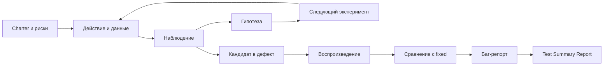
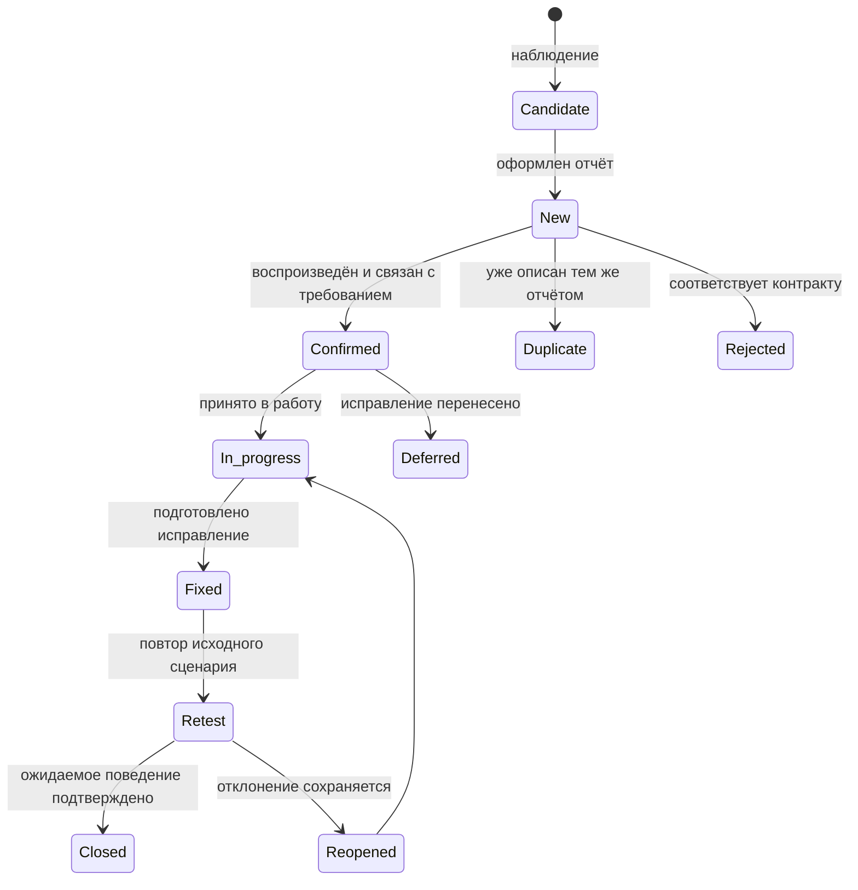

# Практическое задание № 5. Исследовательская сессия и оформление дефектов

## Цель

Научиться планировать и проводить исследовательское функциональное тестирование,
развивать следующие проверки на основе наблюдений, воспроизводить найденные
отклонения и превращать результаты исследования в полноценные баг-репорты и
итоговый отчёт.

После выполнения работы вы сможете:

- формулировать charter исследовательской сессии;
- определять область, риски, вопросы, данные и оракулы исследования;
- сочетать обучение продукту, проектирование и выполнение проверок;
- разделять наблюдение, гипотезу, вопрос и следующий эксперимент;
- отличать дефект продукта от особенности данных, среды или документации;
- минимизировать сценарий воспроизведения;
- подтверждать ожидаемое поведение требованиями и контрольной версией;
- собирать доказательства через UI, HTTP и серверные журналы;
- оформлять баг-репорт с воспроизводимыми шагами;
- независимо обосновывать severity и priority;
- проводить ретест и фиксировать жизненный цикл дефекта;
- составлять Test Summary Report с выводом только по исследованной области.

## Практическое задание

Проведите исследовательскую сессию на ветке `monolith/buggy`. Выберите область и
charter, подготовьте данные для разных ролей, исследуйте поведение через UI и
API, фиксируйте наблюдения и развивайте следующие проверки по результатам
предыдущих.

Несколько наиболее значимых отклонений повторите на свежих данных, сократите до
минимального воспроизводимого сценария и сравните с `monolith/fixed`. По итогам
оформите 2–3 самостоятельных баг-репорта, журнал их жизненного цикла и короткий
Test Summary Report.

Ценность результата определяется качеством исследования, воспроизводимостью,
доказательствами и связью с требованиями. Полный поиск всех восьми встроенных
учебных дефектов не является целью этой работы.

Рабочая ветка личного репозитория:

```text
practice/05-exploratory-defects
```

Рекомендуемая структура результата:

```text
docs/test-reports/05/
├── README.md
├── bugs/
│   ├── BUG-05-01.md
│   ├── BUG-05-02.md
│   └── BUG-05-03.md
└── evidence/
    ├── BUG-05-01-network.png
    ├── BUG-05-01-response.txt
    └── BUG-05-01-log.txt
```

Файл `README.md` содержит charter, журнал заметок, реестр кандидатов, сравнение
веток, жизненный цикл, Test Summary Report и остаточные риски. Каталог `bugs`
содержит отдельные баг-репорты. В `evidence` сохраняются небольшие относящиеся к
отклонению вложения с понятными именами.

### Источники ожидаемого поведения

- `docs/ТРЕБОВАНИЯ.md` — контракт версии `1.0.0`;
- `contract/openapi.json` — полный REST-контракт;
- `monolith/fixed` — контрольная реализация того же контракта;
- модель тест-дизайна из практической работы № 3;
- уточнённая документация и тест-кейсы из практической работы № 4;
- `docs/ШАБЛОНЫ.md` — состав исследовательской сессии, баг-репорта и итогового
  отчёта.

Исправленная ветка помогает подтвердить различие поведения, а ожидаемый
результат баг-репорта связывается с опубликованным требованием.

### Цикл исследовательской работы



## Задание (шаги)

### Шаг 1. Подготовьте две версии продукта

Откройте PowerShell в продуктовом репозитории, получите актуальные ссылки на
ветки и выберите исправленный монолит в основной рабочей копии:

```powershell
$taskProduct = Join-Path $env:USERPROFILE 'repos/testing'
Set-Location -LiteralPath $taskProduct
git fetch origin
git switch monolith/fixed
git pull --ff-only origin monolith/fixed
```

Создайте отдельную рабочую копию дефектной ветки через Git worktree:

```powershell
$taskBuggy = Join-Path $taskProduct '.worktrees/monolith-buggy'
if (!(Test-Path -LiteralPath $taskBuggy)) {
    git worktree add --detach $taskBuggy origin/monolith/buggy
}
git worktree list
git -C $taskProduct branch --show-current
git -C $taskBuggy status
```

Режим `--detach` подходит для запуска неизменяемой продуктовой версии и не
создаёт дополнительную рабочую ветку. Зафиксируйте версии обеих сред:

```powershell
$taskFixedRef = git -C $taskProduct rev-parse HEAD
$taskBuggyRef = git -C $taskBuggy rev-parse HEAD
Get-Content -LiteralPath (Join-Path $taskProduct 'variant.json')
Get-Content -LiteralPath (Join-Path $taskBuggy 'variant.json')
$taskFixedRef
$taskBuggyRef
```

В `variant.json` должны различаться значения `state`, а архитектура должна быть
`monolith` в обеих копиях.

### Шаг 2. Запустите независимые среды

Используйте два окна PowerShell, чтобы каждая среда сохранила свои значения
`LAB_PROJECT`, `LAB_PORT` и `LAB_DB_PORT`.

В первом окне запустите дефектную версию:

```powershell
$taskProduct = Join-Path $env:USERPROFILE 'repos/testing'
$taskBuggy = Join-Path $taskProduct '.worktrees/monolith-buggy'
Set-Location -LiteralPath $taskBuggy
$env:LAB_DEFECTS = 'all'
.\scripts\Start-Student.ps1 -Student 51
Invoke-RestMethod http://localhost:8151/health/ready
docker compose ps
```

В другом окне запустите исправленную версию:

```powershell
$taskProduct = Join-Path $env:USERPROFILE 'repos/testing'
Set-Location -LiteralPath $taskProduct
.\scripts\Start-Student.ps1 -Student 52
Invoke-RestMethod http://localhost:8152/health/ready
docker compose ps
```

Числа `51` и `52` являются идентификаторами локальных сред. Они создают разные
Compose-проекты, сети, тома и порты:

| Версия | Приложение | PostgreSQL | Compose-проект |
|---|---|---|---|
| `monolith/buggy` | `http://localhost:8151` | `localhost:55491` | `mini-student-51` |
| `monolith/fixed` | `http://localhost:8152` | `localhost:55492` | `mini-student-52` |

Swagger доступен по адресам `/docs`. Обе среды имеют независимые данные, поэтому
для сравнительного сценария создаются эквивалентные, но уникальные пользователи
и заявки.

### Шаг 3. Подготовьте рабочую ветку и структуру отчёта

В личном репозитории тестов начните работу от актуальной ветки `main`:

```powershell
$taskTests = Join-Path $env:USERPROFILE 'repos/mini-tickets-tests'
Set-Location -LiteralPath $taskTests
git switch main
git pull --ff-only origin main
git switch -c practice/05-exploratory-defects
New-Item -ItemType Directory -Path docs/test-reports/05/bugs -Force | Out-Null
New-Item -ItemType Directory -Path docs/test-reports/05/evidence -Force | Out-Null
$taskSession = 'docs/test-reports/05/README.md'
if (!(Test-Path -LiteralPath $taskSession)) {
    New-Item -ItemType File -Path $taskSession | Out-Null
}
```

Создайте в `README.md` структуру:

```markdown
# Исследовательская сессия и оформление дефектов

## Контекст, версии и источники
## Charter
## Область, риски и исследовательские вопросы
## Участники и тестовые данные
## Карта покрытия
## Журнал исследовательских заметок
## Кандидаты в дефекты
## Воспроизведение и сравнение веток
## Severity и priority
## Жизненный цикл дефектов
## Test Summary Report
## Остаточные риски и следующие исследования
```

Запишите SHA обеих продуктовых веток, адреса сред, браузер, API-клиент и ссылки
на источники ожидаемого поведения.

### Шаг 4. Сформулируйте charter

Charter задаёт направление исследования, сохраняя свободу выбирать следующий
эксперимент. Используйте структуру:

```text
Исследовать <объект или функцию>
с помощью <данных, ролей, состояний и способов взаимодействия>,
чтобы обнаружить <значимые риски или классы проблем>.
```

Заполните карточку:

| Поле | Содержание |
|---|---|
| ID | `CH-05-01` |
| Миссия | Что требуется узнать о продукте |
| Область | Функции, роли, состояния и интерфейсы |
| Риски | Какие последствия ищутся |
| Вопросы | На что должно ответить исследование |
| Данные | Какие пользователи и объекты потребуются |
| Оракулы | Требования, OpenAPI, модель и fixed-версия |
| Эвристики | Как будут варьироваться данные и действия |
| Доказательства | Что сохраняется при значимом наблюдении |
| Граница сессии | Выбранное время начала и завершения либо условие остановки |

Временную границу определите самостоятельно и запишите фактические начало и
завершение. Если направление заслуживает продолжения, оформите его как идею
следующей сессии, сохранив текущий вывод.

Примеры направлений charter:

- согласованность прав автора, другого пользователя и оператора;
- устойчивость жизненного цикла заявки к разному порядку действий;
- обработка граничных и неизвестных значений;
- соответствие списка, фильтра, карточки и фактического состояния;
- сохранение авторства и состояния при работе с комментариями;
- согласованность ответа API и отображения интерфейса.

Выберите одно основное направление и несколько связанных вопросов. Риски и
вопросы из работ № 3–4 можно использовать как исходную карту.

### Шаг 5. Подготовьте участников и данные

Для ролевых сценариев используйте:

| Участник | Назначение |
|---|---|
| Пользователь A | Автор исследуемой заявки |
| Пользователь B | Другой пользователь для проверки видимости и полномочий |
| Оператор | Обработка и изменение состояния |

В каждой среде создавайте независимые значения. Удобный шаблон email:

```text
p05-buggy-a-<уникальный-фрагмент>@example.test
p05-buggy-b-<уникальный-фрагмент>@example.test
p05-fixed-a-<уникальный-фрагмент>@example.test
p05-fixed-b-<уникальный-фрагмент>@example.test
```

Создайте таблицу данных:

| Имя | Среда | Роль | Email или ID | Назначение | Состояние |
|---|---|---|---|---|---|

Для заявки записывайте `ticket_id`, автора, исходный заголовок, приоритет и
статус. Для комментария — `comment_id`, `ticket_id` и фактического автора.
Устойчивые идентификаторы помогают отличить изменение нужного объекта от
случайного совпадения в списке.

### Шаг 6. Создайте карту покрытия исследования

Карта покрытия помогает замечать новые направления без превращения сессии в
жёсткий тест-кейс. Используйте измерения:

| Измерение | Варианты |
|---|---|
| Роль | Автор, другой пользователь, оператор, участник без сессии |
| Состояние | `new`, `active`, `closed` |
| Операция | Создать, прочитать, изменить, удалить, сменить статус, комментировать, фильтровать |
| Данные | Типичные, граница, за границей, неизвестное значение, пропущенное поле |
| Интерфейс | UI, прямой REST-запрос, Swagger или Postman |
| Наблюдение | Код, тело, заголовок, список, карточка, данные, журнал |

Отмечайте комбинации, фактически затронутые в ходе сессии:

| Область | Исследовано | Наблюдение | Следующая идея |
|---|---|---|---|

Карта показывает охваченную область и помогает корректно сформулировать
остаточные риски в итоговом отчёте.

### Шаг 7. Настройте сбор доказательств

Для UI откройте Chrome DevTools и используйте вкладки:

- `Network` — метод, URL, заголовки, request body, response body и HTTP-код;
- `Console` — ошибки клиентского кода;
- `Application` — состояние браузерной сессии;
- `Elements` — фактическое представление текста и доступность элемента.

Для значимого запроса сохраните `X-Request-ID`. Его можно получить из заголовка
ответа, а при ошибке также из `error.request_id`. В Postman идентификатор виден
в response headers.

При прямом запросе можно задать узнаваемый безопасный идентификатор:

```powershell
$taskRequestId = 'p05-observation-01'
curl.exe -i -H "X-Request-ID: $taskRequestId" http://localhost:8151/health/ready
```

Допустимый идентификатор содержит от 1 до 64 латинских букв, цифр, `_` или `-`.
Сервис возвращает его в заголовке и записывает в JSON-журнал.

Создайте правила именования вложений:

```text
BUG-05-01-step-03.png
BUG-05-01-request.txt
BUG-05-01-response.txt
BUG-05-01-log.txt
BUG-05-01-fixed-result.png
```

В доказательствах сохраняйте относящиеся к сценарию данные. Пароли, Bearer-токены
и значения сессий заменяйте отметкой `<скрыто>`.

### Шаг 8. Проведите исследование по циклу «наблюдение — следующий ход»

Начните с основного пользовательского потока выбранной области. После каждого
действия задайте вопросы:

1. Что именно произошло?
2. Какой источник определяет ожидаемый результат?
3. Какие данные или состояние могли повлиять?
4. Как изменить один фактор и проверить гипотезу?
5. Что наблюдает другой участник?
6. Что показывает список, карточка, API и журнал?
7. Сохранилось ли состояние после отклонённой операции?

Используйте эвристики:

- **CRUD** — создание, чтение, изменение и удаление;
- **границы** — значения около опубликованных пределов;
- **нулевые и пустые значения** — отсутствие поля, пустая строка, пробелы;
- **роли и владение** — автор, другой пользователь, оператор;
- **состояния** — действие до и после перехода;
- **повтор** — повторная отправка действия или перехода;
- **порядок** — другая последовательность тех же операций;
- **согласованность** — сравнение ответа, списка, карточки и повторного чтения;
- **история** — новое значение после обновления страницы, выхода и нового входа.

Варьируйте один фактор, когда требуется проверить конкретную гипотезу. Для новых
идей допускается свободно менять маршрут и возвращаться к основному charter.

### Шаг 9. Ведите журнал исследовательских заметок

Записывайте заметки во время исследования:

| ID | Контекст и данные | Действие | Наблюдение | Тип записи | Связь | Следующий ход |
|---|---|---|---|---|---|---|
| `N-01` | Заполнить | Заполнить | Заполнить | Факт / гипотеза / вопрос / идея | Требование или риск | Заполнить |

Разделяйте типы записи:

- **факт** — воспроизводимое действие и наблюдаемый результат;
- **гипотеза** — возможное объяснение результата;
- **вопрос** — отсутствующее или неоднозначное ожидаемое поведение;
- **идея** — следующий эксперимент;
- **кандидат** — наблюдение, которое может быть дефектом после проверки оракула.

Добавляйте к заметке время, среду `buggy` или `fixed`, роль и устойчивый ID
объекта. Ссылка на скриншот или сохранённый ответ делает последовательность
восстанавливаемой после завершения сессии.

### Шаг 10. Выделите кандидатов в дефекты

Перенесите значимые наблюдения в реестр кандидатов:

| CAND-ID | Симптом | Требование | Риск | Воспроизводимость | Доказательства | Следующая проверка | Решение |
|---|---|---|---|---|---|---|---|

Перед оформлением баг-репорта проверьте возможные объяснения:

- результат соответствует опубликованному требованию;
- ожидание основано на предположении и требует уточнения документации;
- использованы данные от предыдущего сценария;
- запрос отправлен не в ту среду или от другой роли;
- интерфейс показывает устаревшее состояние, а API уже изменился;
- возникла ошибка запуска, сети, браузера или базы;
- найдено самостоятельное отклонение продукта.

Для спорного ожидаемого поведения используйте решения `DEC-*` и `CLR-*` из
работы № 4. Наблюдение, связанное с дефектом требования, сохраняйте как отдельный
результат ревью документации.

### Шаг 11. Воспроизведите и минимизируйте сценарий

Для каждого сильного кандидата создайте свежие данные и повторите сценарий в
`monolith/buggy`. Сокращайте предусловия и шаги по одному, сохраняя отклонение.

Зафиксируйте:

- какие данные требуются;
- какая роль выполняет действие;
- начальное состояние;
- минимальную последовательность;
- код, тело и состояние данных;
- стабильность при повторе;
- влияние обновления страницы или нового входа;
- зависимость от UI либо воспроизводимость через прямой API.

Используйте таблицу:

| CAND-ID | Повтор | Данные | Шаги | Результат | Воспроизведён | Что удалено из сценария |
|---|---:|---|---|---|---|---|

Минимальный сценарий облегчает сравнение веток, диагностику и будущий ретест.

### Шаг 12. Повторите сценарий на `monolith/fixed`

На исправленной среде выполните те же действия с эквивалентными свежими
данными. Сравните:

| Элемент | `monolith/buggy` | `monolith/fixed` | Требование |
|---|---|---|---|
| Предусловия и роль | Заполнить | Заполнить | Ссылка |
| Класс тестовых данных | Заполнить | Заполнить | Ссылка |
| HTTP-код | Заполнить | Заполнить | Ссылка |
| Значимые поля ответа | Заполнить | Заполнить | Ссылка |
| Состояние данных после действия | Заполнить | Заполнить | Ссылка |
| Отображение UI | Заполнить | Заполнить | Ссылка |
| `X-Request-ID` и доказательство | Заполнить | Заполнить | Ссылка |

Разные email и UUID допустимы, если они принадлежат одному классу и создают
одинаковые предусловия. Контрольная версия подтверждает различие реализаций,
требование объясняет, какой результат является ожидаемым.

Если обе ветки ведут себя одинаково вопреки требованию, сохраните наблюдение как
отдельный риск продукта или расхождение версии, не приписывая его только
`monolith/buggy`.

### Шаг 13. Свяжите запрос с серверным журналом

Экспортируйте журналы дефектной среды из того окна PowerShell, где она запущена:

```powershell
Set-Location -LiteralPath $taskBuggy
$taskRequestId = 'p05-observation-01'
New-Item -ItemType Directory -Path artifacts -Force | Out-Null
docker compose cp app:/app/logs ./artifacts/practice-05-buggy-logs
Get-ChildItem -LiteralPath ./artifacts/practice-05-buggy-logs -Recurse -File |
    Select-String -SimpleMatch $taskRequestId
```

Для исправленной среды используйте её окно и отдельный каталог:

```powershell
Set-Location -LiteralPath $taskProduct
$taskRequestId = 'p05-observation-01'
New-Item -ItemType Directory -Path artifacts -Force | Out-Null
docker compose cp app:/app/logs ./artifacts/practice-05-fixed-logs
Get-ChildItem -LiteralPath ./artifacts/practice-05-fixed-logs -Recurse -File |
    Select-String -SimpleMatch $taskRequestId
```

JSON-запись содержит `request_id`, метод, маршрут, статус, длительность, сервис и
идентификатор запуска. Выберите строки, относящиеся к конкретному запросу, и
сохраните небольшой фрагмент рядом с баг-репортом. Полные локальные экспорты
остаются в `artifacts`, а выбранное доказательство — в
`docs/test-reports/05/evidence` личного репозитория.

Для диагностики доступности среды также используйте:

```powershell
docker compose ps
docker compose logs --no-color app
```

Журнал помогает подтвердить путь запроса и серверный статус. Предположение о
причине указывайте отдельно от наблюдаемого пользовательского симптома.

### Шаг 14. Выполните триаж кандидатов

Для каждого кандидата примите одно решение:

| Решение | Основание |
|---|---|
| `Confirmed` | Поведение воспроизводится и противоречит требованию |
| `Needs clarification` | Источники не дают однозначного оракула |
| `Environment` | Причина относится к запуску, сети, данным или инструменту |
| `Duplicate` | Симптом и причина уже представлены другим отчётом |
| `Expected behavior` | Наблюдение соответствует контракту |
| `Additional exploration` | Для вывода требуются новые варианты или данные |

Свяжите решение с доказательством. Несколько симптомов объединяйте в один
баг-репорт, если они воспроизводятся одной причиной и исправлением. Разные
правила или независимые способы исправления оформляйте отдельно.

### Шаг 15. Определите severity и priority

Сначала опишите используемые шкалы. Например:

| Severity | Смысл влияния |
|---|---|
| `S1 Critical` | Нарушены безопасность или целостность данных либо недоступен критический поток |
| `S2 Major` | Основная функция работает неверно и существенно влияет на пользователя |
| `S3 Minor` | Нарушена часть поведения, существует приемлемый обходной путь |
| `S4 Cosmetic` | Затронуто представление без нарушения данных и основного потока |

| Priority | Смысл очередности |
|---|---|
| `P1` | Исправление требуется перед ближайшим использованием или выпуском |
| `P2` | Исправление планируется с высоким приоритетом |
| `P3` | Исправление входит в обычный план работ |
| `P4` | Улучшение можно планировать после более значимых изменений |

Severity оценивайте по последствиям фактического поведения. Priority зависит от
частоты, бизнес-ценности, этапа выпуска, доступности обхода и стоимости риска.
Для каждого дефекта запишите два отдельных обоснования:

```text
Severity: ... потому что ...
Priority: ... потому что ...
```

Одинаковая severity может сочетаться с разным priority, если различаются частота
или актуальность функции.

### Шаг 16. Оформите 2–3 баг-репорта

Создайте отдельный Markdown-файл для каждого подтверждённого отклонения. Шаблон:

```markdown
# BUG-05-01. Короткий наблюдаемый симптом

## Состояние и классификация

- Статус: Confirmed
- Severity:
- Обоснование severity:
- Priority:
- Обоснование priority:

## Версия и окружение

- Продукт: monolith/buggy
- SHA:
- Адрес среды:
- Браузер или API-клиент:
- Дата воспроизведения:

## Требование и риск

- Требование:
- Ожидаемое правило:
- Пользовательский или технический риск:

## Предусловия

1. ...

## Тестовые данные

| Имя | Значение или способ получения |
|---|---|

## Шаги и фактические результаты

| № | Действие | Ожидаемый результат шага | Фактический результат |
|---:|---|---|---|

## Итоговый ожидаемый результат

...

## Итоговый фактический результат

...

## Воспроизводимость

...

## Состояние данных после операции

...

## Сравнение с monolith/fixed

- SHA fixed:
- Результат того же сценария:

## Доказательства

- HTTP-запрос и ответ:
- X-Request-ID:
- Скриншот или trace:
- Фрагмент журнала:
```

Заголовок описывает объект, условие и симптом. Шаги начинаются от минимальных
предусловий, используют конкретные данные и приводят к одному отклонению.

Для UI-проблемы приложите состояние интерфейса и относящийся Network-запрос,
если он выполнялся. Для API-проблемы укажите метод, путь, заголовки без токена,
тело, код и значимые поля ответа.

### Шаг 17. Проведите дефект через жизненный цикл

Названия статусов различаются в Jira, YouTrack и других системах, но смысл
основного маршрута сохраняется:



В этой работе `monolith/buggy` представляет состояние до исправления, а
`monolith/fixed` — подготовленную контрольную реализацию. Сравнение позволяет
смоделировать этапы `Fixed → Retest → Closed`, не утверждая, что исправление было
создано в личном репозитории.

В `README.md` заполните журнал:

| BUG-ID | Предыдущий статус | Новый статус | Основание | Ветка и SHA | Доказательство |
|---|---|---|---|---|---|

Для `Closed` укажите точное требование и результат тех же шагов на fixed-версии.
Если результат не соответствует ожидаемому, используйте `Reopened` и добавьте
новое доказательство.

### Шаг 18. Подготовьте Test Summary Report

Итоговый отчёт описывает фактически исследованную область. Включите:

1. цель и ID charter;
2. версии `monolith/buggy` и `monolith/fixed`;
3. окружение, роли и способы взаимодействия;
4. исследованные функции, данные и состояния;
5. выполненные исследовательские вопросы;
6. количество заметок и кандидатов;
7. подтверждённые дефекты по severity и priority;
8. кандидаты с другими решениями триажа;
9. результаты сравнения и ретеста на fixed;
10. собранные доказательства;
11. ограничения фактического исследования;
12. остаточные риски;
13. следующие charter или проверки;
14. вывод о качестве исследованной области.

Используйте таблицу результатов:

| Область или риск | Исследовано | Результат | BUG/заметка | Fixed-сравнение | Остаточный риск |
|---|---|---|---|---|---|

И таблицу дефектов:

| BUG-ID | Краткий симптом | Требование | Severity | Priority | Статус | Retest |
|---|---|---|---|---|---|---|

В выводе разделите:

- что подтверждено наблюдениями;
- какие отклонения оформлены;
- какие вопросы остались;
- какие области фактически не исследовались;
- насколько результат влияет на готовность именно выбранного сценария.

### Шаг 19. Остановите среды с сохранением данных

В каждом окне PowerShell выполните:

```powershell
docker compose stop
```

Команда останавливает контейнеры и сохраняет тома базы и журналов. Для повторного
исследования в том же окне используйте:

```powershell
docker compose start
```

Если окно было закрыто, восстановите путь и переменные нужной среды. Пример для
дефектной версии:

```powershell
$taskProduct = Join-Path $env:USERPROFILE 'repos/testing'
$taskBuggy = Join-Path $taskProduct '.worktrees/monolith-buggy'
Set-Location -LiteralPath $taskBuggy
$env:LAB_PROJECT = 'mini-student-51'
$env:LAB_PORT = '8151'
$env:LAB_DB_PORT = '55491'
docker compose stop
```

Для fixed используйте `mini-student-52`, `8152` и `55492` в основной рабочей
копии.

### Шаг 20. Зафиксируйте результат в личном репозитории

Просмотрите состав отчёта и вложений:

```powershell
Set-Location -LiteralPath $taskTests
git status --short
git diff -- docs/test-reports/05
```

Создайте коммит и опубликуйте ветку:

```powershell
git add docs/test-reports/05
git commit -m 'Проведена исследовательская сессия и оформлены дефекты'
git push -u origin practice/05-exploratory-defects
```

При использовании второго remote отправьте тот же коммит в GitLab:

```powershell
git push -u gitlab practice/05-exploratory-defects
```

PR и MR направляются в `main` личного репозитория. В описании изменения укажите
charter, исследованную область, количество оформленных отчётов и итог сравнения
с `monolith/fixed`.

## Подсказки по ключевым частям

### Исследовательское тестирование остаётся управляемым

Свобода выбора следующего хода сочетается с charter, картой покрытия, заметками
и доказательствами. Исследование становится воспроизводимым, когда понятны
контекст решения, данные и цепочка наблюдений.

### Charter описывает миссию, а не готовый тест-кейс

Тест-кейс заранее определяет шаги и ожидаемые результаты. Charter задаёт объект,
риски и способы исследования. Конкретные проверки появляются и уточняются во
время работы с продуктом.

### Наблюдение отличается от гипотезы

«После PATCH список показывает прежний приоритет» — наблюдение. «Frontend не
обновил локальное состояние» — гипотеза о причине. В баг-репорте основным
является воспроизводимый симптом; гипотеза может быть добавлена отдельной
диагностической заметкой.

### Оракул может состоять из нескольких источников

Требование определяет ожидаемое бизнес-поведение, OpenAPI — форму HTTP-контракта,
модель тест-дизайна — классы и переходы, fixed-версия — контрольное наблюдение.
Совпадение источников усиливает вывод, а расхождение становится вопросом или
новым риском.

### Один изменяемый фактор делает гипотезу понятнее

Сравните одинаковые операции при смене только роли, статуса, входного значения
или среды. Так наблюдаемое различие легче связать с конкретным условием.

### Повторение и минимизация решают разные задачи

Повторение показывает стабильность симптома. Минимизация выясняет, какие
предусловия и шаги действительно нужны. Оба результата повышают качество
баг-репорта и ускоряют ретест.

### Fixed-версия является контролем, а не единственным требованием

Различие между ветками показывает, что реализации ведут себя по-разному.
Ссылка на `AUTH-*`, `TICKET-*`, `COMMENT-*` или `UI-*` объясняет, какой результат
соответствует контракту.

### HTTP-код не описывает всё состояние

Сверяйте тело ответа, заголовок `X-Request-ID`, серверные поля, видимость объекта
и результат повторного чтения. После отклонённой операции проверяйте сохранность
предыдущих данных.

### Лог используется как связанное доказательство

Ищите запись по `X-Request-ID` и сохраняйте небольшой относящийся фрагмент.
Серверный лог помогает подтвердить маршрут и статус, но пользовательский симптом
остаётся главным содержанием отчёта.

### Severity и priority отвечают на разные вопросы

Severity показывает масштаб последствий уже существующего дефекта. Priority
определяет очередность работы с учётом выпуска, частоты, обхода и бизнес-целей.
Обе оценки требуют отдельного обоснования.

### Один баг-репорт описывает одно исправляемое отклонение

Если два симптома исчезнут после одного изменения и имеют общий минимальный
сценарий, их можно связать одним отчётом. Если нарушены разные правила и нужны
разные исправления, отдельные отчёты упрощают жизненный цикл.

### Заголовок баг-репорта передаёт условие и симптом

Полезная формула:

```text
<объект> <наблюдаемое неверное поведение> при <значимое условие>
```

Формулировка остаётся понятной в списке задач без чтения всех шагов.

### Жизненный цикл фиксирует основание изменения статуса

Переход в `Confirmed` опирается на воспроизведение и требование, в `Closed` — на
успешный ретест. `Rejected`, `Duplicate` и `Deferred` также требуют причины,
чтобы история решения оставалась проверяемой.

### Итоговый отчёт ограничивает силу вывода

Test Summary Report говорит о фактически исследованных ролях, данных, состояниях
и интерфейсах. Остальные направления перечисляются как остаточные риски или
следующие charter.

## Что проверить перед отправкой (чек-лист)

- [ ] В личном репозитории используется ветка
      `practice/05-exploratory-defects`.
- [ ] Результат находится в каталоге `docs/test-reports/05`.
- [ ] Указаны ветки, SHA и адреса `monolith/buggy` и `monolith/fixed`.
- [ ] `variant.json` подтверждает архитектуру `monolith` и различие состояний
      продукта.
- [ ] Две среды используют разные Compose-проекты, порты, сети и тома.
- [ ] Оба `/health/ready` возвращают состояние `ready`.
- [ ] Charter содержит миссию, область, риски, вопросы, данные, оракулы,
      эвристики и границу сессии.
- [ ] Зафиксированы фактические начало и завершение сессии.
- [ ] Подготовлены отдельные данные пользователя A, пользователя B и оператора.
- [ ] Для созданных сущностей сохранены устойчивые идентификаторы.
- [ ] Карта покрытия отражает фактически исследованные роли, состояния,
      операции и классы данных.
- [ ] Журнал разделяет факты, гипотезы, вопросы, идеи и кандидатов.
- [ ] Каждая значимая заметка содержит среду, роль, данные и следующий ход.
- [ ] Кандидаты связаны с требованием или вопросом к документации.
- [ ] Для каждого оформленного дефекта выполнено повторное воспроизведение на
      свежих данных.
- [ ] Сценарий сокращён до понятных предусловий и минимальных шагов.
- [ ] Тот же класс сценария проверен на `monolith/fixed`.
- [ ] Сравнение веток включает код, значимые поля и состояние данных.
- [ ] API-доказательства содержат метод, путь, код, ответ и `X-Request-ID`.
- [ ] Для UI-отклонения сохранены состояние интерфейса и связанный Network-запрос.
- [ ] Относящийся фрагмент JSON-журнала найден по `X-Request-ID`.
- [ ] В доказательствах скрыты пароли, токены и значения сессий.
- [ ] Каждый кандидат получил решение триажа с основанием.
- [ ] Оформлены 2–3 отдельных баг-репорта.
- [ ] Заголовок каждого отчёта описывает объект, условие и симптом.
- [ ] В баг-репорте указаны версия, окружение, требование, риск, предусловия и
      данные.
- [ ] Шаги воспроизводимы, ожидаемый и фактический результаты разделены.
- [ ] Для отклонённой операции проверен инвариант данных.
- [ ] Severity и priority имеют разные обоснования.
- [ ] Журнал жизненного цикла содержит основание каждого изменения статуса.
- [ ] Ретест на fixed связан с теми же шагами и требованием.
- [ ] Test Summary Report описывает charter, область, результаты, дефекты,
      сравнение, остаточные риски и вывод.
- [ ] Вывод относится к исследованной области и подтверждается доказательствами.
- [ ] Среды остановлены с сохранением данных и журналов.
- [ ] `git diff` содержит отчёт, баг-репорты и относящиеся вложения.

## Советы по улучшению работы

- Начинайте с ценного пользовательского потока, затем меняйте роль, состояние,
  данные или порядок действий по одному фактору.
- Записывайте факт сразу после наблюдения, пока известны точные данные и
  последовательность.
- Используйте разные браузерные профили или независимые токены для разных ролей.
- Давайте создаваемым данным узнаваемые уникальные префиксы.
- Проверяйте карточку, список и повторное чтение после каждого значимого
  изменения.
- Сохраняйте `X-Request-ID` рядом с запросом и ответом, чтобы быстро найти
  серверное событие.
- Отделяйте пользовательский симптом от предположения о файле или функции,
  вызвавшей проблему.
- Удаляйте из сценария шаги по одному и проверяйте, сохраняется ли отклонение.
- Повторяйте сравнение веток на данных одного класса, а не на общей базе.
- Связывайте ожидаемый результат с точным идентификатором требования.
- Для отрицательного результата описывайте как ответ, так и неизменность данных.
- Обосновывайте severity через последствия, priority — через контекст выпуска и
  частоту сценария.
- Используйте короткие имена вложений с BUG-ID и номером шага.
- Отмечайте проверенные гипотезы и причины их отклонения: это сохраняет ценность
  исследования даже без нового баг-репорта.
- Завершайте отчёт следующими charter, вытекающими из непроверенных рисков.
