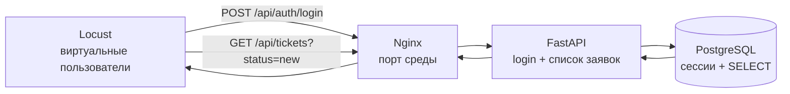

# Практическое задание № 7. Нагрузочное и стресс-тестирование

## Цель

Научиться исследовать поведение клиент-серверного приложения под постепенно
растущей нагрузкой, собирать воспроизводимые метрики и находить момент заметного
ухудшения по совокупности задержек, пропускной способности, ошибок, ресурсов и
журналов.

После выполнения работы вы сможете:

- объяснять различие нагрузочного и стрессового тестирования;
- читать готовый профиль `HttpUser` и связывать его с пользовательским потоком;
- запускать Locust в web- и headless-режимах;
- фиксировать пользователей, скорость их появления и длительность измерения;
- анализировать количество запросов, RPS, error rate, p50, p95, p99 и максимум;
- отделять разогрев от измеряемого прогона;
- строить ступенчатый профиль с одним неизменным сценарием;
- определять деградацию по тенденции нескольких показателей;
- наблюдать CPU, память, сеть, дисковый ввод-вывод и перезапуски контейнеров;
- сопоставлять Locust с журналами Nginx, FastAPI и PostgreSQL;
- учитывать ограничения наблюдаемости каждого слоя;
- проверять восстановление системы после стрессового режима;
- формулировать вывод в границах конкретного стенда и профиля.

## Практическое задание

Проведите нагрузочное и стрессовое исследование исправленной ветки
`client-server/fixed` с помощью готового профиля `load/locustfile.py`.

Сначала получите базовую линию при небольшой нагрузке. Затем выполните несколько
сопоставимых ступеней с растущим количеством виртуальных пользователей и
наблюдайте latency, throughput, error rate и ресурсы Docker. После этого
продолжите рост в стрессовом режиме до заранее сформулированного признака
заметного ухудшения либо до выбранной границы ресурсов локальной среды.

Жёсткий норматив времени ответа не задаётся: характеристики компьютеров,
настройки Docker Desktop и фоновые процессы различаются. Важны одинаковый
профиль, зафиксированные условия, динамика метрик и доказанный вывод.

Рабочая ветка личного репозитория:

```text
practice/07-load-stress
```

Рекомендуемая структура результата:

```text
docs/test-reports/07/
├── README.md
├── profile/
│   ├── locustfile.py
│   └── requirements.txt
├── results/
│   ├── baseline_stats.csv
│   ├── baseline_stats_history.csv
│   ├── baseline_failures.csv
│   ├── baseline.html
│   ├── load-05_stats.csv
│   ├── load-10_stats.csv
│   ├── load-20_stats.csv
│   └── stress-XX_stats.csv
└── evidence/
    ├── baseline-docker.jsonl
    ├── stress-docker.jsonl
    ├── nginx-access.jsonl
    ├── fastapi-sample.jsonl
    ├── nginx-errors.txt
    ├── postgres-before.csv
    └── postgres-after.csv
```

`README.md` содержит гипотезу, описание профиля, характеристики среды, таблицу
ступеней, анализ деградации, сопоставление источников, восстановление и вывод.
Каталог `profile` хранит использованный сценарий и закреплённую зависимость.
`results` содержит машинные отчёты Locust, а `evidence` — небольшие относящиеся к
выводу выборки без паролей и Bearer-токенов.

### Источники и инструменты

- `load/locustfile.py` — готовый сценарий чтения списка заявок;
- `load/requirements.txt` — закреплённая версия Locust;
- `docs/ТРЕБОВАНИЯ.md` и `contract/openapi.json` — ожидаемое поведение API;
- `compose.yaml` — состав сервисов, порты, тома и политика Docker-журналов;
- `backend/main.py` и `backend/logging_setup.py` — поля HTTP-событий FastAPI;
- `deploy/nginx.conf` — фактическая конфигурация и наблюдаемость Nginx;
- Locust Statistics, Charts, Failures и CSV/HTML-экспорт;
- `docker stats`, `docker compose ps` и журналы контейнеров;
- результат практической работы № 6 — сведения о выбранной клиент-серверной
  архитектуре и её HTTP-границах.

### Измеряемый путь



Каждый виртуальный пользователь один раз выполняет вход, сохраняет собственный
Bearer-токен и затем с паузой читает список новых заявок. Основная повторяемая
операция в статистике называется `Список новых заявок`. Вход создаёт начальный
всплеск при добавлении пользователей, поэтому показатели строки списка и общий
`Aggregated` анализируются отдельно.

### Цикл исследования производительности


### Наблюдаемые показатели

| Показатель | Что показывает | Важная оговорка |
|---|---|---|
| Request Count | Объём обработанных запросов | Ноль запросов не является успешным измерением |
| Failure Count / error rate | Ошибки по маршрутам и их долю | Ошибка генератора нагрузки отделяется от ответа системы |
| Average | Среднюю задержку | Скрывает редкие медленные ответы |
| p50 | Типичную задержку половины запросов | Используется вместе с хвостовыми percentile |
| p95 | Задержку, быстрее которой завершилось 95% запросов | Рост относительно baseline важнее чужого абсолютного числа |
| p99 | Хвост наиболее медленных запросов | Чувствителен к малому числу наблюдений |
| Max | Самый медленный запрос | Один выброс не определяет границу системы |
| Requests/s | Фактическую пропускную способность | Плато при росте пользователей может означать насыщение |
| CPU / memory | Насыщение вычислений и памяти контейнера | Учитываются лимиты Docker и фоновые процессы |
| Net I/O / Block I/O | Сетевой и дисковый обмен | Накопительное значение сравнивается между снимками |
| RestartCount / health | Перезапуски и готовность | Помогает обнаружить жёсткий отказ и восстановление |

## Задание (шаги)

### Шаг 1. Подготовьте продуктовую ветку

Получите актуальную ветку и создайте отдельную рабочую копию
`client-server/fixed`:

```powershell
$taskProduct = Join-Path $env:USERPROFILE 'repos/testing'
$taskClientServer = Join-Path $taskProduct '.worktrees/client-server-fixed'
Set-Location -LiteralPath $taskProduct
git fetch origin
if (!(Test-Path -LiteralPath $taskClientServer)) {
    git worktree add --detach $taskClientServer origin/client-server/fixed
}
git -C $taskClientServer status
git -C $taskClientServer rev-parse HEAD
Get-Content -LiteralPath (Join-Path $taskClientServer 'variant.json')
```

Зафиксируйте полный Git SHA и значения `architecture: client-server`,
`state: fixed`. Просмотрите `compose.yaml`: нагрузка приходит на контейнер
`web`, затем проходит к `app` и PostgreSQL `db`.

### Шаг 2. Запустите изолированную среду

Откройте отдельное окно PowerShell и запустите среду с идентификатором `71`:

```powershell
$taskProduct = Join-Path $env:USERPROFILE 'repos/testing'
$taskClientServer = Join-Path $taskProduct '.worktrees/client-server-fixed'
Set-Location -LiteralPath $taskClientServer
.\scripts\Start-Student.ps1 -Student 71
Invoke-RestMethod http://localhost:8171/health/ready
docker compose ps
```

Параметры среды:

| Компонент | Значение |
|---|---|
| Приложение и цель Locust | `http://localhost:8171` |
| Swagger | `http://localhost:8171/docs` |
| PostgreSQL | `localhost:55511` |
| Compose-проект | `mini-student-71` |

В этом окне сохраняются `LAB_PROJECT`, `LAB_PORT` и `LAB_DB_PORT`. Используйте
его для управления средой. Убедитесь, что `db`, `app` и `web` имеют состояние
`healthy`, а ручной вход `anna@example.test` с учебным паролем
`LabPassword1!` открывает список заявок.

### Шаг 3. Подготовьте рабочую ветку и каталоги результата

В личном репозитории тестов создайте ветку от актуальной `main`:

```powershell
$taskTests = Join-Path $env:USERPROFILE 'repos/mini-tickets-tests'
$taskProduct = Join-Path $env:USERPROFILE 'repos/testing'
$taskClientServer = Join-Path $taskProduct '.worktrees/client-server-fixed'
Set-Location -LiteralPath $taskTests
git switch main
git pull --ff-only origin main
git switch -c practice/07-load-stress
New-Item -ItemType Directory -Path docs/test-reports/07/profile -Force | Out-Null
New-Item -ItemType Directory -Path docs/test-reports/07/results -Force | Out-Null
New-Item -ItemType Directory -Path docs/test-reports/07/evidence -Force | Out-Null
Copy-Item -LiteralPath (Join-Path $taskClientServer 'load/locustfile.py') `
    -Destination docs/test-reports/07/profile/locustfile.py
Copy-Item -LiteralPath (Join-Path $taskClientServer 'load/requirements.txt') `
    -Destination docs/test-reports/07/profile/requirements.txt
```

Создайте `docs/test-reports/07/README.md`:

```markdown
# Нагрузочное и стресс-тестирование

## Версия продукта и характеристики среды
## Цель, гипотеза и границы вывода
## Сценарий Locust
## Метрики и условия заметного ухудшения
## План ступеней
## Базовая линия
## Результаты нагрузочного режима
## Результаты стрессового режима
## Ресурсы Docker
## Журналы Nginx, FastAPI и PostgreSQL
## Сопоставление наблюдений
## Восстановление системы
## Итоговый вывод
## Остаточные риски и рекомендации
```

### Шаг 4. Подготовьте отдельную среду Python для Locust

Locust устанавливается в локальный каталог `.runtime`, уже исключённый из Git:

```powershell
Set-Location -LiteralPath $taskClientServer
python --version
$taskLoadPython = Join-Path $taskClientServer '.runtime/load-venv/Scripts/python.exe'
if (!(Test-Path -LiteralPath $taskLoadPython)) {
    python -m venv (Join-Path $taskClientServer '.runtime/load-venv')
}
& $taskLoadPython -m pip install -r load/requirements.txt
& $taskLoadPython -m locust --version
```

Запишите версии Python и Locust. Файл `load/requirements.txt` закрепляет Locust
`2.43.3`, поэтому профиль и формат артефактов можно повторить на другой машине с
той же зависимостью.

### Шаг 5. Разберите готовый профиль нагрузки

Прочитайте `load/locustfile.py` и опишите в отчёте:

- класс `TicketReader` и его связь с виртуальным пользователем;
- `on_start` как однократный вход пользователя;
- сохранение Bearer-токена в заголовках HTTP-клиента;
- повторяемый `GET /api/tickets?status=new`;
- постоянное имя операции `Список новых заявок`;
- паузу `between(0.5, 1.5)` между действиями;
- тайм-аут каждого HTTP-запроса;
- обработчик завершения, который возвращает ненулевой код при нуле запросов или
  любой зафиксированной ошибке.

Сформулируйте модель интенсивности. Один виртуальный пользователь выполняет
примерно один повторяемый запрос за интервал, складывающийся из времени ответа и
случайной паузы. Фактический RPS измеряется Locust и не выводится только из числа
пользователей.

Профиль является read-only: он создаёт сессии входа, но не создаёт и не удаляет
заявки. Один и тот же файл используется для baseline, нагрузочных ступеней и
стресса; меняются только параметры запуска.

### Шаг 6. Зафиксируйте характеристики генератора и системы

Соберите сведения, влияющие на сравнимость результатов:

```powershell
Get-CimInstance Win32_Processor |
    Select-Object Name, NumberOfCores, NumberOfLogicalProcessors
Get-CimInstance Win32_ComputerSystem |
    Select-Object @{Name='MemoryGB';Expression={[math]::Round($_.TotalPhysicalMemory / 1GB, 1)}}
docker version --format 'Docker client={{.Client.Version}} server={{.Server.Version}}'
docker info --format 'CPUs={{.NCPU}} Memory={{.MemTotal}}'
docker compose ps
```

В отчёте укажите:

- ОС и процессор;
- общую память;
- CPU и память, доступные Docker;
- версии Docker, Python и Locust;
- способ запуска приложения;
- отсутствие или наличие явных лимитов контейнеров;
- значимые фоновые процессы во время измерения;
- размещение генератора Locust и системы на одной машине.

Последний пункт важен: Locust конкурирует с приложением за CPU, память и сеть,
поэтому найденная граница характеризует всю локальную конфигурацию.

### Шаг 7. Сформулируйте гипотезу и условия остановки

До первого измерения запишите гипотезу. Пример структуры:

```text
При росте числа виртуальных пользователей read-only сценарий сначала сохранит
нулевую долю ошибок, а RPS будет расти. После насыщения одного из ресурсов рост
RPS замедлится, p95/p99 начнут устойчиво расти либо появятся ошибки. После снятия
нагрузки /health/ready и основной пользовательский поток восстановятся.
```

Определите признаки заметного ухудшения применительно к своей машине:

- устойчивый рост p95 и p99 относительно baseline на соседних ступенях;
- плато или снижение RPS при увеличении пользователей;
- появление повторяемых timeout, `5xx` или других неожиданных ответов;
- насыщение CPU или памяти одного контейнера;
- рост времени FastAPI `duration_ms` по измеряемому маршруту;
- потеря состояния `healthy`, перезапуск контейнера или недоступность UI;
- заметное ухудшение, которое сохраняется при повторе той же ступени.

Отдельно задайте условия завершения стрессового роста: признаки влияния на
операционную систему, повторяющиеся ошибки, потеря готовности, перезапуск либо
достигнутая граница выделенных Docker-ресурсов. Это условия управления
экспериментом, а не универсальный SLA продукта.

### Шаг 8. Составьте план сопоставимых прогонов

Подготовьте таблицу до запуска:

| Run ID | Режим | Users | Spawn rate | Измерение | Назначение |
|---|---|---:|---:|---|---|
| `warmup` | Разогрев | 1 | 1 | `20s` | Подготовить соединения и проверить профиль |
| `baseline` | Базовая линия | 2 | 1 | `45s` | Получить исходные метрики |
| `load-05` | Нагрузка | 5 | 1 | `90s` | Первая сопоставимая ступень |
| `load-10` | Нагрузка | 10 | 2 | `90s` | Проверить рост RPS и latency |
| `load-20` | Нагрузка | 20 | 4 | `90s` | Найти тенденцию насыщения |
| `stress-XX` | Стресс | выбранное значение | выбранное значение | `120s` | Продолжить рост до условия остановки |

Значения образуют начальную лестницу. Скорректируйте её после baseline с учётом
ресурсов компьютера, сохраняя один профиль и одинаковую длительность
сопоставляемых нагрузочных ступеней. Каждому запуску назначайте уникальный Run ID.

### Шаг 9. Познакомьтесь с web-интерфейсом Locust

Запустите Locust без headless-режима:

```powershell
Set-Location -LiteralPath $taskClientServer
& $taskLoadPython -m locust `
    -f load/locustfile.py `
    --host http://localhost:8171 `
    --web-port 8091
```

Откройте `http://localhost:8091`. Выполните небольшой пробный запуск и найдите:

- текущие users и spawn rate;
- Statistics по входу, списку и Aggregated;
- Charts с RPS, response time и количеством пользователей;
- Failures и Exceptions;
- p50, p95 и p99;
- кнопки остановки, сброса статистики и нового запуска.

После знакомства остановите пробный запуск и Locust через `Ctrl+C`. Его
результаты используются для проверки среды, а измеряемая серия выполняется
headless-командами с сохранением файлов.

### Шаг 10. Выполните разогрев и базовую линию

Определите пути один раз:

```powershell
$taskTests = Join-Path $env:USERPROFILE 'repos/mini-tickets-tests'
$taskResults = Join-Path $taskTests 'docs/test-reports/07/results'
$taskProfile = Join-Path $taskTests 'docs/test-reports/07/profile/locustfile.py'
```

Выполните разогрев:

```powershell
& $taskLoadPython -m locust `
    -f $taskProfile `
    --host http://localhost:8171 `
    --headless `
    --users 1 `
    --spawn-rate 1 `
    --run-time 20s `
    --only-summary
$taskWarmupExit = $LASTEXITCODE
$taskWarmupExit
```

Проверьте `/health/ready`, затем выполните baseline:

```powershell
Invoke-RestMethod http://localhost:8171/health/ready
$taskBaselinePrefix = Join-Path $taskResults 'baseline'
$taskBaselineStartedAt = [DateTimeOffset]::UtcNow
& $taskLoadPython -m locust `
    -f $taskProfile `
    --host http://localhost:8171 `
    --headless `
    --users 2 `
    --spawn-rate 1 `
    --run-time 45s `
    --csv $taskBaselinePrefix `
    --csv-full-history `
    --html "$taskBaselinePrefix.html" `
    --only-summary
$taskBaselineExit = $LASTEXITCODE
$taskBaselineEndedAt = [DateTimeOffset]::UtcNow
Set-Content -LiteralPath "$taskBaselinePrefix-exit-code.txt" `
    -Value $taskBaselineExit `
    -Encoding utf8
[pscustomobject]@{
    run_id = 'baseline'
    started_at = $taskBaselineStartedAt.ToString('o')
    ended_at = $taskBaselineEndedAt.ToString('o')
} | ConvertTo-Json | Set-Content `
    -LiteralPath "$taskBaselinePrefix-window.json" `
    -Encoding utf8
Import-Csv "$taskBaselinePrefix`_stats.csv" | Format-Table
```

Убедитесь, что выполнено больше нуля запросов. Запишите отдельно строку
`Список новых заявок` и `Aggregated`: Request Count, Failure Count, median,
average, p95, p99, max, Requests/s и Failures/s.

Ресурсы baseline собирайте одновременно в отдельном окне по шагу 11. Если
сборщик ещё не был подготовлен, повторите baseline с теми же параметрами и
используйте согласованную пару Locust-метрик и Docker stats.

### Шаг 11. Подготовьте наблюдение ресурсов в отдельном окне

Откройте второе окно PowerShell. В нём явно восстановите параметры Compose-среды:

```powershell
$taskProduct = Join-Path $env:USERPROFILE 'repos/testing'
$taskClientServer = Join-Path $taskProduct '.worktrees/client-server-fixed'
$taskTests = Join-Path $env:USERPROFILE 'repos/mini-tickets-tests'
$env:LAB_PROJECT = 'mini-student-71'
$env:LAB_PORT = '8171'
$env:LAB_DB_PORT = '55511'
Set-Location -LiteralPath $taskClientServer
docker compose ps
$taskContainerIds = @(
    docker compose ps -q db
    docker compose ps -q app
    docker compose ps -q web
) | Where-Object { $_ }
docker stats --no-stream $taskContainerIds
```

Перед очередным прогоном задайте путь доказательства и соберите серию снимков в
этом окне одновременно с Locust:

```powershell
$taskRunId = 'load-05'
$taskStatsPath = Join-Path $taskTests "docs/test-reports/07/evidence/$taskRunId-docker.jsonl"
1..18 | ForEach-Object {
    $taskCapturedAt = [DateTimeOffset]::UtcNow.ToString('o')
    docker stats --no-stream --format '{{json .}}' $taskContainerIds |
        ForEach-Object {
            $taskDockerStat = $_ | ConvertFrom-Json
            [pscustomobject]@{
                captured_at = $taskCapturedAt
                name = $taskDockerStat.Name
                cpu_percent = $taskDockerStat.CPUPerc
                memory_usage = $taskDockerStat.MemUsage
                memory_percent = $taskDockerStat.MemPerc
                network_io = $taskDockerStat.NetIO
                block_io = $taskDockerStat.BlockIO
                pids = $taskDockerStat.PIDs
            } | ConvertTo-Json -Compress
        } |
        Add-Content -LiteralPath $taskStatsPath -Encoding utf8
    Start-Sleep -Seconds 5
}
```

Для каждой строки доступны имя контейнера, CPU, память, сеть, Block I/O и PIDs.
Повторяйте сбор с новым `$taskRunId` для baseline, значимых нагрузочных ступеней
и стресса. Снимок до запуска помогает отличить фоновое потребление.

Счётчики PostgreSQL накопительные. Снимите их перед и после того же прогона:

```powershell
function Export-TaskDbSnapshot {
    param([Parameter(Mandatory)][string]$Name)

    $taskDbPath = Join-Path $taskTests "docs/test-reports/07/evidence/$Name-postgres.csv"
    $taskDbQuery = @'
SELECT now() AS captured_at,
       datname,
       numbackends,
       xact_commit,
       xact_rollback,
       blks_read,
       blks_hit,
       tup_returned,
       tup_fetched,
       tup_inserted,
       tup_updated,
       tup_deleted,
       temp_files,
       temp_bytes,
       deadlocks
FROM pg_stat_database
WHERE datname = current_database();
'@
    docker compose exec -T db psql -U lab -d lab --csv -c $taskDbQuery |
        Set-Content -LiteralPath $taskDbPath -Encoding utf8
}

Export-TaskDbSnapshot "$taskRunId-before"
```

После снимка `before` запустите Locust в первом окне, а во втором выполните серию
Docker stats. Дождитесь завершения обоих процессов и только затем снимите
состояние `after`:

```powershell
Export-TaskDbSnapshot "$taskRunId-after"
```

Для `xact_commit`, `xact_rollback`, блоков, строк, временных файлов и deadlocks
рассчитывайте разницу `after - before`. `numbackends` является моментальным
значением и сравнивается как состояние, а не как накопительный счётчик. Снимки
дают агрегированную активность базы без включения полного SQL-журнала, который
добавил бы собственную дисковую нагрузку в измеряемый сценарий.

### Шаг 12. Выполните нагрузочные ступени

Запускайте каждую ступень отдельной командой и сохраняйте уникальный префикс.
Пример первой ступени:

```powershell
$taskRunId = 'load-05'
$taskPrefix = Join-Path $taskResults $taskRunId
$taskRunStartedAt = [DateTimeOffset]::UtcNow
& $taskLoadPython -m locust `
    -f $taskProfile `
    --host http://localhost:8171 `
    --headless `
    --users 5 `
    --spawn-rate 1 `
    --run-time 90s `
    --csv $taskPrefix `
    --csv-full-history `
    --html "$taskPrefix.html" `
    --only-summary
$taskExitCode = $LASTEXITCODE
$taskRunEndedAt = [DateTimeOffset]::UtcNow
Set-Content -LiteralPath "$taskPrefix-exit-code.txt" `
    -Value $taskExitCode `
    -Encoding utf8
[pscustomobject]@{
    run_id = $taskRunId
    started_at = $taskRunStartedAt.ToString('o')
    ended_at = $taskRunEndedAt.ToString('o')
} | ConvertTo-Json | Set-Content `
    -LiteralPath "$taskPrefix-window.json" `
    -Encoding utf8
```

Повторите для `load-10` и `load-20`, изменяя `--users`, `--spawn-rate` и префикс
в соответствии с планом. Между ступенями:

```powershell
Invoke-RestMethod http://localhost:8171/health/ready
docker compose ps
```

Условия запуска, Locust-профиль и адрес остаются одинаковыми. Это позволяет
связать изменение показателей именно с ростом нагрузки.

### Шаг 13. Заполните единую таблицу результатов

Для каждого прогона откройте `<prefix>_stats.csv`,
`<prefix>_stats_history.csv`, `<prefix>_failures.csv` и HTML. Перенесите
агрегированную строку и основную операцию в таблицу:

| Run ID | Users | Requests | Failures | Error rate | RPS | p50 | p95 | p99 | Max | Exit code |
|---|---:|---:|---:|---:|---:|---:|---:|---:|---:|---:|
| `baseline` | 2 | — | — | — | — | — | — | — | — | — |
| `load-05` | 5 | — | — | — | — | — | — | — | — | — |
| `load-10` | 10 | — | — | — | — | — | — | — | — | — |
| `load-20` | 20 | — | — | — | — | — | — | — | — | — |
| `stress-XX` | — | — | — | — | — | — | — | — | — | — |

Рассчитайте error rate как долю Failure Count от Request Count. Рядом добавьте
таблицу ресурсов:

| Run ID | Сервис | Типичный CPU | Пиковый CPU | Типичная память | Пиковая память | Net I/O | Перезапуски |
|---|---|---:|---:|---:|---:|---:|---:|
| `baseline` | `web` | — | — | — | — | — | — |
| `baseline` | `app` | — | — | — | — | — | — |
| `baseline` | `db` | — | — | — | — | — | — |

Дополните числа кратким наблюдением о динамике. Скриншот графика полезен как
доказательство, но таблица с точными значениями остаётся основой сравнения.

### Шаг 14. Найдите первые признаки насыщения

Постройте для ступеней хотя бы два графика:

1. users → RPS;
2. users → p50/p95/p99;

Дополните их error rate и ресурсами контейнеров. Опишите переходы между соседними
ступенями:

- насколько выросло число пользователей;
- как изменился RPS;
- как изменились p50, p95 и p99;
- появились ли ошибки;
- какой контейнер изменил потребление сильнее всего;
- сохранялась ли тенденция в истории прогона;
- повторяется ли наблюдение на той же ступени.

Первым признаком насыщения может быть замедление роста RPS, рост хвоста задержек
или ресурсный предел ещё до HTTP-ошибок. Единичный Max без тенденции p95/p99 не
используется как единственное доказательство.

### Шаг 15. Выполните стрессовый рост

Продолжите лестницу от последней устойчивой нагрузочной ступени. Для первого
стрессового прогона можно увеличить users примерно вдвое и сохранить новый Run
ID:

```powershell
$taskRunId = 'stress-40'
$taskPrefix = Join-Path $taskResults $taskRunId
$taskRunStartedAt = [DateTimeOffset]::UtcNow
& $taskLoadPython -m locust `
    -f $taskProfile `
    --host http://localhost:8171 `
    --headless `
    --users 40 `
    --spawn-rate 8 `
    --run-time 120s `
    --csv $taskPrefix `
    --csv-full-history `
    --html "$taskPrefix.html" `
    --only-summary
$taskExitCode = $LASTEXITCODE
$taskRunEndedAt = [DateTimeOffset]::UtcNow
Set-Content -LiteralPath "$taskPrefix-exit-code.txt" `
    -Value $taskExitCode `
    -Encoding utf8
[pscustomobject]@{
    run_id = $taskRunId
    started_at = $taskRunStartedAt.ToString('o')
    ended_at = $taskRunEndedAt.ToString('o')
} | ConvertTo-Json | Set-Content `
    -LiteralPath "$taskPrefix-window.json" `
    -Encoding utf8
```

Следующую ступень выбирайте по результатам: продолжайте рост, уменьшайте шаг или
повторяйте значение для подтверждения тенденции. Одновременно собирайте Docker
stats и следите за `docker compose ps`.

Обработчик `events.quitting` в готовом профиле возвращает код `1`, если Locust
зафиксировал хотя бы одну ошибку. В стрессовом режиме такой код является
наблюдением о достигнутом ухудшении, а CSV и HTML остаются материалом для
анализа. Зафиксируйте типы ошибок во вкладке Failures или файле
`<prefix>_failures.csv`.

### Шаг 16. Сравните нагрузочный и стрессовый режимы

Заполните сравнительную таблицу собственными результатами:

| Характеристика | Нагрузочный режим | Стрессовый режим |
|---|---|---|
| Цель | Проверить поведение на выбранных ступенях | Найти границу заметного ухудшения и характер отказа |
| Исходная точка | Baseline | Последняя устойчивая ступень |
| Рост нагрузки | Заранее запланированная лестница | Адаптивное продолжение по наблюдениям |
| Основные сигналы | Стабильность latency, RPS и ошибок | Плато RPS, рост хвоста, ошибки, ресурсы и health |
| Роль ошибок | Отклонение, требующее анализа | Диагностический сигнал после превышения возможностей |
| Результат | Рабочая область проверенного профиля | Первая ухудшившаяся ступень и способ восстановления |

Отдельно укажите последнюю устойчивую и первую заметно ухудшившуюся ступени.
Если между ними большой разрыв, предложите дополнительное значение users для
уточнения границы.

### Шаг 17. Изучите журналы трёх слоёв

Выберите значимый Run ID и загрузите точные UTC-границы из сохранённого файла.
В окне среды:

```powershell
$taskTests = Join-Path $env:USERPROFILE 'repos/mini-tickets-tests'
$taskResults = Join-Path $taskTests 'docs/test-reports/07/results'
$taskSelectedRun = 'stress-40'
$taskWindow = Get-Content `
    -LiteralPath (Join-Path $taskResults "$taskSelectedRun-window.json") `
    -Raw `
    -Encoding UTF8 | ConvertFrom-Json
$taskRunStartedAt = [DateTimeOffset]::Parse($taskWindow.started_at)
$taskRunEndedAt = [DateTimeOffset]::Parse($taskWindow.ended_at)
$taskSince = $taskRunStartedAt.AddSeconds(-5).ToString('o')
$taskUntil = $taskRunEndedAt.AddSeconds(5).ToString('o')
$taskLogRoot = Join-Path $env:TEMP 'mini-tickets-p07-logs'
New-Item -ItemType Directory -Path $taskLogRoot -Force | Out-Null
docker compose logs --no-color --timestamps `
    --since $taskSince --until $taskUntil web |
    Set-Content -LiteralPath (Join-Path $taskLogRoot 'web-container.log') -Encoding utf8
docker compose logs --no-color --no-log-prefix `
    --since $taskSince --until $taskUntil web |
    Set-Content -LiteralPath (Join-Path $taskLogRoot 'web-events.log') -Encoding utf8
docker compose logs --no-color --timestamps `
    --since $taskSince --until $taskUntil app |
    Set-Content -LiteralPath (Join-Path $taskLogRoot 'app-container.log') -Encoding utf8
docker compose logs --no-color --timestamps `
    --since $taskSince --until $taskUntil db |
    Set-Content -LiteralPath (Join-Path $taskLogRoot 'db.log') -Encoding utf8
docker compose cp app:/app/logs (Join-Path $taskLogRoot 'fastapi-json')
```

Проанализируйте каждый источник в соответствии с его фактическими возможностями.

#### Nginx

`deploy/nginx.conf` записывает в stdout структурированный JSON для каждого
запроса. В нём есть время, метод, путь без query string, статус,
`request_time_seconds`, `upstream_response_time_seconds`, размер ответа и
`request_id`. Заголовок авторизации, Cookie, тело, query string, адрес клиента и
User-Agent в access log не входят.

Выделите JSON-события из `web-events.log`:

```powershell
$taskNginxEvents = Get-Content `
    -LiteralPath (Join-Path $taskLogRoot 'web-events.log') `
    -Encoding UTF8 |
    ForEach-Object {
        try { ConvertFrom-Json -InputObject $_ -ErrorAction Stop }
        catch { }
    } |
    Where-Object { $_.service -eq 'nginx' -and $_.event -eq 'HTTP-запрос' }
$taskNginxEvents |
    Group-Object path, status |
    Sort-Object Count -Descending |
    Select-Object Count, Name
$taskNginxEvents |
    Sort-Object request_time_seconds -Descending |
    Select-Object -First 20 time, method, path, status,
        request_time_seconds, upstream_response_time_seconds, request_id
```

Сравните количество и статусы с Locust, а полное время Nginx — с временем
upstream. В `web-container.log` ищите ошибки соединения с upstream, разрывы и
timeout. Формат access log является частью измерительного контура, поэтому его
наличие и объём указываются в условиях прогона.

#### FastAPI

Файлы из `fastapi-json` содержат JSON-события `HTTP-запрос` с `path`, `status`,
`duration_ms`, `request_id` и `run_id`. Пример анализа:

```powershell
$taskFastApiFiles = Get-ChildItem `
    -LiteralPath (Join-Path $taskLogRoot 'fastapi-json') `
    -File `
    -Recurse
$taskAllHttpEvents = $taskFastApiFiles |
    ForEach-Object { Get-Content -LiteralPath $_.FullName -Encoding UTF8 } |
    ForEach-Object { $_ | ConvertFrom-Json } |
    Where-Object { $_.event -eq 'HTTP-запрос' }
$taskHttpEvents = $taskAllHttpEvents |
    Where-Object {
        $taskEventTime = [DateTimeOffset]::Parse($_.time)
        $taskEventTime -ge $taskRunStartedAt -and
            $taskEventTime -le $taskRunEndedAt
    }
$taskHttpEvents |
    Group-Object path, status |
    Sort-Object Count -Descending |
    Select-Object Count, Name
$taskHttpEvents |
    Sort-Object duration_ms -Descending |
    Select-Object -First 20 time, path, status, duration_ms, request_id
```

Сопоставьте медленные события с маршрутом Locust и временным интервалом графика.
Поле `run_id` FastAPI обозначает запуск процесса сервиса, а не Run ID Locust.
Текущий прогон выделяется по сохранённым UTC-границам, `path` и `status`.
Одинаковый `request_id` в Nginx и FastAPI связывает два слоя конкретного
запроса.

`app-container.log` содержит сообщения контейнера и Uvicorn, запущенного без
собственного access log. Детальные HTTP-события находятся в постоянных
JSON-файлах FastAPI.

#### PostgreSQL

`db.log` показывает запуск, готовность, ошибки соединений, аварийные сообщения и
перезапуски контейнера. Сравните CSV-снимки `pg_stat_database` до и после:
транзакции, чтение блоков, возвращённые строки, временные файлы и deadlocks.

В текущей конфигурации не включены журнал каждого SQL и slow-query log. Поэтому
отсутствие SQL-строк не подтверждает отсутствие медленных запросов. Агрегаты
`pg_stat_database`, Docker stats, health, ошибки FastAPI и Locust вместе дают
наблюдаемую картину без добавления тяжёлого SQL-логирования.

Сохраните в `evidence` небольшие относящиеся к выводу фрагменты с указанием Run
ID, источника и временного интервала. Полный экспорт остаётся во временном
каталоге.

### Шаг 18. Свяжите метрики, ресурсы и журналы

Для каждого существенного наблюдения заполните цепочку:

| Симптом Locust | Маршрут и интервал | Ресурс Docker | Журнал | Интерпретация | Уверенность |
|---|---|---|---|---|---|
| Рост p95 | `Список новых заявок`, Run ID | CPU `app` вырос | FastAPI `duration_ms` вырос | Возможное насыщение приложения | Средняя |
| RPS вышел на плато | — | — | — | — | — |
| Появились timeout/5xx | — | — | — | — | — |

Интерпретация является гипотезой, если источник только коррелирует с симптомом.
Причина считается подтверждённой, когда дополнительная проверка меняет один
фактор и предсказуемо изменяет результат.

Отдельно оцените генератор нагрузки: если процесс Locust насыщает CPU или память
хоста, он может стать ограничителем раньше приложения. Добавьте снимок общего
состояния компьютера или наблюдение диспетчера задач для первой ухудшившейся
ступени.

### Шаг 19. Проверьте восстановление

После завершения стрессового прогона последовательно проверьте:

```powershell
Invoke-RestMethod http://localhost:8171/health/ready
docker compose ps
$taskRecoveryIds = @(
    docker compose ps -q db
    docker compose ps -q app
    docker compose ps -q web
) | Where-Object { $_ }
docker inspect `
    --format '{{.Name}} restart={{.RestartCount}} status={{.State.Status}} health={{if .State.Health}}{{.State.Health.Status}}{{end}}' `
    $taskRecoveryIds
```

Затем выполните ручной smoke:

```text
открыть UI → войти → получить список новых заявок → открыть одну заявку → выйти
```

Повторите baseline с Run ID `recovery-baseline` и теми же параметрами, что у
первоначальной базовой линии. Сравните RPS, p95/p99, errors и ресурсы. Итог
восстановления может быть полным, замедленным или требующим перезапуска; вывод
подтверждается фактическими значениями и состоянием контейнеров.

Остановите среду после сбора всех доказательств:

```powershell
Set-Location -LiteralPath $taskClientServer
docker compose stop
docker compose ps -a
```

Тома данных и журналов сохраняются для повторного анализа.

### Шаг 20. Подготовьте итоговый отчёт и отправьте ветку

Итоговый вывод должен содержать:

- точную версию и характеристики локальной конфигурации;
- описание read-only профиля и его интенсивности;
- план и фактические параметры всех прогонов;
- baseline и диапазон устойчивых ступеней;
- первую ступень заметного ухудшения либо верхнюю проверенную границу;
- совместную динамику RPS, p50/p95/p99, error rate и ресурсов;
- типы ошибок и затронутые маршруты;
- сведения Nginx, FastAPI и PostgreSQL с ограничениями наблюдаемости;
- результат повторного baseline после стресса;
- границы вывода и следующие эксперименты;
- рекомендации, связанные с наблюдениями.

Проверьте состав изменений:

```powershell
Set-Location -LiteralPath $taskTests
git status --short
git diff --check
git diff -- docs/test-reports/07
```

Сохраните отчёт, профиль, CSV/HTML и выбранные доказательства:

```powershell
git add docs/test-reports/07
git commit -m 'Проведено нагрузочное и стресс-тестирование'
git push -u origin practice/07-load-stress
```

При использовании GitLab отправьте тот же коммит во второй remote:

```powershell
git push -u gitlab practice/07-load-stress
```

В описании PR/MR укажите профиль, последнюю устойчивую и первую ухудшившуюся
ступени, основные сигналы деградации, результат восстановления и ссылку на
итоговый отчёт.

## Подсказки по ключевым частям

### Нагрузочное и стрессовое тестирование отвечают на разные вопросы

Нагрузочный режим показывает поведение в выбранном рабочем диапазоне. Стрессовый
режим намеренно выходит за него, чтобы найти форму деградации, предел текущей
конфигурации и способность восстановиться.

### Профиль является частью результата

Число users без `wait_time`, состава запросов, spawn rate и длительности ничего
не говорит об интенсивности. Сохраняйте `locustfile.py`, версию Locust и точную
команду рядом с измерениями.

### Виртуальный пользователь не равен запросу в секунду

В готовом профиле пользователь ждёт случайный интервал после действия. RPS
зависит от паузы и времени ответа. При росте latency один пользователь начинает
выполнять меньше операций за тот же интервал.

### Вход и повторяемый запрос анализируются отдельно

`on_start` выполняется при появлении каждого виртуального пользователя. Высокий
spawn rate создаёт всплеск запросов входа и записей сессии. Строка
`Список новых заявок` лучше отражает устойчивую read-only часть профиля, а
`Aggregated` — полную стоимость сценария.

### Разогрев уменьшает влияние первого обращения

При первом запросе создаются соединения, прогреваются пути приложения и дисковые
кеши. Разогрев подтверждает готовность профиля, а baseline выполняется отдельным
прогоном с новой статистикой.

### Average недостаточно для хвоста распределения

Среднее может оставаться умеренным, когда небольшая часть запросов уже сильно
замедлилась. p95 и p99 показывают хвост, но для малого Request Count значение p99
нестабильно. Всегда указывайте объём выборки.

### Граница определяется тенденцией нескольких метрик

Сочетание роста p95/p99, плато RPS, ошибок и насыщения ресурса сильнее одного
максимума. Повтор соседней ступени помогает отделить закономерность от фонового
выброса.

### Ненулевой exit code в stress является данными

Готовый обработчик завершения считает любую ошибку основанием для кода `1`.
Сохранённые CSV, Failures и HTML объясняют, что произошло. Код выхода не отменяет
измерение и не заменяет анализ типов ошибок.

### Генератор и система делят одну машину

Если Locust и Docker конкурируют за CPU и память, предел относится к их общей
конфигурации. Показатели хоста и контейнеров помогают понять, кто достиг
ограничения первым.

### `docker stats --no-stream` является снимком

Один снимок легко пропускает пик. Серия с временными метками показывает диапазон
и динамику. Типичное и пиковое значения в отчёте отвечают на разные вопросы.

### Накопительные I/O сравниваются по приращению

Net I/O и Block I/O растут с момента запуска контейнера. Для конкретной ступени
сравнивайте начало и конец либо приращение, а не только последнее абсолютное
число.

### Access log Nginx является частью измерительного контура

Структурированный stdout-журнал даёт статус, полное время запроса, время upstream
и общий `request_id`, не записывая токены и тела. Само журналирование добавляет
I/O, поэтому его конфигурация фиксируется вместе с версией продукта и остаётся
одинаковой во всех сравниваемых прогонах.

### FastAPI `duration_ms` и Locust latency измеряют разные границы

Locust видит полный путь от генератора через Nginx до ответа. FastAPI измеряет
обработку внутри приложения. Разница может включать очередь, проксирование,
сериализацию и сеть.

### PostgreSQL без slow-query log всё равно даёт сигналы

Container log показывает ошибки соединений, аварии и перезапуски, Docker stats —
нагрузку процесса, а разница снимков `pg_stat_database` — агрегированную работу
БД за прогон. Отсутствующую детализацию отдельных запросов фиксируйте как
остаточный риск наблюдаемости.

### Корреляция не всегда доказывает причину

Одновременный рост CPU и p95 создаёт обоснованную гипотезу. Подтверждение требует
изменить один фактор: повторить ступень, изменить ресурсный лимит, профиль или
конфигурацию и получить предсказуемый результат.

### Повторный baseline показывает восстановление

Доступный `/health/ready` подтверждает готовность, но не прежнюю
производительность. Повтор исходного профиля проверяет, вернулись ли latency,
throughput и error rate к сопоставимой области.

### Рекомендация следует из наблюдения

Предложение «увеличить workers» требует сигнала, что ограничен слой FastAPI.
Предложение об индексе требует данных о PostgreSQL или плане запроса. Если данных
недостаточно, сначала рекомендуйте дополнительное измерение.

### Вывод ограничивается конкретной конфигурацией

Формулировка «на версии X и указанной машине профиль выдержал ступень Y без
наблюдаемой деградации» воспроизводима. Она не превращает локальный результат в
универсальную производительность системы.

## Что проверить перед отправкой (чек-лист)

- [ ] В личном репозитории используется ветка `practice/07-load-stress`.
- [ ] Результат находится в `docs/test-reports/07`.
- [ ] Указаны `client-server/fixed`, полный Git SHA и значения `variant.json`.
- [ ] Зафиксированы ОС, CPU, память, ресурсы Docker и версии инструментов.
- [ ] Указаны адрес `http://localhost:8171` и Compose-проект
      `mini-student-71`.
- [ ] В отчёте описаны цель, гипотеза и границы результата.
- [ ] К отчёту приложены фактически использованные `locustfile.py` и
      `requirements.txt`.
- [ ] Объяснены `on_start`, Bearer-токен, повторяемая задача, `wait_time` и
      обработчик завершения.
- [ ] Зафиксированы users, spawn rate, run time, host и Run ID каждого прогона.
- [ ] Разогрев отделён от baseline.
- [ ] Baseline содержит больше нуля запросов.
- [ ] Для baseline сохранены CSV и HTML.
- [ ] Выполнено несколько ступеней с одним неизменным профилем.
- [ ] Для каждой ступени записаны Request Count, Failure Count и error rate.
- [ ] Для основной операции и Aggregated записаны RPS, average, p50, p95, p99 и
      max.
- [ ] Указан объём выборки, на котором интерпретируются percentile.
- [ ] Собрана серия Docker stats с временными метками.
- [ ] Для `web`, `app` и `db` указаны CPU, память, I/O и перезапуски.
- [ ] Построено сравнение users → RPS и users → p50/p95/p99.
- [ ] Деградация определяется по совокупности метрик, а не одному выбросу.
- [ ] Сформулированы условия завершения стрессового роста.
- [ ] Стрессовый режим продолжен от последней устойчивой ступени.
- [ ] Ненулевой код Locust сопоставлен с конкретными Failures.
- [ ] Названы последняя устойчивая и первая ухудшившаяся ступени либо верхняя
      проверенная граница.
- [ ] Нагрузочный и стрессовый режимы сравнены в отдельной таблице.
- [ ] Изучены контейнерные журналы `web`, `app` и `db`.
- [ ] Структурированный access log Nginx проанализирован по `path`, `status`,
      `request_time_seconds` и `upstream_response_time_seconds`.
- [ ] Для одного запроса сопоставлен `request_id` Nginx и FastAPI.
- [ ] JSON-журнал FastAPI проанализирован по `path`, `status` и `duration_ms`.
- [ ] События FastAPI отфильтрованы по временному интервалу текущего прогона.
- [ ] Для PostgreSQL рассчитана разница снимков `pg_stat_database` до и после
      значимого прогона.
- [ ] Указаны найденные события PostgreSQL и отсутствие slow-query log в текущей
      конфигурации.
- [ ] Ключевые симптомы сопоставлены с ресурсами и журналами.
- [ ] Гипотезы и подтверждённые причины обозначены раздельно.
- [ ] После стресса проверены health, UI и RestartCount контейнеров.
- [ ] Выполнен повторный baseline для оценки восстановления.
- [ ] Итоговый вывод не содержит универсального норматива latency.
- [ ] Рекомендации связаны с наблюдаемыми данными или следующим измерением.
- [ ] Полные временные журналы не добавлены в Git.
- [ ] Доказательства не содержат пароль и Bearer-токен.
- [ ] Среда остановлена с сохранением данных и журналов.
- [ ] `git diff --check` не сообщает о проблемах форматирования.
- [ ] В коммит входят отчёт, профиль, результаты и выбранные доказательства.

## Советы по улучшению работы

- Используйте единый Run ID в имени CSV, HTML, Docker stats, выдержек журналов и
  строке итоговой таблицы.
- Сохраняйте точную команду Locust рядом с каждым результатом: имя файла само по
  себе не фиксирует users, spawn rate и run time.
- Начинайте с малого профиля и увеличивайте users после проверки health и
  корректности метрик предыдущей ступени.
- Повторяйте подозрительную ступень, если вывод основан на одном резком выбросе.
- Сравнивайте основную строку `Список новых заявок` и Aggregated, чтобы увидеть
  влияние всплеска входов.
- Рассматривайте RPS вместе с latency: рост одного показателя без контекста
  второго легко интерпретировать неверно.
- Указывайте Request Count рядом с p99, особенно в коротких или малых прогонах.
- Собирайте Docker stats до, во время и после значимой ступени.
- Рассчитывайте приращение Net I/O и Block I/O между первым и последним снимком.
- Отмечайте фоновые обновления, антивирусную проверку и другие процессы, если они
  совпали с аномалией.
- Выбирайте небольшие фрагменты журналов по временному интервалу и маршруту.
- Сопоставляйте Locust latency с FastAPI `duration_ms`: расхождение помогает
  искать очередь вне приложения.
- Сопоставляйте Nginx и FastAPI по `request_id`, а PostgreSQL — по временному окну
  и разнице накопительных счётчиков.
- Формулируйте отсутствие PostgreSQL slow-query log как ограничение уверенности,
  а не как успешную проверку.
- Проверяйте ресурс самого Locust, поскольку генератор может стать узким местом.
- Отделяйте последнюю устойчивую ступень от первой неустойчивой; между ними может
  понадобиться дополнительный эксперимент.
- После первых ошибок снижайте шаг роста, чтобы точнее локализовать границу.
- Сохраняйте артефакты неуспешного стрессового запуска: именно они объясняют
  характер деградации.
- Сравнивайте исходный и recovery baseline одинаковыми параметрами.
- Связывайте каждую рекомендацию с конкретной метрикой, журналом или пробелом
  наблюдаемости.
- Завершайте отчёт границами применимости: версия, профиль, машина, ресурсы и
  фактически пройденные ступени.
