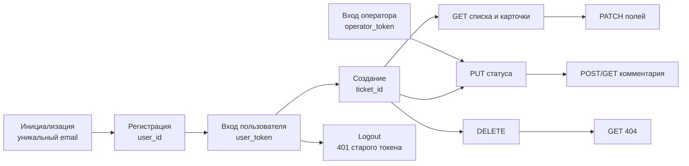

# Практическое задание № 8. Ручное тестирование REST API

## Цель

Научиться вручную исследовать REST API через Postman и Insomnia, строить
связанную цепочку запросов, управлять Bearer-сессиями и проверять не только
HTTP-код, но также заголовки, JSON, схему ответа, бизнес-состояние и отсутствие
побочного эффекта после ошибки.

После выполнения работы вы сможете:

- читать OpenAPI и переводить операцию в фактический HTTP-запрос;
- различать path, query, header и body-параметры;
- выполнять `GET`, `POST`, `PATCH`, `PUT` и `DELETE`;
- проверять регистрацию, вход, текущего пользователя и выход;
- получать и передавать Bearer-токены двух ролей;
- пользоваться environment-, collection- и local-переменными Postman;
- передавать email, токен и UUID между запросами;
- строить воспроизводимую позитивную цепочку;
- проектировать негативные проверки авторизации, доступа, состояния и
  валидации;
- обосновывать ответы `200`, `201`, `204`, `401`, `403`, `404`, `409` и `422`;
- проверять `Content-Type`, `Cache-Control`, `WWW-Authenticate` и
  `X-Request-ID`;
- проверять JSON-схемы пользователя, токена, заявки, комментария и ошибки;
- подтверждать неизменность данных после отклонённого запроса;
- воспроизводить один запрос в двух независимых HTTP-клиентах;
- экспортировать собственную Postman-коллекцию без действующих сессий.

## Практическое задание

Проведите ручное тестирование REST API исправленной ветки
`client-server/fixed` в Postman и Insomnia.

Создайте собственную коллекцию на основе опубликованного контракта и стартовой
заготовки. Настройте локальное окружение, создайте уникального пользователя,
получите токены пользователя и оператора, пройдите жизненный цикл нескольких
заявок и выполните негативные запросы для основных классов ошибок.

Каждый значимый результат проверяется на четырёх уровнях:

1. транспорт — метод, URL, код и заголовки;
2. контракт — структура и типы JSON;
3. бизнес-правило — роль, владение, статус и допустимость операции;
4. состояние — что сохранилось или осталось неизменным после запроса.

Рабочая ветка личного репозитория:

```text
practice/08-manual-rest-api
```

Рекомендуемая структура результата:

```text
docs/test-reports/08/
├── README.md
├── postman/
│   ├── mini-tickets-practice-08.postman_collection.json
│   └── local-practice-08.postman_environment.json
├── insomnia/
│   ├── mini-tickets-practice-08.yaml
│   └── comparison.md
└── evidence/
    ├── positive-chain.png
    ├── negative-statuses.png
    ├── schema-checks.png
    └── request-id-correlation.md
```

`README.md` содержит версию продукта, карту API, данные, реестр запросов,
результаты позитивной и негативной частей, сравнение клиентов и вывод. Каталог
`postman` содержит собственную коллекцию и очищенное окружение. В `insomnia`
сохраняются экспорт и сравнительная таблица. `evidence` содержит небольшие
доказательства без действующих Bearer-токенов.

### Источники ожидаемого поведения

- `docs/ТРЕБОВАНИЯ.md` — бизнес-правила `AUTH-*`, `TICKET-*` и `COMMENT-*`;
- `contract/openapi.json` — полный машиночитаемый контракт OpenAPI 3.1;
- Swagger по адресу `/docs` — интерактивное представление API;
- `postman/mini-tickets.collection.json` — стартовая коллекция Postman;
- `postman/local.environment.json` — минимальный пример окружения;
- `backend/schemas.py` — связь входных и публичных выходных моделей;
- `variant.json` — архитектура и состояние выбранной версии;
- серверные ответы и `X-Request-ID` — фактическое поведение текущего запуска.

### Карта REST API

| Область | Метод | Путь | Успех | Авторизация |
|---|---|---|---:|---|
| Регистрация | `POST` | `/api/auth/register` | `201` | Публичный маршрут |
| Вход | `POST` | `/api/auth/login` | `200` | Публичный маршрут |
| Текущий пользователь | `GET` | `/api/auth/me` | `200` | Bearer |
| Выход | `POST` | `/api/auth/logout` | `204` | Bearer |
| Список заявок | `GET` | `/api/tickets` | `200` | Bearer |
| Создание заявки | `POST` | `/api/tickets` | `201` | Bearer |
| Карточка заявки | `GET` | `/api/tickets/{ticket_id}` | `200` | Bearer |
| Частичное изменение | `PATCH` | `/api/tickets/{ticket_id}` | `200` | Bearer |
| Удаление | `DELETE` | `/api/tickets/{ticket_id}` | `204` | Bearer |
| Изменение статуса | `PUT` | `/api/tickets/{ticket_id}/status` | `200` | Bearer, оператор |
| Список комментариев | `GET` | `/api/tickets/{ticket_id}/comments` | `200` | Bearer |
| Новый комментарий | `POST` | `/api/tickets/{ticket_id}/comments` | `201` | Bearer |

Корень приложения хранится в `base_url`, а `/api` остаётся частью пути каждого
API-запроса. Bearer-токен является непрозрачной серверной сессией, а не JWT.

### Цепочка данных



### Матрица требуемых кодов

| Код | Надёжный сценарий | Что дополнительно проверить |
|---:|---|---|
| `200` | Вход, `/auth/me`, GET/PATCH заявки, PUT оператором | JSON-схема и состояние |
| `201` | Регистрация, создание заявки, комментарий | Серверные поля и сохранение |
| `204` | Удаление или выход | Пустое тело и последующий запрос |
| `401` | Нет токена, неверный токен, токен после logout | `WWW-Authenticate`, отсутствие данных |
| `403` | Пользователь меняет статус; оператор редактирует чужую заявку | Действующая сессия, состояние не изменилось |
| `404` | Нет UUID; пользователь запрашивает чужую заявку | Единая ошибка без раскрытия существования |
| `409` | Дубликат email; запрещённый переход; комментарий в `closed` | Бизнес-конфликт и неизменность данных |
| `422` | Неверное поле, граница или JSON | `error.fields`, путь поля, отсутствие записи |

## Задание (шаги)

### Шаг 1. Подготовьте продуктовую ветку

Получите актуальное состояние продукта и создайте отдельную рабочую копию
`client-server/fixed`:

```powershell
$taskProduct = Join-Path $env:USERPROFILE 'repos/testing'
$taskClientServer = Join-Path $taskProduct '.worktrees/client-server-fixed'
Set-Location -LiteralPath $taskProduct
git fetch origin
if (!(Test-Path -LiteralPath $taskClientServer)) {
    git worktree add --detach $taskClientServer origin/client-server/fixed
}
git -C $taskClientServer merge --ff-only origin/client-server/fixed
git -C $taskClientServer status
git -C $taskClientServer rev-parse HEAD
Get-Content -LiteralPath (Join-Path $taskClientServer 'variant.json')
```

Зафиксируйте полный Git SHA, `architecture: client-server` и `state: fixed`.
Рабочая копия используется как неизменяемый источник приложения, контракта и
стартовой коллекции.

### Шаг 2. Запустите локальную среду

В отдельном окне PowerShell запустите вариант. Ниже используется пример с
идентификатором среды `81`:

```powershell
$taskProduct = Join-Path $env:USERPROFILE 'repos/testing'
$taskClientServer = Join-Path $taskProduct '.worktrees/client-server-fixed'
Set-Location -LiteralPath $taskClientServer
.\scripts\Start-Student.ps1 -Student 81
Invoke-RestMethod http://localhost:8181/health/ready
docker compose ps
```

Параметры запуска:

| Компонент | Значение |
|---|---|
| UI и внешний HTTP-вход | `http://localhost:8181` |
| Swagger | `http://localhost:8181/docs` |
| OpenAPI | `http://localhost:8181/openapi.json` |
| PostgreSQL | `localhost:55521` |
| Compose-проект | `mini-student-81` |

Если эти порты заняты, выберите другой положительный идентификатор `N`.
`Start-Student.ps1` рассчитает HTTP-порт как `8100 + N`, порт PostgreSQL как
`55440 + N`, а имя Compose-проекта как `mini-student-N`. Укажите полученные
значения в окружении клиентов и отчёте.

Убедитесь, что `db`, `app` и `web` имеют состояние `healthy`. Внешний клиент
обращается к Nginx на `8181`; внутренний адрес контейнера `app:8000` доступен
только внутри Compose-сети.

### Шаг 3. Изучите контракт до создания запросов

Откройте `docs/ТРЕБОВАНИЯ.md`, `contract/openapi.json` и Swagger. Для каждой
операции выпишите:

- метод и путь;
- path- и query-параметры;
- наличие JSON-тела;
- обязательные и необязательные поля;
- необходимость Bearer-сессии;
- успешный код и схему ответа;
- реалистичные ошибки по бизнес-правилу;
- ожидаемое изменение данных.

Обратите внимание на различие `PATCH` и `PUT`. Заголовок и приоритет заявки
изменяются частичным `PATCH`, а переход состояния выполняется специальным
`PUT /status`. Замена одного метода другим изменила бы смысл контракта.

### Шаг 4. Подготовьте личный репозиторий и отчёт

Создайте рабочую ветку и каталоги результата:

```powershell
$taskTests = Join-Path $env:USERPROFILE 'repos/mini-tickets-tests'
Set-Location -LiteralPath $taskTests
git switch main
git pull --ff-only origin main
git switch -c practice/08-manual-rest-api
New-Item -ItemType Directory -Path docs/test-reports/08/postman -Force | Out-Null
New-Item -ItemType Directory -Path docs/test-reports/08/insomnia -Force | Out-Null
New-Item -ItemType Directory -Path docs/test-reports/08/evidence -Force | Out-Null
```

Создайте `docs/test-reports/08/README.md`:

```markdown
# Ручное тестирование REST API

## Версия и локальная среда
## Источники ожидаемого поведения
## Карта маршрутов и тестовые данные
## Переменные Postman
## Структура собственной коллекции
## Позитивная цепочка
## Негативные проверки
## HTTP-заголовки
## JSON-схемы
## Сравнение Postman и Insomnia
## Обнаруженные отклонения
## Итоговый вывод и остаточные риски
```

### Шаг 5. Импортируйте заготовку и создайте собственную коллекцию

В Postman импортируйте:

```text
postman/mini-tickets.collection.json
postman/local.environment.json
```

Сохраните копию коллекции под именем
`Мини-заявки — практика 08 — <ваш идентификатор>`. Изучите исходные запросы и
скрипты. Заготовка уже умеет:

- генерировать email перед регистрацией;
- сохранять токен после входа;
- сохранять UUID созданной заявки;
- выполнять основной CRUD-поток;
- проверять базовые коды и наличие `X-Request-ID`.

Расширьте собственную копию папками:

```text
00. Инициализация
01. Авторизация
02. Заявки — позитивная цепочка
03. Комментарии
04. Роли и состояния
05. Ошибки 401 и 403
06. Ошибки 404 и 409
07. Ошибки 422
08. Удаление и отзыв сессии
```

На публичных `register` и `login` выберите `No Auth`. Для защищённых запросов
используйте наследуемый Bearer либо явную переменную нужной роли.

### Шаг 6. Настройте окружение и области переменных Postman

Создайте окружение `Mini Tickets P08 Local`:

| Переменная | Значение запуска | Назначение |
|---|---|---|
| `base_url` | `http://localhost:8181` | Адрес без `/api` |
| `user_password` | `LabPassword1!` | Пароль уникального пользователя |
| `operator_email` | `operator@example.test` | Учётная запись оператора |
| `operator_password` | `LabPassword1!` | Пароль оператора |
| `foreign_ticket_id` | `00000000-0000-0000-0000-00000000000d` | Новая заявка другого seed-пользователя |
| `missing_ticket_id` | `ffffffff-ffff-ffff-ffff-ffffffffffff` | Валидный отсутствующий UUID |

Динамические значения храните в collection variables:

```text
user_email
user_id
user_token
operator_token
ticket_id
status_ticket_id
delete_ticket_id
comment_id
revoked_token
```

`base_url` зависит от запуска и относится к environment. Идентификаторы цепочки
относятся к коллекции. `request_id` создаётся как local variable для одного
запроса. В отчёте объясните выбор области для каждой группы значений.

### Шаг 7. Добавьте общий идентификатор каждого запроса

На уровне коллекции добавьте Pre-request Script:

```javascript
const suffix = pm.variables
  .replaceIn("{{$guid}}")
  .replace(/-/g, "")
  .slice(0, 24);

const requestId = `p08-${suffix}`;
pm.variables.set("request_id", requestId);
pm.request.headers.upsert({
  key: "X-Request-ID",
  value: requestId,
});
```

На уровне коллекции добавьте Post-response Script:

```javascript
pm.test("X-Request-ID возвращён без изменения", () => {
  const actual = pm.response.headers.get("X-Request-ID");
  pm.expect(actual).to.eql(pm.variables.get("request_id"));
});

if (pm.response.code === 401) {
  pm.test("401 объявляет Bearer-аутентификацию", () => {
    pm.expect(pm.response.headers.get("WWW-Authenticate"))
      .to.eql("Bearer");
  });
}
```

Так каждый неожиданный ответ можно связать с Nginx и FastAPI. Значение не
является токеном и подходит для отчёта.

### Шаг 8. Создайте запрос инициализации цепочки

Добавьте первым запрос:

```text
GET {{base_url}}/health/ready
```

В его Pre-request Script сформируйте уникальный email и очистите состояние
прошлого запуска:

```javascript
const suffix = pm.variables
  .replaceIn("{{$guid}}")
  .replace(/-/g, "")
  .slice(0, 12);

pm.collectionVariables.set(
  "user_email",
  `p08-${suffix}@example.test`,
);

[
  "user_id",
  "user_token",
  "operator_token",
  "ticket_id",
  "status_ticket_id",
  "delete_ticket_id",
  "comment_id",
  "revoked_token",
].forEach((name) => pm.collectionVariables.unset(name));
```

Проверьте `200`, `status: ready` и `service: all`. Повторяемая цепочка всегда
начинается с этого запроса, поэтому дубликат email и устаревший UUID не зависят
от прошлого запуска.

### Шаг 9. Проверьте регистрацию и дубликат email

Создайте запрос:

```text
POST {{base_url}}/api/auth/register
Content-Type: application/json
```

```json
{
  "email": "  {{user_email}}  ",
  "password": "{{user_password}}"
}
```

Для первого ответа проверьте:

- код `201`;
- `Content-Type` содержит `application/json`;
- поля `id`, `email`, `role`;
- UUID в `id`;
- нормализованный email без пробелов и в нижнем регистре;
- роль `user`;
- отсутствие `password`, `password_hash`, `token_hash` и `access_token`.

Сохраните данные:

```javascript
pm.test("Регистрация возвращает 201", () => {
  pm.response.to.have.status(201);
});

const body = pm.response.json();

pm.test("Создан обычный пользователь", () => {
  pm.expect(body.email).to.eql(
    pm.collectionVariables.get("user_email"),
  );
  pm.expect(body.role).to.eql("user");
  pm.expect(body).to.have.all.keys("id", "email", "role");
});

pm.collectionVariables.set("user_id", body.id);
```

Создайте отдельный запрос `Повторная регистрация — 409` с тем же телом.
Проверьте единый `ErrorOut` и повторным входом подтвердите, что исходная учётная
запись остаётся работоспособной.

### Шаг 10. Выполните вход пользователя и оператора

Пользовательский вход:

```text
POST {{base_url}}/api/auth/login
```

```json
{
  "email": "{{user_email}}",
  "password": "{{user_password}}"
}
```

Добавьте проверки:

```javascript
pm.test("Вход возвращает 200", () => {
  pm.response.to.have.status(200);
});

pm.test("Токен не разрешено кэшировать", () => {
  pm.expect(pm.response.headers.get("Cache-Control"))
    .to.include("no-store");
});

const body = pm.response.json();

pm.test("Ответ содержит Bearer-сессию", () => {
  pm.expect(body).to.have.all.keys(
    "access_token",
    "token_type",
    "expires_in",
  );
  pm.expect(body.access_token).to.be.a("string").and.not.empty;
  pm.expect(body.token_type).to.eql("bearer");
  pm.expect(body.expires_in).to.eql(3600);
});

pm.collectionVariables.set("user_token", body.access_token);
```

Создайте второй вход с `operator_email` и `operator_password`, а токен сохраните
в `operator_token`. Запросы пользователя используют
`Bearer {{user_token}}`, запросы оператора — `Bearer {{operator_token}}`.

### Шаг 11. Проверьте публичные JSON-схемы

Сопоставьте ответы со схемами `UserOut`, `TokenOut`, `TicketOut`, `CommentOut` и
`ErrorOut` в `contract/openapi.json`.

Пример JSON Schema для `TicketOut`:

```javascript
const ticketSchema = {
  type: "object",
  additionalProperties: false,
  required: [
    "id",
    "author_id",
    "title",
    "priority",
    "status",
    "created_at",
  ],
  properties: {
    id: { type: "string", format: "uuid" },
    author_id: { type: "string", format: "uuid" },
    title: { type: "string" },
    priority: { enum: ["low", "normal", "high"] },
    status: { enum: ["new", "active", "closed"] },
    created_at: { type: "string", format: "date-time" },
  },
};

pm.test("Ответ соответствует TicketOut", () => {
  pm.response.to.have.jsonSchema(ticketSchema);
});
```

Пример схемы ошибки:

```javascript
const errorSchema = {
  type: "object",
  required: ["error"],
  properties: {
    error: {
      type: "object",
      required: ["message", "request_id"],
      properties: {
        message: { type: "string", minLength: 1 },
        request_id: { type: "string", minLength: 1 },
        fields: {
          type: ["array", "null"],
          items: { type: "object" },
        },
      },
    },
  },
};

pm.test("Ответ соответствует ErrorOut", () => {
  pm.response.to.have.jsonSchema(errorSchema);
});

pm.test("request_id тела совпадает с заголовком", () => {
  const body = pm.response.json();
  pm.expect(body.error.request_id)
    .to.eql(pm.response.headers.get("X-Request-ID"));
});
```

Для массива заявок используйте `type: "array"` и `items: ticketSchema`.
Проверка схемы дополняется конкретным бизнес-ожиданием: корректная структура не
доказывает правильного автора, статуса или видимости.

### Шаг 12. Проверьте `GET /auth/me`

Отправьте запрос с `user_token`:

```text
GET {{base_url}}/api/auth/me
Authorization: Bearer {{user_token}}
```

Проверьте `200`, схему `UserOut`, совпадение `id`, `email`, `role: user` и
отсутствие чувствительных полей. Повторите запрос с `operator_token` и ожидайте
`role: operator`.

Эти два ответа подтверждают, что токены принадлежат разным сессиям. Сравните
сохранённые значения между собой и рассматривайте каждый токен как непрозрачный
идентификатор серверной сессии.

### Шаг 13. Создайте три заявки для независимых сценариев

С пользовательским токеном трижды выполните:

```text
POST {{base_url}}/api/tickets
```

Используйте разные тела:

```json
{
  "title": "P08 основная цепочка",
  "priority": "normal"
}
```

```json
{
  "title": "P08 переходы состояния",
  "priority": "high"
}
```

```json
{
  "title": "P08 удаление",
  "priority": "low"
}
```

Для каждого ответа проверьте `201`, `TicketOut`, совпадение `author_id` с
`user_id`, начальный `status: new`, переданный приоритет и дату. Сохраните UUID в
`ticket_id`, `status_ticket_id` и `delete_ticket_id` соответственно.

Независимые записи позволяют проверять состояние и удаление без восстановления
данных между запросами.

### Шаг 14. Проверьте GET списка, фильтра и карточки

С `user_token` выполните:

```text
GET {{base_url}}/api/tickets
GET {{base_url}}/api/tickets?status=new
GET {{base_url}}/api/tickets/{{ticket_id}}
```

Проверьте:

- код `200`;
- список является массивом `TicketOut`;
- все видимые записи принадлежат текущему `user_id`;
- три созданных UUID присутствуют;
- фильтр возвращает только `status: new`;
- карточка идентична созданной записи по основным полям;
- массив не содержит пользователя, пароля или Bearer-токена.

Пример проверки фильтра:

```javascript
const body = pm.response.json();

pm.test("Ответ является массивом", () => {
  pm.expect(body).to.be.an("array");
});

pm.test("Фильтр содержит только новые заявки", () => {
  body.forEach((ticket) => pm.expect(ticket.status).to.eql("new"));
});

pm.test("Созданная заявка присутствует", () => {
  const expected = pm.collectionVariables.get("ticket_id");
  pm.expect(body.some((ticket) => ticket.id === expected)).to.eql(true);
});
```

### Шаг 15. Проверьте POST и GET комментариев

Добавьте комментарий к основной заявке:

```text
POST {{base_url}}/api/tickets/{{ticket_id}}/comments
```

```json
{
  "text": "P08 комментарий ручной API-проверки"
}
```

Проверьте `201`, схему `CommentOut`, `ticket_id`, `author_id`, текст и дату.
Сохраните `comment_id`. Затем выполните GET комментариев, проверьте `200`, массив
и наличие элемента с тем же UUID и значениями.

Повторный GET используется как независимое подтверждение сохранения, а не только
как проверка структуры ответа POST.

### Шаг 16. Проверьте PATCH и отсутствие лишних изменений

Измените только приоритет основной заявки:

```text
PATCH {{base_url}}/api/tickets/{{ticket_id}}
```

```json
{
  "priority": "high"
}
```

Проверьте `200` и `TicketOut`. Сравните ответ с сохранённым состоянием:

- `id`, `author_id`, `title`, `status` и `created_at` прежние;
- `priority` изменился на `high`;
- неизвестные поля не появились.

Повторите GET карточки и подтвердите сохранённый приоритет. Это отделяет
изменение представления ответа от фактического изменения ресурса.

### Шаг 17. Проверьте `PUT` статуса двумя ролями

Пользовательским токеном отправьте:

```text
PUT {{base_url}}/api/tickets/{{status_ticket_id}}/status
```

```json
{
  "status": "active"
}
```

Ожидайте `403`: пользователь аутентифицирован, но его роль не позволяет менять
статус. GET карточки должен по-прежнему вернуть `new`.

С `operator_token` сначала выполните запрещённый `new → closed` и ожидайте
`409`. Затем выполните допустимые переходы:

```text
new → active → closed
```

Каждый успешный PUT возвращает `200` и полный `TicketOut`. Когда заявка получила
статус `active`, попробуйте изменить её приоритет авторским `user_token` и
ожидайте `409`; повторный GET должен показать прежний приоритет. Затем переведите
её в `closed`, попробуйте удалить авторским токеном и добавить комментарий.
Обе операции должны вернуть `409`; GET карточки и комментариев подтверждает, что
заявка осталась на месте, а новый комментарий не появился.

Так одна связка запросов различает недостаточную роль (`403`), конфликт
состояния (`409`) и успешную операцию (`200`).

### Шаг 18. Проверьте `DELETE` и пустое тело `204`

Удалите отдельную заявку `delete_ticket_id` с `user_token`:

```text
DELETE {{base_url}}/api/tickets/{{delete_ticket_id}}
```

Проверьте:

- код `204`;
- тело является пустой строкой;
- заголовок `X-Request-ID` присутствует;
- JSON-декодирование для этого ответа не выполняется;
- последующий GET карточки возвращает `404`;
- UUID отсутствует в новом списке.

Пример Postman-проверки:

```javascript
pm.test("Удаление возвращает 204", () => {
  pm.response.to.have.status(204);
});

pm.test("У 204 пустое тело", () => {
  pm.expect(pm.response.text()).to.eql("");
});
```

### Шаг 19. Соберите набор проверок `401`

Создайте отдельные запросы:

| ID | Условие | Ожидаемый результат |
|---|---|---|
| `API-401-01` | GET `/auth/me` с `No Auth` | `401` |
| `API-401-02` | GET `/tickets` с `Bearer invalid-p08-token` | `401` |
| `API-401-03` | Login существующего email с неверным паролем | `401` |
| `API-401-04` | Login неизвестного email | `401` |
| `API-401-05` | GET `/auth/me` после logout | `401` |

Перед logout сохраните токен:

```javascript
pm.collectionVariables.set(
  "revoked_token",
  pm.collectionVariables.get("user_token"),
);
```

Выполните `POST /api/auth/logout` с `user_token`, проверьте `204`, затем
`GET /api/auth/me` с `revoked_token`.

Для каждого `401` проверяйте:

- `WWW-Authenticate: Bearer`;
- `X-Request-ID`;
- `ErrorOut`;
- отсутствие защищённых данных;
- одинаковое безопасное сообщение там, где различие раскрыло бы существование
  учётной записи.

После проверки получите новую пользовательскую сессию для оставшейся цепочки.

### Шаг 20. Разделите `403` и `404`

Проверки `403` выполняются с действующей сессией и доступным для роли ресурсом:

| Сценарий | Токен | Ожидание |
|---|---|---:|
| PUT статуса собственной заявки | Пользователь | `403` |
| PATCH чужой видимой заявки | Оператор | `403` |
| DELETE чужой видимой новой заявки | Оператор | `403` |

Для оператора используйте `ticket_id` либо новую заявку текущего пользователя.
Оператор видит её, но не становится автором.

Проверки `404`:

| Сценарий | Токен | Ожидание |
|---|---|---:|
| GET `missing_ticket_id` | Пользователь | `404` |
| GET `foreign_ticket_id` | Новый пользователь | `404` |
| GET комментариев чужой заявки | Новый пользователь | `404` |
| GET удалённого `delete_ticket_id` | Пользователь | `404` |

Одинаковый `404` для отсутствующей и недоступной заявки уменьшает раскрытие
существования чужих данных. В каждом случае проверяйте `ErrorOut` и отсутствие
полей заявки.

### Шаг 21. Соберите набор бизнес-конфликтов `409`

Проверьте разные причины одного кода:

| ID | Предусловие и действие | Ожидаемая неизменность |
|---|---|---|
| `API-409-01` | Повторная регистрация `user_email` | Не появляется вторая учётная запись |
| `API-409-02` | Оператор выполняет `new → closed` | Статус остаётся `new` |
| `API-409-03` | Автор PATCH своей `active` заявки | Поля остаются прежними |
| `API-409-04` | Автор DELETE своей `closed` заявки | Ресурс остаётся доступен |
| `API-409-05` | POST комментария в `closed` | Список комментариев не увеличивается |

Код показывает конфликт с текущим состоянием или существующим ресурсом, но
причина уточняется через `error.message` и последующий GET. Запишите фактические
сообщения и `request_id` каждого случая.

### Шаг 22. Соберите набор валидационных ошибок `422`

Добавьте параметризованную таблицу ручных запросов:

| ID | Операция | Входные данные | Проверяемое правило |
|---|---|---|---|
| `API-422-01` | Register | email без корректного формата | `AUTH-01` |
| `API-422-02` | Register | пароль длиной 7 | Нижняя граница |
| `API-422-03` | Register | поле `role: operator` | Запрет неизвестных полей |
| `API-422-04` | POST ticket | заголовок длиной 2 | `TICKET-01` |
| `API-422-05` | POST ticket | заголовок длиной 81 | `TICKET-01` |
| `API-422-06` | POST ticket | `priority: urgent` | `TICKET-02` |
| `API-422-07` | POST ticket | клиентские `author_id` или `status` | Серверные поля |
| `API-422-08` | PATCH ticket | `{}` | Требуется хотя бы одно поле |
| `API-422-09` | PATCH ticket | `{"priority": null}` | Явный `null` запрещён |
| `API-422-10` | GET list | `status=draft` | Закрытый набор фильтра |
| `API-422-11` | GET detail | невалидный UUID в пути | Тип path-параметра |
| `API-422-12` | POST comment | строка из пробелов | Нормализация текста |

Для каждого ответа проверяйте:

- `422`;
- `Content-Type: application/json`;
- схему `ErrorOut`;
- массив `error.fields` и путь некорректного поля для ошибок, сформированных
  валидатором входных данных;
- `error.message` для пустого PATCH: этот сценарий отклоняет бизнес-проверка
  после разбора корректного JSON, поэтому `fields` может отсутствовать;
- отсутствие исходного пароля в ответе;
- `error.request_id`, совпадающий с заголовком;
- отсутствие созданной или изменённой записи.

Добавьте позитивные соседние значения заголовка длиной 3 и 80, чтобы
подтвердить обе стороны границ.

### Шаг 23. Выполните коллекцию как связанную последовательность

Расположите запросы так, чтобы данные создавались до использования и каждый
сценарий имел подходящее состояние:

```text
Инициализация
→ Регистрация 201
→ Повторная регистрация 409
→ Login user 200
→ Login operator 200
→ /auth/me обеих ролей 200
→ Создание трёх заявок 201
→ GET список/фильтр/карточка 200
→ POST/GET комментария 201/200
→ PATCH 200
→ PUT пользователя 403
→ PUT new→closed 409
→ PUT new→active 200
→ PATCH active-заявки автором 409
→ PUT active→closed 200
→ DELETE closed-заявки автором 409
→ POST комментария в closed 409
→ Проверки чужого ресурса 404
→ Набор 422
→ DELETE отдельной новой заявки 204
→ GET удалённой заявки 404
→ Logout 204
→ GET с отозванным токеном 401
```

Выполните последовательность вручную по папкам. Затем используйте Collection
Runner, чтобы проверить связность сохранённых переменных и порядок запросов.
Запишите число запросов, пройденных проверок и каждый неожиданный результат.

Runner здесь подтверждает воспроизводимость ручной коллекции. Полноценная
программная автоматизация API будет развиваться в следующей работе.

### Шаг 24. Воспроизведите контракт в Insomnia

Создайте проект Insomnia и импортируйте:

```text
contract/openapi.json
```

Создайте локальное окружение со значениями `base_url`, `user_email`,
`user_password`, `operator_email`, `operator_password`, `user_token`,
`operator_token` и `ticket_id`. Вставляйте переменные через интерфейс выбора
environment value, чтобы синтаксис соответствовал установленной версии
Insomnia.

Выполните связанную выборку:

1. Login пользователя — `200`;
2. GET `/auth/me` — `200`;
3. POST заявки — `201`;
4. GET карточки — `200`;
5. PATCH приоритета — `200`;
6. PUT статуса с user token — `403`;
7. PUT допустимого статуса с operator token — `200`;
8. GET отсутствующего UUID — `404`;
9. POST с конфликтом состояния — `409`;
10. POST с недопустимым приоритетом — `422`;
11. DELETE отдельной новой заявки — `204`.

Токен и UUID можно сохранить в environment после первого ответа либо связать
через response/template tag Insomnia. Зафиксируйте выбранный способ.

### Шаг 25. Сравните Postman и Insomnia

Для одинаковых запросов заполните таблицу:

| Сценарий | Метод и URL совпали | Request headers | Код Postman | Код Insomnia | JSON/тело совпало | Различия клиента |
|---|---|---|---:|---:|---|---|
| Login | — | — | — | — | — | — |
| GET `/auth/me` | — | — | — | — | — | — |
| POST ticket | — | — | — | — | — | — |
| PUT user → `403` | — | — | — | — | — | — |
| GET missing → `404` | — | — | — | — | — | — |
| Conflict → `409` | — | — | — | — | — | — |
| Validation → `422` | — | — | — | — | — | — |
| DELETE → `204` | — | — | — | — | — | — |

Сравнивайте фактически отправленный URL, `Authorization`, `Content-Type`, тело,
код, response headers и JSON. Различные autogenerated-заголовки клиентов можно
записать отдельно от контрактных различий.

### Шаг 26. Используйте Console и `X-Request-ID` для отладки

При неожиданном результате сначала проверьте в Postman Console или Timeline
Insomnia:

- подставилось ли правильное `base_url`;
- какой Bearer-токен выбрала папка или запрос;
- не осталось ли значение от прошлого запуска;
- является ли JSON синтаксически корректным;
- какой URL получился после подстановки UUID;
- какие заголовки реально отправлены;
- какой код и ответ вернул сервер.

Сохраните безопасный пример в `request-id-correlation.md`:

```markdown
## API-409-02

- Метод и путь: `PUT /api/tickets/<ticket_id>/status`
- Роль: `operator`
- X-Request-ID: `p08-...`
- Ожидаемый код: `409`
- Фактический код: `409`
- Error message: `...`
- Состояние до: `new`
- Состояние после: `new`
```

Bearer-токен замените на `[REDACTED]`. По `X-Request-ID` запрос можно позднее
найти в структурированных журналах Nginx и FastAPI.

### Шаг 27. Подготовьте итоговый отчёт

Сведите результаты в реестр:

| ID | Клиент | Метод и путь | Предусловие | Ожидаемый код | Фактический код | Схема | Состояние | Итог |
|---|---|---|---|---:|---:|---|---|---|
| `API-POS-01` | Postman | POST `/auth/register` | Уникальный email | 201 | — | UserOut | Пользователь создан | — |
| `API-AUTH-01` | Postman | GET `/auth/me` | Нет токена | 401 | — | ErrorOut | Данных нет | — |
| `API-COMP-01` | Оба | POST `/tickets` | User token | 201 | — | TicketOut | Одна запись | — |

Для каждой группы сформулируйте:

- какие маршруты и методы проверены;
- какие роли и состояния использованы;
- какие коды воспроизведены;
- какие заголовки подтверждены;
- какие схемы проверены;
- какие негативные запросы сохранили инвариант данных;
- совпали ли Postman и Insomnia;
- какие отклонения, вопросы и остаточные риски остались.

Формулировка «API работает» заменяется конкретным выводом о версии, маршрутах,
данных и фактических результатах.

### Шаг 28. Очистите экспорт, остановите среду и отправьте ветку

Перед экспортом очистите динамические collection variables:

```javascript
[
  "user_token",
  "operator_token",
  "revoked_token",
].forEach((name) => pm.collectionVariables.unset(name));
```

Экспортируйте собственную Postman Collection v2.1 и окружение. Откройте JSON как
текст и проверьте отсутствие значений `access_token`, действующих токенов и
лишних локальных данных. Экспортируйте проект Insomnia в поддерживаемом вашей
версией формате.

В окне продукта остановите контейнеры с сохранением данных:

```powershell
Set-Location -LiteralPath $taskClientServer
docker compose stop
docker compose ps -a
```

В личном репозитории проверьте состав результата:

```powershell
Set-Location -LiteralPath $taskTests
git status --short
git diff --check
git diff -- docs/test-reports/08
```

Зафиксируйте и отправьте рабочую ветку:

```powershell
git add docs/test-reports/08
git commit -m 'Проведено ручное тестирование REST API'
git push -u origin practice/08-manual-rest-api
```

При использовании GitLab отправьте тот же коммит во второй remote:

```powershell
git push -u gitlab practice/08-manual-rest-api
```

В описании PR/MR укажите проверенные методы, воспроизведённые коды, применение
двух ролей, схему цепочки, сравнение Postman/Insomnia и ссылку на итоговый отчёт.

Перед PR/MR отправьте [один коммит на обе площадки](../СИНХРОНИЗАЦИЯ-GITHUB-GITLAB.md#один-коммит-для-pr-и-mr),
затем выполните [общий цикл проверки CI](README.md#общий-цикл-результата):
сопоставьте GitHub Actions и GitLab CI, их журналы и опубликованные артефакты.

### Шаг 29. Сопоставьте Basic Auth, Bearer Token и OAuth 2.0

Откройте OpenAPI работающего приложения и найдите `securitySchemes`, затем
сопоставьте фактическую схему продукта с тремя распространёнными вариантами:

| Схема | Что передаётся клиентом | Где получается значение | Что проверяет тестировщик |
|---|---|---|---|
| Basic Auth | `Authorization: Basic <base64>` | логин и пароль известны клиенту | TLS, неверная пара, отсутствие секрета в URL и журналах |
| Bearer Token | `Authorization: Bearer <token>` | отдельный вход возвращает токен | выдача, срок действия, отзыв, роли, `401/403`, отсутствие токена в артефактах |
| OAuth 2.0 Authorization Code + PKCE | code, `code_verifier`, затем access token | authorization endpoint и token endpoint | `state`, PKCE, redirect URI, scope, expiry, refresh и разделение authorization/resource server |

Создайте `docs/test-reports/08/authentication-schemes.md`. Для каждой схемы
нарисуйте последовательность из клиента, API и сервера авторизации, приведите
пример HTTP-заголовка со значением `[REDACTED]` и перечислите позитивную и
негативную проверку. Для OAuth 2.0 отдельно покажите, что протокол определяет
делегированную авторизацию, а способ входа пользователя может настраиваться
отдельно.

В выводе зафиксируйте фактическое поведение стенда: приложение «Мини-заявки»
реализует собственную операцию входа и Bearer-токен. Наличие Basic Auth или
OAuth 2.0 не следует утверждать только по тому, что запрос содержит заголовок
`Authorization`; это подтверждается контрактом и реальным обменом запросами.

Добавьте файл в тот же PR/MR отдельным коммитом, опубликуйте одинаковый SHA в
GitHub и GitLab и посмотрите обновившиеся запуски CI.

### Шаг 30. Сопоставьте JSON и XML как форматы тела

В `docs/test-reports/08/content-types.md` представьте одну регистрацию в двух
формах с одинаковым смыслом:

```json
{"email":"format@example.test","password":"LabPassword1!"}
```

```xml
<registration>
  <email>format@example.test</email>
  <password>LabPassword1!</password>
</registration>
```

Сравните синтаксис, типы значений, вложенность, повторяющиеся элементы, способы
валидации схемы и MIME-типы `application/json` / `application/xml`. Затем
проверьте в OpenAPI заявленные media types и отправьте XML-вариант на локальный
`POST /api/auth/register` с новым email. Зафиксируйте фактический код, тело
ошибки, `Content-Type` ответа, `X-Request-ID` и отсутствие созданного
пользователя.

Итог отделяет возможность HTTP передавать XML от контракта конкретного API:
«Мини-заявки» публикуют JSON-контракт, поэтому XML не становится поддерживаемым
форматом только после замены заголовка запроса.

## Подсказки по ключевым частям

### Метод является частью контракта

`POST` создаёт ресурс или действие, `GET` читает, `PATCH` частично меняет,
`PUT /status` задаёт состояние через специальную операцию, `DELETE` удаляет.
Одинаковый URL с другим методом представляет другую операцию.

### Path, query, header и body передают разные данные

`ticket_id` входит в путь, `status=new` — в query, Bearer — в заголовок, а
`title` и `priority` — в JSON. При отладке проверяйте каждую область отдельно.

### Bearer-токен подтверждает сессию, но не право на любое действие

Действующий user token позволяет работать со своими заявками, однако PUT статуса
даёт `403`. Operator token позволяет менять статусы, но не делает оператора
автором чужой заявки.

### `401`, `403` и `404` нельзя объединять в одну «ошибку доступа»

- `401` — действующая сессия отсутствует;
- `403` — пользователь известен, но действие запрещено;
- `404` — ресурс отсутствует либо его существование скрыто от роли.

Ожидаемый код выводится из предусловия, а не из общего негативного характера
запроса.

### `409` описывает конфликт с текущим состоянием

JSON может быть синтаксически и структурно корректным, но операция противоречит
состоянию: email уже существует, переход запрещён или заявка закрыта. Это
отличает `409` от валидационного `422`.

### `422` требует проверки `fields`

Код подтверждает класс ошибки. `error.fields` показывает путь проблемного поля,
а повторный GET подтверждает отсутствие нежелательного изменения. Для ошибки
пароля тело не должно повторять исходное чувствительное значение.

### `204` проверяется без JSON-декодирования

Успешное удаление и logout возвращают пустое тело. Последующий GET превращает
`204` в проверяемый бизнес-результат: ресурс отсутствует или сессия отозвана.

### Переменные превращают набор запросов в цепочку

UUID берётся из ответа POST, а токен — из login. Ручное копирование помогает
познакомиться с запросом, но сохранённый скрипт делает повтор всей коллекции
воспроизводимым.

### Область переменной отражает срок её жизни

Адрес относится к локальному окружению, токен и UUID — к запуску коллекции,
`request_id` — к одному запросу. Чем шире область, тем выше риск случайно
использовать устаревшее значение.

### Схема и бизнес-проверка дополняют друг друга

`TicketOut` может быть структурно корректным, но содержать чужого автора или
неверный статус. Сначала проверяйте форму, затем конкретное правило и состояние.

### `additionalProperties: false` обнаруживает неожиданные поля

Эта настройка полезна для публичных моделей пользователя и заявки: она помогает
заметить случайное появление хеша, внутреннего признака или поля БД.

### Список требует схемы массива и проверки каждого элемента

Проверка первого объекта не гарантирует однородность массива. `items:
ticketSchema` проверяет структуру всех элементов, а отдельный цикл — фильтр,
авторство и наличие созданного UUID.

### Ошибка с правильным кодом может изменить данные

После негативного POST, PATCH, PUT или DELETE повторите GET и проверьте инвариант.
Это обнаруживает ситуацию, когда сервер вернул ошибку после частично выполненной
операции.

### Заголовок помогает проверить свойства вне JSON

`Content-Type` описывает тело, `Cache-Control` защищает ответ входа от
кэширования, `WWW-Authenticate` объявляет Bearer для `401`, а `X-Request-ID`
связывает клиент с журналами.

### OpenAPI перечисляет форму, а требования уточняют достижимый сценарий

Общий ответ `409` в документации маршрута не означает, что любая операция может
реально вернуть его. Предусловие выбирается по бизнес-правилам и состояниям.

### Два токена требуют явного именования

`token` быстро становится неоднозначным после входа оператора. Имена
`user_token` и `operator_token` уменьшают риск выполнить запрос не той ролью.

### Postman Console показывает фактически отправленный запрос

В редакторе может быть виден шаблон `{{ticket_id}}`, а Console показывает
подставленный URL, заголовки и тело. Это первый источник при неожиданном коде.

### Независимый клиент помогает локализовать проблему

Если одинаковый HTTP-запрос даёт одинаковый ответ в Postman и Insomnia,
наблюдение вероятнее связано с API. Различие фактически отправленных запросов
указывает на окружение, авторизацию или настройки клиента.

### Экспорт является переносимой частью результата

Коллекция содержит структуру, скрипты и пустые динамические переменные. Текущая
сессия относится к локальному запуску и очищается перед сохранением артефакта.

## Что проверить перед отправкой (чек-лист)

- [ ] В личном репозитории используется ветка `practice/08-manual-rest-api`.
- [ ] Результат находится в `docs/test-reports/08`.
- [ ] Указаны `client-server/fixed`, полный Git SHA и значения `variant.json`.
- [ ] Зафиксированы фактические HTTP- и PostgreSQL-порты, а также имя
      Compose-проекта выбранной среды.
- [ ] В отчёте есть источники ожидаемого поведения и карта маршрутов.
- [ ] Создана собственная Postman-коллекция с понятными папками и именами.
- [ ] Сохранено очищенное Postman-окружение с корректным `base_url`.
- [ ] Объяснены области environment, collection и local variables.
- [ ] Инициализация создаёт уникальный email и очищает прошлое состояние.
- [ ] Каждый запрос получает уникальный `X-Request-ID`.
- [ ] Проверено совпадение request ID заголовка и ошибки.
- [ ] Регистрация проверена по коду, нормализации, роли и схеме `UserOut`.
- [ ] Повторная регистрация возвращает `409`.
- [ ] Вход пользователя и оператора возвращает `200` и разные Bearer-сессии.
- [ ] Для login проверен `Cache-Control: no-store`.
- [ ] `/auth/me` проверен для ролей `user` и `operator`.
- [ ] Выполнены `GET`, `POST`, `PATCH`, `PUT` и `DELETE`.
- [ ] Созданы независимые заявки для основной цепочки, статусов и удаления.
- [ ] `POST /tickets` проверен по `201`, `TicketOut`, автору и `status: new`.
- [ ] Общий список и фильтр проверены как массивы со схемой каждого элемента.
- [ ] Карточка сопоставлена с ответом создания.
- [ ] Комментарий проверен через POST и последующий GET.
- [ ] PATCH изменяет только переданное поле и сохраняется после GET.
- [ ] Пользовательский PUT статуса возвращает `403` и не меняет состояние.
- [ ] Операторский PUT проходит допустимые переходы с кодом `200`.
- [ ] Запрещённый переход и комментарий в `closed` возвращают `409`.
- [ ] DELETE возвращает `204` с пустым телом.
- [ ] После DELETE карточка возвращает `404`, а запись отсутствует в списке.
- [ ] Проверены `401` без токена, с неверным токеном и после logout.
- [ ] Для каждого `401` проверен `WWW-Authenticate: Bearer`.
- [ ] Проверены `403` для пользователя и оператора в разных правилах доступа.
- [ ] Проверены `404` для отсутствующей, чужой и удалённой заявки.
- [ ] Проверено несколько причин `409` с последующим контролем состояния.
- [ ] Набор `422` охватывает body, query и path.
- [ ] Для валидационных `422` проверены `error.fields`, а для пустого PATCH —
      `error.message`; во всех случаях подтверждено отсутствие побочного эффекта.
- [ ] Проверены соседние границы заголовка 2/3 и 80/81.
- [ ] `UserOut`, `TokenOut`, `TicketOut`, `CommentOut` и `ErrorOut` сопоставлены с
      JSON Schema.
- [ ] В публичных ответах отсутствуют пароль, хеш и внутренние поля.
- [ ] Связанная последовательность повторно выполнена через Collection Runner.
- [ ] В Insomnia импортирован OpenAPI и настроено локальное окружение.
- [ ] Ключевые позитивные и негативные запросы воспроизведены в Insomnia.
- [ ] Сравнительная таблица содержит URL, headers, коды и тела двух клиентов.
- [ ] В OpenAPI найдена фактическая `securityScheme`, а Bearer-поток сопоставлен
      с Basic Auth и OAuth 2.0 Authorization Code + PKCE.
- [ ] Примеры заголовков в сравнении не содержат действующих учётных данных или
      токенов.
- [ ] JSON и XML сопоставлены по структуре, MIME-типу и проверке схемы; XML-
      запрос сравнен с media types фактического OpenAPI-контракта.
- [ ] Неожиданные результаты исследованы через Console или Timeline.
- [ ] В отчёте есть реестр фактических результатов и итоговый вывод.
- [ ] Собственная Postman Collection v2.1 сохранена в JSON.
- [ ] Экспорт Insomnia сохранён в поддерживаемом формате.
- [ ] Действующие Bearer-токены очищены из collection и environment exports.
- [ ] Доказательства не раскрывают `Authorization` и пароль.
- [ ] Среда остановлена с сохранением данных и журналов.
- [ ] `git diff --check` не сообщает о проблемах форматирования.
- [ ] В коммит входят отчёт, коллекции и выбранные доказательства.

## Советы по улучшению работы

- Давайте запросу имя с условием и ожидаемым кодом: `User PUT status — 403`
  информативнее общего `Проверка статуса`.
- Используйте префикс `P08` и уникальный suffix в email и заголовках, чтобы
  быстро находить связанные записи.
- Храните user и operator token в разных переменных и проверяйте выбранную роль
  перед отправкой запроса.
- Разделяйте данные основной цепочки, переходов и удаления отдельными UUID.
- Сохраняйте ожидаемое состояние перед негативной операцией и повторяйте GET
  после неё.
- Проверяйте все ключи публичного объекта, а не только отсутствие слова
  `password`.
- Для списков применяйте JSON Schema к каждому элементу и отдельные assertions к
  содержимому.
- Используйте `X-Request-ID` в имени доказательства или строке отчёта для
  последующей диагностики.
- Проверяйте фактический запрос в Postman Console до вывода о дефекте API.
- Сопоставляйте `401`, `403`, `404`, `409` и `422` с конкретным предусловием и
  инвариантом данных.
- Добавляйте к граничному негативному значению ближайшее позитивное значение.
- После `204` проверяйте не JSON, а пустое тело и следующий бизнес-результат.
- Группируйте коллекцию по потокам и состояниям, а не только по HTTP-методам.
- Поддерживайте повторяемый порядок: подготовка данных предшествует их чтению и
  изменению.
- При сравнении клиентов копируйте фактический cURL без Bearer-значения: так
  легче увидеть разницу метода, URL, headers и body.
- Экспортируйте коллекцию после очистки динамических переменных и открывайте JSON
  как текст для финальной проверки.
- Формулируйте найденное отклонение через запрос, предусловие, ожидаемый ответ,
  фактический ответ и состояние данных.
- Завершайте вывод перечислением реально проверенных операций, ролей, кодов и
  оставшихся API-рисков.
