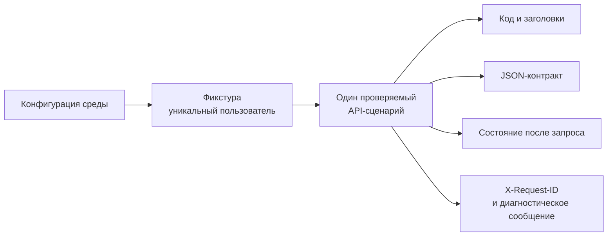

# Практическое задание № 9. API-тесты на Python и диагностика ошибок

## Цель

Научиться переносить ручные проверки REST API из Postman в независимые
автоматизированные тесты на Python, Pytest и Requests, отделять конфигурацию и
подготовку данных от проверяемого поведения, а также диагностировать причину
неуспешного запуска по HTTP-запросу, `X-Request-ID`, журналам приложения и
Chrome DevTools Network.

После выполнения работы вы сможете:

- переводить ручной API-сценарий в читаемый тест Pytest;
- отделять адрес среды, тайм-ауты и учётные данные от тестовых функций;
- использовать отдельную `requests.Session` для каждой роли;
- создавать уникальные тестовые данные через публичный API;
- применять фикстуры Pytest для подготовки пользователя и оператора;
- проверять HTTP-код, заголовки, JSON и сохранённое состояние;
- проверять отсутствие побочного эффекта после отклонённого запроса;
- параметризовать классы эквивалентности и граничные значения;
- добавлять диагностический `X-Request-ID` к каждому запросу;
- находить один запрос в структурированных журналах Nginx и FastAPI;
- исследовать браузерный запрос во вкладке Network;
- запускать один набор тестов на `client-server/fixed` и
  `client-server/buggy`;
- отличать дефект продукта от ошибки теста, тестовых данных или среды.

## Практическое задание

Перенесите ключевые сценарии практической № 8 из Postman в собственный набор
API-тестов на Python. В качестве эталона ожидаемого поведения используйте
`client-server/fixed`. После получения стабильного результата направьте тот же
набор тестов на `client-server/buggy`, исследуйте содержательное расхождение и
подтвердите вывод независимыми источниками.

Каждая автоматизированная проверка должна отвечать на четыре вопроса:

1. какое требование проверяется;
2. какие данные и состояние подготовлены;
3. какое наблюдаемое поведение ожидается;
4. какие сведения помогут понять причину расхождения.

Рабочая ветка личного репозитория:

```text
practice/09-python-api-diagnostics
```

Рекомендуемая структура результата:

```text
mini-tickets-tests/
├── conftest.py
├── pytest.ini
├── requirements.txt
├── support/
│   ├── __init__.py
│   ├── api_client.py
│   └── assertions.py
├── tests/
│   └── api/
│       ├── test_authentication.py
│       ├── test_tickets.py
│       ├── test_validation.py
│       ├── test_access_and_states.py
│       └── test_comments.py
└── docs/
    └── test-reports/
        └── 09/
            ├── README.md
            ├── fixed-result.md
            ├── buggy-investigation.md
            ├── fixed-junit.xml
            ├── buggy-junit.xml
            └── evidence/
                ├── network-investigation.md
                ├── request-correlation.md
                └── relevant-log-lines.jsonl
```

`support` содержит только общий клиент и повторяемые проверки транспортного
контракта. В `tests/api` остаются предусловия, действие и бизнес-ожидание,
которые позволяют понять смысл теста без чтения реализации продукта. Отчёт
сопоставляет результаты двух вариантов и хранит небольшой относящийся к
расследованию фрагмент доказательств.

### Модель независимого теста



Независимость означает, что тест сам создаёт подходящие данные, использует
свою пользовательскую сессию и даёт одинаковый результат отдельно, вместе с
набором и при другом порядке запуска.

### Основной набор сценариев

| Группа | Проверка | Требование | Результат на `fixed` |
|---|---|---|---|
| Авторизация | `/auth/me` без токена | `AUTH-02` | `401`, `WWW-Authenticate: Bearer` |
| Авторизация | Текущий авторизованный пользователь | `AUTH-02` | `200`, публичные поля пользователя |
| Заявки | Создание и последующее чтение | `TICKET-01`, `TICKET-02` | `201 → 200`, одинаковый UUID |
| Границы | Заголовки длиной 2, 3, 80 и 81 | `TICKET-01` | `422`, `201`, `201`, `422` |
| Валидация | Неизвестный приоритет | `TICKET-02` | `422`, список не изменился |
| Доступ | Чужая заявка по известному UUID | `AUTH-03` | `404` |
| Состояние | Прямой переход `new → closed` оператором | `TICKET-04` | `409`, статус остался `new` |
| Фильтр | Только `new` в `?status=new` | `TICKET-05` | `200`, состав соответствует фильтру |
| Комментарий | Фактический автор комментария оператора | `COMMENT-01` | `201`, `author_id` оператора |

На `client-server/buggy` часть этих проверок становится диагностическим
сигналом. Ожидания формируются по требованиям и остаются одинаковыми для обеих
веток.

### Источники ожидаемого поведения

- `docs/ТРЕБОВАНИЯ.md` — бизнес-правила и идентификаторы требований;
- `contract/openapi.json` — методы, параметры, модели и коды;
- практическая № 8 — ручные запросы и наблюдения в Postman;
- `student-template` — начальная структура личного репозитория;
- `variant.json` — архитектура, состояние и версия контракта;
- ответы внешнего REST API — фактическое наблюдаемое поведение;
- журналы Nginx и FastAPI — транспортная и серверная диагностика;
- Chrome DevTools Network — фактический браузерный запрос и ответ.

## Задание (шаги)

### Шаг 1. Сопоставьте ручные проверки и будущие тесты

Откройте собственную Postman-коллекцию из практической № 8 и выберите сценарии
из основной матрицы. Для каждого сценария заполните таблицу в
`docs/test-reports/09/README.md`:

| ID | Требование | Предусловие | Метод и путь | Ожидание | Будущий тест |
|---|---|---|---|---|---|
| `P09-AUTH-01` | `AUTH-02` | Нет Bearer | `GET /api/auth/me` | `401` | `test_me_requires_token` |
| `P09-TICKET-01` | `TICKET-01` | Авторизованный пользователь | `POST /api/tickets` | `201` | `test_create_and_read_ticket` |

Проверка Postman и тест Python используют один контракт, однако отличаются
способом повторения. В Postman значения передаются через переменные коллекции,
а в Pytest их создают фикстуры и возвращаемые значения функций.

### Шаг 2. Подготовьте личный репозиторий

Продолжайте работать в личном репозитории, созданном в практической № 2:

```powershell
$taskTests = Join-Path $env:USERPROFILE 'repos/mini-tickets-tests'
Set-Location -LiteralPath $taskTests
git switch main
git pull --ff-only origin main
git switch -c practice/09-python-api-diagnostics
```

Если репозиторий создаётся впервые, используйте генератор из продуктового
репозитория:

```powershell
$taskProduct = Join-Path $env:USERPROFILE 'repos/testing'
Set-Location -LiteralPath $taskProduct
.\scripts\New-StudentRepo.ps1 -Destination (Join-Path $env:USERPROFILE 'repos/mini-tickets-tests')
```

После создания перейдите в новый каталог и создайте рабочую ветку. Существующие
примеры `tests/api/test_example.py` и `conftest.py` используйте как точку входа
в структуру Pytest.

### Шаг 3. Проверьте Python-среду и зависимости

В корне личного репозитория выполните:

```powershell
py -3.13 --version
if (!(Test-Path -LiteralPath '.venv')) {
    py -3.13 -m venv .venv
}
.\.venv\Scripts\python.exe -m pip install --upgrade pip
.\.venv\Scripts\python.exe -m pip install -r requirements.txt
.\.venv\Scripts\python.exe -c "import pytest, requests; print('pytest', pytest.__version__); print('requests', requests.__version__)"
```

Зафиксируйте фактические версии Python, Pytest и Requests в отчёте. Команда
установки берёт версии библиотек из `requirements.txt`, поэтому локальный и CI
запуски используют один описанный набор зависимостей.

### Шаг 4. Подготовьте обе продуктовые ветки

Обновите отдельные рабочие копии `client-server/fixed` и
`client-server/buggy`:

```powershell
$taskProduct = Join-Path $env:USERPROFILE 'repos/testing'
$taskFixed = Join-Path $taskProduct '.worktrees/client-server-fixed'
$taskBuggy = Join-Path $taskProduct '.worktrees/client-server-buggy'
Set-Location -LiteralPath $taskProduct
git fetch origin

if (!(Test-Path -LiteralPath $taskFixed)) {
    git worktree add --detach $taskFixed origin/client-server/fixed
}
if (!(Test-Path -LiteralPath $taskBuggy)) {
    git worktree add --detach $taskBuggy origin/client-server/buggy
}

git -C $taskFixed merge --ff-only origin/client-server/fixed
git -C $taskBuggy merge --ff-only origin/client-server/buggy
git -C $taskFixed status --short
git -C $taskBuggy status --short
Get-Content -LiteralPath (Join-Path $taskFixed 'variant.json')
Get-Content -LiteralPath (Join-Path $taskBuggy 'variant.json')
```

Запишите Git SHA обеих версий:

```powershell
git -C $taskFixed rev-parse HEAD
git -C $taskBuggy rev-parse HEAD
```

Обе ветки имеют архитектуру `client-server` и контракт `1.0.0`, но разные
значения `state`. Это позволяет сравнивать одну и ту же внешнюю систему с одним
контрактом.

### Шаг 5. Запустите исправленную среду

В отдельном окне PowerShell запустите `client-server/fixed`. В примере
используется идентификатор среды `91`:

```powershell
$taskProduct = Join-Path $env:USERPROFILE 'repos/testing'
$taskFixed = Join-Path $taskProduct '.worktrees/client-server-fixed'
Set-Location -LiteralPath $taskFixed
.\scripts\Start-Student.ps1 -Student 91
Invoke-RestMethod http://localhost:8191/health/ready
docker compose ps
```

Для примера используются:

| Параметр | Значение |
|---|---|
| Внешний HTTP-вход | `http://localhost:8191` |
| PostgreSQL | `localhost:55531` |
| Compose-проект | `mini-student-91` |
| Вариант | `client-server/fixed` |

Если значения заняты другой средой, выберите положительный идентификатор `N`.
HTTP-порт вычисляется как `8100 + N`, порт PostgreSQL — как `55440 + N`, имя
Compose-проекта — как `mini-student-N`. Дальнейшие команды используют
фактический адрес выбранной среды.

### Шаг 6. Создайте структуру API-набора

В личном репозитории создайте каталоги и пакет поддержки:

```powershell
Set-Location -LiteralPath $taskTests
New-Item -ItemType Directory -Path support -Force | Out-Null
New-Item -ItemType Directory -Path tests/api -Force | Out-Null
New-Item -ItemType Directory -Path docs/test-reports/09/evidence -Force | Out-Null
New-Item -ItemType File -Path support/__init__.py -Force | Out-Null
```

Распределите ответственность файлов:

| Файл | Содержание |
|---|---|
| `conftest.py` | Конфигурация и фикстуры клиентов |
| `support/api_client.py` | Один внешний HTTP-клиент на одну сессию |
| `support/assertions.py` | Общие проверки JSON и `X-Request-ID` |
| `tests/api/test_authentication.py` | Авторизация и публичная модель пользователя |
| `tests/api/test_tickets.py` | Позитивное создание и чтение |
| `tests/api/test_validation.py` | Границы и отклонённые входные данные |
| `tests/api/test_access_and_states.py` | Владение, переходы и фильтрация |
| `tests/api/test_comments.py` | Автор комментария разных ролей |

Имена описывают проверяемое поведение. Такая структура помогает открыть
падающий тест и быстро найти относящиеся к нему фикстуры и помощники.

### Шаг 7. Вынесите конфигурацию из тестовых функций

Расширьте `conftest.py`. Адрес, тайм-аут, пароль и учётная запись оператора
читаются из переменных среды:

```python
"""Общая конфигурация и независимые HTTP-сессии API-тестов."""

import os

import pytest


@pytest.fixture(scope="session")
def base_url() -> str:
    """Вернуть внешний адрес выбранной среды без завершающего слеша."""
    return os.getenv("BASE_URL", "http://127.0.0.1:8000").rstrip("/")


@pytest.fixture(scope="session")
def api_timeout() -> float:
    """Вернуть единый тайм-аут HTTP-запроса."""
    return float(os.getenv("API_TIMEOUT_SECONDS", "10"))


@pytest.fixture(scope="session")
def user_password() -> str:
    """Вернуть пароль создаваемых через API пользователей."""
    return os.getenv("TEST_USER_PASSWORD", "LabPassword1!")


@pytest.fixture(scope="session")
def operator_credentials() -> tuple[str, str]:
    """Вернуть учётные данные seed-оператора локальной среды."""
    return (
        os.getenv("TEST_OPERATOR_EMAIL", "operator@example.test"),
        os.getenv("TEST_OPERATOR_PASSWORD", "LabPassword1!"),
    )
```

В тестовой функции остаётся бизнес-сценарий. Смена порта выполняется одной
переменной `BASE_URL`, а смена тайм-аута — одной переменной
`API_TIMEOUT_SECONDS`.

### Шаг 8. Реализуйте минимальный API-клиент

Создайте `support/api_client.py`:

```python
"""Небольшой внешний REST-клиент для независимых API-тестов."""

import json
from uuid import uuid4

import requests


class ApiClient:
    """Хранить HTTP-сессию одной роли и общие правила отправки запросов."""

    sensitive_keys = {
        "access_token",
        "authorization",
        "password",
        "password_hash",
        "token_hash",
    }

    def __init__(self, base_url: str, timeout: float) -> None:
        """Подготовить адрес API, тайм-аут и пустую пользовательскую сессию."""
        self.base_url = base_url.rstrip("/")
        self.timeout = timeout
        self.session = requests.Session()
        self.user: dict | None = None

    def request(self, method: str, path: str, **kwargs) -> requests.Response:
        """Отправить запрос с уникальным идентификатором для диагностики."""
        if not path.startswith("/"):
            raise ValueError("Путь API должен начинаться с /")

        headers = dict(kwargs.pop("headers", {}))
        headers.setdefault("X-Request-ID", f"p09-{uuid4().hex[:24]}")

        return self.session.request(
            method=method,
            url=f"{self.base_url}/api{path}",
            headers=headers,
            timeout=self.timeout,
            **kwargs,
        )

    def login(self, email: str, password: str) -> "ApiClient":
        """Получить Bearer и сохранить его только в текущей HTTP-сессии."""
        response = self.request(
            "POST",
            "/auth/login",
            json={"email": email, "password": password},
        )
        assert response.status_code == 200, self.describe(response)
        token = response.json()["access_token"]
        self.session.headers["Authorization"] = f"Bearer {token}"
        return self

    def register_and_login(self, password: str) -> "ApiClient":
        """Создать уникального пользователя и авторизовать его сессию."""
        email = f"p09-{uuid4().hex}@example.test"
        response = self.request(
            "POST",
            "/auth/register",
            json={"email": email, "password": password},
        )
        assert response.status_code == 201, self.describe(response)
        self.user = response.json()
        return self.login(email, password)

    def create_ticket(
        self,
        title: str | None = None,
        priority: str = "normal",
    ) -> dict:
        """Создать уникальную заявку как предусловие другого теста."""
        body = {
            "title": title or f"P09 заявка {uuid4().hex}",
            "priority": priority,
        }
        response = self.request("POST", "/tickets", json=body)
        assert response.status_code == 201, self.describe(response)
        return response.json()

    @staticmethod
    def redact(value):
        """Рекурсивно скрыть чувствительные значения диагностического JSON."""
        if isinstance(value, dict):
            return {
                key: (
                    "[REDACTED]"
                    if key.lower() in ApiClient.sensitive_keys
                    else ApiClient.redact(item)
                )
                for key, item in value.items()
            }
        if isinstance(value, list):
            return [ApiClient.redact(item) for item in value]
        return value

    @staticmethod
    def describe(response: requests.Response) -> str:
        """Сформировать сообщение с безопасным фрагментом ответа."""
        request_id = response.request.headers.get("X-Request-ID", "missing")
        try:
            payload = ApiClient.redact(response.json())
            response_summary = json.dumps(payload, ensure_ascii=False)[:500]
        except requests.exceptions.JSONDecodeError:
            response_summary = f"<не-JSON: {len(response.content)} байт>"
        return (
            f"{response.request.method} {response.request.url}; "
            f"status={response.status_code}; request_id={request_id}; "
            f"body={response_summary}"
        )

    def close(self) -> None:
        """Закрыть соединения HTTP-сессии после теста."""
        self.session.close()
```

Клиент добавляет `/api` централизованно, задаёт тайм-аут и генерирует допустимый
идентификатор формата `[a-zA-Z0-9_-]{1,64}`. Диагностическое сообщение содержит
метод, URL, код, `request_id` и ограниченный фрагмент ответа. Перед формированием
строки значения чувствительных JSON-полей заменяются на `[REDACTED]`, а
Bearer-заголовок в сообщение не включается.

### Шаг 9. Добавьте повторяемые проверки ответа

Создайте `support/assertions.py`:

```python
"""Повторяемые проверки транспортного контракта Mini Tickets API."""

import requests

from support.api_client import ApiClient


def assert_request_id(response: requests.Response) -> str:
    """Проверить сохранение клиентского X-Request-ID в ответе сервера."""
    sent = response.request.headers.get("X-Request-ID")
    received = response.headers.get("X-Request-ID")
    assert sent, ApiClient.describe(response)
    assert received == sent, ApiClient.describe(response)
    return received


def assert_json_response(
    response: requests.Response,
    expected_status: int,
) -> dict | list:
    """Проверить код, JSON Content-Type, request ID и вернуть разобранное тело."""
    assert response.status_code == expected_status, ApiClient.describe(response)
    content_type = response.headers.get("Content-Type", "")
    assert content_type.startswith("application/json"), ApiClient.describe(response)
    assert_request_id(response)
    return response.json()


def assert_error_response(
    response: requests.Response,
    expected_status: int,
) -> dict:
    """Проверить единый конверт ошибки и корреляцию тела с заголовком."""
    body = assert_json_response(response, expected_status)
    assert isinstance(body, dict), ApiClient.describe(response)
    assert set(body) == {"error"}, ApiClient.describe(response)
    assert isinstance(body["error"].get("message"), str)
    assert body["error"]["message"]
    assert body["error"]["request_id"] == response.headers["X-Request-ID"]
    return body
```

Общая функция проверяет одинаковые свойства ответа. Тестовая функция после неё
проверяет конкретное бизнес-правило: пользователя, автора, статус, фильтр или
неизменность списка.

### Шаг 10. Создайте фикстуры независимых ролей

Добавьте в `conftest.py` импорты и фикстуры:

```python
from collections.abc import Callable, Iterator

from support.api_client import ApiClient


@pytest.fixture
def client_factory(
    base_url: str,
    api_timeout: float,
) -> Iterator[Callable[[], ApiClient]]:
    """Создавать отдельные HTTP-сессии и закрывать их после теста."""
    clients: list[ApiClient] = []

    def create() -> ApiClient:
        client = ApiClient(base_url, api_timeout)
        clients.append(client)
        return client

    yield create

    for client in clients:
        client.close()


@pytest.fixture
def anonymous_api(client_factory) -> ApiClient:
    """Вернуть клиента без Bearer-сессии."""
    return client_factory()


@pytest.fixture
def user_api(client_factory, user_password: str) -> ApiClient:
    """Создать уникального пользователя и его авторизованную сессию."""
    return client_factory().register_and_login(user_password)


@pytest.fixture
def other_user_api(client_factory, user_password: str) -> ApiClient:
    """Создать второго независимого пользователя для проверки владения."""
    return client_factory().register_and_login(user_password)


@pytest.fixture
def operator_api(client_factory, operator_credentials) -> ApiClient:
    """Создать отдельную сессию seed-оператора."""
    email, password = operator_credentials
    return client_factory().login(email, password)
```

Фикстуры имеют область одной тестовой функции. Каждый тест получает новый email
и отдельные сессии. Оператор работает с уникальными заявками текущего теста,
поэтому данные других проверок не влияют на результат.

### Шаг 11. Перенесите проверки авторизации

Создайте `tests/api/test_authentication.py`:

```python
"""Проверки Bearer-сессии и публичной модели пользователя."""

import pytest

from support.assertions import assert_error_response, assert_json_response


@pytest.mark.api
@pytest.mark.requirement("AUTH-02")
def test_me_requires_token(anonymous_api):
    """Вернуть 401 и Bearer challenge для запроса без сессии."""
    response = anonymous_api.request("GET", "/auth/me")
    assert_error_response(response, 401)
    assert response.headers.get("WWW-Authenticate") == "Bearer"


@pytest.mark.api
@pytest.mark.requirement("AUTH-02")
def test_me_returns_current_public_user(user_api):
    """Вернуть пользователя, которому принадлежит предъявленный токен."""
    response = user_api.request("GET", "/auth/me")
    body = assert_json_response(response, 200)

    assert body == user_api.user
    assert set(body) == {"id", "email", "role"}
    assert body["role"] == "user"
    assert "password" not in body
    assert "password_hash" not in body
```

Первый тест является негативным и не зависит от регистрации. Второй получает
авторизацию из фикстуры и проверяет только поведение `/auth/me`.

### Шаг 12. Автоматизируйте создание и чтение заявки

Создайте `tests/api/test_tickets.py`:

```python
"""Позитивные проверки создания и чтения заявки."""

from uuid import uuid4

import pytest

from support.assertions import assert_json_response


@pytest.mark.api
@pytest.mark.requirement("TICKET-01")
@pytest.mark.requirement("TICKET-02")
def test_create_and_read_ticket(user_api):
    """Сопоставить POST, карточку и отфильтрованный список одной заявки."""
    title = f"P09 позитивная заявка {uuid4().hex}"
    created_response = user_api.request(
        "POST",
        "/tickets",
        json={"title": title, "priority": "high"},
    )
    created = assert_json_response(created_response, 201)

    assert set(created) == {
        "id",
        "author_id",
        "title",
        "priority",
        "status",
        "created_at",
    }
    assert created["author_id"] == user_api.user["id"]
    assert created["title"] == title
    assert created["priority"] == "high"
    assert created["status"] == "new"

    detail_response = user_api.request("GET", f"/tickets/{created['id']}")
    detail = assert_json_response(detail_response, 200)
    assert detail == created

    list_response = user_api.request("GET", "/tickets?status=new")
    tickets = assert_json_response(list_response, 200)
    assert created["id"] in {ticket["id"] for ticket in tickets}
    assert all(ticket["status"] == "new" for ticket in tickets)
```

В тесте видны действие и ожидания. Создание через `create_ticket()` здесь не
используется, поскольку именно `POST /tickets` является проверяемой операцией.

### Шаг 13. Параметризуйте границы заголовка

Создайте `tests/api/test_validation.py` и перенесите граничную таблицу из
практической № 8:

```python
"""Проверки границ и отклонённых входных данных заявки."""

import pytest

from support.assertions import assert_error_response, assert_json_response


@pytest.mark.api
@pytest.mark.requirement("TICKET-01")
@pytest.mark.parametrize(
    ("length", "expected_status"),
    [(2, 422), (3, 201), (80, 201), (81, 422)],
    ids=["below-min", "min", "max", "above-max"],
)
def test_ticket_title_boundaries(user_api, length, expected_status):
    """Проверить соседние значения обеих границ заголовка."""
    response = user_api.request(
        "POST",
        "/tickets",
        json={"title": "x" * length, "priority": "normal"},
    )

    if expected_status == 201:
        body = assert_json_response(response, 201)
        assert len(body["title"]) == length
        assert body["status"] == "new"
    else:
        body = assert_error_response(response, 422)
        assert body["error"].get("fields")
```

Каждый параметр является отдельным тестовым случаем и получает отдельную
фикстуру `user_api`. В отчёте Pytest будут видны идентификаторы `below-min`,
`min`, `max` и `above-max`.

### Шаг 14. Проверьте негативный запрос и отсутствие побочного эффекта

Добавьте в `tests/api/test_validation.py`:

```python
@pytest.mark.api
@pytest.mark.requirement("TICKET-02")
def test_unknown_priority_is_rejected_without_side_effect(user_api):
    """Отклонить неизвестный приоритет и сохранить исходный список."""
    before_response = user_api.request("GET", "/tickets")
    before = assert_json_response(before_response, 200)

    response = user_api.request(
        "POST",
        "/tickets",
        json={
            "title": "P09 неизвестный приоритет",
            "priority": "urgent",
        },
    )
    assert_error_response(response, 422)

    after_response = user_api.request("GET", "/tickets")
    after = assert_json_response(after_response, 200)
    assert after == before
```

Значимый результат состоит из двух утверждений: сервер вернул `422`, а
некорректная заявка не появилась. Только проверка кода могла бы пропустить
частично выполненную операцию.

### Шаг 15. Проверьте доступ двумя пользовательскими сессиями

Создайте `tests/api/test_access_and_states.py`:

```python
"""Проверки владения, ролей, состояний и фильтра списка."""

import pytest

from support.assertions import assert_error_response, assert_json_response


@pytest.mark.api
@pytest.mark.requirement("AUTH-03")
def test_user_cannot_read_another_users_ticket(user_api, other_user_api):
    """Скрыть существование чужой заявки за единым ответом 404."""
    ticket = user_api.create_ticket("P09 заявка первого пользователя")

    response = other_user_api.request("GET", f"/tickets/{ticket['id']}")
    body = assert_error_response(response, 404)

    assert "author_id" not in body["error"]
    assert "title" not in body["error"]
```

Две фикстуры создают два разных email, Bearer-токена и `requests.Session`.
Известный UUID передаётся только как вход теста и не меняет правило владения.

### Шаг 16. Проверьте запрещённый переход состояния

Добавьте в `tests/api/test_access_and_states.py`:

```python
@pytest.mark.api
@pytest.mark.requirement("TICKET-04")
def test_operator_cannot_move_new_ticket_directly_to_closed(
    user_api,
    operator_api,
):
    """Отклонить переход new → closed даже для роли operator."""
    ticket = user_api.create_ticket("P09 проверка перехода")
    path = f"/tickets/{ticket['id']}"

    response = operator_api.request(
        "PUT",
        path + "/status",
        json={"status": "closed"},
    )
    assert_error_response(response, 409)

    detail_response = user_api.request("GET", path)
    detail = assert_json_response(detail_response, 200)
    assert detail["status"] == "new"
```

Оператор нужен для достижения бизнес-проверки перехода. С пользовательским
токеном запрос завершился бы на проверке роли с `403` и не проверил бы правило
`new → closed`.

### Шаг 17. Проверяйте состав фильтра, а не только код

Добавьте ещё один тест:

```python
@pytest.mark.api
@pytest.mark.requirement("TICKET-05")
def test_new_filter_contains_only_new_tickets(user_api, operator_api):
    """Вернуть новую заявку и исключить активную заявку того же автора."""
    new_ticket = user_api.create_ticket("P09 новая для фильтра")
    active_ticket = user_api.create_ticket("P09 активная для фильтра")

    transition = operator_api.request(
        "PUT",
        f"/tickets/{active_ticket['id']}/status",
        json={"status": "active"},
    )
    transition_body = assert_json_response(transition, 200)
    assert transition_body["status"] == "active"

    response = user_api.request("GET", "/tickets?status=new")
    tickets = assert_json_response(response, 200)
    returned_ids = {ticket["id"] for ticket in tickets}

    assert returned_ids == {new_ticket["id"]}
    assert active_ticket["id"] not in returned_ids
    assert all(ticket["status"] == "new" for ticket in tickets)
```

Уникальный пользователь создаётся для этого теста, поэтому точное множество из
одного UUID является устойчивым ожиданием. Проверка только `200` не обнаружила
бы неверное содержимое ответа.

### Шаг 18. Проверьте фактического автора комментария

Создайте `tests/api/test_comments.py`:

```python
"""Проверки комментариев при взаимодействии разных ролей."""

import pytest

from support.assertions import assert_json_response


@pytest.mark.api
@pytest.mark.requirement("COMMENT-01")
def test_operator_comment_keeps_operator_as_author(user_api, operator_api):
    """Сохранить действующего автора, а не владельца заявки."""
    ticket = user_api.create_ticket("P09 комментарий оператора")

    me_response = operator_api.request("GET", "/auth/me")
    operator = assert_json_response(me_response, 200)

    comment_response = operator_api.request(
        "POST",
        f"/tickets/{ticket['id']}/comments",
        json={"text": "P09 отвечает оператор"},
    )
    comment = assert_json_response(comment_response, 201)

    assert comment["ticket_id"] == ticket["id"]
    assert comment["author_id"] == operator["id"]
    assert comment["author_id"] != ticket["author_id"]
```

Проверка использует три разных идентификатора: заявки, владельца и действующего
автора комментария. Это точнее утверждения о наличии произвольного
`author_id`.

### Шаг 19. Проверьте маркировку и читаемость набора

У каждого API-теста должны быть:

- `@pytest.mark.api`;
- один или несколько `@pytest.mark.requirement("...")`;
- имя, описывающее наблюдаемое поведение;
- docstring с ожидаемым правилом;
- диагностическое сообщение для утверждений, связанных с ответом.

Убедитесь, что `pytest.ini` объявляет маркеры:

```ini
[pytest]
addopts = --import-mode=importlib
testpaths = tests
pythonpath = .
markers =
    requirement(id): требование из задания
    api: проверка REST API
    ui: проверка интерфейса
```

Просмотрите список собранных API-тестов:

```powershell
Set-Location -LiteralPath $taskTests
.\.venv\Scripts\python.exe -m pytest tests/api -m api --collect-only -q
```

Сборка подтверждает импорты, имена модулей, фикстуры и параметры до обращения к
продукту.

### Шаг 20. Запустите набор на `client-server/fixed`

Укажите адрес исправленной среды и выполните только API-набор:

```powershell
Set-Location -LiteralPath $taskTests
$env:BASE_URL = 'http://localhost:8191'
$env:API_TIMEOUT_SECONDS = '10'
.\.venv\Scripts\python.exe -m pytest tests/api -m api -vv --tb=short `
    --junitxml=docs/test-reports/09/fixed-junit.xml
```

При другом идентификаторе среды замените `BASE_URL` фактическим адресом. Для
эталонной версии ожидается успешный результат всех описанных проверок.

Запишите в `fixed-result.md`:

- ветку и Git SHA продукта;
- значение `BASE_URL`;
- версии Python, Pytest и Requests;
- команду запуска;
- число собранных и выполненных случаев;
- итог каждого файла;
- первый и последний `X-Request-ID` из диагностических ответов;
- вывод о стабильности эталонного запуска.

### Шаг 21. Подтвердите независимость тестов

Запустите несколько сценариев отдельно:

```powershell
.\.venv\Scripts\python.exe -m pytest `
    tests/api/test_authentication.py::test_me_requires_token -vv

.\.venv\Scripts\python.exe -m pytest `
    tests/api/test_access_and_states.py::test_new_filter_contains_only_new_tickets -vv

.\.venv\Scripts\python.exe -m pytest tests/api/test_validation.py -vv
```

Затем повторите весь API-набор. Отдельный запуск не должен зависеть от данных,
созданных предыдущим тестом. Уникальный пользователь и новая сессия каждой
фикстуры обеспечивают повторяемое предусловие.

Для самопроверки просмотрите тесты и найдите скрытые зависимости:

- UUID, скопированный из другого теста;
- общий изменяемый токен на уровне модуля;
- ожидание определённого порядка запуска;
- заранее созданная заявка без явного предусловия;
- сравнение общего списка оператора с фиксированным количеством записей.

Перепишите найденную связь через фикстуру, уникальные данные или возвращаемое
значение подготовительной функции.

### Шаг 22. Сохраните диагностический запрос исправленной версии

Выберите один тест, например проверку неизвестного приоритета. Добавьте в отчёт
значение `X-Request-ID` из отправленного запроса. Его можно получить из
подготовленного объекта Requests:

```python
request_id = response.request.headers["X-Request-ID"]
assert response.headers["X-Request-ID"] == request_id
```

Зафиксируйте безопасную карточку:

```markdown
## P09-TICKET-NEG-01

- Вариант: `client-server/fixed`
- Метод и путь: `POST /api/tickets`
- Ожидаемый код: `422`
- Фактический код: `422`
- X-Request-ID: `p09-...`
- Состояние до: список UUID `[...]`
- Состояние после: тот же список UUID
- Итог: проверка пройдена
```

Такой формат связывает автоматизированное утверждение с серверным наблюдением,
не сохраняя пароль или Bearer-токен.

### Шаг 23. Запустите `client-server/buggy`

В другом окне PowerShell запустите дефектный вариант. В примере используется
идентификатор `92`, поэтому внешний адрес равен `http://localhost:8192`:

```powershell
$taskProduct = Join-Path $env:USERPROFILE 'repos/testing'
$taskBuggy = Join-Path $taskProduct '.worktrees/client-server-buggy'
Set-Location -LiteralPath $taskBuggy
$env:LAB_DEFECTS = 'all'
.\scripts\Start-Student.ps1 -Student 92
Invoke-RestMethod http://localhost:8192/health/ready
docker compose ps
```

Для выбранного другого `N` используйте рассчитанный HTTP-порт. Зафиксируйте
`variant.json`, Git SHA, `LAB_DEFECTS` и фактический адрес в
`buggy-investigation.md`.

### Шаг 24. Выполните тот же набор на `buggy`

Вернитесь в личный репозиторий, измените только адрес среды и выполните ту же
команду:

```powershell
Set-Location -LiteralPath $taskTests
$env:BASE_URL = 'http://localhost:8192'
.\.venv\Scripts\python.exe -m pytest tests/api -m api -vv --tb=short `
    --junitxml=docs/test-reports/09/buggy-junit.xml
```

Сохраните вывод в отдельный файл при необходимости подробной вычитки:

```powershell
.\.venv\Scripts\python.exe -m pytest tests/api -m api -vv --tb=short 2>&1 |
    Tee-Object -FilePath docs/test-reports/09/buggy-pytest.txt
```

Код тестов, фикстуры и assertions остаются теми же, что прошли на `fixed`.
Сравниваются две реализации одного контракта, а не два разных набора ожиданий.

### Шаг 25. Выберите одно содержательное падение

Из результата `buggy` выберите тест, у которого:

- запрос действительно был отправлен;
- readiness среды подтверждён;
- предусловия теста успешно созданы;
- фактический ответ противоречит требованию;
- ошибка находится в assertion проверяемого поведения;
- диагностическое сообщение содержит `X-Request-ID`.

Например, отдельно повторите проверку неизвестного приоритета:

```powershell
.\.venv\Scripts\python.exe -m pytest `
    tests/api/test_validation.py::test_unknown_priority_is_rejected_without_side_effect `
    -vv --tb=long
```

Сопоставьте traceback с фазой теста:

| Фаза | Пример | Значение |
|---|---|---|
| Collection | Ошибка импорта | Python ещё не обратился к API |
| Setup | Фикстура не зарегистрировала пользователя | Предусловие или среда не готовы |
| Call | Получен `201` вместо `422` | Расхождение проверяемого поведения |
| Teardown | Ошибка закрытия или очистки | Основное assertion могло уже пройти |

В расследование переносится не весь traceback, а ключевая строка assertion,
ожидаемый и фактический результат, метод, путь и `X-Request-ID`.

### Шаг 26. Изолируйте один учебный дефект

Для более точного повторения оставьте включённой одну выбранную категорию. В
окне `client-server/buggy` установите, например:

```powershell
$env:LAB_DEFECTS = 'D02'
.\scripts\Start-Student.ps1 -Student 92
Invoke-RestMethod http://localhost:8192/health/ready
```

Повторите сначала выбранный тест, затем весь API-набор. Сравните результаты
режимов `all` и `D02`. Изолированный запуск помогает установить, какое
отклонение вызывает конкретное падение, а какие проверки остаются зелёными.

Для API доступны детерминированные категории `D01`–`D06`:

| Категория | Наблюдаемое правило |
|---|---|
| `D01` | Верхняя граница заголовка |
| `D02` | Закрытый набор приоритетов и отсутствие записи |
| `D03` | Владение и скрытие чужой заявки |
| `D04` | Переход `new → closed` |
| `D05` | Серверная фильтрация списка |
| `D06` | Автор комментария оператора |

`D07` и `D08` относятся к отображению интерфейса. API-набор этой работы
сосредоточен на внешнем REST-контракте, а DevTools используется для связи
браузерного действия с серверным ответом.

### Шаг 27. Найдите Python-запрос в журналах

Скопируйте `X-Request-ID` из диагностического сообщения упавшего теста. В
каталоге запущенной продуктовой ветки выполните:

```powershell
$requestId = 'p09-замените-на-фактическое-значение'

docker compose -p mini-student-92 logs web --since 30m |
    Select-String -SimpleMatch $requestId

docker compose -p mini-student-92 exec -T app `
    grep -F -- $requestId /app/logs/all.log
```

При другом идентификаторе среды замените имя Compose-проекта. В Nginx ожидается
JSON-строка с полями:

```text
service, event, request_id, method, path, status,
request_time_seconds, upstream_response_time_seconds, bytes_sent
```

В FastAPI ожидается строка с полями:

```text
service, event, request_id, method, path, status, duration_ms, run_id
```

Сопоставьте:

- одинаковый `request_id`;
- метод и нормализованный путь;
- HTTP-код;
- клиентское и серверное время;
- последовательность Nginx → FastAPI → ответ тесту.

Действующий формат журналов сохраняет диагностические координаты, но не тела,
query string, `Authorization`, Cookie и пароль. Поэтому лог подтверждает факт
обработки и код, а входные данные подтверждаются подготовленным запросом
Requests или вкладкой Network.

Сохраните только относящиеся строки в
`docs/test-reports/09/evidence/relevant-log-lines.jsonl`.

### Шаг 28. Исследуйте связанный запрос в Chrome DevTools Network

Откройте `http://localhost:8192` в Chrome и инструменты разработчика:

```text
F12 → Network → Fetch/XHR
```

Используйте seed-пользователя:

```text
anna@example.test
LabPassword1!
```

После входа выберите фильтр «Новая». Найдите запрос:

```text
GET /api/tickets?status=new
```

В карточке Network изучите:

- Request Method и полный Request URL;
- Query String Parameters;
- Request Headers и наличие Bearer-сессии;
- Status Code;
- Response Headers, особенно `X-Request-ID`;
- Preview/Response и фактические статусы элементов;
- Timing и размер ответа;
- Initiator, связывающий запрос с действием интерфейса.

В seed-данных пользователя Anna есть новая и активная заявки. На исправленной
версии фильтр возвращает только `new`. При активной категории `D05` ответ
дефектной версии может содержать также `active`. Если Network уже показывает
лишний объект, интерфейс отображает полученный ответ, а источник расхождения
находится на стороне API-фильтрации.

Браузерный клиент сам не задаёт `X-Request-ID`; Nginx создаёт безопасное
значение, передаёт его FastAPI и возвращает в response header. Найдите этот ID в
журналах теми же командами и оформите
`docs/test-reports/09/evidence/network-investigation.md`:

```markdown
## Исследование фильтра через Network

- Действие: выбор фильтра «Новая»
- Метод и URL: `GET /api/tickets?status=new`
- Код: `200`
- X-Request-ID: `...`
- Статусы объектов в Response: `new`, `active`
- Строка Nginx: `...`
- Строка FastAPI: `...`
- Вывод: серверный ответ нарушает TICKET-05
```

Повторите наблюдение на `http://localhost:8191`, чтобы сопоставить одинаковое
действие с эталонной версией.

### Шаг 29. Классифицируйте причину ошибки

Используйте несколько независимых признаков:

| Наблюдение | Категория | Следующая проверка |
|---|---|---|
| `/health/ready` недоступен, запрос не дошёл до Nginx | Среда | Порт, `docker compose ps`, журнал контейнера |
| Pytest сообщает ImportError на collection | Тестовый код | Импорт, venv, структура пакета |
| Фикстура получила неожиданный ответ регистрации | Предусловие или среда | `BASE_URL`, состояние API, response и request ID |
| Тест падает одинаково на `fixed` и `buggy` | Тест или неверное ожидание | Требование, OpenAPI, данные и assertion |
| Тест проходит на `fixed`, падает на `buggy` в бизнес-assertion | Вероятный дефект продукта | Ручное повторение, журнал и Network |
| Python и Postman отправляют разные данные | Ошибка тестовой реализации | Prepared request, JSON, headers, переменные |
| API-ответ корректен, а UI показывает другое | Интерфейсное поведение | Network response и отображённое состояние |

Заключение «дефект продукта» подкрепите цепочкой:

```text
требование
→ тест проходит на fixed
→ тот же тест падает на buggy
→ фактический запрос подтверждён
→ request ID найден в Nginx и FastAPI
→ ручное или браузерное наблюдение воспроизводит расхождение
```

Если цепочка указывает на тест или среду, исправьте соответствующую причину и
повторите сравнение. В отчёте сохраните первоначальный симптом и итоговый вывод.

### Шаг 30. Перехватите запрос через Charles или Fiddler

Выберите установленный HTTP-прокси и настройте на него Postman либо отдельный
профиль браузера. Для HTTPS-сценария используйте локальный учебный сертификат
прокси в выбранном профиле. Перехватите вход и один `GET /api/tickets`, затем
заполните `docs/test-reports/09/proxy-capture.md`:

| Поле | Наблюдение |
|---|---|
| Инструмент и версия | — |
| Клиент и настройки proxy | — |
| Метод и полный URL | — |
| Request headers | `Authorization: [REDACTED]` |
| Request body | — |
| Response status и headers | — |
| Response JSON | — |
| Timing | — |
| `X-Request-ID` | — |
| Строка Nginx | — |
| Строка FastAPI | — |

Сравните источники доказательств:

| Источник | Что наблюдает | Для какой диагностики полезен |
|---|---|---|
| Chrome DevTools Network | обмен конкретной вкладки браузера | UI, инициатор, timing и фактический ответ |
| Charles/Fiddler | трафик настроенного клиента через proxy | сравнение клиентов, заголовков и повтор запроса |
| Nginx log | вход на серверную границу | маршрут, код, duration и request ID |
| FastAPI log | обработку приложения | endpoint, код, duration и прикладной контекст |

После фиксации наблюдений восстановите системные и клиентские настройки proxy.
Если сертификат создавался только для этой работы, удалите его из выбранного
профиля. В отчёте сохраните текстовые поля и безопасный снимок с замаскированным
Bearer, а не действующие секреты.

### Шаг 31. Подготовьте итоговый отчёт

Оформите `docs/test-reports/09/README.md`:

```markdown
# API-тесты на Python и диагностика ошибок

## Версии продукта и адреса сред
## Python-зависимости и команда запуска
## Карта Postman → Pytest
## Структура клиента и фикстур
## Набор независимых тестов
## Результат client-server/fixed
## Результат client-server/buggy
## Изолированное повторение
## Корреляция X-Request-ID
## Исследование DevTools Network
## Перехват через Charles/Fiddler
## Классификация причины
## Итоговый вывод и остаточные риски
```

Для выбранного падения заполните таблицу:

| Поле | Значение |
|---|---|
| Требование | — |
| Тест | — |
| Предусловия | — |
| Метод и URL | — |
| Ожидаемый результат | — |
| Фактический результат | — |
| Результат на `fixed` | — |
| Результат на `buggy` | — |
| `X-Request-ID` | — |
| Подтверждение Nginx | — |
| Подтверждение FastAPI | — |
| Наблюдение Network/Postman | — |
| Классификация | Продукт / тест / данные / среда |
| Обоснование | — |

Итоговый вывод перечисляет реально автоматизированные правила, устойчивость
набора, найденное расхождение и границы собранных доказательств.

### Шаг 32. Проверьте артефакты и остановите среды

Просмотрите файлы отчёта и диагностические сообщения. В артефактах сохраняются
методы, пути, коды, безопасные JSON-ответы, идентификаторы запросов и выбранные
строки логов. Bearer-токены и пароли заменяются на `[REDACTED]`.

Остановите обе среды в их окнах PowerShell:

```powershell
# В окне client-server/fixed
docker compose stop

# В окне client-server/buggy
docker compose stop
```

`stop` сохраняет тома с базой и журналами для последующего исследования.

### Шаг 33. Зафиксируйте результат в Git

В личном репозитории проверьте состав изменений:

```powershell
Set-Location -LiteralPath $taskTests
git status --short
git diff --check
git diff -- tests support conftest.py docs/test-reports/09
```

Зафиксируйте рабочую ветку:

```powershell
git add conftest.py pytest.ini requirements.txt support tests/api docs/test-reports/09
git commit -m 'Добавлены API-тесты и диагностика ошибок'
git push -u origin practice/09-python-api-diagnostics
```

При использовании GitLab отправьте тот же коммит во второй remote:

```powershell
git push -u gitlab practice/09-python-api-diagnostics
```

В описании PR/MR перечислите автоматизированные требования, результаты `fixed`
и `buggy`, выбранное расследование и путь к отчёту.

Для этого SHA выполните [общий цикл проверки CI](README.md#общий-цикл-результата):
сопоставьте GitHub Actions и GitLab CI, их журналы и опубликованные артефакты.

## Подсказки по ключевым частям

### Тест описывает поведение, а клиент — способ обращения

`ApiClient` знает, как добавить `/api`, тайм-аут, `X-Request-ID` и Bearer текущей
сессии. Тест знает, почему отправляется запрос и какие бизнес-свойства ответа
значимы. Такое разделение оставляет тест читаемым и уменьшает дублирование.

### `requests.Session` представляет одну роль

Authorization хранится в заголовках конкретной сессии. Владелец, посторонний
пользователь и оператор получают разные объекты `ApiClient`. Это предотвращает
случайную замену токена между шагами сценария.

### Фикстура подготавливает предусловие

Регистрация и вход в `user_api` являются подготовкой. Создание заявки остаётся
внутри теста, когда проверяется сам `POST`, и выносится в `create_ticket`, когда
заявка служит входом для доступа, перехода или комментария.

### Уникальные данные дают независимость

UUID в email и заголовке отделяет запуски. Тест обращается только к созданным им
ресурсам и сравнивает UUID, а не глобальное количество записей всей базы.

### Тайм-аут является частью надёжности теста

Явный `timeout=10` ограничивает ожидание HTTP-клиента. Connection error и
timeout сообщают о доступности среды или зависимости, а HTTP-код сообщает о
результате обработанного сервером запроса.

### Assertion должен показывать полезный контекст

Сообщение `ApiClient.describe(response)` содержит метод, URL, код, request ID и
короткое тело. Этого достаточно, чтобы начать расследование и найти серверный
лог, не выводя Authorization.

### Проверка кода является началом, а не концом

Ответ `201` дополняется проверкой автора, статуса, приоритета и повторным GET.
Ответ `422` дополняется проверкой ErrorOut и неизменностью списка. Ответ `200`
фильтра дополняется проверкой каждого элемента.

### Параметризация сохраняет одну идею теста

Значения 2/3 и 80/81 принадлежат одному правилу длины. `pytest.mark.parametrize`
создаёт отдельный результат для каждого значения и оставляет логику проверки в
одном месте.

### Подготовительный assert и бизнес-assert имеют разные роли

Assert внутри `register_and_login` подтверждает жизнеспособность предусловия.
Assert в тестовой функции проверяет заявленное требование. Pytest показывает
фазу `setup` или `call`, что помогает различать подготовку и сам сценарий.

### `X-Request-ID` связывает источники

Клиент отправляет допустимый ID, Nginx сохраняет его, FastAPI добавляет в лог и
ответ. Одинаковое значение соединяет traceback Pytest, response headers и две
строки серверных журналов.

### Request ID ошибки проверяется дважды

Для ErrorOut идентификатор присутствует и в заголовке, и в
`error.request_id`. Совпадение показывает, что клиентский ответ и серверная
диагностика относятся к одной обработке.

### Журнал подтверждает только записанные свойства

Строка Nginx подтверждает метод, путь, код и длительность. Она не содержит query
string или JSON-тело. Значение фильтра и payload подтверждаются prepared request
Requests, Postman Console или Chrome Network.

### Prepared request показывает фактическую отправку

После ответа доступны:

```python
response.request.method
response.request.url
response.request.headers["X-Request-ID"]
response.request.body
```

При сохранении доказательства маскируйте `Authorization` и пароль. Сравнение
prepared request с ожидаемым запросом помогает выявить ошибку самого теста.

### Проверка побочного эффекта использует состояние до и после

Для неизвестного приоритета сравниваются два списка одной уникальной сессии.
Если сервер вернул ошибку после записи, различие UUID обнаружит нарушенную
атомарность.

### Две реализации сравниваются одним тестом

`BASE_URL` переключает среду, а ожидания остаются связанными с требованиями.
Прохождение на `fixed` подтверждает жизнеспособность теста; расхождение на
`buggy` становится предметом диагностики.

### Один изолированный дефект упрощает причинную связь

Режим `LAB_DEFECTS=D02` оставляет активным одно отклонение. Если выбранный тест
падает, а остальные проходят, связь между правилом и наблюдением становится
точнее.

### Network разделяет API-ответ и отображение

Во вкладке Response видно, что вернул сервер. Если лишний статус уже находится
в JSON ответа фильтра, источник находится до отрисовки Vue. Если JSON корректен,
а экран показывает другое, исследование продолжается на стороне интерфейса.

### Результат теста и причина ошибки — разные выводы

`FAILED` сообщает о несовпадении assertion. Причина определяется после проверки
среды, подготовленных данных, фактического запроса, требования, ответа и логов.

## Что проверить перед отправкой (чек-лист)

- [ ] Работа находится в ветке `practice/09-python-api-diagnostics`.
- [ ] В отчёте указаны Git SHA `client-server/fixed` и
      `client-server/buggy`.
- [ ] Зафиксированы фактические адреса, порты и Compose-проекты обеих сред.
- [ ] Записаны версии Python, Pytest и Requests.
- [ ] `BASE_URL`, тайм-аут и учётные данные читаются из конфигурации.
- [ ] Общий `ApiClient` использует `requests.Session` и явный тайм-аут.
- [ ] Для каждого запроса создаётся допустимый `X-Request-ID`.
- [ ] Диагностическое сообщение не выводит Authorization и пароль.
- [ ] Пользователь и оператор используют разные HTTP-сессии.
- [ ] Фикстура пользователя создаёт уникальный email через публичный API.
- [ ] Тесты не зависят от порядка и данных другого теста.
- [ ] Каждый API-тест имеет маркеры `api` и `requirement`.
- [ ] Реализована негативная проверка `/auth/me` без Bearer.
- [ ] Для `401` проверены ErrorOut и `WWW-Authenticate: Bearer`.
- [ ] Позитивный тест создания проверяет `201`, заголовки и полный объект.
- [ ] Повторный GET подтверждает сохранение созданной заявки.
- [ ] Границы 2/3 и 80/81 параметризованы отдельными случаями.
- [ ] Неизвестный приоритет возвращает `422`.
- [ ] После отклонённого приоритета список остаётся прежним.
- [ ] Чужая заявка проверена двумя независимыми пользователями.
- [ ] Переход `new → closed` выполняется оператором и возвращает `409`.
- [ ] После отклонённого перехода статус остаётся `new`.
- [ ] Фильтр `status=new` проверен по составу и статусу каждого объекта.
- [ ] Автор комментария сопоставлен с ID действующего оператора.
- [ ] JSON-ответы проверяются вместе с `Content-Type`.
- [ ] Отправленный и возвращённый `X-Request-ID` совпадают.
- [ ] Для ошибок `error.request_id` совпадает с response header.
- [ ] Все API-тесты собраны через `--collect-only`.
- [ ] Каждый выбранный тест запускается отдельно.
- [ ] Полный набор успешно выполнен на `client-server/fixed`.
- [ ] Тот же набор без изменения ожиданий выполнен на
      `client-server/buggy`.
- [ ] Сохранены раздельные JUnit-результаты двух запусков.
- [ ] Одно содержательное падение повторено отдельно.
- [ ] Выбранная категория повторена через `LAB_DEFECTS=D0N`.
- [ ] В расследовании указаны фаза Pytest и строка assertion.
- [ ] Request ID теста найден в журнале Nginx.
- [ ] Тот же request ID найден в журнале FastAPI.
- [ ] Фрагменты логов содержат только относящиеся строки.
- [ ] В DevTools Network проверены URL, query, payload, код, ответ и timing.
- [ ] Браузерный `X-Request-ID` сопоставлен с журналами.
- [ ] Наблюдение Network сравнено на `fixed` и `buggy`.
- [ ] Один запрос перехвачен через Charles или Fiddler; метод, URL, безопасные
      заголовки, тело, ответ, timing и `X-Request-ID` занесены в отчёт.
- [ ] Наблюдения proxy сопоставлены с DevTools Network, Nginx и FastAPI.
- [ ] После исследования восстановлены настройки proxy и учебного сертификата.
- [ ] Причина классифицирована как продукт, тест, данные или среда.
- [ ] Классификация подтверждена несколькими независимыми признаками.
- [ ] Отчёт содержит карту переноса Postman → Pytest.
- [ ] В отчёте перечислены остаточные риски и границы доказательств.
- [ ] Bearer-токены и пароли отсутствуют в сохранённых артефактах.
- [ ] `git diff --check` не сообщает о проблемах форматирования.
- [ ] В коммит входят тесты, поддерживающий код и отчёт практической работы.

## Советы по улучшению работы

- Называйте тест по ожидаемому поведению: `test_unknown_priority_is_rejected`
  понятнее имени `test_post_ticket_2`.
- Сохраняйте правило Arrange → Act → Assert: подготовка, один ключевой запрос и
  проверка наблюдаемого результата.
- Используйте уникальный email на каждый тест и UUID в заголовках заявок.
- Храните один Bearer-токен внутри одной `requests.Session`.
- Передавайте зависимости через фикстуры, а не через изменяемые глобальные
  переменные.
- Ограничивайте общие помощники транспортными проверками; бизнес-ожидание
  оставляйте видимым в тесте.
- Добавляйте к assertion безопасное диагностическое сообщение с request ID.
- Проверяйте точные ключи публичных объектов, чтобы заметить лишние внутренние
  поля.
- Для массивов сравнивайте множество UUID и проверяйте свойства каждого
  элемента.
- Для негативных операций проверяйте состояние до и после запроса.
- Для границ задавайте понятные `ids`, чтобы отчёт Pytest читался без исходного
  кода.
- Запускайте новый тест отдельно, затем вместе со всем API-набором.
- Сохраняйте один набор ожиданий при переключении `BASE_URL` между ветками.
- Начинайте диагностику со стадии Pytest: collection, setup, call или teardown.
- Проверяйте `/health/ready` перед выводом о поведении API.
- Используйте prepared request для проверки фактического URL, тела и заголовка
  `X-Request-ID`.
- Ищите в журналах точный request ID, а не общую строку маршрута.
- Сопоставляйте время, метод, путь и код между Nginx и FastAPI.
- Используйте Network Response как независимое наблюдение серверного ответа.
- Отделяйте доказательство факта обработки запроса от доказательства входных
  данных: журнал и клиент показывают разные части картины.
- Формулируйте вывод через требование, фактический запрос, ответ, состояние и
  подтверждающие источники.
- После исправления ошибки теста повторяйте эталонный запуск на `fixed` до
  сравнения с `buggy`.
- Для одного сложного падения создавайте короткую хронологию: подготовка →
  запрос → ответ → лог → повторение → вывод.
- В отчёте различайте обнаруженное отклонение и остаточный риск, который текущий
  набор ещё не покрывает.
