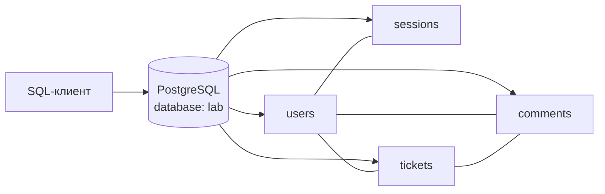

# Практическое задание № 10. SQL и проверка структуры данных

## Цель

Научиться исследовать реальную реляционную базу PostgreSQL средствами SQL,
проверять данные продукта через выборки, фильтрацию, сортировку, группировку и
соединения таблиц, а также читать ограничения, ключи, индексы и базовый план
выполнения запроса.

После выполнения работы вы сможете:

- подключаться к PostgreSQL внутри Docker и через внешний порт;
- определять текущую базу, роль, схему и часовой пояс сессии;
- читать структуру таблиц через `psql`, `information_schema` и системные
  каталоги PostgreSQL;
- выбирать явный набор столбцов с помощью `SELECT`;
- применять `WHERE`, `IN`, диапазоны, подзапросы и переменные `psql`;
- получать детерминированный результат с `ORDER BY`;
- агрегировать данные через `COUNT`, `GROUP BY` и `HAVING`;
- объяснять различия `INNER JOIN`, `LEFT JOIN` и `RIGHT JOIN`;
- находить пользователя, его заявки и связанные комментарии;
- проверять владельца заявки и фактического автора комментария;
- искать осиротевшие ссылки и семантические дубликаты;
- различать `PRIMARY KEY`, `FOREIGN KEY`, `UNIQUE`, `CHECK` и `NOT NULL`;
- находить созданные автоматически и явно заданные индексы;
- сопоставлять ограничения базы с правилами API;
- читать основные узлы, условия и оценки `EXPLAIN`;
- формулировать результат SQL-запроса как проверку данных, а не только как
  выгрузку строк.

## Практическое задание

Исследуйте PostgreSQL исправленной ветки `monolith/fixed`. В этой архитектуре
пользователи, сессии, заявки и комментарии находятся в одной базе `lab`, поэтому
между всеми доменными сущностями доступны обычные SQL-соединения и внешние
ключи.

Создайте воспроизводимый набор SQL-файлов. Каждый запрос должен содержать
понятный вопрос к данным, возвращать только полезные для ответа столбцы и
сопровождаться интерпретацией фактического результата. Завершите работу обзором
схемы и осторожным разбором планов `EXPLAIN`.

Рабочая ветка личного репозитория:

```text
practice/10-sql-data-structure
```

Рекомендуемая структура результата:

```text
mini-tickets-tests/
├── sql/
│   └── practice-10/
│       ├── README.md
│       ├── 00-connection-and-context.sql
│       ├── 01-select-filter-sort.sql
│       ├── 02-aggregation.sql
│       ├── 03-joins.sql
│       ├── 04-data-quality.sql
│       ├── 05-schema-constraints-indexes.sql
│       └── 06-explain.sql
├── scripts/
│   └── Run-Practice10.ps1
└── docs/
    └── test-reports/
        └── 10/
            ├── README.md
            ├── query-results.md
            ├── schema-review.md
            ├── explain-review.md
            └── evidence/
                ├── connection-context.txt
                └── query-output/
                    ├── 00-connection-and-context.txt
                    ├── 01-select-filter-sort.txt
                    ├── 02-aggregation.txt
                    ├── 03-joins.txt
                    ├── 04-data-quality.txt
                    ├── 05-schema-constraints-indexes.txt
                    └── 06-explain.txt
```

SQL-файлы являются исполняемой частью результата. Отчёт содержит не полный
дамп базы, а выбранные результаты, объяснение наблюдений и трассировку от
требования продукта к таблице, столбцу и проверяющему запросу.

### Почему используется монолит



В `monolith/fixed` один процесс приложения работает с одной схемой `public`.
Это позволяет изучить SQL-связи целиком. В микросервисной архитектуре данные
пользователей и заявок разделены по базам и обычный межбазовый `JOIN` не
является способом взаимодействия сервисов.

### Логическая схема для исследования

```mermaid
erDiagram
    USERS ||--o{ SESSIONS : "имеет"
    USERS ||--o{ TICKETS : "создаёт"
    USERS ||--o{ COMMENTS : "пишет"
    TICKETS ||--o{ COMMENTS : "содержит"

    USERS {
        uuid id PK
        varchar email UK
        varchar password_hash
        varchar role CHECK
    }
    SESSIONS {
        varchar token_hash PK
        uuid user_id FK
        timestamptz expires_at
    }
    TICKETS {
        uuid id PK
        uuid author_id FK
        text title
        varchar priority CHECK
        varchar status CHECK
        timestamptz created_at
    }
    COMMENTS {
        uuid id PK
        uuid ticket_id FK
        uuid author_id FK
        text text
        timestamptz created_at
    }
```

Диаграмма показывает отношения. Фактические имена, типы, правила удаления и
индексы подтверждаются запросами к каталогу самой запущенной базы.

### Контрольный снимок начальных данных

На свежей среде `backend/seed.py` создаёт детерминированный набор:

| Сущность | Контрольные записи |
|---|---|
| Пользователи | Anna (`user`), Boris (`user`), Operator (`operator`) |
| Заявки Anna | `new`, `active`, `closed` |
| Заявки Boris | одна `new` |
| Приоритеты | четыре `normal` |
| Комментарии | один комментарий оператора к новой заявке Anna |
| Сессии | пусто до первого входа через API |

Ожидаемые агрегаты свежего снимка:

| Проверка | Ожидаемое значение |
|---|---:|
| Пользователи | 3 |
| Заявки | 4 |
| Комментарии | 1 |
| Статус `new` | 2 |
| Статус `active` | 1 |
| Статус `closed` | 1 |
| Заявки Anna | 3 |
| Заявки Boris | 1 |
| Заявки Operator | 0 |

Повторно используемая среда может содержать записи предыдущих проверок. В
отчёте различайте ожидаемый seed и фактическое состояние выбранного Compose-
проекта.

### Источники ожидаемого поведения

- `docs/ТРЕБОВАНИЯ.md` — правила данных, сортировки и связей;
- `migrations/versions/001_initial.py` — фактическое создание таблиц,
  ограничений и индексов;
- `backend/seed.py` — контрольный начальный набор;
- `backend/models_identity.py` и `backend/models_tickets.py` — отображение
  таблиц в ORM;
- `sql/02_checks.sql` — существующие примеры для сравнения после собственной
  реализации;
- `compose.yaml` — база, роль, порт и имя Compose-проекта;
- каталоги `information_schema` и `pg_catalog` запущенного PostgreSQL —
  фактическая структура среды.

## Задание (шаги)

### Шаг 1. Сформулируйте вопросы к данным

До написания SQL подготовьте в `docs/test-reports/10/README.md` таблицу:

| ID | Вопрос | Источник ожидания | Таблицы | SQL-файл |
|---|---|---|---|---|
| `SQL-10-01` | Какие заявки принадлежат Anna? | `AUTH-03` | `users`, `tickets` | `03-joins.sql` |
| `SQL-10-02` | Есть ли заявки без автора? | Целостность данных | `tickets`, `users` | `04-data-quality.sql` |
| `SQL-10-03` | Как база ограничивает статус? | `TICKET-04` | `pg_constraint` | `05-schema-constraints-indexes.sql` |

Добавляйте строку для каждой основной проверки. Так результат связывается с
задачей тестирования, а не превращается в набор несвязанных запросов.

### Шаг 2. Подготовьте личный репозиторий

Продолжайте работу в личном репозитории:

```powershell
$taskTests = Join-Path $env:USERPROFILE 'repos/mini-tickets-tests'
Set-Location -LiteralPath $taskTests
git switch main
git pull --ff-only origin main
git switch -c practice/10-sql-data-structure

New-Item -ItemType Directory -Path sql/practice-10 -Force | Out-Null
New-Item -ItemType Directory -Path scripts -Force | Out-Null
New-Item -ItemType Directory `
    -Path docs/test-reports/10/evidence/query-output -Force | Out-Null
```

Создайте перечисленные SQL-файлы и документы отчёта. Внутри
`sql/practice-10/README.md` укажите назначение файлов, порядок выполнения,
параметры подключения и ожидаемую версию PostgreSQL.

### Шаг 3. Подготовьте `monolith/fixed`

Обновите продуктовый репозиторий и проверьте выбранную ветку:

```powershell
$taskProduct = Join-Path $env:USERPROFILE 'repos/testing'
Set-Location -LiteralPath $taskProduct
git fetch origin
git switch monolith/fixed
git merge --ff-only origin/monolith/fixed
git status --short
git branch --show-current
git rev-parse HEAD
Get-Content -LiteralPath variant.json
```

Зафиксируйте в отчёте Git SHA и значения:

```text
architecture: monolith
state: fixed
contract: 1.0.0
```

### Шаг 4. Запустите отдельную среду PostgreSQL

В отдельном окне PowerShell запустите среду. В примере используется
идентификатор `101`:

```powershell
$taskProduct = Join-Path $env:USERPROFILE 'repos/testing'
Set-Location -LiteralPath $taskProduct
.\scripts\Start-Student.ps1 -Student 101
Invoke-RestMethod http://localhost:8201/health/ready
docker compose ps
docker compose exec -T db pg_isready -U lab -d lab
```

Параметры примера:

| Компонент | Значение |
|---|---|
| Приложение | `http://localhost:8201` |
| PostgreSQL с хоста | `127.0.0.1:55541` |
| База | `lab` |
| Роль | `lab` |
| Пароль локальной среды | `lab-local-only` |
| Compose-проект | `mini-student-101` |

Для другого положительного идентификатора `N` HTTP-порт равен `8100 + N`, порт
PostgreSQL — `55440 + N`, имя проекта — `mini-student-N`. Укажите фактические
значения в отчёте и последующих командах.

### Шаг 5. Подключитесь к базе двумя способами

Контейнер уже содержит `psql`. Из окна среды выполните:

```powershell
docker compose exec db psql -X -U lab -d lab
```

В интерактивной сессии:

```text
\conninfo
SELECT version();
SELECT current_database(), current_user, current_schema();
\q
```

Если на компьютере установлен клиент PostgreSQL, проверьте внешний порт:

```powershell
$env:PGPASSWORD = 'lab-local-only'
psql -X -h 127.0.0.1 -p 55541 -U lab -d lab `
    -c "SELECT current_database(), current_user;"
Remove-Item Env:PGPASSWORD
```

Оба способа обращаются к одной базе. В первом случае соединение идёт внутри
Compose-сети, во втором — через опубликованный только на localhost порт.

### Шаг 6. Зафиксируйте контекст SQL-сессии

Создайте `00-connection-and-context.sql`:

```sql
-- Контекст воспроизводимого SQL-запуска практической № 10.
\set ON_ERROR_STOP on
\pset pager off
\timing on

SET TIME ZONE 'UTC';

SELECT
    current_database() AS database_name,
    current_user AS database_user,
    current_schema() AS schema_name,
    current_setting('TimeZone') AS session_timezone,
    version() AS postgres_version;

SELECT version_num AS migration_version
FROM alembic_version;
```

`SET TIME ZONE 'UTC'` делает отображение `timestamptz` сопоставимым между
компьютерами. `alembic_version` подтверждает применённую версию схемы.

### Шаг 7. Осмотрите таблицы командами `psql`

Подключитесь интерактивно и выполните:

```text
\dt+ public.*
\d+ public.users
\d+ public.sessions
\d+ public.tickets
\d+ public.comments
\di+ public.*
```

Для каждой таблицы выпишите:

- назначение;
- первичный ключ;
- внешние ключи;
- столбцы `NOT NULL`;
- уникальные и проверочные ограничения;
- индексы;
- правила `ON DELETE` внешних ключей.

Мета-команды `psql` начинаются с обратной косой черты и выполняются без точки с
запятой. Их вывод используется для первичного знакомства, а далее подтверждается
обычными SQL-запросами к системным каталогам.

### Шаг 8. Проверьте контрольный снимок seed-данных

Добавьте в `01-select-filter-sort.sql` общий подсчёт:

```sql
-- Количество строк в доменных таблицах текущей среды.
SELECT 'users' AS entity, COUNT(*) AS row_count FROM users
UNION ALL
SELECT 'sessions', COUNT(*) FROM sessions
UNION ALL
SELECT 'tickets', COUNT(*) FROM tickets
UNION ALL
SELECT 'comments', COUNT(*) FROM comments
ORDER BY entity;
```

На свежей среде ожидаются три пользователя, четыре заявки, один комментарий и
ноль сессий. После входа через UI или API таблица `sessions` содержит активные
сессии. Дополнительные данные объясняются историей именно этого Compose-тома.

Просмотрите безопасную проекцию пользователей:

```sql
SELECT id, email, role
FROM users
ORDER BY email;
```

Структура `password_hash` исследуется через метаданные, а значения хешей не
нужны для проверки пользователей, ролей и связей.

### Шаг 9. Напишите явный `SELECT` заявок

Добавьте запрос:

```sql
SELECT
    id AS ticket_id,
    author_id,
    title,
    priority,
    status,
    created_at
FROM tickets;
```

Сопоставьте столбцы со схемой `TicketOut` из OpenAPI. Отметьте, что SQL видит
физическую запись, а API дополнительно применяет авторизацию, фильтрацию и
формат публичного ответа.

Затем замените `SELECT *` в собственных исследовательских запросах явным
перечнем полезных столбцов. Явная проекция делает результат устойчивее к
добавлению внутреннего поля таблицы.

### Шаг 10. Примените `WHERE` к разным типам условий

Добавьте несколько самостоятельных запросов:

```sql
-- Один элемент закрытого набора статусов.
SELECT id, title, status
FROM tickets
WHERE status = 'new';

-- Несколько допустимых статусов.
SELECT id, title, status
FROM tickets
WHERE status IN ('active', 'closed');

-- Поиск пользователя по нормализованному email.
SELECT id, email, role
FROM users
WHERE email = 'anna@example.test';

-- Точный UUID заявки из seed-данных.
SELECT id, title, status
FROM tickets
WHERE id = '00000000-0000-0000-0000-00000000000a'::uuid;

-- Полуинтервал одного календарного дня в UTC.
SELECT id, title, created_at
FROM tickets
WHERE created_at >= TIMESTAMPTZ '2026-01-10 00:00:00+00'
  AND created_at <  TIMESTAMPTZ '2026-01-11 00:00:00+00';

-- Поиск учебного текста без учёта регистра.
SELECT id, title
FROM tickets
WHERE title ILIKE '%учебная%';
```

Для каждого запроса запишите класс условия, ожидаемый смысл и фактическое число
строк. UUID seed-заявок с десятичными номерами 10–13 оканчиваются шестнадцатеричными
значениями `a`, `b`, `c`, `d`.

### Шаг 11. Сделайте порядок результата детерминированным

Требование `TICKET-05` задаёт порядок списка: `created_at DESC, id DESC`.
Воспроизведите его:

```sql
SELECT id, title, status, created_at
FROM tickets
ORDER BY created_at DESC, id DESC;
```

Добавьте ещё две сортировки:

```sql
SELECT id, title, status, created_at
FROM tickets
ORDER BY status ASC, created_at DESC, id DESC;

SELECT id, email, role
FROM users
ORDER BY role ASC, email ASC;
```

Второй столбец сортировки служит правилом разрешения совпадений первого. Полный
детерминированный порядок особенно полезен при сравнении фактического результата
с ожидаемым списком теста.

### Шаг 12. Сгруппируйте заявки по одному и двум признакам

Создайте `02-aggregation.sql`:

```sql
-- Распределение заявок по состояниям.
SELECT status, COUNT(*) AS ticket_count
FROM tickets
GROUP BY status
ORDER BY status;

-- Матрица состояния и приоритета.
SELECT status, priority, COUNT(*) AS ticket_count
FROM tickets
GROUP BY status, priority
ORDER BY status, priority;
```

На свежем снимке первая выборка подтверждает `new = 2`, `active = 1`,
`closed = 1`. Вторая показывает, что все seed-заявки имеют `normal`.

Добавьте группировку по автору и условие для агрегата:

```sql
SELECT author_id, COUNT(*) AS ticket_count
FROM tickets
GROUP BY author_id
HAVING COUNT(*) >= 2
ORDER BY ticket_count DESC, author_id;
```

`WHERE` фильтрует строки до группировки, а `HAVING` — уже сформированные группы.

### Шаг 13. Посчитайте разные состояния условными агрегатами

Сформируйте одну строку сводки:

```sql
SELECT
    COUNT(*) AS total,
    COUNT(*) FILTER (WHERE status = 'new') AS new_count,
    COUNT(*) FILTER (WHERE status = 'active') AS active_count,
    COUNT(*) FILTER (WHERE status = 'closed') AS closed_count
FROM tickets;
```

Сравните результат с группировкой предыдущего шага. Оба запроса отвечают на
похожий вопрос, но возвращают разную форму данных: несколько строк категорий
или одну строку показателей.

### Шаг 14. Соедините пользователей и заявки через `INNER JOIN`

Создайте `03-joins.sql`:

```sql
SELECT
    u.email AS owner_email,
    u.role AS owner_role,
    t.id AS ticket_id,
    t.title,
    t.status,
    t.created_at
FROM users AS u
INNER JOIN tickets AS t ON t.author_id = u.id
ORDER BY t.created_at, t.id;
```

`INNER JOIN` возвращает только пары, для которых условие `t.author_id = u.id`
истинно. На свежем снимке получится четыре строки заявок; оператор без заявок в
результат не войдёт.

В отчёте объясните:

- какая таблица является родительской;
- какой столбец задаёт связь;
- почему email появляется рядом с заявкой;
- какие сущности исключает внутреннее соединение.

### Шаг 15. Сохраните пользователей без заявок через `LEFT JOIN`

Добавьте запрос:

```sql
SELECT
    u.id AS user_id,
    u.email,
    u.role,
    COUNT(t.id) AS ticket_count
FROM users AS u
LEFT JOIN tickets AS t ON t.author_id = u.id
GROUP BY u.id, u.email, u.role
ORDER BY ticket_count DESC, u.email;
```

На свежем снимке ожидаются Anna — 3, Boris — 1, Operator — 0. Используется
`COUNT(t.id)`: значение `NULL` из отсутствующей правой строки не учитывается.
`COUNT(*)` посчитал бы строку самого пользователя и дал оператору значение 1.

Добавьте детализацию без агрегации и найдите строку, где `ticket_id IS NULL`.
Это означает отсутствие дочерней записи, а не повреждение пользователя.

### Шаг 16. Выполните `RIGHT JOIN` заявок и комментариев

Сохраните все заявки независимо от наличия комментария:

```sql
SELECT
    t.id AS ticket_id,
    t.title,
    t.status,
    c.id AS comment_id,
    c.text AS comment_text
FROM comments AS c
RIGHT JOIN tickets AS t ON t.id = c.ticket_id
ORDER BY t.created_at, t.id, c.created_at, c.id;
```

На свежем снимке запрос возвращает четыре строки: у первой заявки есть
комментарий, у остальных `comment_id` и `comment_text` равны `NULL`.

Перепишите тот же вопрос через `tickets LEFT JOIN comments` и сравните наборы.
Направление записи отличается, а сохраняемая сторона в обоих случаях —
`tickets`.

### Шаг 17. Найдите пользователя и его заявки через переменную `psql`

Добавьте параметризуемую выборку:

```sql
\set user_email 'anna@example.test'

SELECT
    u.id AS user_id,
    u.email,
    t.id AS ticket_id,
    t.title,
    t.status,
    t.created_at
FROM users AS u
LEFT JOIN tickets AS t ON t.author_id = u.id
WHERE u.email = :'user_email'
ORDER BY t.created_at DESC, t.id DESC;
```

Повторите запрос для `boris@example.test` и `operator@example.test`, изменив
только значение переменной. Синтаксис `:'user_email'` передаёт строковый литерал
с корректным экранированием средствами `psql`.

Запишите различия результатов трёх ролей и сопоставьте их с контрольным seed.

### Шаг 18. Проверьте комментарий, владельца и фактического автора

Таблица `users` участвует дважды, поэтому используйте два псевдонима:

```sql
SELECT
    c.id AS comment_id,
    c.ticket_id,
    t.title AS ticket_title,
    owner.email AS ticket_owner,
    commenter.email AS comment_author,
    c.text AS comment_text,
    c.created_at
FROM comments AS c
INNER JOIN tickets AS t ON t.id = c.ticket_id
INNER JOIN users AS owner ON owner.id = t.author_id
INNER JOIN users AS commenter ON commenter.id = c.author_id
ORDER BY c.created_at, c.id;
```

Seed-комментарий связан с заявкой Anna, но его автором является Operator. Эта
выборка проверяет не только существование ссылок, но и бизнес-смысл двух разных
ролей в одной записи.

Для конкретной заявки добавьте `WHERE c.ticket_id = ...::uuid` и сопоставьте
столбцы с ответом `GET /api/tickets/{ticket_id}/comments` из практики № 8.

### Шаг 19. Посчитайте комментарии для каждой заявки

Добавьте агрегацию с сохранением заявок без обсуждения:

```sql
SELECT
    t.id AS ticket_id,
    t.title,
    t.status,
    COUNT(c.id) AS comment_count,
    MIN(c.created_at) AS first_comment_at,
    MAX(c.created_at) AS last_comment_at
FROM tickets AS t
LEFT JOIN comments AS c ON c.ticket_id = t.id
GROUP BY t.id, t.title, t.status
ORDER BY t.created_at, t.id;
```

Для трёх заявок `COUNT(c.id)` равен нулю. `MIN` и `MAX` для пустой группы
возвращают `NULL`, что корректно описывает отсутствие комментариев.

### Шаг 20. Найдите осиротевшие ссылки

Создайте `04-data-quality.sql` и добавьте три проверки:

```sql
-- Комментарий с отсутствующей заявкой.
SELECT c.id AS orphan_comment_id, c.ticket_id
FROM comments AS c
LEFT JOIN tickets AS t ON t.id = c.ticket_id
WHERE t.id IS NULL;

-- Заявка с отсутствующим автором.
SELECT t.id AS orphan_ticket_id, t.author_id
FROM tickets AS t
LEFT JOIN users AS u ON u.id = t.author_id
WHERE u.id IS NULL;

-- Комментарий с отсутствующим автором.
SELECT c.id AS orphan_comment_id, c.author_id
FROM comments AS c
LEFT JOIN users AS u ON u.id = c.author_id
WHERE u.id IS NULL;
```

На `monolith/fixed` все выборки должны быть пустыми. Миграция единой базы
создаёт соответствующие внешние ключи. SQL-проверка при этом остаётся полезной:
она явно формулирует инвариант, показывает фактический результат и может быть
перенесена в аудит импортированных или временно ослабленных данных.

### Шаг 21. Проверьте домены значений и семантические дубликаты

Добавьте проверки:

```sql
-- Роли вне публичного домена.
SELECT id, email, role
FROM users
WHERE role NOT IN ('user', 'operator');

-- Статусы и приоритеты вне контракта.
SELECT id, status, priority
FROM tickets
WHERE status NOT IN ('new', 'active', 'closed')
   OR priority NOT IN ('low', 'normal', 'high');

-- Повтор нормализованного email.
SELECT LOWER(BTRIM(email)) AS normalized_email, COUNT(*) AS duplicate_count
FROM users
GROUP BY LOWER(BTRIM(email))
HAVING COUNT(*) > 1;
```

На свежей исправленной среде запросы возвращают пустые наборы. `UNIQUE(email)`
защищает точное значение, а нормализацию регистра и пробелов выполняет API.
Последняя выборка проверяет более широкое бизнес-понятие дубликата.

Добавьте распределения фактических значений роли, статуса и приоритета. Они
показывают не только отсутствие неизвестных значений, но и покрытие категорий
контрольными данными.

### Шаг 22. Получите столбцы через `information_schema`

Создайте `05-schema-constraints-indexes.sql`:

```sql
SELECT
    table_name,
    ordinal_position,
    column_name,
    data_type,
    udt_name,
    character_maximum_length,
    is_nullable,
    column_default
FROM information_schema.columns
WHERE table_schema = 'public'
  AND table_name IN ('users', 'sessions', 'tickets', 'comments')
ORDER BY table_name, ordinal_position;
```

Составьте словарь данных:

| Таблица.столбец | SQL-тип | Nullable | Назначение | Публичное поле API |
|---|---|---|---|---|
| `users.id` | `uuid` | `NO` | Идентификатор пользователя | `UserOut.id` |
| `users.password_hash` | `varchar(255)` | `NO` | Хеш для серверной проверки | отсутствует |
| `tickets.created_at` | `timestamptz` | `NO` | UTC-время создания | `TicketOut.created_at` |

Для каждого внутреннего поля объясните, почему оно существует в базе и как
проверяется отсутствие этого поля в публичном ответе.

### Шаг 23. Исследуйте ограничения через `pg_constraint`

Добавьте запрос:

```sql
SELECT
    conrelid::regclass AS table_name,
    conname AS constraint_name,
    CASE contype
        WHEN 'p' THEN 'PRIMARY KEY'
        WHEN 'f' THEN 'FOREIGN KEY'
        WHEN 'u' THEN 'UNIQUE'
        WHEN 'c' THEN 'CHECK'
        ELSE contype::text
    END AS constraint_type,
    pg_get_constraintdef(oid) AS definition
FROM pg_constraint
WHERE conrelid IN (
    'users'::regclass,
    'sessions'::regclass,
    'tickets'::regclass,
    'comments'::regclass
)
ORDER BY conrelid::regclass::text, contype, conname;
```

Найдите и зафиксируйте:

- четыре первичных ключа;
- уникальность `users.email`;
- `CHECK` для `users.role`;
- `CHECK` для `tickets.status` и `tickets.priority`;
- `sessions.user_id → users.id ON DELETE CASCADE`;
- `tickets.author_id → users.id`;
- `comments.ticket_id → tickets.id ON DELETE CASCADE`;
- `comments.author_id → users.id`.

Имена `tickets_author` и `comments_author` задаются миграцией явно. Другие имена
PostgreSQL может сформировать по таблице и столбцу.

### Шаг 24. Разделите ответственность API и PostgreSQL

Заполните в `schema-review.md` таблицу:

| Правило | Уровень PostgreSQL | Уровень API | SQL-подтверждение |
|---|---|---|---|
| Email существует один раз | `UNIQUE(email)` | нормализация, ответ `409` | каталог + группа дубликатов |
| Роль только user/operator | `CHECK` | регистрация создаёт `user` | каталог + распределение |
| Автор заявки существует | `FOREIGN KEY` | автор берётся из Bearer | каталог + orphan query |
| Заголовок 3–80 после trim | поле `TEXT`, без проверки длины | Pydantic и policy | метаданные + требования |
| Переход `new → active` | `CHECK` знает только отдельное значение | state transition policy | каталог + требования |
| Пользователь видит свои заявки | строка существует независимо от роли | авторизация запроса | JOIN + требования |
| Удаление заявки удаляет комментарии | `ON DELETE CASCADE` | право удаления | определение FK |

Ограничение БД отвечает на вопрос о допустимости отдельной записи или ссылки.
Бизнес-правило может зависеть от предыдущего состояния, текущей роли и
последовательности действий, поэтому проверяется приложением.

### Шаг 25. Найдите индексы и свяжите их с запросами

Добавьте:

```sql
SELECT
    tablename,
    indexname,
    indexdef
FROM pg_indexes
WHERE schemaname = 'public'
  AND tablename IN ('users', 'sessions', 'tickets', 'comments')
ORDER BY tablename, indexname;
```

Классифицируйте результат:

| Происхождение | Примеры | Потенциальный сценарий |
|---|---|---|
| PRIMARY KEY | `users_pkey`, `tickets_pkey` | поиск записи по UUID |
| UNIQUE | индекс уникального email | вход и регистрация |
| Явный индекс | `ix_tickets_author_id` | список заявок пользователя |
| Явный индекс | `ix_tickets_status` | фильтр по статусу |
| Явный индекс | `ix_comments_ticket_id` | комментарии заявки |

PostgreSQL автоматически создаёт индекс для `PRIMARY KEY` и `UNIQUE`.
Внешний ключ сам по себе не гарантирует индекс на ссылающемся столбце, поэтому
сопоставляйте список FK со списком индексов отдельно.

### Шаг 26. Прочитайте базовый `EXPLAIN` поиска по автору

Создайте `06-explain.sql`:

```sql
EXPLAIN (COSTS, VERBOSE, FORMAT TEXT)
SELECT id, title, status, created_at
FROM tickets
WHERE author_id = '00000000-0000-0000-0000-000000000001'::uuid
ORDER BY created_at DESC, id DESC;
```

В `explain-review.md` найдите:

- верхний узел плана;
- способ чтения таблицы;
- условие фильтра или индекса;
- отдельный узел сортировки, если он присутствует;
- `cost` начала и завершения;
- оценку `rows` и ширину `width`.

На таблице из четырёх строк планировщик может выбрать `Seq Scan`, хотя индекс
`ix_tickets_author_id` существует. Прочитать маленькую таблицу целиком часто
дешевле, чем обращаться к индексу и затем к heap. Наличие индекса и его выбор в
конкретном плане являются разными фактами.

### Шаг 27. Сравните планы фильтра по статусу

Добавьте второй запрос:

```sql
EXPLAIN (COSTS, VERBOSE, FORMAT TEXT)
SELECT id, title, status, created_at
FROM tickets
WHERE status = 'new'
ORDER BY created_at DESC, id DESC;
```

Затем получите фактические показатели читающего запроса:

```sql
EXPLAIN (ANALYZE, BUFFERS, FORMAT TEXT)
SELECT id, title, status, created_at
FROM tickets
WHERE status = 'new'
ORDER BY created_at DESC, id DESC;
```

`EXPLAIN` строит план и оценки. `EXPLAIN ANALYZE` дополнительно выполняет SELECT
и показывает `actual time`, `actual rows`, количество циклов и буферные
операции. Сопоставьте оценку и факт, но формулируйте вывод только для текущего
маленького снимка данных. Время зависит от компьютера, кэша и состояния
контейнера.

### Шаг 28. Выполните SQL-файлы воспроизводимо

Создайте `scripts/Run-Practice10.ps1` в личном репозитории:

```powershell
<#
.SYNOPSIS
Выполнить читающие SQL-файлы практической № 10 и сохранить вывод psql.
#>
param(
    [string]$ProductPath = (Join-Path $env:USERPROFILE 'repos/testing'),
    [string]$ComposeProject = 'mini-student-101'
)

$ErrorActionPreference = 'Stop'
$testsRoot = Split-Path -Parent $PSScriptRoot
$sqlRoot = Join-Path $testsRoot 'sql/practice-10'
$outputRoot = Join-Path $testsRoot 'docs/test-reports/10/evidence/query-output'
New-Item -ItemType Directory -Path $outputRoot -Force | Out-Null

$sqlFiles = Get-ChildItem -LiteralPath $sqlRoot -File |
    Where-Object Name -Match '^\d{2}-.*\.sql$' |
    Sort-Object Name

Set-Location -LiteralPath $ProductPath

foreach ($sqlFile in $sqlFiles) {
    Write-Host "Выполняется $($sqlFile.Name)"
    $sqlInput = "SET TIME ZONE 'UTC';`n" +
        (Get-Content -LiteralPath $sqlFile.FullName -Raw -Encoding UTF8)
    $output = $sqlInput |
        docker compose -p $ComposeProject exec -T db `
            psql -X -P pager=off -v ON_ERROR_STOP=1 -U lab -d lab 2>&1

    if ($LASTEXITCODE -ne 0) {
        throw "Ошибка выполнения $($sqlFile.Name)"
    }

    $resultName = [IO.Path]::ChangeExtension($sqlFile.Name, '.txt')
    $resultPath = Join-Path $outputRoot $resultName
    $output | Set-Content -LiteralPath $resultPath -Encoding UTF8
}
```

Запустите:

```powershell
Set-Location -LiteralPath $taskTests
.\scripts\Run-Practice10.ps1 `
    -ProductPath $taskProduct `
    -ComposeProject mini-student-101
```

`-X` отключает пользовательский `psqlrc`, `ON_ERROR_STOP=1` завершает файл при
первой ошибке, `-T` отключает псевдотерминал, а `pager=off` сохраняет полный
вывод непосредственно в файл.

### Шаг 29. Подготовьте итоговый отчёт

Оформите `docs/test-reports/10/README.md`:

```markdown
# SQL и проверка структуры данных

## Версия продукта и параметры среды
## Контекст подключения к PostgreSQL
## Контрольный снимок данных
## SELECT, WHERE и ORDER BY
## GROUP BY и агрегаты
## INNER JOIN, LEFT JOIN и RIGHT JOIN
## Пользователи, заявки и комментарии
## Проверки качества и ссылочной целостности
## Столбцы и типы
## Ограничения и ключи
## Индексы
## Разбор EXPLAIN
## Границы ответственности API и БД
## Итоговый вывод и вопросы к данным
```

Для каждого существенного запроса заполните реестр:

| ID | Проверяемый вопрос | SQL-файл | Ожидаемый смысл | Фактический результат | Вывод |
|---|---|---|---|---|---|
| `SQL-10-01` | Статусы seed-заявок | `02-aggregation.sql` | 2/1/1 | — | — |
| `SQL-10-02` | Пользователи без заявок | `03-joins.sql` | Operator, 0 | — | — |
| `SQL-10-03` | Комментарии без заявки | `04-data-quality.sql` | пусто | — | — |

В `schema-review.md` поместите словарь данных и матрицу ответственности. В
`explain-review.md` сохраните планы, найденные узлы и осторожную интерпретацию.
В `query-results.md` укажите путь к полному выводу каждого SQL-файла и краткий
результат проверок.

### Шаг 30. Проверьте повторяемость и состояние базы

Выполните `Run-Practice10.ps1` повторно. Сравните:

- число строк доменных таблиц;
- распределение статусов и приоритетов;
- результаты orphan-проверок;
- пользователей и число их заявок;
- планы `EXPLAIN` и фактические показатели `ANALYZE`.

Читающие SQL-файлы должны сохранить данные без изменений. Значения фактического
времени и буферов могут отличаться, а состав выборок и ограничения остаются
теми же для одного снимка.

Если один файл завершился SQL-ошибкой внутри явно начатой транзакции,
`ROLLBACK;` возвращает сессию из состояния aborted перед следующим запросом.
При запуске файлов отдельными процессами `psql` каждая сессия завершается
самостоятельно.

### Шаг 31. Остановите среду и проверьте результат

В окне `monolith/fixed` остановите контейнеры с сохранением томов:

```powershell
docker compose stop
docker compose ps -a
```

В личном репозитории проверьте файлы:

```powershell
Set-Location -LiteralPath $taskTests
git status --short
git diff --check
git diff -- sql/practice-10 scripts/Run-Practice10.ps1 docs/test-reports/10
```

Откройте сохранённый вывод как текст и убедитесь, что в нём находятся запросы и
результаты выбранной среды, а значения `password_hash`, `token_hash`, пароли и
Bearer-токены не сохранены.

### Шаг 32. Зафиксируйте результат в Git

Добавьте SQL-файлы, сценарий запуска и отчёт:

```powershell
git add sql/practice-10 scripts/Run-Practice10.ps1 docs/test-reports/10
git commit -m 'Исследована структура PostgreSQL и SQL-запросы'
git push -u origin practice/10-sql-data-structure
```

При использовании GitLab отправьте тот же коммит во второй remote:

```powershell
git push -u gitlab practice/10-sql-data-structure
```

В описании PR/MR перечислите группы SQL-запросов, проверенные связи,
ограничения, индексы и путь к итоговому отчёту.

## Подсказки по ключевым частям

### Миграция является источником фактической схемы

ORM-модели помогают приложению работать с данными, но окончательный набор
ограничений создаёт Alembic. В `monolith/fixed` миграция выполняется с
`SERVICE=all` и добавляет внешние ключи авторов заявок и комментариев к
`users.id`.

### `psql` и SQL решают разные задачи

Команды `\dt`, `\d` и `\di` принадлежат клиенту `psql`. `SELECT` из
`information_schema` и `pg_catalog` выполняет сервер PostgreSQL. Оба способа
показывают структуру, но SQL-запрос легче сохранить и выполнить другим клиентом.

### Порядок строк задаётся только `ORDER BY`

Физическое расположение или порядок прошлого результата не является
контрактом. Используйте поля бизнес-сортировки и стабильный дополнительный ключ,
например `created_at DESC, id DESC`.

### `WHERE` и `HAVING` работают на разных стадиях

`WHERE` выбирает отдельные строки до `GROUP BY`. `HAVING` фильтрует группы после
вычисления `COUNT`, `MIN`, `MAX` и других агрегатов.

### `COUNT(*)` и `COUNT(column)` различаются при внешнем соединении

`COUNT(*)` считает строку результата `LEFT JOIN`, даже если правая часть
содержит `NULL`. `COUNT(t.id)` считает только фактически найденные заявки.

### `INNER JOIN` отвечает на вопрос о существующих парах

Пользователь без заявки и заявка без совпавшего пользователя отсутствуют в
результате. Для поиска отсутствующей связи нужен внешний `JOIN` и условие
`WHERE right_table.id IS NULL`.

### Сохраняемая сторона определяет смысл внешнего JOIN

`users LEFT JOIN tickets` сохраняет пользователей. `comments RIGHT JOIN
tickets` сохраняет заявки. `RIGHT JOIN` можно переписать перестановкой таблиц в
`LEFT JOIN`, поэтому всегда сначала формулируйте, чьи строки должны остаться.

### Псевдонимы позволяют использовать одну таблицу в разных ролях

В запросе комментариев `users AS owner` обозначает владельца заявки, а
`users AS commenter` — автора действия. Совпадение таблицы не означает
совпадение бизнес-роли.

### `NULL` после JOIN не всегда означает дефект

Пустая правая сторона у оператора без заявок является нормальным результатом
`LEFT JOIN`. Осиротевшая ссылка определяется в обратном направлении: дочерняя
запись содержит идентификатор, для которого родитель не найден.

### Внешний ключ подтверждает существование, но не бизнес-корректность

FK гарантирует, что `comments.author_id` указывает на пользователя. Он не
определяет, имел ли пользователь право комментировать конкретную заявку в её
состоянии. Это правило проверяет API.

### Каскад относится к направлению удаления

`comments.ticket_id → tickets.id ON DELETE CASCADE` означает удаление
комментариев вместе с заявкой. Удаление комментария не влияет на заявку.

### UUID читается как значение, а не как порядковый номер

Seed создаёт детерминированные UUID для удобства, но обычные API-записи получают
случайный UUID. Тесты сохраняют точный идентификатор созданной записи вместо
поиска «последней» строки.

### `timestamptz` хранит момент времени

PostgreSQL отображает его в часовом поясе текущей сессии. `SET TIME ZONE 'UTC'`
делает текстовый вывод сопоставимым, не меняя сохранённый момент.

### Полуинтервал удобен для временных диапазонов

Условие `>= начало AND < начало следующего дня` не зависит от долей секунды и
не требует угадывать максимальное время дня.

### `UNIQUE(email)` и бизнес-уникальность могут различаться

Индекс сравнивает сохранённые строки по правилам столбца. API сначала обрезает
пробелы и приводит email к нижнему регистру. Запрос с `LOWER(BTRIM(email))`
проверяет нормализованное бизнес-представление.

### Ограничение CHECK проверяет значение, а не переход

`status IN ('new','active','closed')` запрещает неизвестный статус, но не знает
предыдущее значение. Правило `new → active → closed` реализуется на уровне
приложения.

### Индекс и внешний ключ являются независимыми объектами

FK защищает ссылочную целостность. Индекс ускоряет подходящие способы поиска.
PostgreSQL индексирует PK и UNIQUE автоматически, а индексы на ссылающихся
столбцах проектируются отдельно.

### Наличие индекса не обещает `Index Scan`

Планировщик сравнивает стоимость альтернатив по статистике и размеру таблицы.
Для четырёх строк `Seq Scan` является разумным планом. Смотрите на условие,
оценки и объём данных, а не только на название узла.

### `EXPLAIN ANALYZE` действительно выполняет запрос

Для SELECT это даёт фактические строки и время. При дальнейшем исследовании
изменяющих запросов учитывайте, что `ANALYZE` выполнит операцию; следующая
практическая работа использует транзакции и управляемый откат.

### План на маленькой базе не является нагрузочным выводом

Результат описывает конкретную схему, статистику, параметры и объём. Он помогает
читать работу оптимизатора, но не заменяет измерение на репрезентативном наборе.

### Ошибка SQL должна сохранять контекст

Запишите текст ошибки, файл и запрос. Синтаксическая ошибка, отсутствующий
столбец и нарушение соединения имеют разные причины. `ON_ERROR_STOP` не даёт
следующим результатам скрыть первый сбой.

### SQL-проверка завершается интерпретацией

Пустой результат orphan-запроса означает «нарушение не обнаружено в текущем
снимке». Он не доказывает корректность всех прошлых и будущих данных без учёта
ограничений и процессов записи.

## Что проверить перед отправкой (чек-лист)

- [ ] Работа находится в ветке `practice/10-sql-data-structure`.
- [ ] В отчёте указаны `monolith/fixed`, Git SHA и значения `variant.json`.
- [ ] Зафиксированы фактические HTTP- и PostgreSQL-порты и Compose-проект.
- [ ] Указаны база `lab`, роль `lab`, версия PostgreSQL и часовой пояс UTC.
- [ ] Подтверждена версия миграции из `alembic_version`.
- [ ] Созданы семь упорядоченных SQL-файлов и README набора.
- [ ] SQL-файлы выполняются повторно через `psql -X` с `ON_ERROR_STOP`.
- [ ] Сохранён отдельный вывод каждого SQL-файла.
- [ ] Исследованы `users`, `sessions`, `tickets` и `comments`.
- [ ] Контрольные количества сопоставлены с seed и фактической средой.
- [ ] В пользовательской выборке используются публичные поля без значения хеша.
- [ ] В запросах указан явный набор столбцов.
- [ ] Реализованы условия `WHERE` по строке, UUID, набору и времени.
- [ ] Показан параметризованный поиск пользователя по email.
- [ ] Использован детерминированный `ORDER BY` с дополнительным ключом.
- [ ] Заявки сгруппированы по статусу.
- [ ] Заявки сгруппированы по статусу и приоритету.
- [ ] Использованы `COUNT`, `MIN`, `MAX` и условный `FILTER`.
- [ ] Показано различие `WHERE` и `HAVING`.
- [ ] `INNER JOIN` связывает пользователей и заявки.
- [ ] `LEFT JOIN` сохраняет пользователя без заявок.
- [ ] Для числа дочерних записей используется `COUNT(t.id)` или `COUNT(c.id)`.
- [ ] `RIGHT JOIN` сохраняет заявки без комментариев.
- [ ] Результат `RIGHT JOIN` сопоставлен с эквивалентным `LEFT JOIN`.
- [ ] Пользователь и его заявки найдены одним запросом.
- [ ] Комментарий связан с заявкой, владельцем и фактическим автором.
- [ ] Псевдонимы `owner` и `commenter` отражают разные роли.
- [ ] Посчитаны комментарии каждой заявки, включая нулевые значения.
- [ ] Проверены комментарии без заявки.
- [ ] Проверены заявки без пользователя-автора.
- [ ] Проверены комментарии без пользователя-автора.
- [ ] Проверены неизвестные роли, статусы и приоритеты.
- [ ] Проверены дубликаты нормализованного email.
- [ ] Получен словарь столбцов из `information_schema.columns`.
- [ ] Различены `uuid`, `text`, `varchar` и `timestamptz`.
- [ ] Исследованы `NOT NULL`, PK, FK, UNIQUE и CHECK.
- [ ] Найдены оба FK с `ON DELETE CASCADE`.
- [ ] Ограничения БД сопоставлены с правилами API.
- [ ] Отмечены правила длины, ролей и переходов, реализованные приложением.
- [ ] Получен список индексов из `pg_indexes`.
- [ ] Различены индексы PK, UNIQUE и явно созданные индексы.
- [ ] Индексы связаны с реальными сценариями поиска.
- [ ] Подготовлен базовый `EXPLAIN` поиска по автору.
- [ ] Подготовлен базовый `EXPLAIN` фильтра по статусу.
- [ ] Прочитаны узлы, условия, cost, rows и width.
- [ ] Результат `EXPLAIN ANALYZE` отделён от общей оценки производительности.
- [ ] Повторный запуск сохраняет состав данных.
- [ ] В отчёте есть реестр вопросов, запросов, результатов и выводов.
- [ ] Составлена матрица ответственности PostgreSQL и API.
- [ ] В отчёте описаны границы и ограничения сделанных выводов.
- [ ] В артефактах отсутствуют значения хешей, токенов и паролей.
- [ ] `git diff --check` не сообщает о проблемах форматирования.
- [ ] В коммит входят SQL-файлы, сценарий запуска и отчёт.

## Советы по улучшению работы

- Начинайте запрос с вопроса на естественном языке и завершайте выводом о
  данных.
- Используйте короткий ID проверки в комментарии SQL и реестре отчёта.
- Выбирайте только столбцы, нужные для ответа на поставленный вопрос.
- Добавляйте стабильный дополнительный столбец в `ORDER BY`.
- Сравнивайте количество строк с конкретным ожиданием или объяснённой историей
  среды.
- Для каждой агрегированной величины проверяйте, какие строки и `NULL` она
  считает.
- Рисуйте направление JOIN от сущности, которую требуется сохранить.
- Используйте два псевдонима одной таблицы для разных бизнес-ролей.
- Проверяйте связь как по наличию родителя, так и по смыслу связанных ролей.
- Сопоставляйте SQL-поле с публичным полем API и внутренними данными отдельно.
- Выносите повторяемые входные значения в переменные `psql`.
- Используйте `TIMESTAMPTZ` и полуинтервалы для точных временных выборок.
- Подтверждайте структуру и через `\d`, и через сохраняемый SQL-запрос к
  каталогу.
- Читайте текст определения ограничения через `pg_get_constraintdef`.
- Сравнивайте внешние ключи и индексы как отдельные списки.
- Связывайте каждый индекс с запросом, которому он потенциально помогает.
- При чтении плана двигайтесь от верхнего узла к источникам данных.
- Сравнивайте оценки `rows` с `actual rows`, учитывая маленький размер таблицы.
- Храните короткие относящиеся результаты вместо полного дампа базы.
- Используйте `ON_ERROR_STOP`, чтобы первый SQL-сбой оставался видимым.
- Повторяйте весь набор на одном снимке и сравнивайте инварианты, а не время.
- Формулируйте пустую выборку как отсутствие найденного нарушения в текущих
  данных.
- Отделяйте гарантию ограничения БД от наблюдения одного SELECT.
- Завершайте отчёт перечислением проверенных связей и вопросов, оставшихся к
  модели данных.
