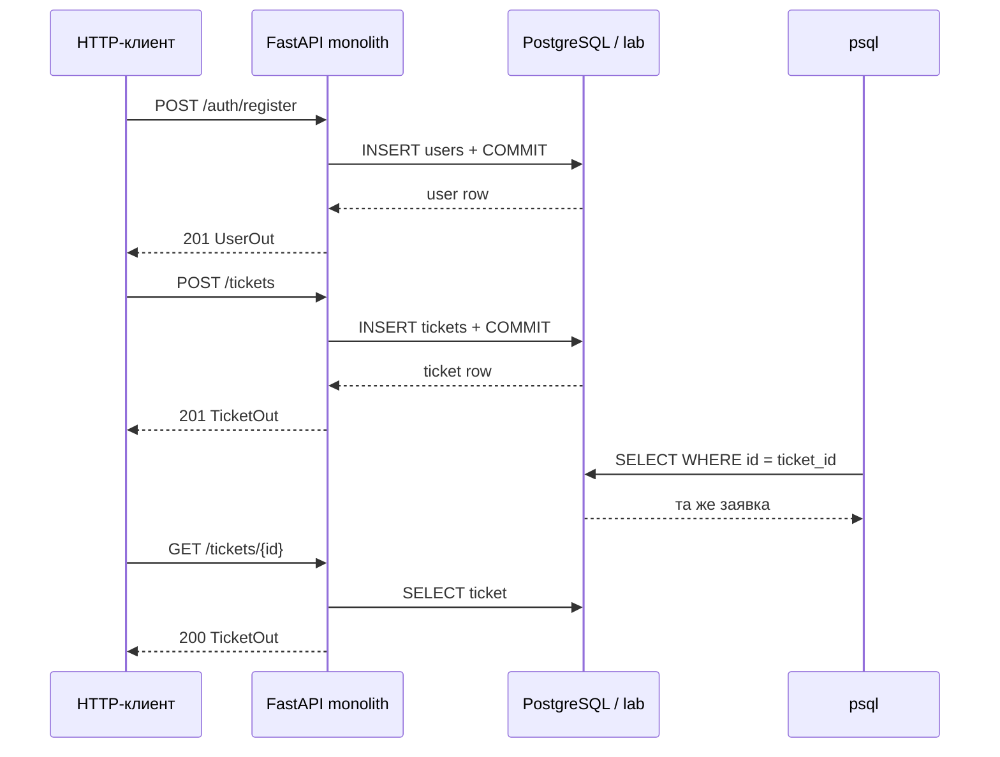
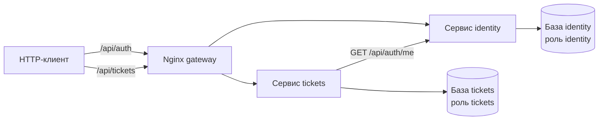
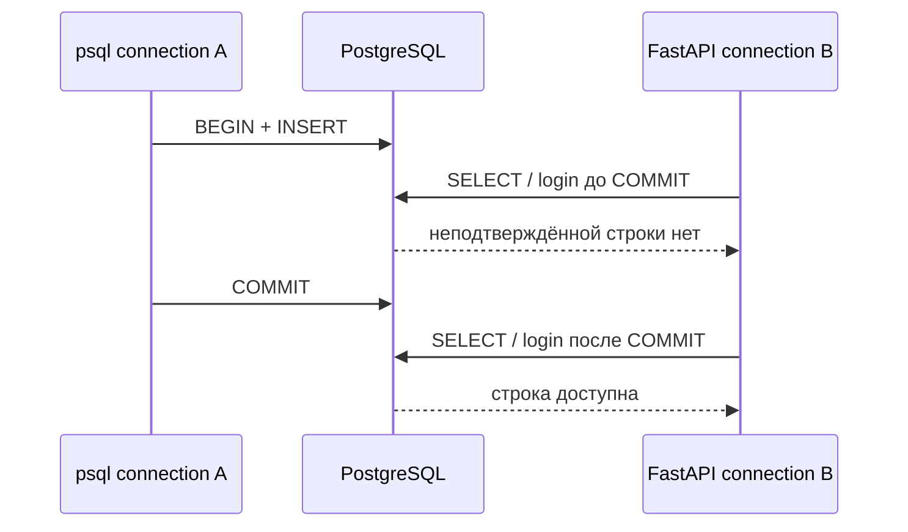

# Практическое задание № 11. API, PostgreSQL и управление тестовыми данными

## Цель

Научиться прослеживать изменение данных от HTTP-запроса до конкретных строк
PostgreSQL и обратно, подготавливать управляемые тестовые состояния через SQL,
использовать транзакции и точечно очищать собственные записи, а также понимать
различие единой базы монолита и границ владения данными в микросервисной
архитектуре.

После выполнения работы вы сможете:

- отправлять связанный набор `POST`- и `GET`-запросов к REST API;
- сохранять UUID и серверные поля непосредственно из ответа;
- находить точную созданную запись через параметризованный SQL;
- сопоставлять JSON API со строками `users`, `tickets` и `comments`;
- различать клиентские поля и значения, назначенные сервером;
- проверять отсутствие записи после отклонённого запроса;
- создавать контролируемого пользователя прямым `INSERT`;
- использовать существующий Argon2-хеш без вывода его значения;
- наблюдать видимость неподтверждённой строки из двух соединений;
- применять `BEGIN`, `COMMIT`, `ROLLBACK` и `SAVEPOINT`;
- восстанавливать транзакцию после ожидаемой SQL-ошибки;
- выполнять адресную очистку по UUID и уникальному маркеру;
- подтверждать каскадное удаление связанных записей;
- сравнивать одну БД `lab` с базами `identity` и `tickets`;
- подключаться к каждой микросервисной базе её собственной ролью;
- проверять отказ роли при подключении к чужой базе;
- объяснять отсутствие межбазового внешнего ключа и обычного `JOIN`;
- выбирать SQL или API в соответствии с владельцем данных и проверяемой
  границей.

## Практическое задание

Проведите два связанных исследования исправленного продукта.

В первой части используйте `monolith/fixed`: создайте пользователя, заявку и
комментарий через API, найдите их в единой базе `lab`, сопоставьте значения,
проверьте ошибочный запрос и выполните несколько транзакционных сценариев
подготовки данных.

Во второй части повторите внешний API-поток на `microservices/fixed`. Найдите
пользователя в базе `identity`, а заявку и комментарий — в базе `tickets`.
Подтвердите разграничение ролей и покажите, почему связь данных разных сервисов
проверяется через HTTP-контракт и сопоставление идентификаторов, а не обычный
межбазовый `JOIN`.

Рабочая ветка личного репозитория:

```text
practice/11-api-db-test-data
```

Рекомендуемая структура результата:

```text
mini-tickets-tests/
├── scripts/
│   └── Invoke-Practice11ApiFlow.ps1
├── sql/
│   └── practice-11/
│       ├── README.md
│       ├── 00-monolith-context.sql
│       ├── 01-monolith-api-to-db.sql
│       ├── 02-user-rollback.sql
│       ├── 03-user-commit.sql
│       ├── 04-savepoint.sql
│       ├── 05-monolith-cleanup.sql
│       ├── 06-microservices-identity.sql
│       ├── 07-microservices-tickets.sql
│       ├── 08-microservices-tickets-cleanup.sql
│       └── 09-microservices-identity-cleanup.sql
└── docs/
    └── test-reports/
        └── 11/
            ├── README.md
            ├── api-db-mapping.md
            ├── transactions-and-cleanup.md
            ├── microservices-boundaries.md
            └── evidence/
                ├── monolith-api.json
                ├── monolith-sql.txt
                ├── invalid-api-and-sql.md
                ├── rollback-visibility.md
                ├── cleanup.md
                ├── microservices-api.json
                ├── microservices-identity.txt
                ├── microservices-tickets.txt
                └── role-isolation.md
```

В evidence сохраняются только относящиеся к проверке публичные значения,
идентификаторы, коды, SQL-результаты и сообщения ожидаемых отказов. Bearer-
токены, пароли и значения хешей остаются за пределами сохраняемых артефактов.

### Сквозной поток монолита



Ответ `201`, строка БД и последующий `GET` наблюдают разные границы. Их
совпадение даёт более сильное подтверждение, чем любой один источник.

### Сквозной поток микросервисов



Один контейнер PostgreSQL выбран для экономии ресурсов, но базы, владельцы,
процессы и права остаются раздельными. Сервис заявок хранит UUID автора и
проверяет предъявленную сессию через внутренний HTTP-вызов к `identity`.

### Матрица физического размещения данных

| Архитектура | База | Роль приложения | Таблицы | Связь автора заявки |
|---|---|---|---|---|
| Монолит | `lab` | `lab` | `users`, `sessions`, `tickets`, `comments` | FK `tickets.author_id → users.id` |
| Микросервисы | `identity` | `identity` | `users`, `sessions` | Владеет пользователем |
| Микросервисы | `tickets` | `tickets` | `tickets`, `comments` | UUID без межбазового FK |

В `tickets` сохраняется локальный FK `comments.ticket_id → tickets.id ON DELETE
CASCADE`. Между базами `identity` и `tickets` обычного FK нет.

### Проверочная модель API → БД → API

| Этап | Наблюдение | Основные поля |
|---|---|---|
| HTTP-запрос | Входные данные клиента | email, title, priority, text |
| HTTP-ответ | Публичный контракт | id, author_id, status, created_at |
| SQL | Физическая запись | точный UUID и столбцы таблицы |
| Повторный HTTP GET | Публичное чтение | тот же ресурс после commit |
| Cleanup | Отсутствие собственных записей | точечные SELECT и DELETE |

## Задание (шаги)

### Шаг 1. Подготовьте карту проверок

Создайте в `docs/test-reports/11/README.md` таблицу:

| ID | Действие | Источник ожидания | База и таблица | SQL-подтверждение |
|---|---|---|---|---|
| `P11-M-01` | Регистрация | `AUTH-01` | `lab.users` | поиск по `id` и email |
| `P11-M-02` | Создание заявки | `TICKET-01`–`03` | `lab.tickets` | поиск по `ticket_id` |
| `P11-M-03` | Ошибочный POST | `TICKET-02` | `lab.tickets` | маркер отсутствует |
| `P11-X-01` | Регистрация в микросервисах | `AUTH-01` | `identity.users` | поиск в своей БД |
| `P11-X-02` | Создание заявки | `TICKET-03` | `tickets.tickets` | поиск в своей БД |

Добавьте комментарий, транзакцию с rollback, cleanup и проверки границ ролей.
Для каждой строки заранее укажите ожидаемое наблюдение.

### Шаг 2. Подготовьте личный репозиторий

Продолжайте работу в личном репозитории:

```powershell
$taskTests = Join-Path $env:USERPROFILE 'repos/mini-tickets-tests'
Set-Location -LiteralPath $taskTests
git switch main
git pull --ff-only origin main
git switch -c practice/11-api-db-test-data

New-Item -ItemType Directory -Path sql/practice-11 -Force | Out-Null
New-Item -ItemType Directory -Path scripts -Force | Out-Null
New-Item -ItemType Directory -Path docs/test-reports/11/evidence -Force |
    Out-Null
```

В `sql/practice-11/README.md` опишите параметры файлов, порядок ручного запуска
и назначение идентификаторов `user_id`, `ticket_id`, `comment_id`,
`invalid_title`.

### Шаг 3. Обновите продуктовые ветки

Подготовьте корневую рабочую копию монолита и два worktree микросервисов:

```powershell
$taskProduct = Join-Path $env:USERPROFILE 'repos/testing'
$taskMicro = Join-Path $taskProduct '.worktrees/microservices-fixed'
$taskMicroBuggy = Join-Path $taskProduct '.worktrees/microservices-buggy'
Set-Location -LiteralPath $taskProduct
git fetch origin
git switch monolith/fixed
git merge --ff-only origin/monolith/fixed

if (!(Test-Path -LiteralPath $taskMicro)) {
    git worktree add --detach $taskMicro origin/microservices/fixed
}
git -C $taskMicro merge --ff-only origin/microservices/fixed

if (!(Test-Path -LiteralPath $taskMicroBuggy)) {
    git worktree add --detach $taskMicroBuggy origin/microservices/buggy
}
git -C $taskMicroBuggy merge --ff-only origin/microservices/buggy

git status --short
git -C $taskMicro status --short
git -C $taskMicroBuggy status --short
git rev-parse HEAD
git -C $taskMicro rev-parse HEAD
git -C $taskMicroBuggy rev-parse HEAD
Get-Content -LiteralPath variant.json
Get-Content -LiteralPath (Join-Path $taskMicro 'variant.json')
Get-Content -LiteralPath (Join-Path $taskMicroBuggy 'variant.json')
```

Зафиксируйте оба Git SHA. Ожидаемые пары `architecture/state`:

```text
monolith/fixed:      monolith, fixed
microservices/fixed: microservices, fixed
microservices/buggy: microservices, buggy
```

### Шаг 4. Запустите отдельную среду монолита

В отдельном окне PowerShell запустите пример с идентификатором `111`:

```powershell
$taskProduct = Join-Path $env:USERPROFILE 'repos/testing'
Set-Location -LiteralPath $taskProduct
.\scripts\Start-Student.ps1 -Student 111
Invoke-RestMethod http://localhost:8211/health/ready
docker compose ps
docker compose exec -T db pg_isready -U lab -d lab
```

Параметры примера:

| Параметр | Значение |
|---|---|
| API | `http://localhost:8211` |
| PostgreSQL | `127.0.0.1:55551` |
| База и роль | `lab` / `lab` |
| Compose-проект | `mini-student-111` |

Если эти значения заняты, выберите другой положительный номер `N`. HTTP-порт
равен `8100 + N`, порт PostgreSQL — `55440 + N`, имя проекта —
`mini-student-N`.

### Шаг 5. Зафиксируйте контекст монолитной базы

Создайте `00-monolith-context.sql`:

```sql
-- P11-M-00: контекст единой базы монолита.
\set ON_ERROR_STOP on
\pset pager off
SET TIME ZONE 'UTC';

SELECT
    current_database() AS database_name,
    current_user AS database_user,
    current_schema() AS schema_name,
    current_setting('TimeZone') AS session_timezone;

SELECT version_num AS migration_version
FROM alembic_version;

SELECT table_name
FROM information_schema.tables
WHERE table_schema = 'public'
  AND table_type = 'BASE TABLE'
ORDER BY table_name;
```

Выполните из окна среды:

```powershell
$sqlFile = Join-Path $taskTests 'sql/practice-11/00-monolith-context.sql'
Get-Content -LiteralPath $sqlFile -Raw -Encoding UTF8 |
    docker compose exec -T db psql -X -v ON_ERROR_STOP=1 -U lab -d lab
```

Ожидается одна база `lab` с доменными таблицами `users`, `sessions`, `tickets`
и `comments`.

### Шаг 6. Создайте воспроизводимый API-поток

Создайте `scripts/Invoke-Practice11ApiFlow.ps1`:

```powershell
<#
.SYNOPSIS
Создать через публичный API пользователя, заявку, комментарий и ошибочный POST.
.DESCRIPTION
Сценарий сохраняет только публичные идентификаторы, значения и request ID.
Bearer используется в памяти процесса и не входит в выходной JSON.
#>
param(
    [Parameter(Mandatory)][string]$BaseUrl,
    [Parameter(Mandatory)][string]$OutputPath
)

$ErrorActionPreference = 'Stop'
$BaseUrl = $BaseUrl.TrimEnd('/')
$runId = [Guid]::NewGuid().ToString('N')
$password = 'LabPassword1!'

function Invoke-LabJson {
    param(
        [Parameter(Mandatory)][string]$Method,
        [Parameter(Mandatory)][string]$Path,
        [object]$Body,
        [string]$Token
    )

    $requestId = "p11-$([Guid]::NewGuid().ToString('N').Substring(0, 24))"
    $headers = @{ 'X-Request-ID' = $requestId }
    if ($Token) {
        $headers.Authorization = "Bearer $Token"
    }

    $parameters = @{
        Method = $Method
        Uri = "$BaseUrl/api$Path"
        Headers = $headers
        SkipHttpErrorCheck = $true
    }
    if ($null -ne $Body) {
        $parameters.ContentType = 'application/json'
        $parameters.Body = $Body | ConvertTo-Json -Compress
    }

    $response = Invoke-WebRequest @parameters
    $payload = if ($response.Content) {
        $response.Content | ConvertFrom-Json
    } else {
        $null
    }

    [pscustomobject]@{
        Status = [int]$response.StatusCode
        RequestId = [string]$response.Headers['X-Request-ID']
        CacheControl = [string]$response.Headers['Cache-Control']
        Body = $payload
    }
}

function Assert-Status {
    param(
        [Parameter(Mandatory)]$Result,
        [Parameter(Mandatory)][int]$Expected,
        [Parameter(Mandatory)][string]$Operation
    )

    if ($Result.Status -ne $Expected) {
        $safeBody = $Result.Body | ConvertTo-Json -Compress -Depth 8
        $safeBody = $safeBody -replace `
            '(?i)("(?:access_token|password|password_hash|token_hash|authorization)"\s*:\s*)"[^"]*"', `
            '$1"<скрыто>"'
        throw "${Operation}: ожидался $Expected, получен $($Result.Status); " +
            "request_id=$($Result.RequestId); body=$safeBody"
    }
}

$email = "p11-$runId@example.test"
$register = Invoke-LabJson -Method POST -Path '/auth/register' -Body @{
    email = $email
    password = $password
}
Assert-Status $register 201 'Регистрация'

$login = Invoke-LabJson -Method POST -Path '/auth/login' -Body @{
    email = $email
    password = $password
}
Assert-Status $login 200 'Вход'
$token = $login.Body.access_token

$me = Invoke-LabJson -Method GET -Path '/auth/me' -Token $token
Assert-Status $me 200 'Текущий пользователь'

$title = "P11 API DB $runId"
$ticket = Invoke-LabJson -Method POST -Path '/tickets' -Token $token -Body @{
    title = "  $title  "
    priority = 'high'
}
Assert-Status $ticket 201 'Создание заявки'

$comment = Invoke-LabJson -Method POST `
    -Path "/tickets/$($ticket.Body.id)/comments" `
    -Token $token `
    -Body @{ text = "P11 комментарий $runId" }
Assert-Status $comment 201 'Создание комментария'

$invalidTitle = "P11 invalid $runId"
$invalid = Invoke-LabJson -Method POST -Path '/tickets' -Token $token -Body @{
    title = $invalidTitle
    priority = 'urgent'
}
Assert-Status $invalid 422 'Ошибочный POST заявки'

$safeResult = [ordered]@{
    base_url = $BaseUrl
    run_id = $runId
    user = $me.Body
    ticket = $ticket.Body
    comment = $comment.Body
    invalid_title = $invalidTitle
    invalid_error = $invalid.Body
    request_ids = [ordered]@{
        register = $register.RequestId
        login = $login.RequestId
        me = $me.RequestId
        ticket = $ticket.RequestId
        comment = $comment.RequestId
        invalid_ticket = $invalid.RequestId
    }
    login_cache_control = $login.CacheControl
}

$directory = Split-Path -Parent $OutputPath
New-Item -ItemType Directory -Path $directory -Force | Out-Null
$safeResult | ConvertTo-Json -Depth 8 |
    Set-Content -LiteralPath $OutputPath -Encoding UTF8

Write-Host "Создан пользователь $($me.Body.id)"
Write-Host "Создана заявка $($ticket.Body.id)"
Write-Host "Создан комментарий $($comment.Body.id)"
Write-Host "Безопасный результат: $OutputPath"
```

Сценарий использует `Invoke-WebRequest`, чтобы сохранить коды и заголовки.
Выходной JSON содержит только публичные модели, уникальные маркеры и request ID.

### Шаг 7. Выполните API-поток на монолите

В личном репозитории запустите:

```powershell
Set-Location -LiteralPath $taskTests
$monolithEvidence = Join-Path $taskTests `
    'docs/test-reports/11/evidence/monolith-api.json'
.\scripts\Invoke-Practice11ApiFlow.ps1 `
    -BaseUrl http://localhost:8211 `
    -OutputPath $monolithEvidence

$monolithData = Get-Content -LiteralPath $monolithEvidence -Raw -Encoding UTF8 |
    ConvertFrom-Json
$monolithData | Select-Object base_url, run_id, user, ticket, comment, request_ids
```

Зафиксируйте:

- `201` регистрации;
- `200` входа и `Cache-Control: no-store`;
- `201` заявки и комментария;
- `422` запроса с `priority: urgent`;
- нормализованный заголовок заявки без крайних пробелов;
- значения `user.id`, `ticket.id`, `ticket.author_id`, `comment.id`;
- отдельный `X-Request-ID` каждой операции.

### Шаг 8. Передайте идентификаторы в `psql`

Получите параметры из безопасного JSON:

```powershell
$userId = [string]$monolithData.user.id
$userEmail = [string]$monolithData.user.email
$ticketId = [string]$monolithData.ticket.id
$commentId = [string]$monolithData.comment.id
$invalidTitle = [string]$monolithData.invalid_title
```

Создайте `01-monolith-api-to-db.sql`:

```sql
-- P11-M-01: сопоставить публичный API-поток с единой базой.
\set ON_ERROR_STOP on
\pset pager off
SET TIME ZONE 'UTC';

SELECT id, email, role
FROM users
WHERE id = :'user_id'::uuid
  AND email = :'user_email';

SELECT id, author_id, title, priority, status, created_at
FROM tickets
WHERE id = :'ticket_id'::uuid;

SELECT id, ticket_id, author_id, text, created_at
FROM comments
WHERE id = :'comment_id'::uuid
  AND ticket_id = :'ticket_id'::uuid;

SELECT COUNT(*) AS invalid_ticket_count
FROM tickets
WHERE title = :'invalid_title';
```

Запустите файл из окна монолитной среды:

```powershell
$sqlFile = Join-Path $taskTests 'sql/practice-11/01-monolith-api-to-db.sql'
$sqlOutput = Join-Path $taskTests `
    'docs/test-reports/11/evidence/monolith-sql.txt'

Get-Content -LiteralPath $sqlFile -Raw -Encoding UTF8 |
    docker compose exec -T db psql -X -P pager=off -v ON_ERROR_STOP=1 `
        -v user_id=$userId `
        -v user_email=$userEmail `
        -v ticket_id=$ticketId `
        -v comment_id=$commentId `
        -v invalid_title=$invalidTitle `
        -U lab -d lab 2>&1 |
    Tee-Object -FilePath $sqlOutput
```

Переменные в SQL используются как `:'name'` и приводятся к `uuid` там, где это
нужно. Значение не склеивается с текстом запроса.

### Шаг 9. Сопоставьте ответ заявки и строку БД

Заполните `api-db-mapping.md`:

| Поле | Вход POST | Ответ API | PostgreSQL | Вывод |
|---|---|---|---|---|
| `id` | отсутствует | `ticket.id` | `tickets.id` | назначен сервером |
| `author_id` | отсутствует | `user.id` | `tickets.author_id` | взят из Bearer-сессии |
| `title` | с пробелами | нормализован | то же значение | сохранён результат валидации |
| `priority` | `high` | `high` | `high` | вход сохранён |
| `status` | отсутствует | `new` | `new` | default бизнес-операции |
| `created_at` | отсутствует | ISO 8601 | `timestamptz` | назначен сервером |

Сравнивайте `created_at` как один момент UTC. Текст API может содержать `T` и
смещение `+00:00`, а `psql` — пробел и `+00`.

### Шаг 10. Проверьте комментарий через составной `JOIN`

Добавьте в `01-monolith-api-to-db.sql`:

```sql
SELECT
    c.id AS comment_id,
    c.ticket_id,
    c.text,
    commenter.id AS commenter_id,
    commenter.email AS commenter_email,
    owner.id AS owner_id,
    owner.email AS owner_email,
    t.status AS ticket_status
FROM comments AS c
INNER JOIN tickets AS t ON t.id = c.ticket_id
INNER JOIN users AS commenter ON commenter.id = c.author_id
INNER JOIN users AS owner ON owner.id = t.author_id
WHERE c.id = :'comment_id'::uuid;
```

В текущем сценарии владелец и автор комментария совпадают. Сопоставьте
`comment.id`, `ticket_id`, `author_id`, текст и время с JSON. Из практической №
10 вспомните, что seed-комментарий показывает второй вариант: Operator пишет к
заявке Anna.

### Шаг 11. Выполните повторное чтение через API

Используйте Postman, Insomnia либо клиент практической № 9:

```text
GET /api/tickets/{ticket_id}
GET /api/tickets/{ticket_id}/comments
```

Авторизуйтесь созданным пользователем и сопоставьте:

- карточку с ответом `POST /tickets` и строкой `tickets`;
- список комментариев с ответом `POST /api/tickets/{ticket_id}/comments` и
  строкой `comments`;
- порядок и публичный набор полей;
- новый `X-Request-ID` каждого чтения.

Получается цепочка `POST → COMMIT приложения → SELECT psql → GET API`.

### Шаг 12. Докажите отсутствие записи после ошибочного POST

API-сценарий уже отправил уникальный `invalid_title` с приоритетом `urgent` и
получил `422`. Повторите точечный SQL до и после отдельного ошибочного запроса:

```sql
SELECT id, title, priority, status
FROM tickets
WHERE title = :'invalid_title';
```

Ожидается пустой результат. Дополнительно сравните список UUID пользователя до
и после запроса:

```sql
SELECT id
FROM tickets
WHERE author_id = :'user_id'::uuid
ORDER BY id;
```

В `invalid-api-and-sql.md` сохраните тело ErrorOut, `X-Request-ID`, точный
маркер и SQL-результат. Общий `COUNT(*)` всей таблицы служит вспомогательной
метрикой: точечный маркер лучше связывает проверку с конкретным запросом.

### Шаг 13. Объясните границу валидации

Заполните таблицу:

| Правило | API | PostgreSQL | Наблюдение |
|---|---|---|---|
| `priority` входит в `low/normal/high` | проверяется до записи | `CHECK tickets_priority` | `422`, строка отсутствует |
| Заголовок 3–80 после trim | проверяется Pydantic/policy | столбец `TEXT` | ошибочный POST не дошёл до INSERT |
| Автор берётся из сессии | назначается приложением | FK на `users` в монолите | `author_id = user.id` |
| Начальный статус `new` | назначается приложением | CHECK знает допустимое значение | ответ и строка содержат `new` |

Наличие `CHECK` не заменяет проверку отсутствия побочного эффекта: важно
установить, что API вернул правильный публичный ответ и не оставил частично
созданную запись.

### Шаг 14. Подготовьте пользователя внутри транзакции

Создайте два независимых значения в PowerShell:

```powershell
$rollbackUserId = [Guid]::NewGuid().ToString()
$rollbackEmail = "p11-rollback-$([Guid]::NewGuid().ToString('N'))@example.test"
```

Создайте `02-user-rollback.sql`:

```sql
-- P11-M-TX-01: создать пользователя и полностью отменить транзакцию.
\set ON_ERROR_STOP on
\pset pager off

BEGIN;

INSERT INTO users (id, email, password_hash, role)
SELECT
    :'new_user_id'::uuid,
    :'new_user_email',
    password_hash,
    'user'
FROM users
WHERE email = 'anna@example.test'
RETURNING id, email, role;

SELECT id, email, role
FROM users
WHERE id = :'new_user_id'::uuid;

ROLLBACK;

SELECT COUNT(*) AS rows_after_rollback
FROM users
WHERE id = :'new_user_id'::uuid;
```

Argon2-хеш копируется внутри БД из безопасной seed-записи. SQL-файл и отчёт
показывают только `id`, email и роль.

Выполните сценарий и убедитесь, что финальный `rows_after_rollback` равен нулю:

```powershell
$rollbackSql = Join-Path $taskTests 'sql/practice-11/02-user-rollback.sql'
Get-Content -LiteralPath $rollbackSql -Raw -Encoding UTF8 |
    docker compose exec -T db psql -X -U lab -d lab `
        -v ON_ERROR_STOP=1 `
        -v new_user_id=$rollbackUserId `
        -v new_user_email=$rollbackEmail
```

### Шаг 15. Проверьте изоляцию через два соединения

Откройте первое интерактивное подключение:

```powershell
docker compose exec db psql -X -U lab -d lab `
    -v new_user_id=$rollbackUserId `
    -v new_user_email=$rollbackEmail
```

В соединении A выполните `BEGIN` и `INSERT` из предыдущего шага, оставив
транзакцию открытой. В соединении B выполните:

```powershell
$visibilityQuery = @"
SELECT id, email, role
FROM users
WHERE id = :'new_user_id'::uuid;
"@
$visibilityQuery |
    docker compose exec -T db psql -X -U lab -d lab `
        -v ON_ERROR_STOP=1 `
        -v new_user_id=$rollbackUserId
```

Соединение A видит собственную неподтверждённую строку, соединение B — нет.
Выполните `ROLLBACK` в A и повторите SELECT в обоих соединениях. Зафиксируйте
хронологию в `rollback-visibility.md`:

```text
A: BEGIN
A: INSERT
A: SELECT → 1 строка
B: SELECT → 0 строк
A: ROLLBACK
A: SELECT → 0 строк
B: SELECT → 0 строк
```

Наблюдение относится к обычной видимости текущего сценария PostgreSQL и
демонстрирует, что незавершённая подготовка не стала общей для приложения.

### Шаг 16. Подготовьте пользователя с `COMMIT`

Создайте новые значения:

```powershell
$committedUserId = [Guid]::NewGuid().ToString()
$committedEmail = "p11-commit-$([Guid]::NewGuid().ToString('N'))@example.test"
```

Создайте `03-user-commit.sql`:

```sql
-- P11-M-TX-02: подтвердить тестового пользователя для другого соединения.
\set ON_ERROR_STOP on
\pset pager off

BEGIN;

INSERT INTO users (id, email, password_hash, role)
SELECT
    :'new_user_id'::uuid,
    :'new_user_email',
    password_hash,
    'user'
FROM users
WHERE email = 'anna@example.test'
RETURNING id, email, role;

COMMIT;

SELECT id, email, role
FROM users
WHERE id = :'new_user_id'::uuid
  AND email = :'new_user_email';
```

Выполните через `psql` с переменными:

```powershell
$commitSql = Join-Path $taskTests 'sql/practice-11/03-user-commit.sql'
Get-Content -LiteralPath $commitSql -Raw -Encoding UTF8 |
    docker compose exec -T db psql -X -U lab -d lab `
        -v ON_ERROR_STOP=1 `
        -v new_user_id=$committedUserId `
        -v new_user_email=$committedEmail
```

Затем войдите через API:

```json
{
  "email": "<committedEmail>",
  "password": "LabPassword1!"
}
```

После `COMMIT` приложение в другом соединении должно вернуть `200` и Bearer-
сессию. `GET /auth/me` подтверждает тот же UUID и роль `user`. Сохраните только
публичный ответ и request ID.

Для знакомства с `UPDATE` создайте `03a-user-update-rollback.sql` и временно
измените email того же пользователя внутри отдельной транзакции:

```sql
-- P11-M-TX-02A: проверить UPDATE и вернуть исходное значение.
\set ON_ERROR_STOP on
\pset pager off

BEGIN;

UPDATE users
SET email = :'temporary_email'
WHERE id = :'user_id'::uuid
  AND email = :'original_email'
RETURNING id, email, role;

SELECT id, email
FROM users
WHERE id = :'user_id'::uuid;

ROLLBACK;

SELECT id, email
FROM users
WHERE id = :'user_id'::uuid
  AND email = :'original_email';

SELECT COUNT(*) AS temporary_email_after_rollback
FROM users
WHERE email = :'temporary_email';
```

Выполните файл, передав новый уникальный temporary email. Подтвердите строку из
`RETURNING`, видимость нового значения внутри транзакции, восстановление
исходного email после `ROLLBACK` и нулевой счётчик временного значения.

### Шаг 17. Восстановите транзакцию через `SAVEPOINT`

Создайте `04-savepoint.sql`:

```sql
-- P11-M-TX-03: локально отменить ожидаемую ошибку FK.
\set ON_ERROR_STOP off
\pset pager off

BEGIN;
SAVEPOINT before_invalid_comment;

INSERT INTO comments (id, ticket_id, author_id, text, created_at)
VALUES (
    :'comment_id'::uuid,
    :'missing_ticket_id'::uuid,
    :'author_id'::uuid,
    'P11 ожидаемая ошибка внешнего ключа',
    now()
);

ROLLBACK TO SAVEPOINT before_invalid_comment;
\set ON_ERROR_STOP on

SELECT 1 AS transaction_is_usable;
SELECT COUNT(*) AS invalid_comment_count
FROM comments
WHERE id = :'comment_id'::uuid;

ROLLBACK;
```

Подготовьте случайные `comment_id` и `missing_ticket_id`, а `author_id` возьмите
из созданного API-пользователя. Первая операция должна получить нарушение FK
`comments.ticket_id`. `ROLLBACK TO SAVEPOINT` отменяет участок после точки
сохранения, а `SELECT 1` подтверждает работоспособность текущей транзакции.

Сравните с вариантом без savepoint: после SQL-ошибки транзакция находится в
состоянии aborted до полного `ROLLBACK`.

Выполните сценарий с новыми UUID:

```powershell
$savepointCommentId = [Guid]::NewGuid().ToString()
$missingTicketId = [Guid]::NewGuid().ToString()
$savepointSql = Join-Path $taskTests 'sql/practice-11/04-savepoint.sql'
Get-Content -LiteralPath $savepointSql -Raw -Encoding UTF8 |
    docker compose exec -T db psql -X -U lab -d lab `
        -v comment_id=$savepointCommentId `
        -v missing_ticket_id=$missingTicketId `
        -v author_id=$userId
```

В выводе должны последовательно появиться ожидаемая ошибка FK,
`transaction_is_usable = 1` и `invalid_comment_count = 0`.

### Шаг 18. Объясните границы транзакций разных соединений

Добавьте в отчёт схему:



`ROLLBACK` управляет операциями только своего соединения. POST, который FastAPI
уже подтвердил в другой транзакции, остаётся зафиксированным. Поэтому очистка
API-данных выполняется отдельной адресной операцией.

### Шаг 19. Выполните адресную очистку монолита

Создайте `05-monolith-cleanup.sql` с параметрами фактического запуска:

```sql
-- P11-M-CLEAN-01: удалить только собственные записи по точным идентификаторам.
\set ON_ERROR_STOP on
\pset pager off

BEGIN;

SELECT id, ticket_id, author_id, text
FROM comments
WHERE ticket_id = :'ticket_id'::uuid;

SELECT id, author_id, title, status
FROM tickets
WHERE id = :'ticket_id'::uuid
  AND author_id = :'api_user_id'::uuid;

DELETE FROM tickets
WHERE id = :'ticket_id'::uuid
  AND author_id = :'api_user_id'::uuid
RETURNING id, title;

SELECT COUNT(*) AS comments_after_ticket_delete
FROM comments
WHERE ticket_id = :'ticket_id'::uuid;

DELETE FROM users
WHERE id = :'api_user_id'::uuid
  AND email = :'api_user_email'
RETURNING id, email;

DELETE FROM users
WHERE id = :'committed_user_id'::uuid
  AND email = :'committed_user_email'
RETURNING id, email;

COMMIT;

SELECT COUNT(*) AS api_ticket_after_cleanup
FROM tickets
WHERE id = :'ticket_id'::uuid;

SELECT COUNT(*) AS api_user_after_cleanup
FROM users
WHERE id = :'api_user_id'::uuid;

SELECT id, email, role
FROM users
WHERE email IN (
    'anna@example.test',
    'boris@example.test',
    'operator@example.test'
)
ORDER BY email;
```

Удаление заявки каскадно удаляет её комментарий. Удаление пользователя каскадно
удаляет его сессии. Условия содержат одновременно UUID и ожидаемый email или
автора, поэтому операция адресована данным одного запуска.

Сначала выполните файл с `ROLLBACK` вместо `COMMIT` и просмотрите `RETURNING`.
После проверки параметров верните `COMMIT`, выполните очистку и сохраните
контрольные SELECT в `cleanup.md`.

Команда запуска использует идентификаторы, сохранённые в предыдущих шагах:

```powershell
$cleanupSql = Join-Path $taskTests 'sql/practice-11/05-monolith-cleanup.sql'
Get-Content -LiteralPath $cleanupSql -Raw -Encoding UTF8 |
    docker compose exec -T db psql -X -U lab -d lab `
        -v ON_ERROR_STOP=1 `
        -v ticket_id=$ticketId `
        -v api_user_id=$userId `
        -v api_user_email=$userEmail `
        -v committed_user_id=$committedUserId `
        -v committed_user_email=$committedEmail 2>&1 |
    Tee-Object -FilePath (Join-Path $taskTests `
        'docs/test-reports/11/evidence/cleanup.txt')
```

### Шаг 20. Подтвердите очистку через API и SQL

После удаления проверьте:

```text
GET /api/tickets/{ticket_id} → 401 для удалённой пользовательской сессии
POST /api/auth/login с удалённым email → 401
```

Для независимой проверки существования заявки используйте операторскую сессию
или SQL:

```sql
SELECT COUNT(*) FROM tickets WHERE id = :'ticket_id'::uuid;
SELECT COUNT(*) FROM comments WHERE ticket_id = :'ticket_id'::uuid;
SELECT COUNT(*) FROM users WHERE id = :'api_user_id'::uuid;
SELECT COUNT(*) FROM sessions WHERE user_id = :'api_user_id'::uuid;
```

Все четыре значения должны быть равны нулю, а три seed-пользователя остаются на
месте.

### Шаг 21. Запустите отдельную микросервисную среду

В отдельном окне PowerShell перейдите в worktree `microservices/fixed`. В
примере используется номер `112`:

```powershell
$taskProduct = Join-Path $env:USERPROFILE 'repos/testing'
$taskMicro = Join-Path $taskProduct '.worktrees/microservices-fixed'
Set-Location -LiteralPath $taskMicro
.\scripts\Start-Student.ps1 -Student 112
Invoke-RestMethod http://localhost:8212/health/ready
docker compose ps
```

Параметры примера:

| Компонент | Значение |
|---|---|
| Gateway/API | `http://localhost:8212` |
| PostgreSQL | `127.0.0.1:55552` |
| Identity DB / role | `identity` / `identity` |
| Tickets DB / role | `tickets` / `tickets` |
| Compose-проект | `mini-student-112` |

Новая Compose-среда при первом создании тома автоматически выполняет
`deploy/init-micro.sh`: создаёт обе базы и роли, отзывает `CONNECT` у `PUBLIC` и
выдаёт каждой роли доступ к своей базе.

### Шаг 22. Повторите внешний API-поток

В личном репозитории выполните тот же сценарий с другим адресом:

```powershell
Set-Location -LiteralPath $taskTests
$microEvidence = Join-Path $taskTests `
    'docs/test-reports/11/evidence/microservices-api.json'
.\scripts\Invoke-Practice11ApiFlow.ps1 `
    -BaseUrl http://localhost:8212 `
    -OutputPath $microEvidence

$microData = Get-Content -LiteralPath $microEvidence -Raw -Encoding UTF8 |
    ConvertFrom-Json
```

Сравните коды и публичные схемы с монолитом. Внешний контракт остаётся тем же,
хотя регистрация и заявки обрабатываются разными процессами и базами.

### Шаг 23. Подключитесь к базе `identity` её ролью

Создайте `06-microservices-identity.sql`:

```sql
-- P11-X-IDENTITY: данные, которыми владеет сервис identity.
\set ON_ERROR_STOP on
\pset pager off
SET TIME ZONE 'UTC';

SELECT current_database(), current_user;

SELECT table_name
FROM information_schema.tables
WHERE table_schema = 'public'
  AND table_type = 'BASE TABLE'
ORDER BY table_name;

SELECT id, email, role
FROM users
WHERE id = :'user_id'::uuid
  AND email = :'user_email';

SELECT user_id, expires_at
FROM sessions
WHERE user_id = :'user_id'::uuid
ORDER BY expires_at;
```

Получите параметры и выполните файл из worktree микросервисов:

```powershell
$microUserId = [string]$microData.user.id
$microUserEmail = [string]$microData.user.email
$identitySql = Join-Path $taskTests `
    'sql/practice-11/06-microservices-identity.sql'
$identityOutput = Join-Path $taskTests `
    'docs/test-reports/11/evidence/microservices-identity.txt'

Get-Content -LiteralPath $identitySql -Raw -Encoding UTF8 |
    docker compose exec -T -e PGPASSWORD=identity-local-only db `
        psql -X -h 127.0.0.1 -U identity -d identity `
        -v ON_ERROR_STOP=1 `
        -v user_id=$microUserId `
        -v user_email=$microUserEmail 2>&1 |
    Tee-Object -FilePath $identityOutput
```

В этой базе присутствуют `users`, `sessions` и `alembic_version`. Запись заявки
здесь отсутствует, поскольку ею владеет другой сервис.

### Шаг 24. Подключитесь к базе `tickets` её ролью

Создайте `07-microservices-tickets.sql`:

```sql
-- P11-X-TICKETS: данные, которыми владеет сервис tickets.
\set ON_ERROR_STOP on
\pset pager off
SET TIME ZONE 'UTC';

SELECT current_database(), current_user;

SELECT table_name
FROM information_schema.tables
WHERE table_schema = 'public'
  AND table_type = 'BASE TABLE'
ORDER BY table_name;

SELECT id, author_id, title, priority, status, created_at
FROM tickets
WHERE id = :'ticket_id'::uuid;

SELECT id, ticket_id, author_id, text, created_at
FROM comments
WHERE id = :'comment_id'::uuid
  AND ticket_id = :'ticket_id'::uuid;
```

Выполните:

```powershell
$microTicketId = [string]$microData.ticket.id
$microCommentId = [string]$microData.comment.id
$ticketsSql = Join-Path $taskTests `
    'sql/practice-11/07-microservices-tickets.sql'
$ticketsOutput = Join-Path $taskTests `
    'docs/test-reports/11/evidence/microservices-tickets.txt'

Get-Content -LiteralPath $ticketsSql -Raw -Encoding UTF8 |
    docker compose exec -T -e PGPASSWORD=tickets-local-only db `
        psql -X -h 127.0.0.1 -U tickets -d tickets `
        -v ON_ERROR_STOP=1 `
        -v ticket_id=$microTicketId `
        -v comment_id=$microCommentId 2>&1 |
    Tee-Object -FilePath $ticketsOutput
```

В этой базе присутствуют `tickets`, `comments` и `alembic_version`. Сопоставьте
`tickets.author_id` и `comments.author_id` с `microData.user.id` внешне, по
значениям из API и двух SQL-результатов.

### Шаг 25. Сравните ограничения двух микросервисных баз

В каждой базе выполните:

```sql
SELECT
    conrelid::regclass AS table_name,
    conname AS constraint_name,
    contype AS constraint_type,
    pg_get_constraintdef(oid) AS definition
FROM pg_constraint
WHERE connamespace = 'public'::regnamespace
ORDER BY conrelid::regclass::text, contype, conname;
```

Зафиксируйте:

- `identity.sessions.user_id → identity.users.id ON DELETE CASCADE`;
- `tickets.comments.ticket_id → tickets.tickets.id ON DELETE CASCADE`;
- отсутствие таблицы `users` и внешнего ключа автора в базе `tickets`;
- отсутствие таблиц заявок в базе `identity`;
- `CHECK` ролей только в `identity`;
- `CHECK` статусов и приоритетов только в `tickets`.

`author_id` остаётся UUID и публичным полем API, но его принадлежность
пользователю подтверждается взаимодействием сервисов.

### Шаг 26. Проверьте изоляцию ролей

Подключение правильной роли уже подтверждено предыдущими шагами. Теперь
выполните две ожидаемо неуспешные команды:

```powershell
docker compose exec -T -e PGPASSWORD=identity-local-only db `
    psql -X -h 127.0.0.1 -U identity -d tickets `
        -c 'SELECT current_database(), current_user;' 2>&1 |
    Tee-Object -FilePath (Join-Path $taskTests `
        'docs/test-reports/11/evidence/identity-to-tickets.txt')
Write-Host "Код завершения identity → tickets: $LASTEXITCODE"

docker compose exec -T -e PGPASSWORD=tickets-local-only db `
    psql -X -h 127.0.0.1 -U tickets -d identity `
        -c 'SELECT current_database(), current_user;' 2>&1 |
    Tee-Object -FilePath (Join-Path $taskTests `
        'docs/test-reports/11/evidence/tickets-to-identity.txt')
Write-Host "Код завершения tickets → identity: $LASTEXITCODE"
```

Ожидается отказ `permission denied for database ...` и ненулевой код. TCP-
подключение с `-h 127.0.0.1` проверяет аутентификацию и право `CONNECT`. Роль
`lab` является начальной административной ролью контейнера, поэтому для
проверки сервисной изоляции используются именно `identity` и `tickets`.

### Шаг 27. Зафиксируйте границу обычного `JOIN`

Из подключения к базе `tickets` выполните запрос к локальной таблице:

```sql
SELECT t.id, t.author_id, t.title
FROM tickets AS t
WHERE t.id = :'ticket_id'::uuid;
```

Затем отдельно выполните ожидаемо неуспешную межбазовую ссылку:

```powershell
docker compose exec -T -e PGPASSWORD=tickets-local-only db `
    psql -X -h 127.0.0.1 -U tickets -d tickets `
        -c 'SELECT u.email, t.id FROM identity.public.users AS u JOIN public.tickets AS t ON t.author_id = u.id;' `
        2>&1 |
    Tee-Object -FilePath (Join-Path $taskTests `
        'docs/test-reports/11/evidence/cross-database-join.txt')
Write-Host "Код завершения межбазовой ссылки: $LASTEXITCODE"
```

PostgreSQL сообщает, что межбазовая ссылка не реализована. Обычное имя таблицы
разрешается только внутри текущей базы. Сопоставление пользователя и заявки
выполняется так:

1. внешний клиент предъявляет Bearer gateway;
2. `tickets` передаёт токен во внутренний `GET identity /api/auth/me`;
3. `identity` возвращает публичного пользователя;
4. `tickets` применяет роль и UUID к своей операции;
5. ответ API связывает пользователя и заявку без прямого SQL-доступа к чужой
   базе.

### Шаг 28. Сравните гарантии монолита и микросервисов

Заполните `microservices-boundaries.md`:

| Проверяемое свойство | Монолит | Микросервисы | Способ проверки |
|---|---|---|---|
| Пользователь существует | `lab.users` | `identity.users` | SQL владельца данных |
| Заявка существует | `lab.tickets` | `tickets.tickets` | SQL владельца данных |
| Автор заявки существует | межтабличный FK | внутренний HTTP к identity | каталог + API |
| Комментарий связан с заявкой | локальный FK | локальный FK в tickets | каталог + SELECT |
| Роль меняет статус | один процесс + API | tickets получает роль от identity | API-сценарий |
| JOIN user/ticket | доступен в `lab` | обычный межбазовый JOIN отсутствует | успешный/ошибочный SQL |
| Изоляция доступа | одна роль приложения | разные роли и CONNECT | негативные подключения |

Отделите три утверждения: физическое размещение строки, гарантию ограничения БД
и бизнес-проверку приложения.

### Шаг 29. Выполните адресную очистку микросервисных данных

Создайте `08-microservices-tickets-cleanup.sql`. В базе `tickets` сначала
найдите собственные UUID, затем удалите заявку:

```sql
BEGIN;

SELECT id, author_id, title
FROM tickets
WHERE id = :'ticket_id'::uuid
  AND author_id = :'user_id'::uuid;

DELETE FROM tickets
WHERE id = :'ticket_id'::uuid
  AND author_id = :'user_id'::uuid
RETURNING id, title;

SELECT COUNT(*) AS comments_after_delete
FROM comments
WHERE ticket_id = :'ticket_id'::uuid;

COMMIT;
```

Создайте `09-microservices-identity-cleanup.sql`. В базе `identity` удалите
пользователя по UUID и email:

```sql
BEGIN;

DELETE FROM users
WHERE id = :'user_id'::uuid
  AND email = :'user_email'
RETURNING id, email;

COMMIT;

SELECT COUNT(*) AS user_after_cleanup
FROM users
WHERE id = :'user_id'::uuid;

SELECT COUNT(*) AS sessions_after_cleanup
FROM sessions
WHERE user_id = :'user_id'::uuid;
```

Порядок соответствует владению данными: сначала удаляется локальная заявка в
`tickets`, затем пользователь и его сессии в `identity`. Проверьте seed-записи
обеих баз после очистки.

Выполните оба файла соответствующими сервисными ролями:

```powershell
$ticketsCleanup = Join-Path $taskTests `
    'sql/practice-11/08-microservices-tickets-cleanup.sql'
Get-Content -LiteralPath $ticketsCleanup -Raw -Encoding UTF8 |
    docker compose exec -T -e PGPASSWORD=tickets-local-only db `
        psql -X -h 127.0.0.1 -U tickets -d tickets `
        -v ON_ERROR_STOP=1 `
        -v ticket_id=$microTicketId `
        -v user_id=$microUserId

$identityCleanup = Join-Path $taskTests `
    'sql/practice-11/09-microservices-identity-cleanup.sql'
Get-Content -LiteralPath $identityCleanup -Raw -Encoding UTF8 |
    docker compose exec -T -e PGPASSWORD=identity-local-only db `
        psql -X -h 127.0.0.1 -U identity -d identity `
        -v ON_ERROR_STOP=1 `
        -v user_id=$microUserId `
        -v user_email=$microUserEmail
```

### Шаг 30. Проверьте повторяемость полного сценария

Повторите API-поток с новым `run_id`. Для каждой архитектуры подтвердите:

- регистрация создаёт новый публичный UUID;
- POST заявки виден в точечном SQL сразу после ответа `201`;
- комментарий связан с точной заявкой;
- ошибочный POST не оставляет маркер;
- rollback-пользователь отсутствует;
- committed-пользователь доступен до cleanup;
- cleanup удаляет только UUID текущего запуска;
- seed-данные остаются доступны;
- одинаковый API-контракт работает при разном физическом размещении.

Воспроизводимость оценивается по инвариантам и точным идентификаторам, а не по
совпадению случайных UUID двух запусков.

### Шаг 31. Сопоставьте API и БД на `microservices/buggy`

Запустите третью независимую среду с одним детерминированным учебным дефектом:

```powershell
$taskProduct = Join-Path $env:USERPROFILE 'repos/testing'
$taskMicroBuggy = Join-Path $taskProduct '.worktrees/microservices-buggy'
Set-Location -LiteralPath $taskMicroBuggy
$env:LAB_DEFECTS = 'D01'
try {
    .\scripts\Start-Student.ps1 -Student 113
} finally {
    Remove-Item Env:LAB_DEFECTS -ErrorAction SilentlyContinue
}
Invoke-RestMethod http://localhost:8213/health/ready
docker compose ps
```

В личном репозитории зарегистрируйте отдельного пользователя, получите Bearer
и отправьте заголовок заявки ровно из 81 символа:

```powershell
Set-Location -LiteralPath $taskTests
$baseUrl = 'http://localhost:8213/api'
$runId = [Guid]::NewGuid().ToString('N')
$email = "p11-d01-$runId@example.test"
$password = 'LabPassword1!'

$registerBody = @{ email = $email; password = $password } |
    ConvertTo-Json -Compress
Invoke-RestMethod -Method Post -Uri "$baseUrl/auth/register" `
    -ContentType 'application/json' -Body $registerBody | Out-Null

$login = Invoke-RestMethod -Method Post -Uri "$baseUrl/auth/login" `
    -ContentType 'application/json' -Body $registerBody
$headers = @{
    Authorization = "Bearer $($login.access_token)"
    'X-Request-ID' = "p11-d01-$($runId.Substring(0, 24))"
}
$title = ("P11-D01-$runId").PadRight(81, 'x')
$create = Invoke-WebRequest -Method Post -Uri "$baseUrl/tickets" `
    -Headers $headers -ContentType 'application/json' `
    -Body (@{ title = $title; priority = 'normal' } |
        ConvertTo-Json -Compress) `
    -SkipHttpErrorCheck

$payload = $create.Content | ConvertFrom-Json
[pscustomobject]@{
    status = [int]$create.StatusCode
    title_length = $title.Length
    ticket_id = $payload.id
    request_id = [string]$create.Headers['X-Request-ID']
} | Format-List
```

Для D01 ожидаемое по `TICKET-01` значение `422` заменяется фактическим `201`.
Сохраните полученный `ticket_id` и подтвердите побочный эффект непосредственно
в базе сервиса tickets:

```powershell
$ticketId = [string]$payload.id
$buggySqlOutput = Join-Path $taskTests `
    'docs/test-reports/11/evidence/microservices-buggy-d01.txt'

Set-Location -LiteralPath $taskMicroBuggy
docker compose exec -T -e PGPASSWORD=tickets-local-only db `
    psql -X -h 127.0.0.1 -U tickets -d tickets `
    -v ON_ERROR_STOP=1 -v ticket_id=$ticketId `
    -c "SELECT id, char_length(title) AS title_length, priority, status FROM tickets WHERE id = :'ticket_id'::uuid;" `
    2>&1 | Tee-Object -FilePath $buggySqlOutput
```

В `docs/test-reports/11/microservices-buggy-d01.md` свяжите требование,
активный `LAB_DEFECTS=D01`, HTTP-код, `X-Request-ID`, UUID и найденную строку.
Объясните разницу уровней: API должен отклонять 81 символ, а SQL подтверждает,
что ошибочно принятый объект действительно зафиксирован в базе владельца
данных. Это показывает проверку побочного эффекта, а не только сравнение кода.

Среда изолирована отдельным Compose-проектом, поэтому после сохранения
доказательств её данные можно очистить вместе с томами:

```powershell
Set-Location -LiteralPath $taskMicroBuggy
docker compose down -v
```

### Шаг 32. Подготовьте итоговый отчёт

Оформите `docs/test-reports/11/README.md`:

```markdown
# API, PostgreSQL и управление тестовыми данными

## Версии продукта и параметры сред
## Карта API → БД → API
## Монолит: пользователь, заявка и комментарий
## Монолит: ошибочный POST и отсутствие записи
## Транзакция и видимость из двух соединений
## ROLLBACK, COMMIT и SAVEPOINT
## Реестр адресной очистки
## Микросервисы: база identity
## Микросервисы: база tickets
## Проверка изоляции ролей
## Проверка границы межбазового JOIN
## Microservices/buggy: D01 через API и tickets DB
## Сравнение архитектурных гарантий
## Итоговый вывод и остаточные риски
```

Для каждого изменяющего действия заполните ledger:

| Этап | Архитектура/БД | Операция | Точный ID/маркер | До | После | Cleanup |
|---|---|---|---|---|---|---|
| Регистрация | monolith/lab | API POST | user UUID | 0 | 1 | удалён |
| Заявка | monolith/lab | API POST | ticket UUID | 0 | 1 | удалена |
| Rollback user | monolith/lab | SQL INSERT | user UUID | 0 | 0 | rollback |
| Temporary email | monolith/lab | SQL UPDATE | user UUID | original | temporary | rollback |
| Micro ticket | micro/tickets | API POST | ticket UUID | 0 | 1 | удалена |
| D01 ticket | microservices/buggy, tickets | API POST 81 символ | ticket UUID | 0 | 1 | isolated volume удалён |

В итоговом выводе перечислите, что доказано API, что подтверждено SQL, что
гарантирует ограничение БД и что обеспечивается взаимодействием сервисов.

### Шаг 33. Остановите среды и зафиксируйте результат

В окнах обеих продуктовых сред остановите контейнеры с сохранением томов:

```powershell
docker compose stop
docker compose ps -a
```

В личном репозитории проверьте состав изменений:

```powershell
Set-Location -LiteralPath $taskTests
git status --short
git diff --check
git diff -- scripts/Invoke-Practice11ApiFlow.ps1 sql/practice-11 `
    docs/test-reports/11
```

Зафиксируйте результат:

```powershell
git add scripts/Invoke-Practice11ApiFlow.ps1 sql/practice-11 `
    docs/test-reports/11
git commit -m 'Проверена связь API и PostgreSQL'
git push -u origin practice/11-api-db-test-data
```

При использовании GitLab отправьте тот же коммит во второй remote:

```powershell
git push -u gitlab practice/11-api-db-test-data
```

В описании PR/MR укажите обе архитектуры, проверенные API-операции,
транзакционные сценарии, способ очистки и ссылку на итоговый отчёт.

Для этого SHA выполните [общий цикл проверки CI](README.md#общий-цикл-результата):
сопоставьте GitHub Actions и GitLab CI, их журналы и опубликованные артефакты.

## Подсказки по ключевым частям

### UUID ответа является основным ключом поиска

Сохраняйте `id` сразу из JSON `201` и передавайте его в `psql`. Поиск
«последней» строки по времени может выбрать запись другого запроса или
параллельного запуска.

### API и SQL показывают разные стороны одной операции

API подтверждает публичный контракт, права и код. SQL подтверждает физическую
строку и связи. Повторный GET показывает, что зафиксированное состояние снова
доступно через публичную границу.

### Параметры `psql` отделяют значения от текста запроса

Ключ `-v ticket_id=$ticketId` создаёт переменную, а `:'ticket_id'::uuid`
подставляет её как строковый литерал и явно приводит к типу UUID. Это удобнее и
надёжнее ручного редактирования запроса перед каждым запуском.

### Серверные поля сравниваются отдельно от клиентских

`title` и `priority` приходят из запроса. `id`, `author_id`, `status` и
`created_at` назначает сервер. Матрица вход → ответ → БД помогает проверить
каждую группу по своему источнику ожидания.

### Один момент времени может иметь разные строковые формы

JSON использует ISO 8601, PostgreSQL хранит `timestamptz`, а `psql` отображает
момент в часовом поясе сессии. Устанавливайте UTC и сравнивайте временной смысл,
а не только посимвольное представление.

### Ошибочный ответ проверяется вместе с отсутствием строки

`422` подтверждает контракт ошибки. Точечный SELECT по уникальному
`invalid_title` подтверждает, что запрос не оставил побочный результат. Эти
наблюдения дополняют друг друга.

### Транзакция принадлежит соединению

Соединение A видит собственный INSERT до COMMIT. Соединение B и FastAPI увидят
его после подтверждения. ROLLBACK A не отменяет изменения, ранее зафиксированные
приложением через другое соединение.

### `ROLLBACK` и `ROLLBACK TO SAVEPOINT` имеют разный масштаб

Полный rollback отменяет текущую транзакцию. Savepoint сохраняет предыдущую
часть и позволяет отменить только действия после точки. После SQL-ошибки
`ROLLBACK TO SAVEPOINT` возвращает транзакцию в рабочее состояние.

### Хеш можно подготовить без работы с его значением

`INSERT ... SELECT password_hash FROM users WHERE email = 'anna@example.test'`
копирует корректный локальный Argon2-хеш внутри PostgreSQL. Публичные результаты
показывают только UUID, email и роль.

### Cleanup является частью сценария тестовых данных

Для каждой созданной записи сохраняйте UUID, автора и уникальный marker.
Контрольный SELECT перед DELETE подтверждает цель, `RETURNING` показывает
фактическое изменение, а SELECT после — итог.

### Каскад проверяется по дочерней таблице

После удаления заявки запрос к `comments` по `ticket_id` должен вернуть ноль.
После удаления пользователя запрос к `sessions` по `user_id` также должен
вернуть ноль. Исчезновение только родительской строки не доказывает каскад.

### Seed-данные служат контрольной группой

Anna, Boris и Operator имеют заранее известные UUID. Адресная очистка использует
UUID текущего запуска, а финальный SELECT подтверждает сохранность контрольной
группы.

### Одна PostgreSQL-служба может содержать независимые базы

Контейнер `db` является одним процессом PostgreSQL. `identity` и `tickets`
остаются отдельными database с разными владельцами и правами `CONNECT`.

### Административная роль не демонстрирует изоляцию сервиса

Начальная роль `lab` управляет экземпляром PostgreSQL. Проверка архитектурной
границы выполняется ролью `identity` или `tickets`, поскольку именно эти данные
подключения используют приложения.

### Локальный FK не может ссылаться в другую базу

В `tickets` FK связывает комментарий с заявкой внутри одной базы. UUID автора
сопоставляется с ответом `identity` через сервисный HTTP-вызов; обычного
межбазового ограничения для него нет.

### Отказ подключения и отсутствие таблицы — разные наблюдения

`permission denied for database` показывает отсутствие права `CONNECT`.
`relation does not exist` показывает, что таблицы нет в текущей базе.
`cross-database references are not implemented` показывает ограничение обычного
SQL PostgreSQL. В отчёте сохраняйте фактическое сообщение каждого уровня.

### API остаётся одинаковым при разном размещении

Один и тот же скрипт принимает только другой `BaseUrl`. Совпадающие коды и
публичные модели показывают стабильность внешнего контракта, а SQL раскрывает
разную внутреннюю топологию.

### Ограничение БД и бизнес-правило отвечают на разные вопросы

FK отвечает, существует ли родительская строка. API отвечает, имеет ли текущая
роль право выполнить действие и допустимо ли оно в текущем состоянии.

## Что проверить перед отправкой (чек-лист)

- [ ] Работа находится в ветке `practice/11-api-db-test-data`.
- [ ] В отчёте указаны Git SHA и `variant.json` трёх использованных продуктовых
      веток.
- [ ] Зафиксированы адреса, порты и Compose-проекты трёх сред.
- [ ] Подтверждены готовность API и PostgreSQL.
- [ ] Создан безопасный воспроизводимый API-поток.
- [ ] Для каждого API-запроса сформирован отдельный `X-Request-ID`.
- [ ] Выходной JSON содержит публичные значения без Bearer-токена и пароля.
- [ ] Регистрация возвращает `201`, а вход — `200`.
- [ ] Для входа проверен `Cache-Control: no-store`.
- [ ] Заявка и комментарий созданы с кодом `201`.
- [ ] Ошибочный POST с неизвестным приоритетом возвращает `422`.
- [ ] Пользователь найден в монолитной БД по UUID и email.
- [ ] Заявка найдена по точному UUID из ответа POST.
- [ ] Сопоставлены `id`, `author_id`, `title`, `priority`, `status` и
      `created_at`.
- [ ] Комментарий сопоставлен по `id`, `ticket_id`, `author_id` и тексту.
- [ ] Повторный API GET подтверждает сохранённые данные.
- [ ] SQL по уникальному invalid-маркеру возвращает пустой результат.
- [ ] Отдельно объяснены проверки API и CHECK PostgreSQL.
- [ ] Пользователь подготовлен через `INSERT ... SELECT password_hash`.
- [ ] Значение хеша отсутствует в отчётных выборках.
- [ ] Неподтверждённая строка сравнена в двух соединениях.
- [ ] После `ROLLBACK` пользователь отсутствует.
- [ ] После `COMMIT` пользователь доступен для входа через API.
- [ ] `UPDATE ... RETURNING` показал временное изменение email, а `ROLLBACK`
      восстановил исходное значение.
- [ ] `SAVEPOINT` использован для восстановления после ожидаемой FK-ошибки.
- [ ] После восстановления транзакция выполняет `SELECT 1`.
- [ ] Адресная очистка использует точные UUID, email и автора.
- [ ] `RETURNING` показывает фактически удалённые записи.
- [ ] Каскад комментариев подтверждён запросом дочерней таблицы.
- [ ] Каскад сессий подтверждён запросом по `user_id`.
- [ ] Seed-пользователи сохранены после очистки.
- [ ] На `microservices/fixed` выполнен тот же внешний API-поток.
- [ ] В базе `identity` найдены только данные пользователей и сессий.
- [ ] В базе `tickets` найдены данные заявок и комментариев.
- [ ] Каждая база исследована собственной сервисной ролью.
- [ ] Подтверждён локальный FK `comments.ticket_id`.
- [ ] Подтверждено отсутствие межбазового FK автора.
- [ ] Роль `identity` получает отказ подключения к `tickets`.
- [ ] Роль `tickets` получает отказ подключения к `identity`.
- [ ] Зафиксирована ошибка обычной межбазовой ссылки PostgreSQL.
- [ ] Объяснён внутренний HTTP-вызов `tickets → identity`.
- [ ] Монолит и микросервисы сравнены по физическому размещению и гарантиям.
- [ ] На `microservices/buggy` активирован только D01 и зафиксирован POST
      заголовка длиной 81 символ.
- [ ] Ошибочно принятая заявка сопоставлена по UUID с записью в базе `tickets`.
- [ ] Доказательство D01 связывает требование, HTTP-код, `X-Request-ID`, SQL и
      очистку изолированного тома.
- [ ] Микросервисные данные очищены в базах их владельцев.
- [ ] Повторный прогон использует новый marker и даёт те же инварианты.
- [ ] В отчёте есть ledger создания, rollback, commit и cleanup.
- [ ] В evidence сохранены только относящиеся строки и публичные поля.
- [ ] Значения паролей, токенов и хешей отсутствуют в Git-артефактах.
- [ ] `git diff --check` не сообщает о проблемах форматирования.
- [ ] В коммит входят SQL, API-сценарий и итоговый отчёт.

## Советы по улучшению работы

- Используйте один `run_id` в email, заголовке заявки и тексте комментария.
- Сохраняйте UUID сразу после API-ответа и передавайте его как параметр SQL.
- Разделяйте в таблице отчёта вход клиента, ответ API, строку БД и итоговый GET.
- Сравнивайте серверные поля отдельно от переданных клиентом.
- Для времени задавайте UTC и сравнивайте момент, а не оформление строки.
- Дополняйте код ошибки проверкой состояния таблицы.
- Используйте уникальный маркер для запроса, у которого нет возвращаемого UUID.
- Подготавливайте транзакционные данные отдельными UUID для rollback и commit.
- Наблюдайте одну открытую транзакцию из второго соединения.
- После ожидаемой SQL-ошибки фиксируйте состояние транзакции и способ
  восстановления.
- Применяйте `RETURNING` к адресным INSERT и DELETE для видимого результата.
- Перед cleanup выполняйте SELECT с теми же условиями, что у DELETE.
- Подтверждайте каскад отдельным SELECT дочерней таблицы.
- Сохраняйте seed-записи как контрольную группу неизменности.
- Повторяйте сценарий с новым `run_id`, сохраняя структуру запросов.
- В микросервисах сначала называйте владельца данных, затем выбирайте его БД или
  API.
- Проверяйте права подключением от имени сервисной роли, а не администратора.
- Различайте отказ `CONNECT`, отсутствие relation и невозможность межбазовой
  ссылки.
- Сопоставляйте `author_id` между базами через публичные ответы и внутренний
  контракт.
- Формулируйте архитектурный вывод отдельно от результата одной SQL-команды.
- Храните короткие доказательства вместо полного дампа базы.
- Завершайте отчёт перечнем гарантий БД, гарантий API и наблюдений текущего
  запуска.
