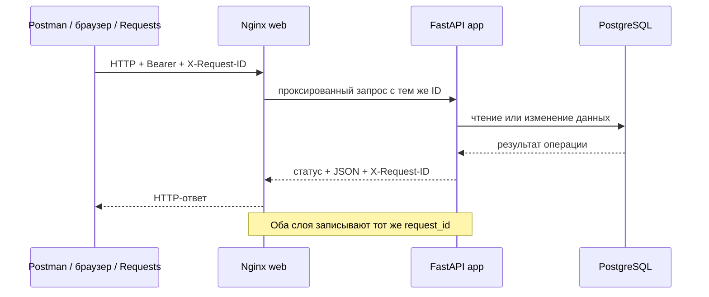

# Практическое задание № 12. API и отладка: от Postman к Requests

## Цель

Собрать компактный воспроизводимый набор проверок REST API и научиться
диагностировать один и тот же запрос на разных уровнях клиент-серверного
приложения: в Postman, браузере, Nginx, FastAPI и автоматическом тесте на Python.

После выполнения работы вы сможете:

- развивать ранее созданную Postman-коллекцию без дублирования запросов;
- строить связанную цепочку регистрации, входа и работы с заявками;
- передавать Bearer-токены через переменные окружения;
- различать назначение `POST`, `GET`, `PATCH`, `PUT` и `DELETE`;
- проверять успешные коды `200`, `201`, `204` и тело каждого ответа;
- различать ошибки `401`, `403`, `404`, `409` и `422`;
- подтверждать отсутствие побочного эффекта после отклонённого запроса;
- связывать запрос и ответ через `X-Request-ID`;
- исследовать фактически отправленный браузером запрос в DevTools Network;
- находить одно обращение в access-журнале Nginx и JSON-журнале FastAPI;
- переносить выбранные ручные сценарии в независимые тесты Pytest + Requests;
- формировать диагностическое сообщение без паролей и Bearer-токенов;
- сравнивать ценность ручного исследования и повторяемого автотеста.

## Практическое задание

Используйте `client-server/fixed` и продолжите работу с личным репозиторием
тестов, Postman-коллекцией и Python-набором из предыдущих практических работ.

Сначала расширьте коллекцию компактным контрактным регрессионным сценарием.
Он должен охватить регистрацию и вход, создание, чтение, изменение статуса и
удаление заявок, Bearer-авторизацию и все основные классы ответа.

Затем выполните один пользовательский сценарий в интерфейсе, исследуйте его в
Chrome DevTools Network и найдите тот же `X-Request-ID` в журналах Nginx и
FastAPI.

В завершение выделите три наиболее содержательных сценария и оформите их как
небольшой независимый набор на Python + Requests. Результатом станет единая
цепочка доказательств:

```text
ручная проверка → браузерное наблюдение → серверные журналы → автотест
```

Рабочая ветка личного репозитория:

```text
practice/12-api-debugging
```

Рекомендуемая структура результата:

```text
mini-tickets-tests/
├── collections/
│   └── postman/
│       ├── mini-tickets-practice-12.postman_collection.json
│       └── local-practice-12.postman_environment.json
├── tests/
│   └── api/
│       └── test_practice_12_contract.py
├── docs/
│   └── test-reports/
│       └── 12/
│           ├── README.md
│           ├── api-status-matrix.md
│           ├── manual-run.md
│           ├── browser-network-and-logs.md
│           └── evidence/
│               ├── postman-run.json
│               ├── pytest-result.txt
│               ├── pytest-results.xml
│               ├── network-request.md
│               ├── nginx-request.json
│               └── fastapi-request.json
└── requirements.txt
```

Коллекцию и вспомогательный Python-код из работ № 8–9 можно перенести,
переработать и дополнить. Если работа выполняется в новом личном репозитории,
стартовая заготовка уже содержит Pytest, Requests, фикстуру адреса приложения и
пример проверки API.

### Диагностическая цепочка



Браузерный интерфейс сам не добавляет `X-Request-ID`. В этом случае Nginx
создаёт допустимое значение, передаёт его FastAPI и возвращает в заголовке
ответа. Postman и Requests задают собственные идентификаторы, чтобы запрос было
легко найти позднее.

### Центральная матрица сценариев

| Код | Метод и путь | Сессия | Основная проверка состояния |
|---:|---|---|---|
| `201` | `POST /api/auth/register` | публичный запрос | создан публичный пользователь |
| `200` | `POST /api/auth/login` | публичный запрос | выдана Bearer-сессия, `Cache-Control: no-store` |
| `201` | `POST /api/tickets` | автор | заявка получила UUID и статус `new` |
| `200` | `GET /api/tickets/{id}` | автор | карточка совпадает с ответом POST |
| `200` | `PATCH /api/tickets/{id}` | автор новой заявки | изменились только переданные поля |
| `200` | `PUT /api/tickets/{id}/status` | оператор | разрешённый переход сохранён |
| `204` | `DELETE /api/tickets/{id}` | автор новой заявки | тело пустое, последующий GET даёт `404` |
| `401` | `GET /api/auth/me` | без Bearer | единая ошибка и `WWW-Authenticate: Bearer` |
| `403` | `PUT /api/tickets/{id}/status` | автор с ролью `user` | статус остался прежним |
| `404` | `GET /api/tickets/{id}` | удалённая или недоступная заявка | сведения о ресурсе не раскрыты |
| `409` | `PUT /api/tickets/{id}/status` | оператор, переход `new → closed` | статус остался `new` |
| `422` | `POST /api/tickets` | автор, `priority: urgent` | новая заявка отсутствует |

Для `DELETE` корректным результатом является `204`, хотя основная матрица
ошибок сосредоточена на кодах `401`, `403`, `404`, `409` и `422`.

## Задание (шаги)

### Шаг 1. Зафиксируйте контекст работы

Перед запуском прочитайте в продуктовом репозитории:

- `variant.json`;
- `docs/ТРЕБОВАНИЯ.md`, разделы `AUTH-01`–`AUTH-03` и `TICKET-01`–`TICKET-05`;
- `contract/openapi.json`;
- `deploy/nginx-client.conf`;
- `backend/main.py` и `backend/logging_setup.py`.

В `docs/test-reports/12/README.md` укажите:

| Параметр | Фактическое значение |
|---|---|
| Ветка продукта | `client-server/fixed` |
| Архитектура / состояние | `client-server` / `fixed` |
| Контракт | значение из `variant.json` |
| Git SHA продукта | результат `git rev-parse HEAD` |
| Адрес приложения | адрес выбранной среды |
| Compose-проект | `mini-student-N` |
| Ветка тестов | `practice/12-api-debugging` |

### Шаг 2. Подготовьте личный репозиторий

Продолжите работу в созданном ранее репозитории тестов:

```powershell
$taskTests = Join-Path $env:USERPROFILE 'repos/mini-tickets-tests'
Set-Location -LiteralPath $taskTests
git switch main
git pull --ff-only origin main
git switch -c practice/12-api-debugging

New-Item -ItemType Directory -Path collections/postman -Force | Out-Null
New-Item -ItemType Directory -Path tests/api -Force | Out-Null
New-Item -ItemType Directory -Path docs/test-reports/12/evidence -Force |
    Out-Null
```

Если ветка уже создана, переключитесь на неё и продолжите текущую работу.

### Шаг 3. Подготовьте продуктовую ветку

Откройте отдельное окно PowerShell:

```powershell
$taskProduct = Join-Path $env:USERPROFILE 'repos/testing'
$taskClient = Join-Path $taskProduct '.worktrees/client-server-fixed'

Set-Location -LiteralPath $taskProduct
git fetch origin

if (!(Test-Path -LiteralPath $taskClient)) {
    git worktree add --detach $taskClient origin/client-server/fixed
}

git -C $taskClient merge --ff-only origin/client-server/fixed
git -C $taskClient status --short
git -C $taskClient rev-parse HEAD
Get-Content -LiteralPath (Join-Path $taskClient 'variant.json')
```

Значения `architecture`, `state` и `contract` перенесите в отчёт.

### Шаг 4. Запустите клиент-серверную среду

В примере используется идентификатор `121`:

```powershell
Set-Location -LiteralPath $taskClient
.\scripts\Start-Student.ps1 -Student 121
Invoke-RestMethod http://localhost:8221/health/ready
docker compose ps
```

Параметры примера:

| Параметр | Значение |
|---|---|
| Web/API | `http://localhost:8221` |
| PostgreSQL | `127.0.0.1:55561` |
| Compose-проект | `mini-student-121` |
| Сервис внешнего входа | `web` — Nginx + Vue |
| Сервис API | `app` — FastAPI |

Для другого положительного номера `N` HTTP-порт равен `8100 + N`, порт
PostgreSQL — `55440 + N`, имя проекта — `mini-student-N`.

Откройте приложение и Swagger:

```text
http://localhost:8221/
http://localhost:8221/docs
```

### Шаг 5. Проверьте локальные зависимости тестов

В личном репозитории проверьте среду:

```powershell
Set-Location -LiteralPath $taskTests
if (!(Test-Path -LiteralPath '.venv/Scripts/python.exe')) {
    py -3.13 -m venv .venv
}

.\.venv\Scripts\python.exe -m pip install -r requirements.txt
.\.venv\Scripts\python.exe --version
.\.venv\Scripts\python.exe -m pytest --version
.\.venv\Scripts\python.exe -c "import requests; print(requests.__version__)"
```

Запишите фактические версии Python, Pytest и Requests в отчёт.

### Шаг 6. Сопоставьте ручные запросы и будущие тесты

Создайте в `api-status-matrix.md` начальную таблицу:

| ID | Требование | Postman-запрос | Python-тест | Состояние до/после |
|---|---|---|---|---|
| `P12-AUTH-401` | `AUTH-02` | `GET /auth/me` без токена | `test_me_requires_bearer` | сессия отсутствует |
| `P12-CRUD` | `TICKET-01`–`03` | create → read → patch → delete | `test_ticket_crud_flow` | создана и удалена одна заявка |
| `P12-STATE` | `TICKET-02`, `TICKET-04` | user/operator PUT, invalid POST | `test_role_state_and_validation` | отклонённые запросы не меняют данные |

Для каждого сценария укажите метод, путь, роль, вход, код, значимые заголовки,
форму JSON и способ проверки состояния.

### Шаг 7. Создайте отдельное Postman-окружение

Продолжите коллекцию практической № 8 либо создайте её копию с названием
`Mini Tickets — Practice 12`.

Добавьте окружение `Mini Tickets — Practice 12 Local`:

| Переменная | Локальное значение | Назначение |
|---|---|---|
| `base_url` | `http://localhost:8221` | внешний адрес среды |
| `user_email` | создаётся при запуске | личный пользователь |
| `user_password` | `LabPassword1!` | локальный тестовый пароль |
| `operator_email` | `operator@example.test` | seed-оператор |
| `operator_password` | `LabPassword1!` | локальный тестовый пароль оператора |
| `user_token` | создаётся входом | Bearer пользователя |
| `operator_token` | создаётся входом | Bearer оператора |
| `lifecycle_ticket_id` | создаётся POST | заявка для ролевого и разрешённого PUT |
| `delete_ticket_id` | создаётся POST | отдельная заявка для DELETE |
| `conflict_ticket_id` | создаётся POST | отдельная новая заявка для `409` |
| `run_id` | создаётся при запуске | общий маркер тестовых данных |
| `request_id` | создаётся перед запросом | корреляция запроса |

Значения токенов и паролей используются только в локальном окружении. Перед
сохранением экспортируемого файла очистите чувствительные current values.

### Шаг 8. Добавьте общий `X-Request-ID`

На уровне коллекции добавьте Pre-request Script:

```javascript
const requestId = `p12-${pm.variables.replaceIn('{{$guid}}')
  .replaceAll('-', '')
  .slice(0, 24)}`;

pm.variables.set('request_id', requestId);
pm.request.headers.upsert({
  key: 'X-Request-ID',
  value: requestId,
});
```

На уровне коллекции добавьте общие Tests:

```javascript
pm.test('X-Request-ID возвращён без изменения', () => {
  pm.expect(pm.response.headers.get('X-Request-ID'))
    .to.eql(pm.variables.get('request_id'));
});

if (pm.response.code !== 204) {
  pm.test('Ответ имеет JSON Content-Type', () => {
    pm.expect(pm.response.headers.get('Content-Type'))
      .to.match(/^application\/json(?:;|$)/);
  });
}

if (pm.response.code >= 400) {
  pm.test('Ошибка содержит связанный request_id', () => {
    const body = pm.response.json();
    pm.expect(body).to.have.property('error');
    pm.expect(body.error.message).to.be.a('string').and.not.empty;
    pm.expect(body.error.request_id)
      .to.eql(pm.response.headers.get('X-Request-ID'));
  });
}
```

Каждый запрос получает новый допустимый идентификатор длиной менее 64 символов.

### Шаг 9. Инициализируйте данные одного запуска

Создайте первым в папке `00 Setup` запрос
`GET {{base_url}}/health/ready`. В его Pre-request Script создайте общий маркер:

```javascript
const runId = pm.variables.replaceIn('{{$guid}}').replaceAll('-', '');
pm.environment.set('run_id', runId);
pm.environment.set('user_email', `p12-${runId}@example.test`);
```

В Tests проверьте готовность среды:

```javascript
pm.test('Среда готова', () => {
  pm.response.to.have.status(200);
  pm.expect(pm.response.json().status).to.eql('ready');
});
```

Тот же `run_id` используйте в заголовках заявок и комментариях. Он связывает
артефакты одного запуска и предотвращает конфликт с предыдущими данными.

### Шаг 10. Выполните регистрацию и вход пользователя

Создайте папку коллекции `01 Auth` и запросы:

1. `POST {{base_url}}/api/auth/register` → `201`;
2. `POST {{base_url}}/api/auth/login` → `200`;
3. `GET {{base_url}}/api/auth/me` → `200`.

Тело регистрации и входа:

```json
{
  "email": "{{user_email}}",
  "password": "{{user_password}}"
}
```

В Tests запроса входа сохраните токен только в активном окружении:

```javascript
pm.test('Вход успешен', () => pm.response.to.have.status(200));
pm.test('Токен не разрешено кэшировать', () => {
  pm.expect(pm.response.headers.get('Cache-Control')).to.eql('no-store');
});

const body = pm.response.json();
pm.expect(body.token_type).to.eql('bearer');
pm.environment.set('user_token', body.access_token);
```

Для защищённых запросов используйте Bearer Token `{{user_token}}`.

### Шаг 11. Получите отдельную сессию оператора

Создайте запрос `POST /api/auth/login` с `operator_email` и
`operator_password`. Сохраните результат в `operator_token`:

```javascript
pm.test('Оператор вошёл', () => pm.response.to.have.status(200));
pm.environment.set('operator_token', pm.response.json().access_token);
```

Явно называйте используемый токен в каждом запросе. Так запрос с ролью
оператора не будет случайно выполнен от имени обычного пользователя.

### Шаг 12. Создайте две независимые заявки

В папке `02 Positive CRUD` дважды выполните `POST /api/tickets` с Bearer
пользователя.

Заявка жизненного цикла:

```json
{
  "title": "P12 lifecycle {{run_id}}",
  "priority": "high"
}
```

Заявка удаления:

```json
{
  "title": "P12 delete {{run_id}}",
  "priority": "normal"
}
```

Проверки каждого ответа:

- код `201`;
- UUID присутствует;
- `author_id` совпадает с текущим пользователем;
- заголовок и приоритет совпадают с запросом;
- статус назначен сервером и равен `new`;
- `created_at` содержит дату со смещением UTC.

Сохраните идентификаторы в `lifecycle_ticket_id` и `delete_ticket_id`.

### Шаг 13. Проверьте чтение и PATCH

Для `lifecycle_ticket_id` выполните:

```text
GET   /api/tickets/{id}
GET   /api/tickets?status=new
PATCH /api/tickets/{id}
GET   /api/tickets/{id}
```

Тело PATCH:

```json
{
  "title": "P12 updated {{run_id}}",
  "priority": "low"
}
```

Сопоставьте UUID и `created_at` до и после изменения. Проверьте новое название и
приоритет, а также сохранение `author_id` и статуса `new`.

### Шаг 14. Проверьте DELETE и пустой ответ

Удалите отдельную заявку `delete_ticket_id` Bearer-токеном её автора:

```text
DELETE /api/tickets/{{delete_ticket_id}} → 204
GET    /api/tickets/{{delete_ticket_id}} → 404
```

Для DELETE добавьте:

```javascript
pm.test('Удаление вернуло 204', () => pm.response.to.have.status(204));
pm.test('Тело ответа пустое', () => {
  pm.expect(pm.response.text()).to.eql('');
});
```

Последующий `404` подтверждает наблюдаемое состояние, а не только код операции
удаления.

### Шаг 15. Разделите `403` и успешный `PUT`

Используйте заявку `lifecycle_ticket_id`:

1. Обычный пользователь отправляет
   `PUT /api/tickets/{id}/status` с `{"status":"active"}` и получает `403`.
2. Контрольный GET пользователя показывает прежний статус `new`.
3. Оператор отправляет тот же PUT и получает `200`.
4. Контрольный GET оператора показывает статус `active`.

`403` проверяет разрешение на действие при существующей действующей сессии.
`401` здесь был бы признаком проблемы с авторизацией, а не с ролью.

### Шаг 16. Получите `409` без смешения с `403`

Создайте отдельную новую заявку с заголовком `P12 conflict {{run_id}}`. В Tests
её POST-запроса сохраните UUID:

```javascript
pm.test('Заявка для конфликта создана', () => {
  pm.response.to.have.status(201);
});
pm.environment.set('conflict_ticket_id', pm.response.json().id);
```

От имени оператора попробуйте выполнить переход `new → closed`:

```http
PUT /api/tickets/{{conflict_ticket_id}}/status
Authorization: Bearer {{operator_token}}
Content-Type: application/json

{"status":"closed"}
```

Ожидается `409`. Повторный GET автора должен по-прежнему показывать `new`.
После проверки удалите эту заявку Bearer-токеном автора и проверьте `204` с
пустым телом. Такой сценарий полностью повторяется в Collection Runner без
ручной подстановки UUID.

Дополнительный конфликт состояния можно наблюдать при DELETE заявки в статусе
`active`: автор получает `409`, а заявка остаётся доступной.

### Шаг 17. Проверьте `401`

Создайте два запроса `GET /api/auth/me`:

- без заголовка `Authorization`;
- с `Authorization: Bearer p12-invalid-token`.

Для каждого ответа проверьте:

- код `401`;
- `WWW-Authenticate: Bearer`;
- `Content-Type: application/json`;
- непустой `error.message`;
- совпадение `error.request_id` и `X-Request-ID`.

### Шаг 18. Проверьте `404`

Используйте два источника `404`:

1. GET удалённой заявки по `delete_ticket_id`;
2. GET по случайному корректному UUID.

Сравните форму ответов. Для проверки разграничения доступа можно создать второго
пользователя и запросить UUID чужой заявки: контракт также возвращает `404`, не
раскрывая факт её существования.

### Шаг 19. Проверьте `422` и состояние после ошибки

До запроса получите список заявок пользователя и сохраните множество UUID.
Затем отправьте:

```json
{
  "title": "P12 invalid {{run_id}}",
  "priority": "urgent"
}
```

Проверьте:

- код `422`;
- `error.message`;
- массив `error.fields` с путём ошибочного поля;
- совпадение идентификаторов запроса в теле и заголовке;
- отсутствие нового UUID в списке после запроса;
- отсутствие заголовка с уникальным маркером в списке.

Так результат отличает корректный отказ от ответа `422`, после которого данные
всё же изменились.

### Шаг 20. Заполните фактическую статусную матрицу

В `api-status-matrix.md` заполните строки:

| ID | Метод | Путь | Роль | Ожидалось | Получено | Request ID | Проверка состояния |
|---|---|---|---|---:|---:|---|---|
| `P12-201` | POST | `/api/tickets` | user | 201 |  |  | GET возвращает UUID |
| `P12-200` | PUT | `/api/tickets/{id}/status` | operator | 200 |  |  | статус изменён |
| `P12-401` | GET | `/api/auth/me` | anonymous | 401 |  |  | пользователь не возвращён |
| `P12-403` | PUT | `/api/tickets/{id}/status` | user | 403 |  |  | статус прежний |
| `P12-404` | GET | `/api/tickets/{id}` | user | 404 |  |  | удалённая запись недоступна |
| `P12-409` | PUT | `/api/tickets/{id}/status` | operator | 409 |  |  | переход не применён |
| `P12-422` | POST | `/api/tickets` | user | 422 |  |  | invalid-маркер отсутствует |

Добавьте строки для GET, PATCH и DELETE успешной CRUD-цепочки.

### Шаг 21. Повторите коллекцию как единый запуск

Запустите коллекцию через Collection Runner. Порядок папок:

```text
00 Setup
01 Auth
02 Positive CRUD
03 Roles and states
04 Error contract
05 Cleanup
```

Перед повторным запуском запрос `00 Setup` создаёт новый `run_id`. После прогона
сохраните сводку кодов, количество проверок и перечень request ID в
`manual-run.md`.

Очистите значения `user_token`, `operator_token`, `user_password` и
`operator_password`, затем экспортируйте коллекцию и окружение в
`collections/postman`.

### Шаг 22. Создайте компактный файл Requests-тестов

Создайте `tests/api/test_practice_12_contract.py`. Пример ниже использует
простые `requests.Session`, поэтому видны HTTP-операции. В существующем наборе
из практической № 9 те же сценарии можно реализовать через готовые `ApiClient`,
фикстуры и общие assertions.

```python
"""Компактный регрессионный набор API для практической работы № 12."""

import os
from uuid import uuid4

import pytest
import requests


TIMEOUT = float(os.getenv("API_TIMEOUT_SECONDS", "10"))
USER_PASSWORD = os.getenv("TEST_USER_PASSWORD", "LabPassword1!")
OPERATOR_EMAIL = os.getenv("TEST_OPERATOR_EMAIL", "operator@example.test")
OPERATOR_PASSWORD = os.getenv("TEST_OPERATOR_PASSWORD", "LabPassword1!")


@pytest.fixture(scope="session")
def practice_url() -> str:
    """Вернуть внешний адрес выбранной среды без завершающего слеша."""
    return os.getenv("BASE_URL", "http://127.0.0.1:8000").rstrip("/")


def send(
    session: requests.Session,
    method: str,
    url: str,
    path: str,
    **kwargs,
) -> requests.Response:
    """Отправить запрос с уникальным безопасным идентификатором."""
    headers = dict(kwargs.pop("headers", {}))
    headers["X-Request-ID"] = f"p12-{uuid4().hex[:24]}"
    return session.request(
        method,
        f"{url.rstrip('/')}/api{path}",
        headers=headers,
        timeout=TIMEOUT,
        **kwargs,
    )


def coordinates(response: requests.Response) -> str:
    """Вернуть безопасные координаты ответа без токена и тела запроса."""
    return (
        f"{response.request.method} {response.request.url}; "
        f"status={response.status_code}; "
        f"request_id={response.request.headers.get('X-Request-ID', 'missing')}"
    )


def assert_json(response: requests.Response, expected_status: int):
    """Проверить код, JSON Content-Type и сквозной идентификатор запроса."""
    message = coordinates(response)
    assert response.status_code == expected_status, message
    assert response.headers.get("Content-Type", "").startswith(
        "application/json"
    ), message
    sent = response.request.headers["X-Request-ID"]
    assert response.headers.get("X-Request-ID") == sent, message
    return response.json()


def assert_error(response: requests.Response, expected_status: int) -> dict:
    """Проверить единый конверт ошибки и request_id внутри него."""
    body = assert_json(response, expected_status)
    message = coordinates(response)
    assert set(body) == {"error"}, message
    assert body["error"].get("message"), message
    assert (
        body["error"]["request_id"] == response.headers["X-Request-ID"]
    ), message
    return body


def register_and_login(session: requests.Session, url: str) -> dict:
    """Создать уникального пользователя и установить Bearer текущей сессии."""
    email = f"p12-{uuid4().hex}@example.test"
    credentials = {"email": email, "password": USER_PASSWORD}

    registered = assert_json(
        send(session, "POST", url, "/auth/register", json=credentials),
        201,
    )
    login_response = send(session, "POST", url, "/auth/login", json=credentials)
    login = assert_json(login_response, 200)
    assert login_response.headers.get("Cache-Control") == "no-store"
    session.headers["Authorization"] = f"Bearer {login['access_token']}"
    return registered


def login_operator(session: requests.Session, url: str) -> None:
    """Установить в отдельной сессии Bearer seed-оператора."""
    response = send(
        session,
        "POST",
        url,
        "/auth/login",
        json={"email": OPERATOR_EMAIL, "password": OPERATOR_PASSWORD},
    )
    login = assert_json(response, 200)
    session.headers["Authorization"] = f"Bearer {login['access_token']}"


@pytest.mark.api
@pytest.mark.requirement("AUTH-02")
def test_me_requires_bearer(practice_url: str) -> None:
    """Вернуть 401 и Bearer challenge для запроса без сессии."""
    with requests.Session() as anonymous:
        response = send(anonymous, "GET", practice_url, "/auth/me")

    assert_error(response, 401)
    assert response.headers.get("WWW-Authenticate") == "Bearer"


@pytest.mark.api
@pytest.mark.requirement("TICKET-01")
@pytest.mark.requirement("TICKET-02")
@pytest.mark.requirement("TICKET-03")
def test_ticket_crud_flow(practice_url: str) -> None:
    """Сопоставить POST, GET, PATCH, DELETE и состояние после удаления."""
    with requests.Session() as user:
        current_user = register_and_login(user, practice_url)
        title = f"P12 CRUD {uuid4().hex}"

        created = assert_json(
            send(
                user,
                "POST",
                practice_url,
                "/tickets",
                json={"title": title, "priority": "normal"},
            ),
            201,
        )
        assert created["author_id"] == current_user["id"]
        assert created["title"] == title
        assert created["status"] == "new"

        detail = assert_json(
            send(user, "GET", practice_url, f"/tickets/{created['id']}"),
            200,
        )
        assert detail == created

        updated_title = f"P12 updated {uuid4().hex}"
        updated = assert_json(
            send(
                user,
                "PATCH",
                practice_url,
                f"/tickets/{created['id']}",
                json={"title": updated_title, "priority": "high"},
            ),
            200,
        )
        assert updated["id"] == created["id"]
        assert updated["title"] == updated_title
        assert updated["priority"] == "high"
        assert updated["status"] == "new"

        deleted = send(
            user,
            "DELETE",
            practice_url,
            f"/tickets/{created['id']}",
        )
        assert deleted.status_code == 204, coordinates(deleted)
        assert deleted.content == b"", coordinates(deleted)
        assert (
            deleted.headers.get("X-Request-ID")
            == deleted.request.headers["X-Request-ID"]
        )

        missing = send(
            user,
            "GET",
            practice_url,
            f"/tickets/{created['id']}",
        )
        assert_error(missing, 404)


@pytest.mark.api
@pytest.mark.requirement("TICKET-02")
@pytest.mark.requirement("TICKET-04")
def test_role_state_and_validation(practice_url: str) -> None:
    """Разделить 403, успешный идемпотентный PUT, 409 и 422."""
    with requests.Session() as user, requests.Session() as operator:
        register_and_login(user, practice_url)
        login_operator(operator, practice_url)

        marker = uuid4().hex
        created = assert_json(
            send(
                user,
                "POST",
                practice_url,
                "/tickets",
                json={"title": f"P12 roles {marker}", "priority": "low"},
            ),
            201,
        )
        ticket_path = f"/tickets/{created['id']}"

        denied = send(
            user,
            "PUT",
            practice_url,
            ticket_path + "/status",
            json={"status": "active"},
        )
        assert_error(denied, 403)

        unchanged = assert_json(
            send(user, "GET", practice_url, ticket_path),
            200,
        )
        assert unchanged["status"] == "new"

        idempotent = assert_json(
            send(
                operator,
                "PUT",
                practice_url,
                ticket_path + "/status",
                json={"status": "new"},
            ),
            200,
        )
        assert idempotent["status"] == "new"

        conflict = send(
            operator,
            "PUT",
            practice_url,
            ticket_path + "/status",
            json={"status": "closed"},
        )
        assert_error(conflict, 409)

        before = assert_json(send(user, "GET", practice_url, "/tickets"), 200)
        before_ids = {ticket["id"] for ticket in before}

        invalid = send(
            user,
            "POST",
            practice_url,
            "/tickets",
            json={"title": f"P12 invalid {marker}", "priority": "urgent"},
        )
        invalid_body = assert_error(invalid, 422)
        assert invalid_body["error"].get("fields")

        after = assert_json(send(user, "GET", practice_url, "/tickets"), 200)
        assert {ticket["id"] for ticket in after} == before_ids
        assert all(
            ticket["title"] != f"P12 invalid {marker}"
            for ticket in after
        )

        still_new = assert_json(
            send(user, "GET", practice_url, ticket_path),
            200,
        )
        assert still_new["status"] == "new"

        cleanup = send(user, "DELETE", practice_url, ticket_path)
        assert cleanup.status_code == 204, coordinates(cleanup)
        assert cleanup.content == b"", coordinates(cleanup)
        assert (
            cleanup.headers.get("X-Request-ID")
            == cleanup.request.headers["X-Request-ID"]
        )
```

Три теста отвечают на разные вопросы:

1. требуется ли Bearer для защищённого маршрута;
2. работает ли успешная CRUD-цепочка и её итоговое состояние;
3. различаются ли запрет роли, допустимый PUT, конфликт состояния и ошибка
   входных данных.

### Шаг 23. Запустите только новый API-набор

Из корня личного репозитория:

```powershell
Set-Location -LiteralPath $taskTests
$env:BASE_URL = 'http://localhost:8221'

.\.venv\Scripts\python.exe -m pytest `
    tests/api/test_practice_12_contract.py `
    -q `
    --junitxml=docs/test-reports/12/evidence/pytest-results.xml `
    2>&1 | Tee-Object `
        -FilePath docs/test-reports/12/evidence/pytest-result.txt
```

Запустите файл повторно. Уникальные email и заголовки должны исключать влияние
предыдущего запуска, а CRUD-тест и тест ролей завершаются удалением своих новых
заявок.

### Шаг 24. Сопоставьте Postman и Requests

Заполните таблицу в отчёте:

| Свойство | Postman | Pytest + Requests |
|---|---|---|
| Подготовка уникального пользователя |  |  |
| Управление Bearer |  |  |
| Связывание запросов |  |  |
| Проверка JSON |  |  |
| Проверка состояния после ошибки |  |  |
| Повторный запуск |  |  |
| Диагностика падения |  |  |

Для каждого из трёх автоматизированных сценариев укажите соответствующие
Postman-запросы и расхождения в глубине проверок.

### Шаг 25. Исследуйте запрос интерфейса в DevTools Network

Откройте `http://localhost:8221`, затем Chrome DevTools → Network и включите
фильтр `Fetch/XHR`.

В интерфейсе:

1. войдите как `anna@example.test` с паролем `LabPassword1!`;
2. измените фильтр списка заявок на «Новая»;
3. выберите запрос `GET /api/tickets?status=new`.

Зафиксируйте в `network-request.md`:

- Request URL и метод;
- query-параметр `status=new`;
- код ответа;
- наличие Bearer в фактически отправленных заголовках с замаскированным
  значением;
- Response Headers, включая `X-Request-ID`;
- JSON Preview/Response;
- Timing;
- Initiator.

Network показывает реальный запрос Vue-приложения. Он дополняет прямую
Postman-проверку и помогает отделить ошибку API от ошибки отображения.

### Шаг 26. Найдите браузерный запрос в Nginx и FastAPI

Скопируйте `X-Request-ID` из Response Headers DevTools:

```powershell
$requestId = 'ВСТАВЬТЕ_REQUEST_ID_ИЗ_NETWORK'
Set-Location -LiteralPath $taskClient

docker compose -p mini-student-121 logs --no-color --since 30m web |
    Select-String -SimpleMatch $requestId

docker compose -p mini-student-121 exec -T app `
    grep -F -- $requestId /app/logs/all.log
```

В access-записи Nginx сопоставьте:

- `request_id`;
- метод;
- путь;
- статус;
- общую и upstream-длительность.

В JSON-записи FastAPI сопоставьте:

- тот же `request_id`;
- `service: all`;
- `event: HTTP-запрос`;
- шаблон пути `/api/tickets`;
- статус;
- `duration_ms`;
- `run_id` процесса.

Сохраните только найденные строки в `nginx-request.json` и
`fastapi-request.json`. Query string, тело и Bearer в эти журналы не входят;
фактические входные данные подтверждаются вкладкой Network.

### Шаг 27. Составьте диагностическую карточку

Оформите `browser-network-and-logs.md`:

```markdown
# Диагностика одного запроса

- Сценарий:
- Источник запроса: Vue UI
- Метод и URL:
- Ожидаемый и фактический код:
- X-Request-ID:
- Наблюдение Network:
- Наблюдение Nginx:
- Наблюдение FastAPI:
- Что подтверждает каждый источник:
- Какие данные этим источником не подтверждаются:
- Итоговый вывод:
```

Отдельно объясните разницу:

- Network подтверждает фактически отправленные URL, query, заголовки и JSON;
- Nginx подтверждает прохождение через внешний HTTP-вход;
- FastAPI подтверждает обработанный маршрут, код и длительность приложения;
- API-тест подтверждает ожидаемые значения и бизнес-инвариант;
- PostgreSQL в этой работе остаётся внутренней зависимостью, исследованной в
  практических № 10–11.

### Шаг 28. Подготовьте итоговый отчёт и зафиксируйте результат

Структура `docs/test-reports/12/README.md`:

```markdown
# API и отладка: от Postman к Requests

## Версия продукта и параметры среды
## Источники ожидаемого поведения
## Карта ручных и автоматических проверок
## Статусная матрица
## Положительная CRUD-цепочка
## Авторизация, роли и состояния
## Ошибки 401, 403, 404, 409 и 422
## Результат Postman Runner
## Результат Pytest + Requests
## Исследование Chrome DevTools Network
## Корреляция Nginx и FastAPI по X-Request-ID
## Сравнение ручной и автоматической проверки
## Итоговый вывод и остаточные риски
```

Проверьте изменения и сохраните их в своей ветке:

```powershell
Set-Location -LiteralPath $taskTests
git diff --check
git status --short
git add collections tests/api docs/test-reports/12
git commit -m 'Добавлены проверки API и диагностический сценарий'
git status --short
```

После фиксации результата среду можно остановить из worktree продукта:

```powershell
Set-Location -LiteralPath $taskClient
docker compose -p mini-student-121 down
```

### Шаг 29. Опубликуйте ветку и проверьте CI

Отправьте один и тот же коммит в оба репозитория личных работ:

```powershell
Set-Location -LiteralPath $taskTests
git push -u origin practice/12-api-debugging
git push -u gitlab practice/12-api-debugging
git rev-parse HEAD
git ls-remote origin refs/heads/practice/12-api-debugging
git ls-remote gitlab refs/heads/practice/12-api-debugging
```

Порядок работы с двумя remote и перенос результата после merge приведены в
[инструкции синхронизации GitHub и GitLab](../СИНХРОНИЗАЦИЯ-GITHUB-GITLAB.md#один-коммит-для-pr-и-mr).

Откройте PR и MR из `practice/12-api-debugging` в `main`. В описании укажите ручную
CRUD-цепочку, коды `401/403/404/409/422`, путь к Requests-тестам и диагностическую
карточку. Проверьте запуски GitHub Actions и GitLab CI для текущего SHA:

- событие и целевую ветку;
- job с API-тестами и фактическую команду Pytest;
- первую значимую строку при ошибке либо завершение всех команд;
- JUnit и другие опубликованные артефакты;
- одинаковый результат одного commit SHA на обеих площадках.

Добавьте ссылки на workflow и pipeline в описание PR/MR. Если при уточнении
тестов или конфигурации появился новый коммит, отправьте его в оба remote и
сопоставьте уже запуски нового SHA.

## Подсказки по ключевым частям

### Практическая № 12 связывает, а не повторяет работы № 8–9

Работа № 8 дала полный ручной каталог запросов, а № 9 — расширенный каркас
API-тестов и диагностику buggy-варианта. Здесь выбирается небольшой регрессионный
набор и для каждого сценария строится одна связная линия доказательств.

### Метод является частью проверяемого контракта

`PATCH /tickets/{id}` изменяет поля заявки, а
`PUT /tickets/{id}/status` передаёт новое состояние. Совпадающее JSON-тело не
делает методы взаимозаменяемыми.

### `204` проверяется отдельно от JSON-ответов

Успешный DELETE возвращает пустое тело. Универсальная попытка вызвать `.json()`
для `204` создаёт ошибку теста, хотя продукт ответил правильно.

### Bearer подтверждает сессию, но не любое действие

`401` означает отсутствие действующей сессии. `403` означает, что сессия
действительна, ресурс известен, но роль не разрешает операцию.

### `404` скрывает и отсутствие, и недоступность

Одинаковая форма ответа для чужого и отсутствующего ресурса уменьшает раскрытие
данных. Проверка права выполняется отдельными пользователями, а не по тексту
сообщения.

### `409` и `422` относятся к разным причинам

`422` сообщает, что вход не соответствует контракту. `409` означает, что
корректно сформированная операция конфликтует с текущим состоянием или
уникальностью данных.

### Код ответа является началом проверки

Для успешного запроса проверяйте публичные поля и сохранённое состояние. Для
ошибки проверяйте конверт, request ID и отсутствие нежелательного изменения.

### Каждая роль получает отдельную HTTP-сессию

Один `requests.Session` хранит один Bearer. Отдельные сессии пользователя и
оператора делают принадлежность каждого действия явной.

### Уникальный marker делает запуск повторяемым

UUID в email и заголовке отделяет данные текущего запуска. Повторение с новым
маркером проверяет инварианты, а не случайное совпадение с прежней записью.

### `X-Request-ID` должен быть диагностическим, а не секретным

Используйте символы `[A-Za-z0-9_-]` и длину до 64. Идентификатор можно хранить в
отчёте и использовать для поиска, потому что он не содержит учётных данных.

### Request ID ошибки проверяется в двух местах

Для ошибки значение из response header должно совпадать с
`error.request_id`. Это связывает транспортный ответ с его JSON-телом.

### Browser Network и серверный журнал отвечают на разные вопросы

Network показывает фактический запрос, включая query и заголовки. Журнал
подтверждает прохождение запроса через слой, но намеренно не хранит Bearer и
тело.

### Nginx и FastAPI используют один идентификатор

В `client-server/fixed` запрос проходит через `web` к одному API-сервису `app`.
Совпадение ID, метода, пути и статуса связывает два уровня без предположений по
времени.

### Безопасная диагностика начинается с координат

Для сообщения падения обычно достаточно метода, URL, кода и request ID.
Добавляйте ограниченный фрагмент ответа после маскирования чувствительных полей.

### Postman Runner проверяет порядок, Pytest — независимость

Связанная Postman-цепочка удобна для исследования бизнес-потока. Независимые
тесты сами создают предусловия и дают более устойчивый повторный регресс.

### Проверка состояния после отказа усиливает негативный тест

После `403`, `409` или `422` повторный GET или список показывает, что запрещённое
изменение не применилось.

## Что проверить перед отправкой (чек-лист)

- [ ] Работа находится в ветке `practice/12-api-debugging` личного репозитория.
- [ ] В отчёте указаны `client-server/fixed`, Git SHA и `variant.json`.
- [ ] Зафиксированы адрес среды и Compose-проект.
- [ ] `/health/ready` отвечает успешно, сервисы `web`, `app` и `db` готовы.
- [ ] Фактические версии Python, Pytest и Requests записаны в отчёте.
- [ ] Postman-коллекция продолжает материалы предыдущих работ.
- [ ] Окружение содержит отдельные переменные пользователя и оператора.
- [ ] Каждый запрос получает новый допустимый `X-Request-ID`.
- [ ] Регистрация проверена с кодом `201`.
- [ ] Вход проверен с кодом `200` и `Cache-Control: no-store`.
- [ ] Bearer пользователя и оператора применяются к правильным запросам.
- [ ] POST заявки проверен с кодом `201` и серверными полями.
- [ ] GET карточки и списка проверен с кодом `200`.
- [ ] PATCH проверяет изменение полей и сохранение остальных значений.
- [ ] PUT пользователя возвращает `403` и сохраняет прежний статус.
- [ ] PUT оператора выполняет разрешённый сценарий с кодом `200`.
- [ ] Недопустимый переход возвращает `409` и не меняет статус.
- [ ] DELETE возвращает `204` с пустым телом.
- [ ] GET удалённой заявки возвращает `404`.
- [ ] Запрос без Bearer возвращает `401` и Bearer challenge.
- [ ] Неверный приоритет возвращает `422` с `error.fields`.
- [ ] После `422` отсутствует заявка с invalid-маркером.
- [ ] Для каждой ошибки request ID тела совпадает с заголовком.
- [ ] Статусная матрица содержит ожидаемые и фактические результаты.
- [ ] Коллекция повторно запускается с новым `run_id`.
- [ ] Из экспортов удалены токены и пароли.
- [ ] Реализованы три самостоятельных Requests-теста.
- [ ] Тесты используют внешний `BASE_URL` и единый тайм-аут.
- [ ] Пользователь и оператор представлены разными `requests.Session`.
- [ ] CRUD-тест проверяет POST, GET, PATCH, DELETE и последующий `404`.
- [ ] Тест ролей различает `403`, `200`, `409` и `422`.
- [ ] Автоматические запросы получают отдельные request ID.
- [ ] Локальный запуск тестового файла сохранён в evidence.
- [ ] В DevTools исследован фактический UI-запрос.
- [ ] Из Network зафиксированы URL, метод, query, статус, заголовки и ответ.
- [ ] Bearer на скриншотах и в описании замаскирован.
- [ ] Один request ID найден в Nginx и FastAPI.
- [ ] Сохранены только относящиеся строки журналов.
- [ ] В отчёте объяснена ценность каждого диагностического источника.
- [ ] Один SHA опубликован в ветке `practice/12-api-debugging` на GitHub и
      GitLab.
- [ ] PR и MR направлены в `main`, а их описания связывают сценарии, код тестов
      и отчёт.
- [ ] Для текущего SHA просмотрены GitHub Actions и GitLab CI, команды API-
      тестов, журналы и опубликованные артефакты.
- [ ] `git diff --check` не сообщает о проблемах форматирования.
- [ ] В коммит входят коллекция, тесты и отчётные материалы работы.

## Советы по улучшению работы

- Группируйте Postman-запросы по назначению, а не только по HTTP-методу.
- Размещайте повторяемые проверки заголовков на уровне коллекции.
- Создавайте request ID централизованно, чтобы каждый запрос имел одинаковый
  формат корреляции.
- Называйте переменные `user_token` и `operator_token`, а не общим `token`.
- Используйте разные заявки для удаления и исследования переходов состояния.
- Сохраняйте исходный UUID сразу после POST и передавайте его следующим
  запросам через переменную.
- Сопоставляйте POST, GET и PATCH по полному набору стабильных полей.
- После негативной операции выполняйте контрольный запрос состояния.
- Добавляйте JSON Schema для публичных моделей после стабилизации основных
  бизнес-проверок.
- Выносите общие Python-проверки в функции после появления реального
  повторения, сохраняя тестовые сценарии читаемыми.
- Указывайте request ID в сообщении assertion, чтобы падение можно было найти в
  журнале без повторного запуска.
- Храните адрес, тайм-аут и локальные учётные данные в переменных среды.
- Разделяйте сырые evidence и краткие выводы отчёта.
- Используйте Preserve log в DevTools, когда действие вызывает переход или
  перезагрузку страницы.
- Фильтруйте Network по `/api/`, чтобы отделить API от статических ресурсов.
- Сверяйте request ID, метод, путь и код сразу в двух журналируемых слоях.
- Повторяйте коллекцию и тесты с новыми уникальными данными.
- Формулируйте вывод как проверенный инвариант: что было отправлено, обработано
  и сохранено либо отклонено.
