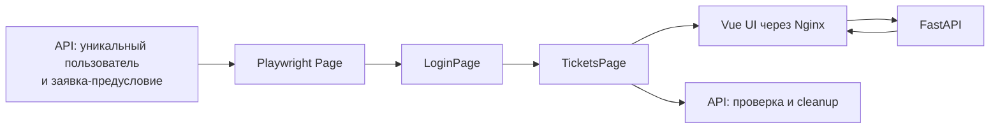

# Практическое задание № 13. Автоматизация UI на Playwright

## Цель

Научиться создавать устойчивые автоматизированные проверки пользовательского
интерфейса на Python + Pytest + Playwright, отделять подготовку данных от
действий пользователя и собирать диагностические артефакты браузерного теста.

После выполнения работы вы сможете:

- подготавливать уникального пользователя и заявки через REST API;
- использовать API только для предусловий и очистки UI-сценария;
- организовывать браузерный код по паттерну Page Object;
- выбирать локаторы по ролям, подписям и доступным атрибутам;
- применять `data-testid` для объекта с известным серверным UUID;
- использовать автоматические ожидания Playwright и проверки `expect`;
- проверять создание заявки через интерфейс;
- сопоставлять состояние формы, карточки и строки таблицы;
- проверять обновление приоритета без перезагрузки страницы;
- подтверждать результат UI-действия через публичный API;
- выполнять одни сценарии в desktop- и compact-разрешении;
- сохранять screenshot и trace при падении;
- локализовывать причину сбоя по шагам, DOM, сети и снимку экрана;
- поддерживать независимость и повторяемость UI-тестов.

## Практическое задание

Используйте `client-server/fixed` и продолжите личный репозиторий тестов.
Подготовьте Page Object для рабочего пространства заявок, API-помощник для
уникальных предусловий и два полноценных UI-сценария:

1. зарегистрировать пользователя через API, войти через интерфейс, создать
   заявку в форме и проверить результат в карточке и таблице;
2. зарегистрировать пользователя и создать заявку через API, открыть её через
   интерфейс, изменить приоритет и проверить синхронизацию карточки и строки
   списка без перезагрузки страницы.

Каждый сценарий выполняется в двух размерах viewport. Подготовка и очистка
выполняются публичным API, а проверяемое действие — через настоящий интерфейс
Vue в браузере Chromium.

Рабочая ветка личного репозитория:

```text
practice/13-ui-playwright
```

Рекомендуемая структура результата:

```text
mini-tickets-tests/
├── pages/
│   ├── __init__.py
│   ├── login_page.py
│   └── tickets_page.py
├── support/
│   ├── __init__.py
│   └── ui_setup.py
├── tests/
│   └── ui/
│       └── test_practice_13_tickets.py
├── docs/
│   └── test-reports/
│       └── 13/
│           ├── README.md
│           ├── locator-map.md
│           ├── scenario-results.md
│           └── evidence/
│               ├── pytest-result.txt
│               └── pytest-results.xml
├── conftest.py
├── pytest.ini
└── requirements.txt
```

Диагностические screenshots, traces и Allure-данные сохраняются локально в
`artifacts/practice-13`. Этот каталог уже исключён из Git стартовой заготовкой
и будет использоваться CI в следующей практической работе.

### Граница UI-теста



API создаёт изолированное состояние быстрее и точнее, чем повторение всех
подготовительных действий через форму. UI-тест сохраняет фокус на наблюдаемом
поведении пользователя: вводе, кликах, сообщениях, карточке и таблице.

### Два основных сценария

| ID | Предусловие API | Действие UI | Наблюдаемый результат |
|---|---|---|---|
| `P13-UI-01` | уникальный пользователь | вход и создание заявки | сообщение, карточка и строка списка согласованы |
| `P13-UI-02` | пользователь и новая заявка с `priority=low` | открыть карточку и выбрать `high` | карточка и строка списка показывают новое значение без reload |

### Стратегия локаторов

| Элемент | Основной локатор | Причина |
|---|---|---|
| Заголовок экрана входа | `get_by_role("heading", name="Вход в систему")` | доступное имя и роль |
| Email и пароль | `get_by_label(...)` | связь `label` и поля |
| Кнопка входа | `get_by_role("button", name="Войти")` | пользовательское действие |
| Форма новой заявки | поля через `get_by_label(...)` | устойчивость к вёрстке |
| Сообщение результата | `get_by_role("status")` | семантика уведомления |
| Таблица заявок | `get_by_role("table", name="Список заявок")` | доступное имя таблицы |
| Известная заявка | `get_by_test_id("ticket-<uuid>")` | точный серверный объект |
| Приоритет строки | `row.get_by_test_id("ticket-priority")` | значение внутри конкретной строки |
| Карточка | `get_by_role("complementary", name="Карточка заявки")` | именованная область интерфейса |

## Задание (шаги)

### Шаг 1. Зафиксируйте контекст UI-проверки

В продуктовом репозитории изучите:

- `variant.json`;
- `docs/ТРЕБОВАНИЯ.md`, требования `UI-01`–`UI-03` и `TICKET-01`–`TICKET-03`;
- `frontend/src/App.vue`;
- `frontend/src/behavior.js`;
- `student-template/pages/login_page.py`;
- `student-template/tests/ui/test_example.py`;
- `student-template/pytest.ini` и `requirements.txt`.

В `docs/test-reports/13/README.md` зафиксируйте:

| Параметр | Фактическое значение |
|---|---|
| Ветка продукта | `client-server/fixed` |
| Архитектура / состояние | `client-server` / `fixed` |
| Контракт | значение из `variant.json` |
| Git SHA | результат `git rev-parse HEAD` |
| Адрес UI | адрес выбранной среды |
| Браузер | Chromium и фактическая версия |
| Viewport | `desktop` и `compact` |
| Ветка тестов | `practice/13-ui-playwright` |

### Шаг 2. Подготовьте личный репозиторий

```powershell
$taskTests = Join-Path $env:USERPROFILE 'repos/mini-tickets-tests'
Set-Location -LiteralPath $taskTests
git switch main
git pull --ff-only origin main
git switch -c practice/13-ui-playwright

New-Item -ItemType Directory -Path pages -Force | Out-Null
New-Item -ItemType Directory -Path support -Force | Out-Null
New-Item -ItemType Directory -Path tests/ui -Force | Out-Null
New-Item -ItemType Directory -Path docs/test-reports/13/evidence -Force |
    Out-Null
New-Item -ItemType File -Path pages/__init__.py -Force | Out-Null
New-Item -ItemType File -Path support/__init__.py -Force | Out-Null
```

Если ветка уже существует, переключитесь на неё и продолжите текущую работу.

### Шаг 3. Подготовьте `client-server/fixed`

Откройте отдельное окно PowerShell:

```powershell
$taskProduct = Join-Path $env:USERPROFILE 'repos/testing'
$taskClient = Join-Path $taskProduct '.worktrees/client-server-fixed'
Set-Location -LiteralPath $taskProduct
git fetch origin

if (!(Test-Path -LiteralPath $taskClient)) {
    git worktree add --detach $taskClient origin/client-server/fixed
}

git -C $taskClient merge --ff-only origin/client-server/fixed
git -C $taskClient status --short
git -C $taskClient rev-parse HEAD
Get-Content -LiteralPath (Join-Path $taskClient 'variant.json')
```

Ожидаемая пара значений: `client-server` / `fixed`.

### Шаг 4. Запустите отдельную среду

В примере используется идентификатор `131`:

```powershell
Set-Location -LiteralPath $taskClient
.\scripts\Start-Student.ps1 -Student 131
Invoke-RestMethod http://localhost:8231/health/ready
docker compose ps
```

Параметры примера:

| Параметр | Значение |
|---|---|
| UI и внешний API | `http://localhost:8231` |
| PostgreSQL | `127.0.0.1:55571` |
| Compose-проект | `mini-student-131` |
| Frontend | Vue через сервис `web` |
| Backend | FastAPI в сервисе `app` |

Для номера `N` HTTP-порт равен `8100 + N`, порт PostgreSQL — `55440 + N`, имя
проекта — `mini-student-N`.

### Шаг 5. Подготовьте Playwright

В личном репозитории:

```powershell
Set-Location -LiteralPath $taskTests
if (!(Test-Path -LiteralPath '.venv/Scripts/python.exe')) {
    py -3.13 -m venv .venv
}

.\.venv\Scripts\python.exe -m pip install -r requirements.txt
.\.venv\Scripts\python.exe -m playwright install chromium
.\.venv\Scripts\python.exe --version
.\.venv\Scripts\python.exe -m pytest --version
.\.venv\Scripts\python.exe -c `
    "import playwright; import requests; print(requests.__version__)"
.\.venv\Scripts\python.exe -c `
    "from playwright.sync_api import sync_playwright; p=sync_playwright().start(); b=p.chromium.launch(); print(b.version); b.close(); p.stop()"
```

Запишите версии Python, Pytest, pytest-playwright, Playwright, Requests и
Chromium. Версию пакетов можно получить так:

```powershell
.\.venv\Scripts\python.exe -m pip show `
    pytest pytest-playwright playwright requests
```

### Шаг 6. Исследуйте доступную модель интерфейса

Откройте `http://localhost:8231`, Chrome DevTools → Elements → Accessibility и
составьте `locator-map.md`:

| Экран | Элемент | Role | Accessible name | Выбранный локатор |
|---|---|---|---|---|
| Вход | заголовок | heading | Вход в систему | `get_by_role` |
| Вход | email | textbox | Email | `get_by_label` |
| Заявки | таблица | table | Список заявок | `get_by_role` |
| Заявки | результат | status | текст операции | `get_by_role` |
| Карточка | область | complementary | Карточка заявки | `get_by_role` |

Добавьте поля создания, редактирования, кнопки и строку заявки. Отметьте, где
UUID из API делает `data-testid` более точным выбором, чем текст.

### Шаг 7. Определите границы Page Object

Распределите ответственность:

| Компонент | Отвечает за | Не содержит |
|---|---|---|
| `LoginPage` | открытие страницы, поля входа, отправка формы | бизнес-assertions |
| `TicketsPage` | локаторы рабочего пространства и действия с заявкой | создание тестовых данных через БД |
| `PreparedUser` | API-регистрация, API-сессия, предусловия и cleanup | действия браузера |
| UI-тест | сценарий и ожидаемый результат | детали HTTP-авторизации |

Page Object выражает язык интерфейса: «войти», «создать заявку», «открыть
заявку», «изменить приоритет». Проверки результата остаются в тесте и видны при
чтении сценария.

### Шаг 8. Реализуйте API-подготовку пользователя

Создайте `support/ui_setup.py`:

```python
"""API-предусловия и адресная очистка данных UI-тестов."""

from dataclasses import dataclass, field
from uuid import uuid4

import requests


@dataclass
class PreparedUser:
    """Хранить уникального пользователя и его авторизованную API-сессию."""

    base_url: str
    email: str
    password: str
    session: requests.Session
    ticket_ids: list[str] = field(default_factory=list)
    timeout: float = 10.0

    @classmethod
    def register(
        cls,
        base_url: str,
        password: str = "LabPassword1!",
    ) -> "PreparedUser":
        """Зарегистрировать пользователя и получить Bearer для подготовки."""
        session = requests.Session()
        email = f"p13-{uuid4().hex}@example.test"
        credentials = {"email": email, "password": password}

        register = session.post(
            f"{base_url.rstrip('/')}/api/auth/register",
            json=credentials,
            headers={"X-Request-ID": f"p13-{uuid4().hex[:24]}"},
            timeout=10,
        )
        assert register.status_code == 201, cls.coordinates(register)

        login = session.post(
            f"{base_url.rstrip('/')}/api/auth/login",
            json=credentials,
            headers={"X-Request-ID": f"p13-{uuid4().hex[:24]}"},
            timeout=10,
        )
        assert login.status_code == 200, cls.coordinates(login)
        session.headers["Authorization"] = (
            f"Bearer {login.json()['access_token']}"
        )
        return cls(base_url.rstrip("/"), email, password, session)

    @staticmethod
    def coordinates(response: requests.Response) -> str:
        """Вернуть безопасные координаты ответа без тела и Authorization."""
        return (
            f"{response.request.method} {response.request.url}; "
            f"status={response.status_code}; "
            f"request_id="
            f"{response.request.headers.get('X-Request-ID', 'missing')}"
        )

    def request(
        self,
        method: str,
        path: str,
        **kwargs,
    ) -> requests.Response:
        """Отправить авторизованный API-запрос с новым request ID."""
        headers = dict(kwargs.pop("headers", {}))
        headers["X-Request-ID"] = f"p13-{uuid4().hex[:24]}"
        return self.session.request(
            method,
            f"{self.base_url}/api{path}",
            headers=headers,
            timeout=self.timeout,
            **kwargs,
        )

    def create_ticket(self, title: str, priority: str = "normal") -> dict:
        """Создать новую заявку как предусловие и запомнить её UUID."""
        response = self.request(
            "POST",
            "/tickets",
            json={"title": title, "priority": priority},
        )
        assert response.status_code == 201, self.coordinates(response)
        ticket = response.json()
        self.track_ticket(ticket["id"])
        return ticket

    def get_ticket(self, ticket_id: str) -> dict:
        """Прочитать заявку после UI-действия для независимого подтверждения."""
        response = self.request("GET", f"/tickets/{ticket_id}")
        assert response.status_code == 200, self.coordinates(response)
        return response.json()

    def track_ticket(self, ticket_id: str) -> None:
        """Добавить созданный через UI UUID в адресную очистку."""
        if ticket_id not in self.ticket_ids:
            self.ticket_ids.append(ticket_id)

    def cleanup(self) -> None:
        """Удалить новые заявки пользователя и закрыть HTTP-сессию."""
        discovered = self.request("GET", "/tickets")
        if discovered.status_code == 200:
            for ticket in discovered.json():
                self.track_ticket(ticket["id"])

        errors: list[str] = []
        for ticket_id in reversed(self.ticket_ids):
            response = self.request("DELETE", f"/tickets/{ticket_id}")
            if response.status_code not in {204, 404}:
                errors.append(self.coordinates(response))

        self.session.close()
        assert not errors, "Cleanup не завершён: " + "; ".join(errors)
```

Помощник создаёт пользователя через публичный контракт. Значение Bearer остаётся
внутри `requests.Session` и не включается в диагностические сообщения.

### Шаг 9. Добавьте фикстуры данных и viewport

Расширьте `conftest.py`, сохранив существующую фикстуру `url`:

```python
"""Общие фикстуры API-предусловий и размеров UI для практической № 13."""

import os

import pytest

from support.ui_setup import PreparedUser


@pytest.fixture
def url() -> str:
    """Вернуть внешний адрес тестируемого приложения."""
    return os.getenv("BASE_URL", "http://127.0.0.1:8000").rstrip("/")


@pytest.fixture
def prepared_user(url: str):
    """Создать пользователя и очистить его новые заявки после UI-теста."""
    user = PreparedUser.register(url)
    yield user
    user.cleanup()


@pytest.fixture(
    params=[
        {"width": 1440, "height": 900},
        {"width": 390, "height": 844},
    ],
    ids=["desktop", "compact"],
)
def viewport(request) -> dict[str, int]:
    """Вернуть desktop- или compact-размер для отдельного запуска теста."""
    return request.param


@pytest.fixture
def ui_page(page, viewport):
    """Настроить viewport до первого перехода и вернуть чистую Page."""
    page.set_viewport_size(viewport)
    return page
```

Каждый параметр создаёт отдельный тестовый запуск и отдельную Playwright Page.
Сессия браузерной вкладки не переносится между вариантами.

### Шаг 10. Развивайте `LoginPage`

Обновите `pages/login_page.py`:

```python
"""Page Object экрана входа Mini Tickets."""


class LoginPage:
    """Собрать локаторы и пользовательские действия формы входа."""

    def __init__(self, page) -> None:
        """Привязать объект к Playwright Page текущего теста."""
        self.page = page
        self.heading = page.get_by_role("heading", name="Вход в систему")
        self.email = page.get_by_label("Email", exact=True)
        self.password = page.get_by_label("Пароль", exact=True)
        self.submit = page.get_by_role("button", name="Войти", exact=True)

    def open(self, url: str) -> None:
        """Открыть внешний адрес клиент-серверного приложения."""
        self.page.goto(url)

    def login(self, email: str, password: str) -> None:
        """Заполнить подписанные поля и отправить форму."""
        self.email.fill(email)
        self.password.fill(password)
        self.submit.click()
```

Page Object выполняет действия. Видимость заголовка и результат входа проверяет
тест с помощью `expect`.

### Шаг 11. Реализуйте `TicketsPage`

Создайте `pages/tickets_page.py`:

```python
"""Page Object рабочего пространства заявок."""


class TicketsPage:
    """Предоставить семантические локаторы и действия с заявками."""

    def __init__(self, page) -> None:
        """Собрать локаторы страницы без выполнения действий."""
        self.page = page
        self.heading = page.get_by_role("heading", name="Заявки")
        self.table = page.get_by_role("table", name="Список заявок")
        self.status_message = page.get_by_role("status")
        self.create_title = page.get_by_label("Заголовок новой заявки")
        self.create_priority = page.get_by_label("Приоритет новой заявки")
        self.create_button = page.get_by_role(
            "button",
            name="Создать заявку",
            exact=True,
        )
        self.card = page.get_by_role(
            "complementary",
            name="Карточка заявки",
            exact=True,
        )

    def ticket_row(self, ticket_id: str):
        """Вернуть строку заявки по известному серверному UUID."""
        return self.page.get_by_test_id(f"ticket-{ticket_id}")

    def ticket_row_by_title(self, title: str):
        """Вернуть строку только что созданной UI-заявки по уникальному тексту."""
        link = self.page.get_by_role("button", name=title, exact=True)
        return self.page.get_by_role("row").filter(has=link)

    def create_ticket(self, title: str, priority: str = "normal") -> None:
        """Заполнить форму новой заявки и отправить её."""
        self.create_title.fill(title)
        self.create_priority.select_option(priority)
        self.create_button.click()

    def open_ticket(self, ticket_id: str) -> None:
        """Открыть карточку из точной строки таблицы."""
        self.ticket_row(ticket_id).get_by_role("button").click()

    def change_priority(self, priority: str) -> None:
        """Изменить приоритет в открытой карточке и сохранить."""
        self.card.get_by_label("Приоритет заявки").select_option(priority)
        self.card.get_by_role(
            "button",
            name="Сохранить изменения",
            exact=True,
        ).click()

    def selected_title(self):
        """Вернуть поле заголовка открытой карточки."""
        return self.card.get_by_label("Заголовок заявки")

    def selected_priority(self):
        """Вернуть select приоритета открытой карточки."""
        return self.card.get_by_label("Приоритет заявки")

    def row_priority(self, ticket_id: str):
        """Вернуть отображаемый приоритет внутри конкретной строки."""
        return self.ticket_row(ticket_id).get_by_test_id("ticket-priority")
```

Локаторы строки ограничиваются UUID, а локаторы карточки — её именованной
областью. Такой scope защищает тест от совпадающих подписей в других формах.

### Шаг 12. Создайте файл двух UI-сценариев

Создайте `tests/ui/test_practice_13_tickets.py`:

```python
"""UI-регресс создания и обновления заявки на двух viewport."""

from uuid import uuid4

import pytest
from playwright.sync_api import expect

from pages.login_page import LoginPage
from pages.tickets_page import TicketsPage


def login_as_prepared_user(page, url: str, user) -> TicketsPage:
    """Войти через UI подготовленным через API пользователем."""
    login = LoginPage(page)
    login.open(url)
    expect(login.heading).to_be_visible()
    login.login(user.email, user.password)

    tickets = TicketsPage(page)
    expect(tickets.heading).to_be_visible()
    expect(tickets.table).to_be_visible()
    return tickets


@pytest.mark.ui
@pytest.mark.requirement("UI-01")
@pytest.mark.requirement("TICKET-03")
def test_user_creates_ticket_through_ui(
    ui_page,
    url: str,
    prepared_user,
) -> None:
    """Создать заявку через форму и сопоставить карточку, таблицу и API."""
    tickets = login_as_prepared_user(ui_page, url, prepared_user)
    title = f"P13 UI create {uuid4().hex}"

    tickets.create_ticket(title, priority="normal")

    expect(tickets.status_message).to_have_text("Заявка создана")
    expect(tickets.card).to_be_visible()
    expect(tickets.selected_title()).to_have_value(title)
    expect(tickets.selected_priority()).to_have_value("normal")

    row = tickets.ticket_row_by_title(title)
    expect(row).to_be_visible()
    expect(row.get_by_test_id("ticket-priority")).to_have_text("Обычный")
    expect(row.get_by_text("Новая", exact=True)).to_be_visible()

    test_id = row.get_attribute("data-testid")
    assert test_id and test_id.startswith("ticket-")
    ticket_id = test_id.removeprefix("ticket-")
    prepared_user.track_ticket(ticket_id)

    stored = prepared_user.get_ticket(ticket_id)
    assert stored["title"] == title
    assert stored["priority"] == "normal"
    assert stored["status"] == "new"


@pytest.mark.ui
@pytest.mark.requirement("UI-02")
@pytest.mark.requirement("TICKET-03")
def test_priority_is_synchronized_without_reload(
    ui_page,
    url: str,
    prepared_user,
) -> None:
    """Обновить приоритет и увидеть одно значение в карточке и списке."""
    title = f"P13 UI update {uuid4().hex}"
    created = prepared_user.create_ticket(title, priority="low")
    tickets = login_as_prepared_user(ui_page, url, prepared_user)

    row = tickets.ticket_row(created["id"])
    expect(row).to_be_visible()
    expect(tickets.row_priority(created["id"])).to_have_text("Низкий")

    tickets.open_ticket(created["id"])
    expect(tickets.card).to_be_visible()
    expect(tickets.selected_title()).to_have_value(title)
    expect(tickets.selected_priority()).to_have_value("low")

    tickets.change_priority("high")

    expect(tickets.status_message).to_have_text("Изменения сохранены")
    expect(tickets.selected_priority()).to_have_value("high")
    expect(tickets.row_priority(created["id"])).to_have_text("Высокий")

    stored = prepared_user.get_ticket(created["id"])
    assert stored["priority"] == "high"
    assert stored["title"] == title
    assert stored["status"] == "new"
```

Две функции выражают разные пользовательские риски. Параметризованная фикстура
viewport превращает их в четыре независимых браузерных запуска.

### Шаг 13. Разберите первый сценарий по слоям

Для `P13-UI-01` зафиксируйте:

| Этап | Инструмент | Проверка |
|---|---|---|
| Регистрация | Requests | пользователь создан с ролью `user` |
| Вход | Playwright | форма приняла учётные данные, открыт экран заявок |
| Создание | Playwright | заполнены заголовок и приоритет, нажата кнопка |
| Обратная связь | Playwright `expect` | появилось `Заявка создана` |
| Карточка | Playwright `expect` | заголовок и приоритет совпадают |
| Таблица | Playwright `expect` | строка видна, статус `Новая` |
| Сохранение | Requests | API возвращает те же данные |
| Cleanup | Requests | новая заявка удалена по UUID |

API-проверка в конце не заменяет UI-assertions. Она показывает, что действие
интерфейса дошло до серверного состояния.

### Шаг 14. Разберите второй сценарий по слоям

Для `P13-UI-02`:

1. API создаёт заявку с `priority=low` и возвращает UUID.
2. UI находит точную строку по `data-testid="ticket-<uuid>"`.
3. Тест открывает карточку через кнопку внутри этой строки.
4. Select с подписью «Приоритет заявки» меняется на `high`.
5. UI показывает сообщение «Изменения сохранены».
6. Карточка показывает значение `high`.
7. Строка списка показывает «Высокий» без `reload()`.
8. API возвращает `priority=high` для того же UUID.

Этот сценарий проверяет требование `UI-02`: список синхронизируется с ответом
PATCH непосредственно после сохранения.

### Шаг 15. Объясните выбор локаторов

В `locator-map.md` для каждого локатора укажите:

- пользовательское имя элемента;
- роль или связанную подпись;
- область поиска;
- причину устойчивости;
- возможное изменение интерфейса, при котором локатор должен измениться.

Сравните примеры:

```python
page.get_by_role("button", name="Создать заявку", exact=True)
page.get_by_label("Приоритет новой заявки")
page.get_by_test_id(f"ticket-{ticket_id}")
```

Первый локатор выражает действие, второй — назначение поля, третий — конкретный
серверный объект. Позиция элемента, CSS-класс и порядок строк в эти ожидания не
входят.

### Шаг 16. Используйте ожидания Playwright

Составьте таблицу ожиданий:

| После действия | Ожидаемый сигнал |
|---|---|
| `goto` | heading формы входа видим |
| submit входа | heading «Заявки» и таблица видимы |
| создание заявки | `role=status` получил нужный текст |
| открытие строки | карточка видима и поля получили значения |
| сохранение | сообщение результата и два представления приоритета согласованы |

`click`, `fill` и `select_option` автоматически ожидают готовность элемента.
`expect` повторяет проверку до тайм-аута и формирует полезную диагностику.
Фиксированная задержка не выражает состояние продукта и делает тест зависимым
от скорости компьютера.

### Шаг 17. Проверьте область Page Object

Просмотрите код и ответьте в отчёте:

- какие локаторы скрыты в `LoginPage` и `TicketsPage`;
- какие действия выражены методами;
- почему assertions находятся в тестах;
- почему `PreparedUser` не является Page Object;
- какой код потребуется изменить при переименовании UI-кнопки;
- какой код потребуется изменить при смене API-пути подготовки.

Цель разделения — локализовать изменение, а не перенести весь тест в большой
класс.

### Шаг 18. Проверьте параметризацию viewport

Тесты запускаются для:

| ID | Width × height | Назначение |
|---|---:|---|
| `desktop` | `1440 × 900` | обычное рабочее окно |
| `compact` | `390 × 844` | узкое мобильное представление |

В `scenario-results.md` заполните:

| Сценарий | Desktop | Compact | Наблюдение |
|---|---|---|---|
| Создание заявки |  |  |  |
| Синхронизация приоритета |  |  |  |

Одинаковые бизнес-ожидания выполняются для обоих размеров. Параметр изменяет
только окружение отображения.

### Шаг 19. Запустите новый UI-набор

Из корня личного репозитория:

```powershell
Set-Location -LiteralPath $taskTests
$env:BASE_URL = 'http://localhost:8231'

.\.venv\Scripts\python.exe -m pytest `
    tests/ui/test_practice_13_tickets.py `
    --browser=chromium `
    --screenshot=only-on-failure `
    --tracing=retain-on-failure `
    --output=artifacts/practice-13 `
    --junitxml=docs/test-reports/13/evidence/pytest-results.xml `
    --alluredir=artifacts/practice-13/allure `
    -q `
    2>&1 | Tee-Object `
        -FilePath docs/test-reports/13/evidence/pytest-result.txt
```

В результате Pytest должен показать четыре параметризованных запуска: два
сценария × два viewport.

### Шаг 20. Повторите набор

Запустите ту же команду ещё раз и сопоставьте:

- новые уникальные email и названия;
- отсутствие конфликтов с предыдущими запусками;
- одинаковый набор test ID `desktop` / `compact`;
- очистку новых заявок после каждой параметризации;
- отсутствие зависимости второго сценария от первого.

В отчёте укажите команды и результат обоих запусков.

### Шаг 21. Настройте screenshot и trace при падении

Использованные флаги означают:

| Флаг | Результат при падении |
|---|---|
| `--screenshot=only-on-failure` | снимок последнего состояния страницы |
| `--tracing=retain-on-failure` | `trace.zip` с действиями, DOM и сетью |
| `--output=artifacts/practice-13` | единый локальный каталог артефактов |

Просмотрите появившиеся при реальном падении файлы:

```powershell
Get-ChildItem -LiteralPath artifacts/practice-13 -Recurse -File |
    Select-Object FullName, Length
```

Screenshot показывает один кадр. Trace восстанавливает последовательность
действий, locator, состояния DOM, консоль и HTTP-запросы.

### Шаг 22. Откройте trace

Найдите `trace.zip` и откройте его локальным Trace Viewer:

```powershell
$trace = Get-ChildItem -LiteralPath artifacts/practice-13 `
    -Filter trace.zip -Recurse -File |
    Select-Object -First 1

if ($trace) {
    .\.venv\Scripts\python.exe -m playwright show-trace $trace.FullName
}
```

В `scenario-results.md` опишите, какие данные доступны во вкладках Actions,
Snapshot, Network, Console и Source. Для запроса изменения заявки сопоставьте
PATCH, код ответа и состояние страницы после действия.

### Шаг 23. Классифицируйте возможные падения

Используйте таблицу:

| Наблюдение | Вероятный слой | Следующая проверка |
|---|---|---|
| locator не найден | Page Object или доступная модель | snapshot и Accessibility |
| кнопка найдена, но действие ожидается | состояние UI | enabled/visible и предыдущий шаг |
| UI показывает error alert | API или входные данные | Network и JSON ошибки |
| PATCH успешен, карточка верна, строка старая | синхронизация frontend | trace после ответа |
| desktop проходит, compact падает | адаптивная вёрстка | screenshot обоих viewport |
| API cleanup получил `409` | изменённое состояние заявки | фактический status и сценарий |

Trace используется для установления причины, а не только как вложение к отчёту.

### Шаг 24. Сопоставьте инструменты и модели ожидания

Добавьте в отчёт обоснование выбора автоматизации. Для сценариев создания и
изменения заявки оцените риск, частоту регрессии, повторяемость, устойчивость
ожидаемого результата, стоимость данных и пользу быстрой обратной связи:

| Проверка | Риск | Частота запуска | Подходящий уровень | Автоматизировать сейчас | Обоснование |
|---|---|---|---|---|---|
| Валидация границы заголовка | — | — | unit/API | — | — |
| Правило доступа к заявке | — | — | API | — | — |
| Создание через форму | — | — | UI | — | — |
| Визуальная понятность ошибки | — | — | UI + исследование | — | — |

Изобразите пирамиду тестирования для выбранной функции: много быстрых unit-
проверок правил, меньший слой API/интеграционных проверок и небольшой слой
сквозных UI-сценариев. Поясните, почему два текущих сценария дают ценность именно
на UI-уровне и какие их правила быстрее проверить через API или unit-тест.

Затем заполните сравнительную таблицу инструментов:

| Инструмент | Основной сценарий применения | Язык/драйвер | Сильная сторона | Компромисс |
|---|---|---|---|---|
| Selenium WebDriver | web UI в разных браузерах и языках | WebDriver, Python/Java и другие | зрелая экосистема и широкий выбор браузеров | синхронизация и инфраструктура драйверов требуют внимания |
| Playwright | современный web UI и API-подготовка | встроенный browser protocol, Python/JS/.NET/Java | auto-wait, browser contexts, trace | отдельные понятия и зависимости Playwright |
| Cypress | web UI в JavaScript/TypeScript | выполнение рядом с приложением | интерактивная диагностика и удобный frontend workflow | другая модель команд и меньшая универсальность вне web |
| Appium | нативные, гибридные и мобильные web-приложения | WebDriver protocol | Android/iOS и реальные устройства | эмуляторы, SDK и device farm усложняют среду |

Сопоставьте паттерны:

| Паттерн | Где применяется | Как хранит элементы | Как выполняет действия |
|---|---|---|---|
| Page Object | Selenium, Playwright, Cypress и другие UI-стеки | локаторы и методы страницы | явно описанные методы бизнес-действий |
| Page Factory | преимущественно Selenium | элементы создаются через фабрику/аннотации | WebElement используется после инициализации |

Page Factory не является требованием Playwright: в этой работе используется
обычный Page Object с локаторами Playwright. Объясните, почему assertions
остаются в тестах, а Page Object скрывает только детали взаимодействия.

Отдельно сравните ожидания:

| Механизм | Пример | Риск или преимущество |
|---|---|---|
| Неявное ожидание Selenium | `driver.implicitly_wait(...)` | влияет на все поиски и может скрывать источник задержки |
| Явное ожидание Selenium | `WebDriverWait(...).until(...)` | ждёт конкретное условие в конкретном месте |
| Ожидание Playwright | locator action/assertion с auto-wait | проверяет actionability или ожидаемое состояние элемента |

Покажите один фрагмент текущего теста с ожиданием Playwright и запишите, какое
условие ожидал бы `WebDriverWait` в эквивалентном Selenium-сценарии. В рабочем
коде сохраняйте событийные ожидания и web-first assertions вместо фиксированной
паузы.

### Шаг 25. Подготовьте отчёт

Оформите `docs/test-reports/13/README.md`:

```markdown
# Автоматизация UI на Playwright

## Версия продукта и параметры среды
## Сценарии и требования
## Граница API-подготовки и UI-проверки
## Структура Page Object
## Выбор инструмента, Page Object и Page Factory
## Карта устойчивых локаторов
## Ожидания и синхронизация
## Сценарий создания заявки
## Сценарий обновления приоритета
## Desktop- и compact-результаты
## Повторный запуск и очистка данных
## Screenshot и trace при падении
## Итоговый вывод и остаточные риски
```

Для каждого сценария приложите:

- test ID и связанные требования;
- предусловия API;
- действия UI;
- ожидаемые и фактические наблюдения;
- результат desktop и compact;
- способ cleanup;
- путь к локальным диагностическим артефактам при падении.

### Шаг 26. Проверьте безопасность артефактов

Trace может содержать сетевые запросы и введённые в форму значения. Перед
добавлением отдельных файлов в evidence просмотрите их содержимое. В Git входят
код тестов, отчёт, JUnit и безопасный текстовый вывод; Bearer, пароли и полные
необработанные traces остаются в локальном `artifacts`.

В отчёте заменяйте чувствительные значения на `[REDACTED]`, сохраняя метод, URL,
код ответа и `X-Request-ID`.

### Шаг 27. Зафиксируйте результат

```powershell
Set-Location -LiteralPath $taskTests
git diff --check
git status --short
git add pages support tests/ui conftest.py docs/test-reports/13
git commit -m 'Добавлены UI-тесты Playwright с Page Object'
git status --short
```

После фиксации результата остановите выбранную среду из worktree продукта:

```powershell
Set-Location -LiteralPath $taskClient
docker compose -p mini-student-131 down
```

### Шаг 28. Опубликуйте ветку и проверьте CI

Отправьте один и тот же коммит в GitHub и GitLab:

```powershell
Set-Location -LiteralPath $taskTests
git push -u origin practice/13-ui-playwright
git push -u gitlab practice/13-ui-playwright
git rev-parse HEAD
git ls-remote origin refs/heads/practice/13-ui-playwright
git ls-remote gitlab refs/heads/practice/13-ui-playwright
```

Откройте PR и MR в `main`. В описании перечислите два UI-сценария, API-
подготовку, Page Object, desktop/compact параметры и пути к диагностическим
артефактам. Для текущего SHA проверьте GitHub Actions и GitLab CI:

- установку зависимостей и браузера Playwright;
- запуск UI-маркера и фактический base URL;
- JUnit, screenshot и trace при падении;
- первую значимую строку журнала или успешное завершение всех шагов;
- совпадение commit SHA на обеих площадках.

После изменения кода или конфигурации отправьте новый коммит в оба remote и
сопоставьте результаты уже для нового SHA.

## Подсказки по ключевым частям

### API создаёт предусловие, UI остаётся предметом проверки

Регистрация и начальная заявка через API сокращают подготовительную часть. Само
создание или изменение, сообщение результата, карточка и таблица проверяются
через настоящий браузерный интерфейс.

### Page Object описывает язык интерфейса

Методы `create_ticket`, `open_ticket` и `change_priority` читаются как действия
пользователя. Детали `label`, `role` и `data-testid` сосредоточены в одном месте.

### Assertions остаются в тестовом сценарии

Ожидания рядом с действиями показывают, какое поведение проверяется. Page Object
возвращает локаторы, чтобы тест мог выразить конкретное ожидание.

### Role и label ближе к пользовательскому восприятию

Локатор по роли и доступному имени сохраняет смысл при изменении вложенности и
CSS. Он одновременно выявляет проблемы доступной модели интерфейса.

### `data-testid` связывает UI с известным UUID

API-подготовка возвращает точный UUID. Строка `ticket-<uuid>` исключает
совпадение с другой заявкой с похожим текстом и ограничивает дальнейшие
локаторы одной строкой.

### Scope уменьшает неоднозначность

Поиск кнопки внутри строки или select внутри карточки устойчивее глобального
поиска по странице, где могут встречаться одинаковые роли и подписи.

### Playwright ожидает наблюдаемое состояние

`expect(locator).to_be_visible()` и `to_have_text()` повторяют условие до
тайм-аута. Ожидание связано с результатом операции и адаптируется к скорости
среды.

### Viewport задаётся до первого `goto`

Страница загружается сразу в проверяемом размере. Каждая параметризация получает
новую Page и отдельный `sessionStorage`.

### Два viewport используют одинаковые бизнес-ожидания

Desktop и compact меняют размещение элементов, но не смысл входа, создания и
редактирования заявки. Расхождение показывает риск адаптивного интерфейса.

### Уникальные данные обеспечивают повторяемость

Новый email и UUID-маркер заголовка отделяют запуск от ранее созданных записей.
Тесты могут выполняться в любом порядке.

### Cleanup выполняется через тот же публичный контракт

Фикстура получает список заявок уникального пользователя и адресно удаляет
новые записи. Это покрывает данные, созданные как API, так и UI.

### Screenshot и trace дополняют друг друга

Screenshot отвечает, что было видно в последнем кадре. Trace показывает, какие
действия и запросы привели к этому состоянию.

### Trace полезен для трёх классов причин

Snapshot помогает с локатором и DOM, Network — с API, Console — с ошибками
frontend. Сначала определите слой, затем меняйте тест или оформляйте дефект.

### API-проверка после UI усиливает вывод

Совпадение UI и последующего GET подтверждает сохранение. При расхождении trace
и Network помогают отличить ошибку отображения от ошибки API.

### Page Object развивается по реальному повторению

Новый метод добавляется, когда действие используется как осмысленная операция.
Большой универсальный метод с множеством флагов затрудняет чтение сценария.

## Что проверить перед отправкой (чек-лист)

- [ ] Работа находится в ветке `practice/13-ui-playwright`.
- [ ] В отчёте указаны `client-server/fixed`, Git SHA и `variant.json`.
- [ ] Зафиксированы URL среды, Compose-проект и версия Chromium.
- [ ] `/health/ready` отвечает успешно, сервисы `web`, `app` и `db` готовы.
- [ ] Зависимости установлены из `requirements.txt`.
- [ ] Chromium установлен через Playwright.
- [ ] Карта локаторов содержит role, accessible name и область поиска.
- [ ] `LoginPage` инкапсулирует форму входа.
- [ ] `TicketsPage` инкапсулирует действия рабочего пространства.
- [ ] Проверки результата находятся в тестовых функциях.
- [ ] API-помощник создаёт уникального пользователя.
- [ ] API-помощник добавляет уникальные `X-Request-ID`.
- [ ] Bearer хранится внутри `requests.Session`.
- [ ] Cleanup удаляет новые заявки пользователя по UUID.
- [ ] Реализован сценарий создания заявки через UI.
- [ ] Создание проверяется по сообщению `role=status`.
- [ ] Карточка содержит введённый заголовок и выбранный приоритет.
- [ ] Строка таблицы показывает ожидаемые приоритет и статус.
- [ ] Результат создания подтверждён публичным API.
- [ ] Реализован сценарий обновления приоритета через UI.
- [ ] Предусловие второго сценария создано через API.
- [ ] Строка второго сценария найдена по `ticket-<uuid>`.
- [ ] Приоритет карточки изменён с `low` на `high`.
- [ ] Строка списка показывает «Высокий» без перезагрузки.
- [ ] Изменение подтверждено GET того же UUID.
- [ ] Сценарии используют `expect`, связанный с наблюдаемым состоянием.
- [ ] Тестовые функции помечены `ui` и идентификаторами требований.
- [ ] Оба сценария запускаются в `desktop` viewport.
- [ ] Оба сценария запускаются в `compact` viewport.
- [ ] Результат содержит четыре параметризованных test case.
- [ ] Настроены `--screenshot=only-on-failure` и `--tracing=retain-on-failure`.
- [ ] Артефакты Playwright сохраняются в `artifacts/practice-13`.
- [ ] Для имеющегося падения изучены screenshot и trace.
- [ ] В отчёте различены причины UI, API, локатора и среды.
- [ ] Selenium, Playwright, Cypress и Appium сопоставлены по назначению и
      модели выполнения.
- [ ] Кандидаты автоматизации оценены по риску, повторяемости, частоте запуска,
      данным и стоимости поддержки; составлена пирамида выбранной функции.
- [ ] Объяснены различия Page Object и Selenium Page Factory.
- [ ] Неявное ожидание, `WebDriverWait` и auto-wait Playwright сопоставлены с
      конкретным условием текущего сценария.
- [ ] Повторный запуск использует новые данные и даёт те же инварианты.
- [ ] В Git-материалах отсутствуют токены и пароли.
- [ ] Один SHA опубликован в ветке `practice/13-ui-playwright` на GitHub и
      GitLab.
- [ ] PR и MR направлены в `main`, а их описания связывают UI-сценарии, Page
      Object и отчёт.
- [ ] Для текущего SHA просмотрены GitHub Actions и GitLab CI, установка
      Playwright, журналы UI-тестов и опубликованные артефакты.
- [ ] `git diff --check` не сообщает о проблемах форматирования.
- [ ] В коммит входят Page Object, тесты, фикстуры и отчёт.

## Советы по улучшению работы

- Называйте методы Page Object действиями предметной области.
- Ограничивайте локаторы строкой, формой или карточкой перед поиском дочернего
  элемента.
- Используйте роли и подписи для интерактивных элементов.
- Применяйте `data-testid`, когда тест уже знает UUID конкретного объекта.
- Храните генерацию уникальных данных в API-помощнике или фикстуре.
- Возвращайте из API-подготовки публичную модель, а не отдельные несвязанные
  значения.
- Выполняйте cleanup в завершающей части yield-фикстуры.
- Проверяйте одно UI-действие несколькими наблюдаемыми представлениями только
  тогда, когда это связано с требованием.
- Добавляйте API GET после UI-изменения для локализации рассинхронизации.
- Задавайте viewport до навигации на страницу.
- Сохраняйте названия параметризаций `desktop` и `compact` в отчёте и JUnit.
- При падении начинайте с последнего успешного действия в trace.
- Сопоставляйте Network в trace с `X-Request-ID` серверного ответа.
- Используйте screenshot для визуального контекста, а trace — для причинной
  последовательности.
- Разделяйте артефакты тестового запуска и материалы, предназначенные для Git.
- После стабилизации двух сценариев расширяйте набор проверкой комментариев,
  закрытого состояния или отдельного BrowserContext роли оператора.
