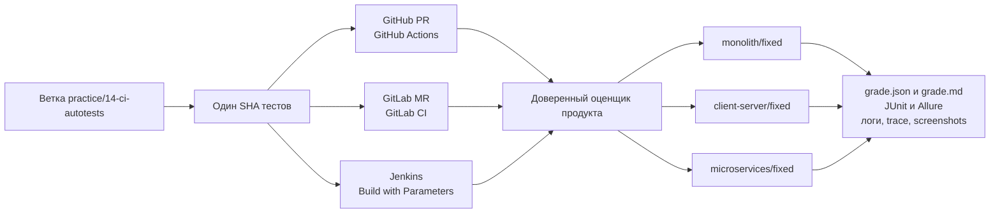

# Практическое задание № 14. Автотесты в GitHub Actions, GitLab CI и Jenkins

## Цель

Научиться воспроизводимо запускать один и тот же набор API- и UI-автотестов в
трёх системах непрерывной интеграции, связывать результат с точным Git-коммитом
и разбирать падение по журналам и диагностическим артефактам.

После выполнения работы вы сможете:

- выделять компактный smoke-набор из API- и UI-проверок;
- проверять smoke-набор на монолитной, клиент-серверной и микросервисной
  архитектурах;
- отличать коммит продукта от коммита репозитория тестов;
- запускать проверку через PR в GitHub и MR в GitLab;
- передавать тот же SHA тестов в доверенное задание Jenkins;
- сопоставлять событие, pipeline, job, runner и Jenkins agent;
- читать итоговые `grade.json`, `grade.md` и JUnit XML;
- просматривать raw Allure-результаты, Playwright trace и screenshot;
- повторять запуск без изменения исходного коммита;
- распознавать нестабильную UI-проверку и заменять её ожиданием наблюдаемого
  состояния;
- подтверждать, что финальный набор проходит на трёх исправленных вариантах
  продукта.

## Практическое задание

Продолжите личный репозиторий тестов после практических № 12 и № 13. Создайте
ветку `practice/14-ci-autotests`, отметьте две критические проверки маркером
`smoke`, локально выполните их на ветках `monolith/fixed`,
`client-server/fixed` и `microservices/fixed`, а затем отправьте один и тот же
коммит в GitHub и GitLab.

Для исходного SHA откройте PR и MR, дождитесь результатов GitHub Actions и
GitLab CI и запустите тот же SHA через Jenkins. Сохраните сведения о JUnit,
Allure и журналах. Отдельным временным коммитом воспроизведите нестабильное
ожидание в UI-тесте, получите trace и screenshot падения, исправьте ожидание и
сравните повторные запуски финального коммита.

Состояние pipeline используется для самоконтроля: результат связывается с SHA,
а выводы подтверждаются файлами из CI-артефактов.

Продуктовые ветки:

```text
monolith/fixed
client-server/fixed
microservices/fixed
```

Рабочая ветка личного репозитория:

```text
practice/14-ci-autotests
```

Рекомендуемая структура результата:

```text
mini-tickets-tests/
├── .github/
│   └── workflows/
│       └── qa.yml
├── docs/
│   └── test-reports/
│       └── 14/
│           ├── README.md
│           ├── artifact-map.md
│           ├── fixed-architectures.md
│           ├── flaky-fix.md
│           ├── pipeline-map.md
│           ├── rerun-comparison.md
│           ├── sha-comparison.md
│           └── evidence/
│               ├── github.md
│               ├── gitlab.md
│               ├── jenkins.md
│               └── local-smoke.txt
├── pages/
├── support/
├── tests/
│   ├── api/
│   └── ui/
├── .gitlab-ci.yml
├── ci_grade.py
├── conftest.py
├── pytest.ini
└── requirements.txt
```

Каталог `artifacts/practice-14` предназначен для локальных JUnit, Allure,
trace и screenshot. Он уже исключён из Git стартовой заготовкой. В отчёт
попадают ссылки, идентификаторы запусков, безопасные выдержки и выводы.

### Поток одного коммита через три CI



В каждом CI участвуют две независимые версии:

| Версия | Что фиксирует | Где задаётся |
|---|---|---|
| SHA продукта | доверенный оценщик и шесть продуктовых вариантов | `QA_PRODUCT_REF` или SCM задания Jenkins |
| SHA работы | API/UI-тесты из личного репозитория | head PR, head MR или `SUBMISSION_SHA` |

Сравнение систем имеет смысл, когда обе версии совпадают во всех трёх
запусках.

### Что запускает готовая CI-заготовка

| Система | Событие | Исполнитель | Основной результат |
|---|---|---|---|
| GitHub Actions | открытие/обновление PR или ручной `workflow_dispatch` | GitHub-hosted runner | артефакт `grading` |
| GitLab CI | открытие/обновление MR или ручной web pipeline | runner с тегом `qa-docker` | артефакты job `grade` |
| Jenkins | параметризованный запуск доверенного Pipeline | agent с меткой `qa-docker` | archived artifacts сборки |

Штатный оценщик выполняет весь набор тестов на трёх исправленных архитектурах,
а затем проверяет способность тестов обнаруживать учебные дефекты. Это шире
локального `-m smoke`: отдельный smoke-прогон нужен для быстрой предварительной
обратной связи, полный CI-прогон — для подтверждения переносимости всего набора.

## Задание (шаги)

### Шаг 1. Проверьте исходное состояние личного репозитория

Откройте PowerShell в личном репозитории и убедитесь, что в нём сохранились
результаты API- и UI-автоматизации:

```powershell
$taskTests = Join-Path $env:USERPROFILE 'repos/mini-tickets-tests'
Set-Location -LiteralPath $taskTests

git status
git branch --show-current
git remote -v
git log --oneline -5
Get-ChildItem tests/api -File
Get-ChildItem tests/ui -File
Get-ChildItem pages -File
```

Работа опирается на следующие результаты:

- один независимый API-сценарий из практической № 12;
- два UI-сценария с Page Object из практической № 13;
- `.github/workflows/qa.yml`, `.gitlab-ci.yml` и `ci_grade.py` из стартовой
  заготовки;
- зависимости `pytest`, `requests`, `pytest-playwright`, `playwright`,
  `pytest-timeout` и `allure-pytest`;
- чистое состояние Git либо осознанно сохранённые изменения предыдущей работы.

В `docs/test-reports/14/README.md` запишите исходную ветку, её SHA и перечень
найденных API/UI-тестов.

### Шаг 2. Создайте рабочую ветку и каталог отчёта

Переключитесь на ветку, в которой находятся завершённые тесты практических
№ 12–13, проверьте её и создайте новую ветку от фактического состояния:

```powershell
git status --short
$sourceBranch = git branch --show-current
$sourceSha = git rev-parse HEAD
$sourceBranch
$sourceSha
git switch -c practice/14-ci-autotests

New-Item -ItemType Directory `
    -Path docs/test-reports/14/evidence -Force | Out-Null
New-Item -ItemType Directory `
    -Path artifacts/practice-14 -Force | Out-Null
```

Если изменения прошлых практик объединены в `main`, перед созданием ветки
обновите его через `git pull --ff-only origin main`. Если работа продолжается
непосредственно от `practice/13-ui-playwright`, исходной точкой служит её
последний коммит. В отчёте укажите `$sourceBranch` и `$sourceSha`.

### Шаг 3. Составьте карту трёх pipeline

Изучите файлы:

- `.github/workflows/qa.yml` в личном репозитории;
- `.gitlab-ci.yml` и `ci_grade.py` в личном репозитории;
- `ci/grading.Jenkinsfile` в репозитории продукта;
- `grader/run.py` и `grader/entrypoint.py` в репозитории продукта.

Создайте `pipeline-map.md` и заполните таблицу фактическими значениями:

| Характеристика | GitHub Actions | GitLab CI | Jenkins |
|---|---|---|---|
| Триггер | | | |
| Файл определения | | | |
| Откуда берётся продукт | | | |
| Откуда берётся работа | | | |
| Как фиксируется SHA работы | | | |
| Исполнитель | | | |
| Команда оценивания | | | |
| Условие сохранения артефактов | | | |
| Срок хранения | | | |
| Способ повторного запуска | | | |

Добавьте короткую схему `event → pipeline → job → runner/agent → grader →
artifact`. Отдельно объясните разницу между GitLab runner и Jenkins agent.

### Шаг 4. Выберите две критические smoke-проверки

Отметьте маркером `smoke`:

1. API-проверку полного CRUD или ключевой авторизованной операции с заявкой;
2. UI-проверку входа и создания заявки через форму.

Для набора из практических № 12–13 подходят функции:

```text
tests/api/test_practice_12_contract.py::test_ticket_crud_flow
tests/ui/test_practice_13_tickets.py::test_user_creates_ticket_through_ui
```

Выбранная пара проверяет два разных интерфейса системы и один сквозной
пользовательский риск: авторизованный пользователь может создать заявку и
увидеть сохранённый результат.

### Шаг 5. Зарегистрируйте маркер `smoke`

Дополните `pytest.ini`:

```ini
[pytest]
addopts = --import-mode=importlib
testpaths = tests
pythonpath = .
markers =
    requirement(id): требование из задания
    api: проверка REST API
    ui: проверка интерфейса
    smoke: критический API/UI-сценарий для быстрой проверки сборки
```

Маркер регистрируется централизованно, чтобы опечатка в имени не превращалась
в незаметное предупреждение Pytest.

### Шаг 6. Добавьте маркер к выбранным тестам

В API- и UI-файлах добавьте декоратор рядом с существующими маркерами:

```python
@pytest.mark.smoke
@pytest.mark.api
@pytest.mark.requirement("TICKET-01")
def test_ticket_crud_flow(practice_url: str) -> None:
    """Проверить критический CRUD-сценарий заявки."""
```

```python
@pytest.mark.smoke
@pytest.mark.ui
@pytest.mark.requirement("UI-01")
def test_user_creates_ticket_through_ui(
    ui_page,
    url: str,
    prepared_user,
) -> None:
    """Создать заявку через UI и подтвердить её состояние."""
```

Сохраните имеющиеся маркеры требований. Один тест может одновременно входить в
наборы `smoke`, `api`/`ui` и в покрытие одного или нескольких требований.

### Шаг 7. Проверьте состав smoke-набора без запуска

```powershell
Set-Location -LiteralPath $taskTests
.\.venv\Scripts\python.exe -m pytest -m smoke --collect-only -q |
    Tee-Object artifacts/practice-14/smoke-collection.txt
```

В списке должны присутствовать API- и UI-проверки. Запишите в
`fixed-architectures.md` количество собранных тестовых случаев. Помните, что
параметризация viewport разворачивает одну UI-функцию в несколько случаев.

### Шаг 8. Подготовьте три исправленные продуктовые ветки

В примере корневой каталог продукта содержит `monolith/fixed`, а две другие
архитектуры находятся в worktree:

```powershell
$taskProduct = Join-Path $env:USERPROFILE 'repos/testing'
$taskMonolith = $taskProduct
$taskClient = Join-Path $taskProduct '.worktrees/client-server-fixed'
$taskMicro = Join-Path $taskProduct '.worktrees/microservices-fixed'

git -C $taskProduct fetch origin

if (!(Test-Path -LiteralPath $taskClient)) {
    git -C $taskProduct worktree add --detach `
        $taskClient origin/client-server/fixed
}

if (!(Test-Path -LiteralPath $taskMicro)) {
    git -C $taskProduct worktree add --detach `
        $taskMicro origin/microservices/fixed
}

git -C $taskProduct status --short
git -C $taskClient status --short
git -C $taskMicro status --short
```

Проверьте `variant.json` в каждом каталоге:

```powershell
Get-Content (Join-Path $taskMonolith 'variant.json')
Get-Content (Join-Path $taskClient 'variant.json')
Get-Content (Join-Path $taskMicro 'variant.json')
```

Зафиксируйте ветку и SHA каждой архитектуры в `fixed-architectures.md`:

```powershell
git -C $taskMonolith rev-parse HEAD
git -C $taskClient rev-parse HEAD
git -C $taskMicro rev-parse HEAD
```

### Шаг 9. Сопоставьте среды и локальные артефакты

Используйте три уникальных номера среды:

| Архитектура | Каталог | Номер | HTTP | PostgreSQL | Compose-проект |
|---|---|---:|---|---|---|
| monolith | `$taskMonolith` | 141 | `http://localhost:8241` | `localhost:55581` | `mini-student-141` |
| client-server | `$taskClient` | 142 | `http://localhost:8242` | `localhost:55582` | `mini-student-142` |
| microservices | `$taskMicro` | 143 | `http://localhost:8243` | `localhost:55583` | `mini-student-143` |

Для каждого запуска подготовьте отдельные каталоги:

```powershell
$architectures = 'monolith', 'client-server', 'microservices'
foreach ($architecture in $architectures) {
    New-Item -ItemType Directory -Force `
        -Path "artifacts/practice-14/$architecture/allure" | Out-Null
    New-Item -ItemType Directory -Force `
        -Path "artifacts/practice-14/$architecture/browser" | Out-Null
}
```

Раздельные пути исключают перезапись JUnit и Allure при переходе к следующей
архитектуре.

### Шаг 10. Выполните smoke на `monolith/fixed`

Запустите продукт и тесты последовательно в одном окне PowerShell. Блок
`finally` остановит среду и при неуспешном тесте:

```powershell
Set-Location -LiteralPath $taskMonolith
.\scripts\Start-Student.ps1 -Student 141
$testExitCode = 1
try {
    Invoke-RestMethod http://localhost:8241/health/ready
    docker compose -p mini-student-141 ps
    Set-Location -LiteralPath $taskTests
    $env:BASE_URL = 'http://localhost:8241'
    .\.venv\Scripts\python.exe -m pytest -m smoke `
        --browser chromium `
        --junitxml=artifacts/practice-14/monolith/junit.xml `
        --alluredir=artifacts/practice-14/monolith/allure `
        --output=artifacts/practice-14/monolith/browser `
        --screenshot=only-on-failure `
        --tracing=retain-on-failure -ra |
        Tee-Object artifacts/practice-14/monolith/pytest.txt
    $testExitCode = $LASTEXITCODE
}
finally {
    Remove-Item Env:BASE_URL -ErrorAction Ignore
    Set-Location -LiteralPath $taskMonolith
    docker compose -p mini-student-141 down --volumes --remove-orphans
}
if ($testExitCode -ne 0) { throw 'Smoke monolith завершился ошибкой' }
```

### Шаг 11. Выполните smoke на `client-server/fixed`

```powershell
Set-Location -LiteralPath $taskClient
.\scripts\Start-Student.ps1 -Student 142
$testExitCode = 1
try {
    Invoke-RestMethod http://localhost:8242/health/ready
    Set-Location -LiteralPath $taskTests
    $env:BASE_URL = 'http://localhost:8242'
    .\.venv\Scripts\python.exe -m pytest -m smoke `
        --browser chromium `
        --junitxml=artifacts/practice-14/client-server/junit.xml `
        --alluredir=artifacts/practice-14/client-server/allure `
        --output=artifacts/practice-14/client-server/browser `
        --screenshot=only-on-failure `
        --tracing=retain-on-failure -ra |
        Tee-Object artifacts/practice-14/client-server/pytest.txt
    $testExitCode = $LASTEXITCODE
}
finally {
    Remove-Item Env:BASE_URL -ErrorAction Ignore
    Set-Location -LiteralPath $taskClient
    docker compose -p mini-student-142 down --volumes --remove-orphans
}
if ($testExitCode -ne 0) { throw 'Smoke client-server завершился ошибкой' }
```

Здесь браузер открывает Vue через Nginx, а API обслуживает отдельный FastAPI-
контейнер. Тесты по-прежнему взаимодействуют только с единым внешним HTTP-
адресом.

### Шаг 12. Выполните smoke на `microservices/fixed`

```powershell
Set-Location -LiteralPath $taskMicro
.\scripts\Start-Student.ps1 -Student 143
$testExitCode = 1
try {
    Invoke-RestMethod http://localhost:8243/health/ready
    Set-Location -LiteralPath $taskTests
    $env:BASE_URL = 'http://localhost:8243'
    .\.venv\Scripts\python.exe -m pytest -m smoke `
        --browser chromium `
        --junitxml=artifacts/practice-14/microservices/junit.xml `
        --alluredir=artifacts/practice-14/microservices/allure `
        --output=artifacts/practice-14/microservices/browser `
        --screenshot=only-on-failure `
        --tracing=retain-on-failure -ra |
        Tee-Object artifacts/practice-14/microservices/pytest.txt
    $testExitCode = $LASTEXITCODE
}
finally {
    Remove-Item Env:BASE_URL -ErrorAction Ignore
    Set-Location -LiteralPath $taskMicro
    docker compose -p mini-student-143 down --volumes --remove-orphans
}
if ($testExitCode -ne 0) { throw 'Smoke microservices завершился ошибкой' }
```

В этом варианте аутентификацию и заявки обслуживают разные FastAPI-сервисы.
Переносимый тест использует публичный API через gateway и не зависит от числа
внутренних контейнеров.

### Шаг 13. Сведите локальные результаты

В `fixed-architectures.md` заполните таблицу:

| Архитектура | SHA продукта | Собрано | Passed | Failed | Время | JUnit | Allure |
|---|---|---:|---:|---:|---:|---|---|
| monolith | | | | | | | |
| client-server | | | | | | | |
| microservices | | | | | | | |

Добавьте вывод:

- какие проверки вошли в smoke;
- сохранился ли внешний контракт между архитектурами;
- различалось ли время выполнения;
- какие диагностические файлы появились при успешном запуске;
- чем локальный smoke отличается от полного прогона оценщика.

### Шаг 14. Проверьте файлы CI перед публикацией

Убедитесь, что CI-файлы находятся в корне личного репозитория:

```powershell
Set-Location -LiteralPath $taskTests
git ls-files .github/workflows/qa.yml .gitlab-ci.yml ci_grade.py
Get-Content .github/workflows/qa.yml
Get-Content .gitlab-ci.yml
.\.venv\Scripts\python.exe -m py_compile ci_grade.py
```

Сопоставьте в `pipeline-map.md`:

- PR GitHub запускает workflow `Проверка работы`;
- MR GitLab запускает job `grade`;
- обе системы сохраняют `product/artifacts/` даже при падении;
- GitHub и GitLab используют утверждённый `QA_PRODUCT_REF`;
- Jenkins читает доверенный `ci/grading.Jenkinsfile` из продукта.

### Шаг 15. Проверьте настройки GitHub Actions

В личном репозитории GitHub откройте
`Settings → Secrets and variables → Actions → Variables` и проверьте:

| Переменная | Значение |
|---|---|
| `QA_PRODUCT_REPOSITORY` | `tsenturion/mini-tickets-qa` или выданное `владелец/репозиторий` |
| `QA_PRODUCT_REF` | полный утверждённый SHA продукта |

В `Settings → Actions → General` должен быть разрешён запуск Actions. Значение
`QA_PRODUCT_REF` внесите в `sha-comparison.md`; оно должно совпасть с доверенным
коммитом, выбранным для GitLab и Jenkins.

### Шаг 16. Проверьте настройки GitLab CI

В личном проекте GitLab откройте `Settings → CI/CD → Variables`:

| Переменная | Значение |
|---|---|
| `QA_PRODUCT_URL` | Clone URL продукта на этом GitLab |
| `QA_PRODUCT_REF` | тот же полный утверждённый SHA продукта |

В `Settings → CI/CD → Runners` проверьте доступность runner с тегом
`qa-docker`. Если продукт ограничивает `CI_JOB_TOKEN`, проект тестов должен быть
в allowlist проекта продукта. Зафиксируйте видимость runner, тег и выбранный
SHA без копирования токенов в отчёт.

### Шаг 17. Зафиксируйте первый стабильный коммит

```powershell
Set-Location -LiteralPath $taskTests
git status --short
git diff --check
git add pytest.ini tests docs/test-reports/14
git commit -m 'Добавлен smoke-набор для трёх архитектур'
$stableSha = git rev-parse HEAD
$stableSha
```

Запишите SHA в `sha-comparison.md`. Это первая точка, которую можно сравнить на
трёх площадках.

### Шаг 18. Отправьте ветку в GitHub и GitLab

Проверьте имена удалённых репозиториев:

```powershell
git remote -v
```

В примере `origin` указывает на GitHub, `gitlab` — на GitLab:

```powershell
git push -u origin practice/14-ci-autotests
git push -u gitlab practice/14-ci-autotests

$localSha = git rev-parse HEAD
$githubSha = (git ls-remote origin `
    refs/heads/practice/14-ci-autotests).Split("`t")[0]
$gitlabSha = (git ls-remote gitlab `
    refs/heads/practice/14-ci-autotests).Split("`t")[0]

[pscustomobject]@{
    Local = $localSha
    GitHub = $githubSha
    GitLab = $gitlabSha
} | Format-List
```

Все три строки должны содержать один SHA. Если `origin` и `gitlab` названы
иначе, используйте фактические имена из `git remote -v`.

### Шаг 19. Откройте PR в GitHub

Создайте PR в своём репозитории:

```text
base: main
compare: practice/14-ci-autotests
```

В описании укажите:

- два сценария smoke-набора;
- три локально проверенные архитектуры;
- SHA работы;
- SHA продукта;
- ожидаемые CI-артефакты.

Откройте вкладку Checks и убедитесь, что запустился workflow `Проверка работы`,
а job использует head SHA PR. В `evidence/github.md` сохраните URL PR, run ID,
SHA, статус и ссылку на артефакт `grading`.

### Шаг 20. Откройте MR в GitLab

Создайте MR в своём проекте:

```text
source: practice/14-ci-autotests
target: main
```

Проверьте, что pipeline имеет источник `merge_request_event`, а job `grade`
выполняется runner с тегом `qa-docker`. В `evidence/gitlab.md` сохраните URL
MR, pipeline ID, job ID, SHA, статус и ссылку на артефакты.

### Шаг 21. Запустите тот же SHA в Jenkins

Откройте настроенное доверенное задание Jenkins и выберите
`Build with Parameters`:

| Параметр | Значение |
|---|---|
| `SUBMISSION_URL` | Clone URL личного репозитория тестов |
| `SUBMISSION_SHA` | тот же SHA исходной ветки PR/MR |
| `SUBMISSION_CREDENTIALS_ID` | ID credentials чтения либо пустое значение для доступного репозитория |
| `FULL_MATRIX` | `true` для проверки учебных дефектов на всех архитектурах |

Pipeline самого задания должен загружаться из доверенного
`ci/grading.Jenkinsfile` продукта. В SCM-настройке задания закрепите доверенный
SHA продукта и отключите Lightweight checkout. В
`evidence/jenkins.md` сохраните URL сборки, номер, `SUBMISSION_SHA`, состояние
agent, итог и ссылку на archived artifacts.

### Шаг 22. Подтвердите идентичность проверенного коммита

Заполните `sha-comparison.md`:

| Система | SHA работы | SHA продукта | Источник значения | Совпадение |
|---|---|---|---|---|
| локальный Git | | | `git rev-parse HEAD` | |
| GitHub Actions | | | PR head и `grade.json` | |
| GitLab CI | | | MR pipeline и `grade.json` | |
| Jenkins | | | параметр и `grade.json` | |

В итоговом `grade.json` поля `submission_commit` и `grader_commit` позволяют
проверить, какие исходники фактически использовались. В `refs` находятся
закреплённые коммиты продуктовых вариантов релиза.

### Шаг 23. Скачайте и разберите артефакты

Для каждой системы найдите:

```text
grade.json
grade.md
<architecture>-fixed-none/<run-id>/student/junit.xml
<architecture>-fixed-none/<run-id>/student/allure/
<architecture>-fixed-none/<run-id>/student/browser/
<architecture>-fixed-none/<run-id>/student/runner.log
<architecture>-fixed-none/<run-id>/compose.log
<architecture>-fixed-none/<run-id>/logs-app/ или logs-identity/ и logs-tickets/
```

Точный верхний каталог зависит от площадки:

- GitHub — содержимое скачанного артефакта `grading`;
- GitLab — `product/artifacts/` из job `grade`;
- Jenkins — `product/artifacts/grading-<номер-сборки>/`.

Создайте `artifact-map.md`:

| Артефакт | Когда создаётся | Какую гипотезу проверяет | Пример найденного пути |
|---|---|---|---|
| `grade.md` | после оценивания | общий итог | |
| `grade.json` | после оценивания | SHA, baseline, mutants | |
| `junit.xml` | каждый тестовый прогон | тесты и длительности | |
| raw Allure | каждый тестовый прогон | шаги и вложения | |
| `trace.zip` | падение UI | DOM, network, действия | |
| screenshot | падение UI | видимое состояние | |
| `runner.log` | каждый сценарий | stdout/stderr Pytest | |
| `compose.log` | каждый сценарий | состояние сервисов | |

### Шаг 24. Прочитайте JUnit и Allure

В JUnit сравните:

- число `tests`, `failures`, `errors`, `skipped`;
- имена test case;
- время отдельных тестов;
- текст assertion и координаты файла при падении.

Raw Allure можно открыть локально при установленном Allure CLI:

```powershell
allure serve '<путь-к-каталогу-allure>'
```

Сопоставьте один test case в JUnit с соответствующим результатом Allure и
записью Pytest в `runner.log`. В `artifact-map.md` объясните, какую информацию
удобнее получать из каждого формата.

Jenkinsfile архивирует JUnit как файл, но не вызывает шаг Jenkins `junit(...)`.
Поэтому XML ищите в скачанных archived artifacts, а не на странице
`Test Result`. При отсутствии Allure CLI выводы можно сделать по `grade.json`,
JUnit и журналам; команда `allure serve` добавляет интерактивное представление.

### Шаг 25. Проверьте baseline трёх исправленных архитектур

В `grade.json` найдите объект `baselines` и заполните таблицу:

| Ключ baseline | `exit_code` | `source_commit` | Есть JUnit | Вывод |
|---|---:|---|---|---|
| `monolith` | | | | |
| `client-server` | | | | |
| `microservices` | | | | |
| `repeat` | | | | |

Значение `exit_code = 0` у первых трёх ключей подтверждает прохождение полного
набора тестов на трёх исправленных архитектурах. `repeat` повторно запускает
монолит с обратным порядком тестов и помогает обнаруживать зависимость между
сценариями.

Результаты специально дефектных вариантов находятся в `mutants`. Падение теста
на таком варианте может быть ожидаемым обнаружением дефекта, поэтому общий
вывод делайте по `grade.md` и верхнему полю `status` в `grade.json`.

### Шаг 26. Повторите запуск того же SHA

Не создавая нового коммита, выполните повторный запуск:

- GitHub Actions: `Re-run jobs → Re-run all jobs`;
- GitLab CI: `Retry` для job либо повтор pipeline того же SHA;
- Jenkins: ещё один `Build with Parameters` с тем же `SUBMISSION_SHA`.

Создайте `rerun-comparison.md`:

| Система | Первый ID | Повторный ID | SHA одинаков | Статус одинаков | Tests | Время | Артефакты доступны |
|---|---|---|---|---|---:|---:|---|
| GitHub Actions | | | | | | | |
| GitLab CI | | | | | | | |
| Jenkins | | | | | | | |

Сравните не только цвет pipeline, но и число тестов, baseline, наличие
артефактов и причины заметного расхождения времени.

### Шаг 27. Создайте временную нестабильную проверку

В тесте `test_user_creates_ticket_through_ui` временно замените устойчивое
ожидание сообщения:

```python
expect(tickets.status_message).to_have_text("Заявка создана")
```

на слишком короткое ожидание:

```python
expect(tickets.status_message).to_have_text(
    "Заявка создана",
    timeout=75,
)
```

Смысл эксперимента — показать гонку между ответом API, обновлением Vue и
проверкой браузера. На быстром запуске проверка может пройти, на загруженном
runner — упасть. Такое различие и составляет наблюдаемую нестабильность.

Зафиксируйте временный коммит:

```powershell
git add tests/ui/test_practice_13_tickets.py
git commit -m 'Добавлен эксперимент с коротким UI-ожиданием'
$flakySha = git rev-parse HEAD
git push origin practice/14-ci-autotests
git push gitlab practice/14-ci-autotests
```

Новый push обновит существующие PR и MR. Для Jenkins передайте новый
`SUBMISSION_SHA`.

### Шаг 28. Получите и изучите артефакты падения

Если короткое ожидание прошло, повторите pipeline для того же `$flakySha` и
сравните результаты. Если два повтора не дали падения, добавьте в этот временный
эксперимент управляемую задержку только для POST создания заявки:

```python
from time import sleep


def delay_ticket_creation(route, request) -> None:
    """Имитировать загруженную сеть перед созданием заявки."""
    if request.method == "POST" and request.url.endswith("/api/tickets"):
        sleep(0.5)
    route.continue_()


ui_page.route("**/api/tickets", delay_ticket_creation)
```

Установите route перед `tickets.create_ticket(...)`, сохраните ещё один
временный коммит и повторите CI. Сочетание задержки 500 мс и ожидания 75 мс
воспроизводит падение без изменения продукта. В финальном исправлении удалите
и короткий timeout, и искусственную route-задержку.

После падения скачайте артефакты соответствующего baseline и найдите:

- JUnit с текстом timeout/assertion;
- raw Allure result;
- Playwright `trace.zip`;
- screenshot фактического состояния;
- `runner.log`;
- серверный `compose.log` и журналы приложения.

Откройте trace локально:

```powershell
.\.venv\Scripts\python.exe -m playwright show-trace `
    '<путь-к-trace.zip>'
```

В `flaky-fix.md` заполните диагностическую карточку:

| Поле | Наблюдение |
|---|---|
| SHA нестабильного коммита | |
| Pipeline/job/build | |
| Упавший test case | |
| Ожидаемое состояние | |
| Состояние на screenshot | |
| Последнее действие в trace | |
| HTTP-запрос в trace | |
| Ответ сервера | |
| Признак дефекта продукта | |
| Признак дефекта теста | |
| Выбранное исправление | |

Trace показывает временную последовательность, screenshot — один кадр, JUnit —
формальный результат, а журналы сервера помогают отделить задержку интерфейса
от ошибки backend.

### Шаг 29. Исправьте нестабильность

Верните ожидание, которое опрашивает наблюдаемое состояние в пределах общего
тайм-аута Playwright, и удалите временную route-задержку:

```python
expect(tickets.status_message).to_have_text("Заявка создана")
```

Так тест ожидает бизнес-признак завершения операции, а не предполагаемую
скорость конкретного компьютера или runner. Снова запустите
`client-server/fixed`, проверьте UI-файл несколько раз и гарантированно
остановите среду:

```powershell
Set-Location -LiteralPath $taskClient
.\scripts\Start-Student.ps1 -Student 142
try {
    Invoke-RestMethod http://localhost:8242/health/ready
    Set-Location -LiteralPath $taskTests
    $env:BASE_URL = 'http://localhost:8242'
    1..3 | ForEach-Object {
        .\.venv\Scripts\python.exe -m pytest `
            tests/ui/test_practice_13_tickets.py `
            -k test_user_creates_ticket_through_ui `
            --browser chromium -q
        if ($LASTEXITCODE -ne 0) {
            throw "Повтор $_ завершился ошибкой"
        }
    }
}
finally {
    Remove-Item Env:BASE_URL -ErrorAction Ignore
    Set-Location -LiteralPath $taskClient
    docker compose -p mini-student-142 down --volumes --remove-orphans
}
```

В `flaky-fix.md` сравните короткий timeout и ожидание состояния: причина,
наблюдения, изменение и результат повторов.

### Шаг 30. Создайте финальный коммит

```powershell
git add tests/ui/test_practice_13_tickets.py docs/test-reports/14
git commit -m 'Устранена нестабильность UI-теста в CI'
$finalSha = git rev-parse HEAD
git push origin practice/14-ci-autotests
git push gitlab practice/14-ci-autotests
$finalSha
```

Убедитесь, что PR и MR показывают новый head SHA. Запустите Jenkins с тем же
`$finalSha`.

### Шаг 31. Проверьте финальный SHA в трёх CI

Для финального коммита снова заполните матрицу:

| Система | SHA работы | Итог | Три fixed baseline | Repeat | JUnit | Allure | Логи |
|---|---|---|---|---|---|---|---|
| GitHub Actions | | | | | | | |
| GitLab CI | | | | | | | |
| Jenkins | | | | | | | |

Для Jenkins с `FULL_MATRIX=true` дополнительно проверьте, что mutants содержат
результаты для монолита, клиент-серверной и микросервисной архитектур. Этот
режим расширяет проверку учебных дефектов; три fixed baseline выполняются
оценщиком в любом режиме.

### Шаг 32. Подготовьте итоговый отчёт

В `docs/test-reports/14/README.md` соберите ссылки на остальные файлы и добавьте:

1. цель и границы проверки;
2. версии Python, Pytest, Playwright и браузера;
3. выбранные smoke-сценарии;
4. локальную матрицу трёх архитектур;
5. SHA продукта и финальный SHA работы;
6. URL PR, MR и Jenkins build;
7. идентификаторы первого, повторного, нестабильного и финального запусков;
8. карту JUnit, Allure, trace, screenshot и журналов;
9. причину нестабильности и способ исправления;
10. вывод о воспроизводимости одного коммита на трёх площадках.

Ссылки на pipeline и краткие безопасные выдержки делают отчёт проверяемым без
публикации токенов и содержимого credentials.

### Шаг 33. Проверьте содержимое Git

```powershell
git status --short
git diff --check main...HEAD
git log --oneline main..HEAD
git ls-files | Select-String `
    -Pattern 'artifacts|\.venv|\.env|trace\.zip|screenshot|allure-results'
```

Ожидается, что в Git находятся тесты, конфигурация и отчёт, а объёмные runtime-
артефакты остаются в хранилищах CI или локальном исключённом каталоге.

Проверьте историю на наличие токенов, паролей, Jenkins credentials и значений
`Authorization`. В отчёте достаточно идентификаторов, URL и выводов.

### Шаг 34. Выполните финальную самопроверку

Сопоставьте финальное состояние с четырьмя независимыми источниками:

1. локальный smoke на трёх исправленных архитектурах;
2. `baselines` в GitHub Actions;
3. `baselines` в GitLab CI;
4. `baselines` и расширенная матрица Jenkins.

Расхождение зафиксируйте как отдельное наблюдение: какой SHA, какая среда,
какой test case, какой артефакт и какая гипотеза объясняют разницу. Такой подход
отличает подтверждённый стабильный запуск от одного случайно зелёного pipeline.

## Подсказки по ключевым частям

### Один SHA — основа сравнения

Название ветки меняется со временем: новый push передвигает её на другой
коммит. Полный SHA неизменяем и однозначно связывает исходники, запуск и
артефакты. Для сравнения GitHub, GitLab и Jenkins используйте
`submission_commit` из `grade.json`, а не только имя ветки.

### Smoke и полный CI-прогон решают разные задачи

Команда `pytest -m smoke` быстро отвечает, работает ли критический путь после
изменения. Готовый оценщик запускает весь каталог `tests` на каждом fixed-
варианте. Если full baseline зелёный, smoke-тесты тоже выполнились как часть
этого набора, но итог CI дополнительно подтверждает остальные проверки.

### Почему CI запускается через PR и MR

GitHub workflow слушает события `pull_request`, GitLab pipeline —
`merge_request_event`. В GitHub push в открытую PR-ветку порождает событие
`pull_request.synchronize`. В GitLab обновление исходной ветки создаёт MR
pipeline с `merge_request_event`. Вне PR/MR используйте описанные
`workflow_dispatch` и web pipeline.

### Как читать `grade.json`

Главные поля:

| Поле | Значение |
|---|---|
| `status` | общий итог оценивания |
| `reason` | причина итогового статуса |
| `submission_commit` | проверенный SHA личного репозитория |
| `grader_commit` | доверенный SHA оценщика |
| `refs` | SHA шести продуктовых вариантов |
| `baselines` | запуски на исправленных архитектурах и повтор |
| `mutants` | результаты на вариантах с учебными дефектами |

Красный отдельный test case на mutant может означать успешное обнаружение
дефекта. Красный fixed baseline означает, что набор падает на корректном
поведении или среда не смогла завершить проверку.

### Где искать trace и screenshot

Pytest-playwright создаёт их при падении UI-теста, потому что оценщик передаёт:

```text
--screenshot=only-on-failure
--tracing=retain-on-failure
--output=/results/browser
```

Если упал только API-тест, браузерных артефактов может не быть. Для UI-падения
сначала найдите каталог конкретной архитектуры и `run-id`, затем
`student/browser`.

### Как отличить нестабильность теста от дефекта продукта

Признаки проблемы ожидания:

- сервер вернул ожидаемый успешный ответ;
- trace показывает появление нужного состояния после assertion;
- повтор того же SHA иногда проходит, иногда падает;
- увеличение времени runner меняет результат без изменения данных.

Признаки дефекта продукта:

- воспроизводится одно и то же неправильное состояние;
- ответ API противоречит контракту;
- ошибка подтверждается журналом сервиса;
- повтор того же SHA даёт одинаковое функциональное отклонение.

### Почему короткий `timeout` заменяется ожиданием состояния

Фиксированное малое время кодирует предположение о скорости среды. Playwright
`expect` с рабочим общим timeout повторяет проверку, пока наблюдаемое состояние
не появится или операция действительно не превысит предел. Ожидать следует
бизнес-признак: сообщение, строку заявки, значение поля или ответ API.

### Как интерпретировать повторный запуск

Повтор того же SHA полезен для поиска нестабильности, но не создаёт новый
результат разработки. В таблице сравнения храните два разных run/pipeline/build
ID и один `submission_commit`. Совпадение SHA позволяет связывать различие с
окружением, порядком, нагрузкой или состоянием внешней системы.

### Артефакты GitHub, GitLab и Jenkins

Площадки по-разному показывают архив, но источник одинаков: каталог
`product/artifacts/`, созданный доверенным оценщиком. Jenkins добавляет номер
сборки к каталогу, чтобы новая неуспешная попытка не выдала результат старого
запуска.

### Что означает `FULL_MATRIX`

Три fixed baseline выполняются всегда. При `FULL_MATRIX=false` учебные дефекты
проверяются на монолите. При `FULL_MATRIX=true` каждый выбранный дефект
проверяется на всех трёх архитектурах. Это влияет на mutants, а не на наличие
fixed baseline.

### Безопасное диагностическое описание

В отчёт помещайте метод, путь, статус, `X-Request-ID`, test case, SHA и ссылку на
закрытый артефакт. Заголовок `Authorization`, access token, cookie, пароль и
значение Jenkins credential не относятся к диагностическим доказательствам.

## Что проверить перед отправкой (чек-лист)

### Репозиторий и тесты

- [ ] Работа находится в ветке `practice/14-ci-autotests`.
- [ ] В репозитории есть API- и UI-тесты предыдущих практических.
- [ ] В `pytest.ini` зарегистрирован маркер `smoke`.
- [ ] В smoke-набор входят выбранные API- и UI-проверки.
- [ ] `pytest -m smoke --collect-only` собирает ожидаемые test case.
- [ ] UI-тесты используют Page Object и ожидания наблюдаемого состояния.
- [ ] Финальная версия не содержит короткого экспериментального timeout.

### Три архитектуры

- [ ] Проверены `monolith/fixed`, `client-server/fixed` и
  `microservices/fixed`.
- [ ] Для каждой архитектуры зафиксирован SHA продукта.
- [ ] Локальный smoke прошёл на всех трёх вариантах.
- [ ] Для каждого локального прогона созданы отдельные JUnit и Allure.
- [ ] В `fixed-architectures.md` заполнена сводная таблица.

### GitHub Actions и GitLab CI

- [ ] `.github/workflows/qa.yml` находится в правильном пути.
- [ ] `.gitlab-ci.yml` и `ci_grade.py` находятся в корне.
- [ ] Заданы `QA_PRODUCT_REPOSITORY`/`QA_PRODUCT_URL` и один
  `QA_PRODUCT_REF`.
- [ ] В GitLab доступен runner с тегом `qa-docker`.
- [ ] Открыты PR и MR из одной рабочей ветки в `main` личных репозиториев.
- [ ] Head SHA GitHub и GitLab совпадают с локальным SHA.
- [ ] GitHub сохранил артефакт `grading`.
- [ ] GitLab сохранил `product/artifacts/` job `grade`.

### Jenkins

- [ ] Pipeline загружает `ci/grading.Jenkinsfile` из доверенного продукта.
- [ ] Agent с меткой `qa-docker` подключён.
- [ ] `SUBMISSION_URL` ведёт к личному репозиторию тестов.
- [ ] `SUBMISSION_SHA` совпадает с head SHA PR и MR.
- [ ] Для расширенной проверки выбран `FULL_MATRIX=true`.
- [ ] Archived artifacts относятся к текущему номеру сборки.

### Диагностика и повторяемость

- [ ] Для одного SHA выполнен повторный запуск на каждой площадке.
- [ ] Сопоставлены статусы, число test case и наличие артефактов.
- [ ] Временный нестабильный коммит сохранён отдельным SHA.
- [ ] Для UI-падения изучены JUnit, trace, screenshot и журналы.
- [ ] Причина нестабильности описана в `flaky-fix.md`.
- [ ] Исправление заменяет предположение о времени ожиданием состояния.
- [ ] Финальный SHA повторно проверен GitHub, GitLab и Jenkins.

### Результат и безопасность

- [ ] `grade.json` содержит ожидаемый `submission_commit`.
- [ ] В `baselines` есть три исправленные архитектуры и `repeat`.
- [ ] `grade.md` прочитан вместе с результатами mutants.
- [ ] Заполнены `pipeline-map.md`, `sha-comparison.md`,
  `artifact-map.md`, `rerun-comparison.md` и `flaky-fix.md`.
- [ ] В Git не попали `.venv`, `.env`, runtime-артефакты и секреты.
- [ ] В отчёте отсутствуют Bearer-токены, пароли и значения credentials.
- [ ] `git diff --check main...HEAD` не сообщает об ошибках оформления.

## Советы по улучшению работы

1. Добавьте в начало каждого CI-отчёта таблицу координат: продуктовый SHA,
   SHA тестов, pipeline ID, job/build ID и время запуска.
2. Сформируйте маленькую функцию PowerShell для последовательного локального
   smoke-прогона трёх архитектур с гарантированной очисткой в `finally`.
3. Добавьте Allure labels для слоя (`api`/`ui`), требования и бизнес-сценария,
   чтобы отчёт отражал риски, а не только имена Python-функций.
4. Сравните распределение длительностей API- и UI-test case по JUnit трёх
   архитектур и объясните заметные различия.
5. Свяжите каждый screenshot и trace с test case, архитектурой, run ID и SHA в
   `artifact-map.md`.
6. Добавьте в описание PR/MR таблицу покрытия: критический риск, тест, маркер,
   требование и ожидаемый артефакт падения.
7. Проверьте идемпотентность повтором с обратным порядком тестов и объясните
   значение baseline `repeat`.
8. Сравните удобство поиска причины сбоя в интерфейсах GitHub Actions, GitLab
   CI и Jenkins по одинаковому искусственному падению.
9. Добавьте уникальный `X-Request-ID` в API-предусловия UI-тестов и найдите его
   в серверном журнале из CI-артефакта.
10. Используйте `pytest --durations=10`, чтобы выделить самые медленные
    проверки и обосновать состав быстрого smoke-набора.
11. В итоговом выводе разделите четыре свойства: корректность тестов на fixed,
    способность обнаруживать mutants, стабильность повтора и переносимость
    между CI-системами.
12. После завершения сравните первый стабильный SHA, нестабильный SHA и
    финальный SHA как короткую хронологию причины и исправления.
