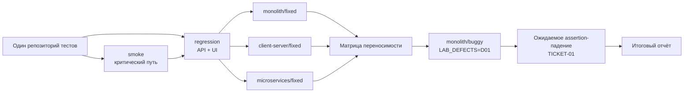

# Практическое задание № 15. Итоговый межархитектурный регрессионный прогон

## Цель

Собрать созданные в предыдущих практических работах API- и UI-проверки в
небольшой управляемый регрессионный комплект, подтвердить его переносимость
между тремя архитектурами и показать, что проверки обнаруживают известное
отклонение продукта.

После выполнения работы вы сможете:

- формировать smoke-профиль и более широкий regression-профиль по рискам;
- связывать тесты с требованиями, сценариями и ожидаемыми результатами;
- запускать один набор на монолите, клиент-серверном приложении и
  микросервисах;
- отделять внешний контракт от внутренних деталей реализации;
- устранять архитектурную связанность тестов;
- обеспечивать независимость тестовых данных и порядка выполнения;
- сравнивать результаты нескольких вариантов по JUnit и Allure;
- запускать тот же набор на контролируемой `buggy`-ветке;
- доказывать обнаружение дефекта содержательным assertion, а не технической
  ошибкой среды;
- составлять компактный итоговый отчёт о покрытии, переносимости и результате
  регрессии.

## Практическое задание

Продолжите личный репозиторий тестов после практической № 14. Создайте ветку
`practice/15-cross-architecture-regression` и соберите два профиля:

- `smoke` — критический путь авторизации, создания заявки, граничной валидации
  и отображения результата в интерфейсе;
- `regression` — созданные ранее API- и UI-проверки требований, подходящие для
  запуска через единый публичный адрес приложения.

Последовательно выполните regression-профиль на `monolith/fixed`,
`client-server/fixed` и `microservices/fixed`. Один и тот же тестовый код должен
работать с каждой реализацией через переменную `BASE_URL`. Найденные привязки к
PostgreSQL, внутренним портам, контейнерам, сервисам или структуре Vue замените
проверками публичного HTTP-контракта и наблюдаемого поведения пользователя.

Затем запустите тот же набор на `monolith/buggy` с единственным активным
дефектом `D01`. Специальная граничная проверка должна пройти на трёх fixed-
ветках и упасть на buggy из-за ответа `201` вместо ожидаемого `422` для
заголовка длиной 81 символ. Сопоставьте результаты и подготовьте короткий
итоговый отчёт.

Основная матрица:

```text
monolith/fixed
client-server/fixed
microservices/fixed
monolith/buggy + LAB_DEFECTS=D01
```

Рабочая ветка личного репозитория:

```text
practice/15-cross-architecture-regression
```

Рекомендуемая структура результата:

```text
mini-tickets-tests/
├── docs/
│   └── test-reports/
│       └── 15/
│           ├── README.md
│           ├── architecture-matrix.md
│           ├── buggy-detection.md
│           ├── portability-review.md
│           ├── regression-scope.md
│           ├── requirement-coverage.md
│           └── evidence/
│               ├── client-server-fixed.md
│               ├── microservices-fixed.md
│               ├── monolith-buggy-d01.md
│               └── monolith-fixed.md
├── pages/
├── scripts/
│   └── Invoke-Practice15Run.ps1
├── support/
├── tests/
│   ├── api/
│   └── ui/
├── conftest.py
├── pytest.ini
└── requirements.txt
```

Runtime-артефакты каждого запуска сохраняются в
`artifacts/practice-15/<вариант>` и остаются вне Git. В отчёт входят сводные
таблицы, SHA, безопасные выдержки и пути к доказательствам.

### Логика итогового прогона



### Два профиля одного комплекта

| Профиль | Назначение | Пример состава |
|---|---|---|
| `smoke` | быстрая проверка критического пути и граничной валидации | CRUD заявки, граница 81, создание через UI |
| `regression` | проверка основных требований, ролей, состояний и синхронизации UI | все подготовленные API/UI-сценарии № 12–13 |

Маркер `smoke` является подмножеством `regression`: каждый smoke-тест также
имеет маркер `regression`.

## Задание (шаги)

### Шаг 1. Зафиксируйте исходную точку

Откройте личный репозиторий тестов и сохраните состояние после практической
№ 14:

```powershell
$taskTests = Join-Path $env:USERPROFILE 'repos/mini-tickets-tests'
Set-Location -LiteralPath $taskTests

git status
git branch --show-current
git rev-parse HEAD
git log --oneline -6
git remote -v
```

В `docs/test-reports/15/README.md` запишите:

| Параметр | Фактическое значение |
|---|---|
| Исходная ветка тестов | |
| Исходный SHA | |
| Python | |
| Pytest | |
| Playwright | |
| Chromium | |
| Дата прогона | |

Эта точка связывает заключительную работу с готовыми API-тестами, Page Object,
фикстурами и CI-конфигурацией предыдущих практик.

### Шаг 2. Создайте рабочую ветку и каркас отчёта

Создайте ветку от коммита, содержащего финальные изменения практической № 14:

```powershell
git status --short
$sourceBranch = git branch --show-current
$sourceSha = git rev-parse HEAD
git switch -c practice/15-cross-architecture-regression

$reportRoot = 'docs/test-reports/15'
New-Item -ItemType Directory -Force `
    -Path "$reportRoot/evidence" | Out-Null
New-Item -ItemType Directory -Force `
    -Path 'artifacts/practice-15' | Out-Null
New-Item -ItemType Directory -Force -Path scripts | Out-Null
```

Создайте файлы из рекомендуемой структуры. В `README.md` укажите
`$sourceBranch`, `$sourceSha` и назначение каждого документа.

### Шаг 3. Проведите инвентаризацию созданных тестов

Получите список test case и маркеров:

```powershell
.\.venv\Scripts\python.exe -m pytest --collect-only -q |
    Tee-Object artifacts/practice-15/all-collected.txt

Get-ChildItem tests -Recurse -Filter '*.py' |
    Select-String -Pattern 'def test_|@pytest\.mark'
```

В `regression-scope.md` составьте таблицу:

| Test case | Слой | Требования | Риск | Данные | Наблюдаемый результат | Профиль |
|---|---|---|---|---|---|---|
| | API/UI | | | | | smoke/regression |

Включите проверки, созданные в практических № 12–13:

- отсутствие Bearer и ответ `401`;
- CRUD-цепочку заявки;
- роли, переходы состояний и валидацию;
- создание заявки через UI;
- синхронизацию приоритета в карточке и списке;
- новую проверку верхней границы заголовка.

### Шаг 4. Составьте матрицу рисков и требований

Изучите `docs/ТРЕБОВАНИЯ.md` продукта и создайте
`requirement-coverage.md`:

| Требование | Риск регрессии | API-тест | UI-тест | Smoke | Regression | Результат fixed |
|---|---|---|---|---|---|---|
| `AUTH-02` | защищённые данные доступны без сессии | | | | | |
| `TICKET-01` | неверная длина заголовка принята | | | | | |
| `TICKET-02` | неизвестный приоритет сохранён | | | | | |
| `TICKET-03` | CRUD меняет неверную заявку или состояние | | | | | |
| `TICKET-04` | запрещённый переход выполнен | | | | | |
| `UI-01` | основной пользовательский путь недоступен | | | | | |
| `UI-02` | список показывает устаревший приоритет | | | | | |

Матрица помогает выбирать проверки по риску, а не по длине тестового файла.

### Шаг 5. Определите smoke- и regression-профили

Используйте следующую стартовую модель:

| Проверка | Smoke | Regression | Причина выбора |
|---|---|---|---|
| `test_me_requires_bearer` | | да | базовая защита API |
| `test_ticket_crud_flow` | да | да | основной жизненный путь заявки |
| `test_role_state_and_validation` | | да | роли, состояния, `409`, `422` |
| `test_title_above_upper_boundary_is_rejected` | да | да | детерминированная граница и D01 |
| `test_user_creates_ticket_through_ui` | да | да | основной UI-путь |
| `test_priority_is_synchronized_without_reload` | | да | синхронизация UI-02 |

Параметризация viewport превращает одну UI-функцию в несколько test case.
Отразите фактическое количество случаев после `--collect-only`.

### Шаг 6. Зарегистрируйте маркер `regression`

Проверьте `pytest.ini`. Итоговая конфигурация маркеров:

```ini
[pytest]
addopts = --import-mode=importlib
testpaths = tests
pythonpath = .
markers =
    requirement(id): требование из задания
    api: проверка REST API
    ui: проверка интерфейса
    smoke: критический API/UI-сценарий для быстрой проверки сборки
    regression: переносимая проверка итогового регрессионного комплекта
```

Централизованная регистрация позволяет Pytest обнаружить ошибку в имени
маркера при строгой проверке.

### Шаг 7. Добавьте граничную проверку `TICKET-01`

В `tests/api/test_practice_12_contract.py` используйте уже созданные функции
`register_and_login`, `send`, `assert_error` и `coordinates`:

```python
@pytest.mark.smoke
@pytest.mark.regression
@pytest.mark.api
@pytest.mark.requirement("TICKET-01")
def test_title_above_upper_boundary_is_rejected(
    practice_url: str,
) -> None:
    """Отклонить 81 символ после допустимой верхней границы 80."""
    with requests.Session() as user:
        register_and_login(user, practice_url)
        response = send(
            user,
            "POST",
            practice_url,
            "/tickets",
            json={"title": "я" * 81, "priority": "normal"},
        )

        if response.status_code == 201:
            ticket_id = response.json().get("id")
            if ticket_id:
                cleanup = send(
                    user,
                    "DELETE",
                    practice_url,
                    f"/tickets/{ticket_id}",
                )
                assert cleanup.status_code == 204, coordinates(cleanup)

        assert_error(response, 422)
```

На исправленном варианте `assert_error` проверяет код, JSON-конверт и
`X-Request-ID`. На D01 временно созданная неправильная запись удаляется, после
чего исходный response даёт содержательное assertion-падение `201 != 422`.

### Шаг 8. Разметьте существующие API-тесты

Добавьте `@pytest.mark.regression` к трём API-сценариям практической № 12.
Для CRUD-теста сохраните также `@pytest.mark.smoke`:

```python
@pytest.mark.smoke
@pytest.mark.regression
@pytest.mark.api
@pytest.mark.requirement("TICKET-01")
@pytest.mark.requirement("TICKET-02")
@pytest.mark.requirement("TICKET-03")
def test_ticket_crud_flow(practice_url: str) -> None:
    """Сопоставить POST, GET, PATCH, DELETE и итоговое состояние."""
```

`test_me_requires_bearer` и `test_role_state_and_validation` получают маркеры
`regression` и `api`, сохраняя все существующие `requirement`.

### Шаг 9. Разметьте существующие UI-тесты

Оба сценария практической № 13 входят в regression. Сценарий создания заявки
также входит в smoke:

```python
@pytest.mark.smoke
@pytest.mark.regression
@pytest.mark.ui
@pytest.mark.requirement("UI-01")
@pytest.mark.requirement("TICKET-03")
def test_user_creates_ticket_through_ui(...):
    """Создать заявку через UI и подтвердить её состояние."""
```

```python
@pytest.mark.regression
@pytest.mark.ui
@pytest.mark.requirement("UI-02")
@pytest.mark.requirement("TICKET-03")
def test_priority_is_synchronized_without_reload(...):
    """Синхронизировать карточку и строку без перезагрузки."""
```

Сохраните параметризацию `desktop` и `compact`, Page Object и API-предусловия.

### Шаг 10. Проверьте состав двух профилей

```powershell
Set-Location -LiteralPath $taskTests

.\.venv\Scripts\python.exe -m pytest `
    -m smoke --collect-only -q |
    Tee-Object artifacts/practice-15/smoke-collected.txt

.\.venv\Scripts\python.exe -m pytest `
    -m regression --collect-only -q |
    Tee-Object artifacts/practice-15/regression-collected.txt

.\.venv\Scripts\python.exe -m pytest `
    --strict-markers -m regression --collect-only -q
```

Сопоставьте количество функций, параметризованных test case и требований.
Каждый элемент smoke должен встречаться в regression.

### Шаг 11. Проведите ревью архитектурной переносимости

Найдите кандидатов на привязку к реализации:

```powershell
$sourceFiles = Get-ChildItem tests, pages, support `
    -Recurse -File -Filter '*.py'
$sourceFiles += Get-Item conftest.py
$sourceFiles | Select-String -Pattern `
    'localhost:[0-9]+|127\.0\.0\.1:[0-9]+|postgres|psql|docker|compose|identity|:8000|query_selector|locator\(.[#.]'
```

Для каждого совпадения определите, относится ли оно к публичному контракту или
к внутренней детали. Заполните `portability-review.md`:

| Найденная зависимость | Слой | Почему мешает переносимости | Замена | Проверка после изменения |
|---|---|---|---|---|
| фиксированный URL | конфигурация | порт среды меняется | `BASE_URL` | три fixed |
| прямое подключение PostgreSQL | данные | базы разделены в microservices | публичный API | API-ответ |
| URL `identity`/`tickets` | сеть | внутренний маршрут | внешний `/api` | HTTP-контракт |
| CSS/DOM-цепочка | UI | зависит от вёрстки | role/label/test-id | Playwright |
| Vue state | UI | внутренняя модель | видимый текст/поле | `expect` |

В итоговом комплекте адрес среды поступает из `BASE_URL`, API начинается с
`/api`, а UI проверяется по доступным ролям, подписям и наблюдаемому состоянию.

### Шаг 12. Проверьте независимость данных и порядка

Для каждого теста ответьте в `regression-scope.md`:

- как создаётся уникальный email;
- как создаётся уникальный заголовок;
- какая заявка принадлежит текущему сценарию;
- как выполняется адресная очистка;
- какое состояние требуется до первого шага;
- остаётся ли тест корректным при другом порядке запуска.

Проверьте два порядка:

```powershell
.\.venv\Scripts\python.exe -m pytest `
    tests/api/test_practice_12_contract.py `
    tests/ui/test_practice_13_tickets.py `
    --collect-only -q

.\.venv\Scripts\python.exe -m pytest `
    tests/ui/test_practice_13_tickets.py `
    tests/api/test_practice_12_contract.py `
    --collect-only -q
```

Оба варианта должны собирать одинаковое множество test case.

### Шаг 13. Подготовьте четыре продуктовых каталога

```powershell
$taskProduct = Join-Path $env:USERPROFILE 'repos/testing'
$taskMonolith = $taskProduct
$taskMonolithBuggy = Join-Path $taskProduct '.worktrees/monolith-buggy'
$taskClient = Join-Path $taskProduct '.worktrees/client-server-fixed'
$taskMicro = Join-Path $taskProduct '.worktrees/microservices-fixed'

git -C $taskProduct fetch origin

if (!(Test-Path -LiteralPath $taskMonolithBuggy)) {
    git -C $taskProduct worktree add --detach `
        $taskMonolithBuggy origin/monolith/buggy
}
if (!(Test-Path -LiteralPath $taskClient)) {
    git -C $taskProduct worktree add --detach `
        $taskClient origin/client-server/fixed
}
if (!(Test-Path -LiteralPath $taskMicro)) {
    git -C $taskProduct worktree add --detach `
        $taskMicro origin/microservices/fixed
}

git -C $taskMonolith merge --ff-only origin/monolith/fixed
git -C $taskMonolithBuggy merge --ff-only origin/monolith/buggy
git -C $taskClient merge --ff-only origin/client-server/fixed
git -C $taskMicro merge --ff-only origin/microservices/fixed
```

Прочитайте фактические варианты:

```powershell
$productPaths = @(
    $taskMonolith,
    $taskClient,
    $taskMicro,
    $taskMonolithBuggy
)

foreach ($path in $productPaths) {
    Write-Host "--- $path"
    Get-Content (Join-Path $path 'variant.json')
    git -C $path rev-parse HEAD
    git -C $path status --short
}

$expectedVariants = @{
    $taskMonolith = @('monolith', 'fixed')
    $taskClient = @('client-server', 'fixed')
    $taskMicro = @('microservices', 'fixed')
    $taskMonolithBuggy = @('monolith', 'buggy')
}
foreach ($entry in $expectedVariants.GetEnumerator()) {
    $variant = Get-Content (Join-Path $entry.Key 'variant.json') -Raw |
        ConvertFrom-Json
    if ($variant.architecture -ne $entry.Value[0] -or
        $variant.state -ne $entry.Value[1]) {
        throw "Неожиданный вариант в $($entry.Key)"
    }
}
```

В `architecture-matrix.md` сохраните архитектуру, состояние и SHA каждого
каталога. Локальный SHA ветки и SHA из `releases/1.0.0.json` являются разными
координатами: первый описывает текущий checkout, второй — закреплённый выпуск,
который использует оценщик.

### Шаг 14. Сопоставьте среды итоговой матрицы

| Вариант | Номер среды | HTTP | PostgreSQL | Compose-проект | Дефекты |
|---|---:|---|---|---|---|
| `monolith/fixed` | 151 | `http://localhost:8251` | `localhost:55591` | `mini-student-151` | `none` |
| `client-server/fixed` | 152 | `http://localhost:8252` | `localhost:55592` | `mini-student-152` | `none` |
| `microservices/fixed` | 153 | `http://localhost:8253` | `localhost:55593` | `mini-student-153` | `none` |
| `monolith/buggy` | 154 | `http://localhost:8254` | `localhost:55594` | `mini-student-154` | `D01` |

Среды запускаются последовательно. Для каждого варианта используется отдельный
каталог JUnit, Allure, browser output и журналов.

### Шаг 15. Создайте единый скрипт запуска варианта

Создайте `scripts/Invoke-Practice15Run.ps1` в личном репозитории:

```powershell
<#
.SYNOPSIS
Запустить выбранный профиль тестов на одном варианте Mini Tickets.
#>
param(
    [Parameter(Mandatory)][string]$ProductPath,
    [Parameter(Mandatory)][string]$RunName,
    [Parameter(Mandatory)][ValidateRange(1, 10000)][int]$EnvironmentNumber,
    [ValidateSet('smoke', 'regression')][string]$Selection = 'regression',
    [string]$Defects = 'none'
)

$ErrorActionPreference = 'Stop'
$testsRoot = Split-Path -Parent $PSScriptRoot
$productRoot = (Resolve-Path -LiteralPath $ProductPath).Path
$python = Join-Path $testsRoot '.venv/Scripts/python.exe'
$httpPort = 8100 + $EnvironmentNumber
$project = "mini-student-$EnvironmentNumber"
$output = Join-Path $testsRoot "artifacts/practice-15/$RunName"
$junitPath = Join-Path $output 'junit.xml'
$allurePath = Join-Path $output 'allure'
$browserPath = Join-Path $output 'browser'
$pytestLog = Join-Path $output 'pytest.txt'
$healthPath = Join-Path $output 'health.json'
$composeLog = Join-Path $output 'compose.log'
$runPath = Join-Path $output 'run.json'
$testExitCode = 1
$PSNativeCommandUseErrorActionPreference = $false
$startedAt = Get-Date
$productCommit = (git -C $productRoot rev-parse HEAD).Trim()
$testCommit = (git -C $testsRoot rev-parse HEAD).Trim()

if (!(Test-Path -LiteralPath $python)) {
    throw "Python среды тестов не найден: $python"
}

New-Item -ItemType Directory -Force `
    -Path $output, $allurePath, $browserPath | Out-Null

Push-Location $productRoot
try {
    $env:LAB_DEFECTS = $Defects
    & .\scripts\Start-Student.ps1 -Student $EnvironmentNumber | Out-Host
    Invoke-RestMethod "http://localhost:$httpPort/health/ready" |
        ConvertTo-Json -Depth 5 |
        Set-Content -Encoding utf8 -LiteralPath $healthPath

    Push-Location $testsRoot
    try {
        $env:BASE_URL = "http://localhost:$httpPort"
        & $python -m pytest -m $Selection `
            --browser chromium `
            "--junitxml=$junitPath" `
            "--alluredir=$allurePath" `
            "--output=$browserPath" `
            --screenshot=only-on-failure `
            --tracing=retain-on-failure -ra `
            2>&1 | Tee-Object -FilePath $pytestLog | Out-Host
        $testExitCode = $LASTEXITCODE
    }
    finally {
        Remove-Item Env:BASE_URL -ErrorAction Ignore
        Pop-Location
    }
}
finally {
    docker compose -p $project logs --no-color *> $composeLog
    docker compose -p $project down --volumes --remove-orphans | Out-Host
    Remove-Item Env:LAB_DEFECTS -ErrorAction Ignore
    Pop-Location
}

$result = [pscustomobject]@{
    RunName = $RunName
    Selection = $Selection
    BaseUrl = "http://localhost:$httpPort"
    Defects = $Defects
    ExitCode = $testExitCode
    ProductCommit = $productCommit
    TestCommit = $testCommit
    StartedAt = $startedAt.ToString('o')
    FinishedAt = (Get-Date).ToString('o')
}
$result | ConvertTo-Json | Set-Content `
    -Encoding utf8 -LiteralPath $runPath
$result
```

Скрипт использует один интерфейс запуска для всех архитектур, всегда выгружает
Compose-журнал и удаляет временную среду в `finally`.

### Шаг 16. Выполните smoke на трёх fixed-ветках

```powershell
Set-Location -LiteralPath $taskTests

$monolithSmoke = & .\scripts\Invoke-Practice15Run.ps1 `
    -ProductPath $taskMonolith `
    -RunName 'monolith-fixed-smoke' `
    -EnvironmentNumber 151 `
    -Selection smoke
if ($monolithSmoke.ExitCode -ne 0) {
    throw 'Smoke monolith/fixed не прошёл'
}

$clientSmoke = & .\scripts\Invoke-Practice15Run.ps1 `
    -ProductPath $taskClient `
    -RunName 'client-server-fixed-smoke' `
    -EnvironmentNumber 152 `
    -Selection smoke
if ($clientSmoke.ExitCode -ne 0) {
    throw 'Smoke client-server/fixed не прошёл'
}

$microSmoke = & .\scripts\Invoke-Practice15Run.ps1 `
    -ProductPath $taskMicro `
    -RunName 'microservices-fixed-smoke' `
    -EnvironmentNumber 153 `
    -Selection smoke
if ($microSmoke.ExitCode -ne 0) {
    throw 'Smoke microservices/fixed не прошёл'
}
```

Код тестов и набор маркеров между командами не меняются. Отличаются только
путь продукта, номер среды и имя каталога артефактов.

### Шаг 17. Выполните regression на `monolith/fixed`

```powershell
$monolithRegression = & .\scripts\Invoke-Practice15Run.ps1 `
    -ProductPath $taskMonolith `
    -RunName 'monolith-fixed-regression' `
    -EnvironmentNumber 151 `
    -Selection regression

if ($monolithRegression.ExitCode -ne 0) {
    throw "Regression monolith/fixed: exit $($monolithRegression.ExitCode)"
}
```

Заполните `evidence/monolith-fixed.md`: SHA, test case, итог, длительность,
JUnit, Allure и наблюдения.

### Шаг 18. Выполните regression на `client-server/fixed`

```powershell
$clientRegression = & .\scripts\Invoke-Practice15Run.ps1 `
    -ProductPath $taskClient `
    -RunName 'client-server-fixed-regression' `
    -EnvironmentNumber 152 `
    -Selection regression

if ($clientRegression.ExitCode -ne 0) {
    throw "Regression client-server/fixed: exit $($clientRegression.ExitCode)"
}
```

Проверьте, что UI открылся через Nginx, а API-тесты продолжили использовать тот
же внешний `/api`. Заполните `evidence/client-server-fixed.md`.

### Шаг 19. Выполните regression на `microservices/fixed`

```powershell
$microRegression = & .\scripts\Invoke-Practice15Run.ps1 `
    -ProductPath $taskMicro `
    -RunName 'microservices-fixed-regression' `
    -EnvironmentNumber 153 `
    -Selection regression

if ($microRegression.ExitCode -ne 0) {
    throw "Regression microservices/fixed: exit $($microRegression.ExitCode)"
}
```

Сервисы `identity` и `tickets` используют раздельные области данных, но тесты
наблюдают единый публичный контракт. Заполните
`evidence/microservices-fixed.md`.

### Шаг 20. Сведите fixed-матрицу

В `architecture-matrix.md` заполните две таблицы.

Smoke:

| Вариант | SHA | Collected | Passed | Failed | Skipped | Время | JUnit | Allure |
|---|---|---:|---:|---:|---:|---:|---|---|
| `monolith/fixed` | | | | | | | | |
| `client-server/fixed` | | | | | | | | |
| `microservices/fixed` | | | | | | | | |

Regression:

| Вариант | SHA | API cases | UI cases | Passed | Failed | Время | Итог |
|---|---|---:|---:|---:|---:|---:|---|
| `monolith/fixed` | | | | | | | |
| `client-server/fixed` | | | | | | | |
| `microservices/fixed` | | | | | | | |

Для каждой строки укажите путь к `run.json`, `junit.xml`, Allure и
`compose.log`.

### Шаг 21. Устраните найденную архитектурную зависимость

Если один fixed-вариант дал отличающийся результат:

1. укажите test case и архитектуру;
2. проверьте health и тип ошибки в JUnit;
3. сопоставьте request URL, response и `X-Request-ID`;
4. найдите соответствующий запрос в `compose.log`;
5. классифицируйте причину как среду, данные, тест или продукт;
6. замените внутреннюю зависимость проверкой внешнего контракта;
7. повторите изменившуюся строку матрицы;
8. опишите before/after в `portability-review.md`.

Примеры полезных преобразований:

| Было | Стало |
|---|---|
| `http://app:8000` | `BASE_URL` |
| SQL-поиск созданной заявки | `GET /api/tickets/{id}` |
| обращение к `identity` | `GET /api/auth/me` |
| ожидание конкретного контейнера | `/health/ready` |
| CSS-цепочка элементов | role/label/test-id |
| `sleep` после действия | Playwright `expect` состояния |

### Шаг 22. Проверьте повторяемость regression-профиля

Повторите один fixed-прогон на том же SHA тестов, например монолит:

```powershell
$repeatRegression = & .\scripts\Invoke-Practice15Run.ps1 `
    -ProductPath $taskMonolith `
    -RunName 'monolith-fixed-regression-repeat' `
    -EnvironmentNumber 151 `
    -Selection regression

if ($repeatRegression.ExitCode -ne 0) {
    throw 'Повтор regression monolith/fixed не прошёл'
}
```

Сравните число test case, их имена, исходы и длительности. Уникальные данные и
адресная очистка должны позволять запускать комплект повторно на чистой среде.

### Шаг 23. Подготовьте контролируемый `monolith/buggy`

Изучите карточку D01 в `docs/ДЕФЕКТЫ.md` продукта:

| Координата | Значение |
|---|---|
| Ветка | `monolith/buggy` |
| Активный дефект | `D01` |
| Требование | `TICKET-01` |
| Вход | заголовок из 81 Unicode code point |
| Ожидается по контракту | `422` |
| Фактически при D01 | `201` |
| Различающая проверка | `test_title_above_upper_boundary_is_rejected` |

В `buggy-detection.md` зафиксируйте SHA buggy-ветки и объясните, почему один
дефект включается отдельно: это связывает падение с конкретным нарушением
контракта.

### Шаг 24. Запустите тот же regression-профиль на D01

```powershell
Set-Location -LiteralPath $taskTests

$buggyRegression = & .\scripts\Invoke-Practice15Run.ps1 `
    -ProductPath $taskMonolithBuggy `
    -RunName 'monolith-buggy-d01-regression' `
    -EnvironmentNumber 154 `
    -Selection regression `
    -Defects D01

$buggyExit = $buggyRegression.ExitCode
if ($buggyExit -ne 1) {
    throw "Ожидался один тестовый отказ D01, получен exit $buggyExit"
}
$buggyRegression | Format-List
```

Ожидаемый код Pytest — `1`: приложение доступно, тесты собраны, а граничная
проверка получила `201` вместо `422`. Код, отличный от `1`, исследуйте по
`pytest.txt`, JUnit, health и Compose-журналу до вывода о дефекте.

### Шаг 25. Подтвердите содержательное обнаружение дефекта

В `buggy-detection.md` заполните:

| Поле | Наблюдение |
|---|---|
| Ветка и SHA | |
| `LAB_DEFECTS` | `D01` |
| Test case | |
| Требование | `TICKET-01` |
| Вход | 81 символ |
| Expected | `422` + error envelope |
| Actual | |
| `X-Request-ID` | |
| JUnit assertion | |
| Запись в `compose.log` | |
| Результат того же test case на fixed | |
| Классификация | дефект продукта / тест / данные / среда |

Признаки корректного обнаружения:

- `/health/ready` успешно ответил;
- Pytest собрал тот же regression-профиль;
- setup и фикстуры завершились;
- упал assertion, связанный с `TICKET-01`;
- фактический ответ воспроизводится отдельным запросом;
- тот же тест проходит на трёх fixed-вариантах.

### Шаг 26. Воспроизведите D01 отдельным API-запросом

Запустите buggy-среду ещё раз либо используйте Postman. Для PowerShell:

```powershell
Set-Location -LiteralPath $taskMonolithBuggy
$env:LAB_DEFECTS = 'D01'
.\scripts\Start-Student.ps1 -Student 154

try {
    Invoke-RestMethod http://localhost:8254/health/ready
    $baseUrl = 'http://localhost:8254'
    $email = "p15-$([guid]::NewGuid().ToString('N'))@example.test"
    $password = 'LabPassword1!'
    $credentials = @{
        email = $email
        password = $password
    } | ConvertTo-Json

    $registerId = "p15-$([guid]::NewGuid().ToString('N').Substring(0, 24))"
    $register = Invoke-WebRequest `
        -Method Post `
        -Uri "$baseUrl/api/auth/register" `
        -ContentType 'application/json' `
        -Headers @{'X-Request-ID' = $registerId} `
        -Body $credentials `
        -SkipHttpErrorCheck

    $loginId = "p15-$([guid]::NewGuid().ToString('N').Substring(0, 24))"
    $login = Invoke-WebRequest `
        -Method Post `
        -Uri "$baseUrl/api/auth/login" `
        -ContentType 'application/json' `
        -Headers @{'X-Request-ID' = $loginId} `
        -Body $credentials `
        -SkipHttpErrorCheck
    $token = ($login.Content | ConvertFrom-Json).access_token

    $ticketRequestId = `
        "p15-$([guid]::NewGuid().ToString('N').Substring(0, 24))"
    $ticket = Invoke-WebRequest `
        -Method Post `
        -Uri "$baseUrl/api/tickets" `
        -ContentType 'application/json' `
        -Headers @{
            Authorization = "Bearer $token"
            'X-Request-ID' = $ticketRequestId
        } `
        -Body (@{
            title = 'я' * 81
            priority = 'normal'
        } | ConvertTo-Json) `
        -SkipHttpErrorCheck

    [pscustomobject]@{
        RegisterStatus = $register.StatusCode
        LoginStatus = $login.StatusCode
        TicketStatus = $ticket.StatusCode
        TicketRequestId = $ticket.Headers['X-Request-ID']
        TicketBody = $ticket.Content
    } | Format-List

    if ($ticket.StatusCode -eq 201) {
        $ticketId = ($ticket.Content | ConvertFrom-Json).id
        Invoke-WebRequest `
            -Method Delete `
            -Uri "$baseUrl/api/tickets/$ticketId" `
            -Headers @{
                Authorization = "Bearer $token"
                'X-Request-ID' = `
                    "p15-$([guid]::NewGuid().ToString('N').Substring(0, 24))"
            } `
            -SkipHttpErrorCheck | Out-Null
    }
}
finally {
    docker compose -p mini-student-154 `
        down --volumes --remove-orphans
    Remove-Item Env:LAB_DEFECTS -ErrorAction Ignore
    Remove-Variable token -ErrorAction Ignore
}
```

Сохраните метод, путь, status, безопасный `X-Request-ID` и значимую часть JSON.
Сопоставьте ручное наблюдение с assertion из JUnit.

### Шаг 27. Сравните fixed и buggy как дифференциальную проверку

| Свойство | `monolith/fixed` | `monolith/buggy + D01` | Вывод |
|---|---|---|---|
| Готовность среды | | | |
| Собран regression-профиль | | | |
| Регистрация и вход | | | |
| POST заголовка 81 | `422` | `201` | |
| Остальные smoke-сценарии | | | |
| Exit code | `0` | `1` | |
| Падение связано с requirement | | | |

Меняется продуктовый вариант, а тестовый SHA, вход и ожидаемое поведение
остаются одинаковыми. Такой эксперимент показывает различающую способность
регрессионного теста.

### Шаг 28. Зафиксируйте финальный SHA личного репозитория

```powershell
Set-Location -LiteralPath $taskTests
git status --short
git diff --check
git add pytest.ini tests pages scripts docs/test-reports/15
if (Test-Path -LiteralPath support) { git add support }
git commit -m 'Собран итоговый межархитектурный регрессионный комплект'
$finalSha = git rev-parse HEAD
$finalSha
```

Внесите `$finalSha` во все итоговые таблицы. Runtime-артефакты остаются в
`artifacts/practice-15` и подтверждают локальные результаты.

### Шаг 29. Сопоставьте результат с доверенным оценщиком

После создания коммита запустите из репозитория продукта:

```powershell
Set-Location -LiteralPath $taskProduct
.\scripts\Prepare-Lab.ps1 -Grader
.\.venv\Scripts\python.exe grader/run.py `
    --submission $taskTests `
    --defects D01 `
    --output artifacts/practice-15-final
```

Оценщик использует закреплённый выпуск и выполняет весь каталог `tests` на трёх
fixed-вариантах, повторяет монолит с обратным порядком, затем без параметра
`--full` проверяет назначенный D01 на `monolith/buggy`. Это более широкий
прогон, чем локальная выборка по маркеру.

В `artifacts/practice-15-final/grade.json` проверьте:

- `submission_commit` совпадает с `$finalSha`;
- fixed-baseline трёх архитектур имеют `exit_code = 0`;
- `repeat` имеет `exit_code = 0`;
- в `mutants.D01` подтверждён assertion теста с `TICKET-01`;
- верхний `status` отражает успешное обнаружение назначенного дефекта.

### Шаг 30. Подготовьте короткий итоговый отчёт

В `docs/test-reports/15/README.md` оставьте компактное резюме:

1. цель и границы регрессии;
2. финальный SHA тестов;
3. фактические SHA четырёх продуктовых вариантов;
4. состав smoke и regression;
5. покрытие требований;
6. три строки fixed-матрицы;
7. найденные архитектурные зависимости и изменения;
8. результат `monolith/buggy + D01`;
9. пути к JUnit, Allure и журналам;
10. итоговый вывод о переносимости и различающей способности.

Пример сводки:

```text
Регрессионный комплект содержит N test case и покрывает требования ... .
Один SHA тестов прошёл на monolith/fixed, client-server/fixed и
microservices/fixed. Привязка ... заменена на ... . На monolith/buggy с D01
проверка ... обнаружила нарушение TICKET-01: ожидался 422, получен 201.
```

### Шаг 31. Свяжите финальный результат с CI

Отправьте рабочую ветку в настроенные в практической № 14 GitHub и GitLab:

```powershell
git push -u origin practice/15-cross-architecture-regression
git push -u gitlab practice/15-cross-architecture-regression
```

Обновите или создайте PR/MR в `main` личного репозитория. CI выполняет полный
каталог тестов через доверенный оценщик, поэтому `grade.json` дополняет, но не
заменяет локальную матрицу маркеров. В отчёте укажите URL запуска и проверенный
`submission_commit`.

### Шаг 32. Расширьте работу до полной матрицы шести веток

Тот же подход можно распространить на:

```text
monolith/buggy
client-server/buggy
microservices/buggy
```

Для каждого дефекта используйте отдельную свежую среду и одно значение
`LAB_DEFECTS`. Полная матрица может содержать строки:

| Архитектура | Fixed | Buggy D01 | Buggy D02 | Buggy D04 | Buggy D07 | Вывод |
|---|---|---|---|---|---|---|
| monolith | | | | | | |
| client-server | | | | | | |
| microservices | | | | | | |

Команда доверенного оценщика для всех назначенных дефектов на всех
архитектурах:

```powershell
.\.venv\Scripts\python.exe grader/run.py `
    --submission $taskTests `
    --full `
    --output artifacts/practice-15-full-matrix
```

Расширенная матрица позволяет сравнить переносимость самих тестов и
одинаковость проявления контрактного дефекта в разных реализациях.

### Шаг 33. Проверьте содержимое репозитория

```powershell
Set-Location -LiteralPath $taskTests
git status --short
git diff --check main...HEAD
git log --oneline main..HEAD
git ls-files | Select-String `
    -Pattern 'artifacts|\.venv|\.env|trace\.zip|screenshot|allure-results'
```

В Git должны находиться тесты, Page Object, помощники, сценарий запуска и
Markdown-отчёт. Артефакты исполнения, виртуальная среда и локальные параметры
остаются в исключённых каталогах.

Просмотрите отчёт и историю на наличие access token, cookie, паролей,
`Authorization` и значений credentials. Для доказательства достаточно SHA,
`X-Request-ID`, статуса, имени test case и безопасной части ответа.

### Шаг 34. Выполните финальную самопроверку

Последовательно подтвердите:

1. smoke является подмножеством regression;
2. один regression-код использует только внешний `BASE_URL`;
3. три fixed-варианта проходят;
4. повтор fixed-варианта воспроизводим;
5. D01 даёт одно объяснимое assertion-падение на buggy;
6. тот же граничный test case зелёный на fixed;
7. итоговый SHA указан в отчёте и артефактах оценщика;
8. выводы подтверждаются JUnit, Allure и журналами.

## Подсказки по ключевым частям

### Внешний контракт — общий знаменатель архитектур

Во всех вариантах клиент обращается к корню `/api`, использует одинаковые HTTP-
методы, коды, JSON и Bearer-аутентификацию. Внутри монолита запрос обслуживает
один процесс, в клиент-серверном варианте Nginx проксирует FastAPI, в
микросервисах gateway направляет запрос в `identity` или `tickets`. Для
переносимого теста наблюдаемым объектом остаётся внешний ответ.

### Разница smoke и regression

Smoke отвечает на вопрос, доступен ли критический путь после изменения.
Regression проверяет больше рисков: отрицательную авторизацию, роли, состояния,
валидацию, CRUD и синхронизацию UI. Малый smoke помогает быстро локализовать
общий отказ, regression даёт более широкую уверенность.

### Маркеры образуют множества

Один test case может иметь `api`, `requirement`, `smoke` и `regression`.
Маркер описывает назначение проверки, а не отдельную копию теста. Выражения
Pytest позволяют запускать срезы:

```powershell
pytest -m smoke
pytest -m regression
pytest -m 'regression and api'
pytest -m 'regression and ui'
```

### Почему выбран D01

D01 меняет только верхнюю границу `TICKET-01`: 81 символ принимается вместо
`422`. Сценарий детерминирован, использует публичный POST, не зависит от роли
оператора, состояния существующей заявки и устройства БД. Один активный дефект
даёт однозначное сравнение fixed/buggy.

### Красный buggy-прогон может быть успешным экспериментом

Код Pytest `1` подтверждает наличие упавшего теста, но сам по себе не доказывает
дефект. Нужны одновременно зелёный fixed, готовая среда, правильный test case,
business assertion, маркировка `TICKET-01` и фактический ответ `201`. Ошибка
импорта, timeout setup или недоступный Docker относятся к инфраструктуре.

### Как отделить дефект теста от дефекта продукта

| Наблюдение | Наиболее вероятная причина |
|---|---|
| тест падает на всех fixed | ожидание, данные или тестовая среда |
| тест зелёный на fixed и падает на D01 в status assertion | дефект продукта |
| health не отвечает | среда запуска |
| тесты не собраны | структура/зависимости тестового репозитория |
| ошибка только при другом порядке | зависимость тестов друг от друга |
| API успешно, UI не дождался состояния | ожидание или UI-дефект |

### JUnit, Allure и журналы отвечают на разные вопросы

- JUnit показывает formal outcome, test case, длительность и assertion;
- Allure группирует шаги, метки и вложения;
- `pytest.txt` хранит консольный контекст;
- `compose.log` показывает работу сервисов;
- Playwright trace и screenshot появляются при UI-падении;
- `run.json` связывает профиль, URL, D01 и exit code.

### Почему локальная матрица дополняет оценщик

Локальный скрипт выбирает `smoke` или `regression` и сохраняет понятные имена
вариантов. Оценщик использует весь каталог `tests`, закреплённые SHA выпуска,
повтор с обратным порядком и анализ маркировки requirement. Два подхода дают
разные, дополняющие доказательства.

### Как читать различие локального и релизного SHA

`git rev-parse HEAD` показывает текущий checkout продуктовой ветки. Файл
`releases/1.0.0.json` хранит проверенные коммиты выпуска для CI и оценщика.
Отчёт подписывает каждое доказательство тем SHA, который реально участвовал в
конкретном запуске.

### Полная матрица развивает основной эксперимент

Три fixed-варианта подтверждают переносимость, одна buggy-ветка — различающую
способность. Запуск нескольких дефектов и всех buggy-архитектур добавляет анализ
полноты и одинаковости проявления дефектов, сохраняя тот же принцип: один
дефект, свежая среда, тот же ожидаемый контракт.

## Что проверить перед отправкой (чек-лист)

### Состав комплекта

- [ ] Работа находится в ветке `practice/15-cross-architecture-regression`.
- [ ] В `pytest.ini` зарегистрированы `smoke` и `regression`.
- [ ] Smoke является подмножеством regression.
- [ ] В комплекте представлены API- и UI-проверки.
- [ ] Каждый тест связан с одним или несколькими требованиями.
- [ ] Граница 81 символ проверяется отдельным test case `TICKET-01`.
- [ ] `--strict-markers --collect-only` завершается успешно.

### Переносимость и данные

- [ ] Адрес приложения поступает через `BASE_URL`.
- [ ] API-тесты используют публичный корень `/api`.
- [ ] UI-проверки используют role, label, test-id и Playwright `expect`.
- [ ] Тестовые email и заголовки уникальны.
- [ ] Созданные заявки очищаются адресно или изолируются свежей средой.
- [ ] Тесты не зависят от порядка выполнения.
- [ ] `portability-review.md` содержит найденные зависимости и изменения.

### Fixed-матрица

- [ ] Smoke выполнен на трёх исправленных архитектурах.
- [ ] Regression выполнен на `monolith/fixed`.
- [ ] Regression выполнен на `client-server/fixed`.
- [ ] Regression выполнен на `microservices/fixed`.
- [ ] Для каждой строки указан фактический SHA продукта.
- [ ] Для каждой строки сохранены JUnit, Allure, `run.json` и журнал.
- [ ] Повторный fixed-прогон дал тот же набор и исходы test case.

### Buggy и обнаружение дефекта

- [ ] Использован `monolith/buggy` с `LAB_DEFECTS=D01`.
- [ ] Buggy-среда успешно прошла health check.
- [ ] Запущен тот же regression-профиль и тот же SHA тестов.
- [ ] Pytest завершился кодом `1`, а не ошибкой сбора или среды.
- [ ] Падение связано с `TICKET-01` и ответом `201` вместо `422`.
- [ ] Тот же test case проходит на всех fixed-вариантах.
- [ ] Ручное наблюдение сопоставлено с JUnit и журналом.

### Отчёт и репозиторий

- [ ] Заполнены `regression-scope.md` и `requirement-coverage.md`.
- [ ] Заполнены `architecture-matrix.md` и `portability-review.md`.
- [ ] Заполнен `buggy-detection.md`.
- [ ] Итоговый `README.md` содержит короткий вывод и финальный SHA.
- [ ] Доверенный оценщик видит три зелёных baseline и обнаруженный D01.
- [ ] Runtime-артефакты и `.venv` отсутствуют среди отслеживаемых файлов.
- [ ] В истории и отчёте отсутствуют токены, пароли и credentials.
- [ ] `git diff --check main...HEAD` завершается без ошибок.

## Советы по улучшению работы

1. Добавьте к Allure-результатам labels слоя, требования и профиля, чтобы отчёт
   можно было фильтровать по `api`, `ui`, `smoke` и `regression`.
2. Сформируйте краткую диаграмму покрытия: риск → requirement → test case →
   архитектуры → артефакт.
3. Сравните длительности одинаковых test case на трёх fixed-вариантах и
   объясните различия топологией, не превращая их в жёсткий норматив.
4. Добавьте `--durations=10` в локальный regression и используйте данные для
   обоснования smoke-профиля.
5. Сохраните в evidence безопасный `X-Request-ID` граничного запроса и найдите
   ту же координату в серверном журнале.
6. Проверьте regression отдельно выражениями `regression and api` и
   `regression and ui`, чтобы быстрее локализовать слой ошибки.
7. Добавьте в PowerShell-скрипт параметр браузера и выполните UI-профиль в
   Chromium и Firefox.
8. Параметризуйте границы `2`, `3`, `80`, `81`, сохранив D01 как отдельный
   читаемый test case в отчёте.
9. Расширьте матрицу дефектами D02, D04 и D07: валидация, переход состояния и
   синхронизация интерфейса дают разные виды диагностических артефактов.
10. Выполните `--full` оценщика и сравните обнаружение одного требования на
    монолите, клиент-серверном варианте и микросервисах.
11. Добавьте в итоговый отчёт один пример исправленной архитектурной привязки с
    фрагментами before/after и доказательством трёх зелёных строк.
12. Сведите историю практических № 12–15 в хронологию: ручной запрос →
    Requests → Playwright → CI → межархитектурная регрессия.
